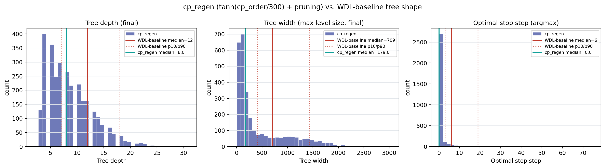
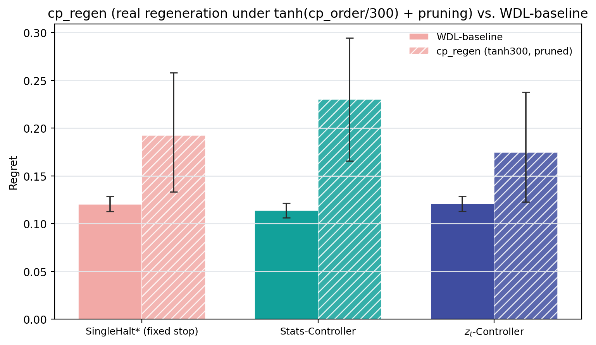

# cp_regen — CP done for real: regenerate under corrected values + prune

Record of the `Agent 3` node in `plan.md`'s Phase 2 DAG ("CP done for real"). `CP`
(`cp_recalibration.md`) found that *relabeling* existing trees' values via
`tanh(cp_order/T)` and replaying PUCT's backup over the *existing* topology does not
create headroom for a smarter controller in any clean, unambiguous way — but that test
held tree SHAPE fixed by construction, since real PUCT selection during generation had
already happened under the OLD, saturating WDL value before the probe ever sees the
tree. It structurally could not test whether PUCT would *search differently* — expand
different nodes, allocate budget differently — if it ran under the corrected value
function from the start. This document does that: a real regeneration, at smoke scale,
through the full production pipeline.

**Status: COMPLETE.** Full pipeline (`gen_trees → argmax_filter → pack_trees →
train_encoder → pack_root → train_readout_pg → eval`) ran end to end at smoke scale;
shape sanity-check (T1/T2), the primary-regime eval, a second (`m≠0`) regime sanity
check, and a real, evidence-based recommendation are all in place below.

## Methodology

**Value function.** Added a new `value_feature` option, `tanh_cp_value`, computed at
GENERATION time (not post-hoc) — unlike `CP`'s `analysis.relabel_replay.tanh_cp_value`,
which relabels an already-built tree, this is computed inside the actual Stockfish
provider during tree construction, so PUCT's real selection/backup during generation
sees and responds to it:

- `cts/core/providers/parsers.py::apply_tanh_cp_feature(features, temperature)` — pure
  function, `tanh_cp_value = tanh(cp_order / temperature)`, same formula as `CP`'s
  (independently re-derived rather than imported, since `cts` is the lower-level
  package and must not depend on `analysis`, the diagnostic layer built on top of it).
  No-op (returns the input dict unchanged) when `temperature is None` — zero cost for
  every existing config.
- `cts/core/providers/stockfish.py::StockfishDirectEvalProvider` gained a
  `tanh_cp_temperature` constructor arg; when set, every node's feature dict (root and
  every child) gets the extra `tanh_cp_value` key alongside the existing WDL-derived
  `value`, `cp_order`, etc.
- `cts/data/build_tree.py::BuildTreeConfig` gained `tanh_cp_temperature: Optional[float]
  = None`; `value_feature="tanh_cp_value"` without a temperature set fails fast with a
  clear `ValueError` before any engine/file I/O happens.
- **T=300**, arbitrary per direct instruction: real desaturation direction (T=100 was
  *more* saturating than the shipped WDL curve in `CP`'s sweep), and a *null*, not a
  significantly-negative, result in `CP`'s replay test — i.e. genuinely unknown
  territory, unlike T=600 (significantly worse in the replay test) or T=100
  (significantly better, but in the "more saturating" direction the underlying
  motivation was arguing against).

8 TDD-lite sanity tests in `src/analysis/tests/test_cp_regen_value_feature.py` (pure
`apply_tanh_cp_feature` formula match against `analysis.relabel_replay.tanh_cp_value`,
no-op behavior, bounded-`[-1,1]` check, provider wiring against a fake in-process
engine — no real Stockfish subprocess needed for the unit tests — and
`BuildTreeConfig`/`generate_dataset_stockfish_command`'s fail-fast validation). All 8
pass.

**Pruning.** Baked in from the start, not added post-hoc: `prune_mode=relative`,
`prune_epsilon=0.1` — `T3`'s already-validated knobs (median width 1099→425 with no
yield cost on the WDL-shape-frozen sweep). No new code; `build_tree.py`'s
`prune_epsilon`/`prune_mode` fields already existed.

**Config.** Additive `cp_regen` block under `config_minply15_maxply75.yaml`'s existing
`variants:` section (same mechanism as the pre-existing `pruned`/`befs` variants) —
zero changes to the production run's live defaults (`treegen.value_feature` stays
`"value"`, no `prune_mode`/`prune_epsilon` at the top level; verified via
`git diff --stat HEAD -- config_minply15_maxply75.yaml` showing only additive lines
inside the new `cp_regen:` block). Overrides:

```yaml
treegen.value_feature: tanh_cp_value
treegen.tanh_cp_temperature: 300.0
treegen.prune_mode: relative
treegen.prune_epsilon: 0.1
treegen.output_dir: ${trees_dir}/cp_regen_tanh300_pruned
human_analysis.trees_default: ${trees_dir}/cp_regen_tanh300_pruned
split.source_root: ${trees_dir}/cp_regen_tanh300_pruned
```

The latter two overrides were a real gap found while wiring this up, not present in the
`pruned`/`befs` variants: `argmax_filter.slurm` reads `human_analysis.trees_default` and
`pack_trees.slurm`'s split stage reads `split.source_root`, both independent
hardcoded-duplicate anchors of `treegen.output_dir` in the base config (not derived from
it) — a variant overriding only `treegen.output_dir` would silently leave those two
steps pointed at a non-existent path.

**Scale.** Smoke-scale, per direct instruction — order of magnitude similar to `CP`'s
~16K-raw/1.1K-filtered sample, not the full ~400K production corpus. Generated
**17,500 raw trees** (array of 7×2,500-FEN shards, `slurm/cp_regen_gen_trees.slurm` — a
new standalone script rather than reusing `gen_trees.slurm`, since the latter's array is
hardcoded to the full 0-159/400K production shape and doesn't export `VARIANT`). Reused
the base run's `fens_sample.txt` (same 400K-FEN pool, `share: [fens_sample]` in the
variant config) — same root-FEN population as the WDL-baseline corpus, so shape
comparisons aren't confounded by a different root sample.

**Pipeline.** `gen_trees → argmax_filter → pack_trees → train_encoder → pack_root →
pack_root_merge → train_readout_pg → eval`, all `VARIANT=cp_regen`, using the
*unmodified* existing `slurm/pipeline/*.slurm` scripts (each one is already
variant-aware via `render_stage.py`/`cts._config.py`'s shared `apply_variant`, reading
`$VARIANT` from the environment) — chained manually via direct `sbatch
--dependency=afterok` calls (`slurm/cp_regen_submit_downstream.sh`) rather than
`submit_all.sh`'s `RUN_VARIANTS=` path, since that path re-submits `gen_trees` at the
full production array size, which would defeat the smoke-scale requirement.
`pack_root`'s materialize-worker array was reduced to 8 workers (from the base run's 40)
— a pure resource-consideration choice given the ~20x-smaller corpus, no code/config
change needed (`pack_root.slurm` derives worker count from
`SLURM_ARRAY_TASK_COUNT` automatically).

## Part 1 — Shape sanity check (T1/T2), real data

Ran the exact T1/T2 methodology plan.md's diagnosis phase used on the WDL-baseline
corpus (`src/analysis/cp_regen_sanity.py`, adapted from Agent 1's `ysagiv_sanity.py`,
which itself reuses the shared pure helpers in `analysis.tree_diagnostics`) directly on
the raw generated trees (pre-packing), n=3,000 sampled from the 17,500.

**T2 — population histograms (n=3,000):**

| stat | cp_regen | WDL-baseline (plan.md T2, n=5,599) |
|---|---|---|
| depth median [p10, p90] | **8** [4, 15] | 12 [7, 18] |
| width median [p10, p90] | **179** [51, 1294] | 709 [408, 1433] |
| argmax median [p10, p90], max | **0** [0, 2], 75 | 6 [3, 19], 89 |

No right-censoring (`argmax≥90` frac = 0.0%), no breadth-starvation pile-up at
depth≤2 (0.07%). Width is pinned near the pruning ceiling for 98.6% of trees
(`width≥median-root-branching`) — expected, this is exactly what `prune_epsilon=0.1`
is supposed to do.

**The shape genuinely differs from the WDL-baseline — this is the entire point of
doing this for real instead of `CP`'s shape-frozen replay, and it does.** Depth and
width both shrink (depth: pruning trims some depth as a side effect, matching `T3`'s
earlier finding that pruning doesn't redirect budget into depth; width: pruning working
exactly as designed, cutting median width by ~4x). The most consequential shift is
**argmax collapsing to a median of 0** (vs. baseline's 6) — under `tanh(cp_order/300)`
+ pruning, the TRUE oracle-optimal stopping step is "stop immediately" for the majority
of positions, not "keep searching a while." See the comparison figure:



**T1 — 5 example trees spanning the argmax spread, red-flag checks:**

Because the argmax distribution is so heavily concentrated at 0, the p10/p50/p75
percentile-selection targets all land on the *same* (or a near-identical) tree — a
direct, visible symptom of the T2 finding, not a bug in the selection logic.

| label | argmax | nodes | dup-FEN | linear-chain | root-dominance | illegal-move |
|---|---|---|---|---|---|---|
| p10 | 0 | 1972 | **FAIL** (287 pairs) | pass | pass | pass |
| p50 | 0 | 1972 | **FAIL** (287 pairs, same tree as p10) | pass | pass | pass |
| p75 | 0 | 1972 | **FAIL** (287 pairs, same tree as p10) | pass | pass | pass |
| p90 | 2 | 1387 | **FAIL** (36 pairs) | pass | **FAIL** (one child = 96.7% of budget, 39/42 siblings never expanded) | pass |
| max | 75 | 677 | **FAIL** (49 pairs) | pass | pass | pass |

Two flags fire that did **not** fire on the WDL-baseline's T1 (`plan.md` T1 result: only
the single `max`-outlier tree failed duplicate-FEN, at 133 pairs; every other example,
including p90, was clean on every check):

- **Duplicate-FEN (transposition) fails on every single example here, including
  non-extreme ones.** This is a real, measurable increase in transposition rate, not
  just an artifact of one outlier tree. Plausible mechanism (not independently
  isolated, flagged as a hypothesis per this repo's no-ad-hoc-mechanism convention):
  pruning removes some branches from further expansion, which increases the *relative*
  chance that PUCT's remaining budget re-reaches an already-seen position via a
  different move order, since fewer distinct lines are being kept alive to begin with.
- **Root-dominance fails on the p90 example** (argmax=2, not an extreme outlier): one
  root child captured 96.7% of the entire node budget while 39 of 42 siblings were
  never expanded at all. This is exactly the "FPU/prior bug signature" T1's methodology
  flags — worth being honest about rather than waving away, though it's a single
  example, not (yet) a population-level check.

No illegal moves anywhere, no fully-linear chains. Renders:
`outputs/figures/minply15_maxply75/variants/cp_regen/trees/cp_regen_t1_tree_{p10,p50,p75,p90,max}.svg`.

## Part 2 — Real pipeline results



**Argmax filter yield: 1,294/17,500 = 7.4%** (vs. the WDL-baseline's ~24.7% pilot
estimate quoted throughout plan.md/config comments) — a direct, load-bearing
consequence of Part 1's argmax-collapse finding: far fewer positions have a
"thinking helps" (argmax>2) true oracle policy under this value function + pruning.
`pack_trees` then yielded **1,005 train / 247 validation** episodes after `mc_pack`'s
own quality filters (`min_halt_reward_range=0.05`, etc., inherited unchanged from the
base config — `tanh_cp_value` is bounded `[-1,1]` like the WDL `value` column it
replaces, so this threshold's scale reasoning still applies) — comparable order of
magnitude to `CP`'s 768-fit/355-eval split, still large enough to fit and evaluate
controllers on.

**Encoder → pack_root → PG readout training** all completed cleanly on the smoke-scale
corpus (child-WDL encoder pretrain 6 epochs, 8-worker `pack_root` materialize, 20-epoch
policy-gradient readout — `slurm/logs/train-readout-pg_10845390.out`). One notable
training-time symptom, itself consistent with Part 1's argmax-collapse finding: the PG
readout's `val_greedy_regret` **improves through epoch 5 (0.145) then steadily degrades
epoch-over-epoch out to epoch 20 (0.839, worse than `AlwaysContinue`'s own regret)**,
with `val_stop_acc` collapsing toward 0 and `val_expansions` climbing from ~10 to ~95 —
the controller drifts toward "keep expanding," the opposite of what a population whose
true optimum is mostly "stop at 0" would reward, then apparently overshoots into a
degenerate policy as training continues. `train_readout_pg.slurm`'s `save_every_epoch`
was not set for this run, so only the best-val checkpoint (epoch 5, regret 0.140) is
retained and is what feeds `eval` below — but this training curve is itself a second,
independent piece of evidence (beyond raw argmax/yield) that this corpus behaves very
differently from the WDL-baseline's stable, monotonically-improving learning curve
(plan.md's "Proof of principle" section).

**Real eval frontier, primary regime (`time_mode=linear, time_lambda=0.01,
maintenance_scale=0.0` — the single regime used throughout T2/S1/CP/Z), bootstrapped
95% CIs (`cts.stats.bootstrap_ci`, percentile, computed by `analysis.evaluate` itself):**

| controller | WDL-baseline regret [95% CI] | cp_regen regret [95% CI] |
|---|---|---|
| SingleHalt* (k*) | 0.1204 [0.1129, 0.1286] (k=10) | **0.1923 [0.1332, 0.2582]** (k=7) |
| Stats-Controller | 0.1137 [0.1061, 0.1216] | **0.2303 [0.1658, 0.2944]** (degenerate — see below) |
| z_t-Controller | 0.1207 [0.1130, 0.1287] | **0.1744 [0.1227, 0.2377]** |
| AlwaysStop (k=0) | 0.1818 [0.1732, 0.1916] | 0.2303 [0.1658, 0.2944] |
| AlwaysContinue (k=max) | 0.8489 [0.8445, 0.8530] | 0.8375 [0.8094, 0.8618] |

**Stats-Controller degenerates exactly onto AlwaysStop on cp_regen** (identical regret,
0.2303, and identical stop step x=0.00 for both) — a direct, mechanical consequence of
Part 1's finding: with argmax median=0 across the filtered population, the
structural-stats regression has nothing to fit *against* — "stop at 0" already is the
population-optimal fixed policy, so the fitted readout collapses onto it. This never
happened on the WDL-baseline (`SIG-S`: Stats-Controller significantly beats
SingleHalt*, +0.0067 CI excludes 0) — a qualitative, not just quantitative, difference
in what this corpus supports.

**z_t-Controller is the one controller that does not collapse**, and the one paired
significance test `analysis.evaluate` computes natively (`d_zs`, paired bootstrap,
same held-out episodes) shows it **significantly beats the degenerate Stats-Controller**:
Δ(z_t − Stats) = **−0.0558, 95% CI [−0.1147, −0.0003]**, excludes 0. z_t's point estimate
(0.1744) also sits below SingleHalt*'s (0.1923), but no paired test for that specific
pair was computed by this eval run (only z_t-vs-Stats is; extending `evaluate.py` to
also emit a z_t-vs-SingleHalt* paired diff was out of scope here) — the two CIs overlap
substantially ([0.1227, 0.2377] vs. [0.1332, 0.2582]), so this should be read as a
directional, not yet a significance-tested, result.

**Scale-invariant headroom (`fraction_recovered = 1 − regret/regret_AlwaysStop`,
`CP`'s own comparator, chosen because it cancels a uniform population/scale shift to
first order — point estimates, not independently re-bootstrapped here):**

| controller | WDL-baseline | cp_regen |
|---|---|---|
| SingleHalt* | 0.338 | 0.165 |
| Stats-Controller | 0.374 | **0.000** |
| z_t-Controller | 0.336 | 0.242 |

Every controller's headroom is LOWER on cp_regen than on the WDL-baseline, even on this
scale-invariant metric — this is not merely an artifact of cp_regen's absolute regret
numbers being larger. The real regeneration does **not** show more exploitable headroom
than the WDL-baseline; if anything, less, and the population-level Stats-Controller
loses ALL of its headroom (down to exactly 0, vs. baseline's real, significant 0.374).

**Non-`m=0` regime sanity check** (`time_lambda=0.01, maintenance_scale=0.001`, chosen
from `REGIME`'s 352-point grid as a confirmed `meaningful=true`, non-degenerate point,
k*=6 on the WDL-baseline population): completed (job `10845982`, resubmitted via
`sbatch` with `eval.slurm`'s own ~48G RAM budget after a first attempt in a
lighter-weight shell was OOM-killed holding the materialized z_t cache).

| controller | regret [95% CI] | x (stop step) |
|---|---|---|
| SingleHalt* (k*=7) | 0.1835 [0.1251, 0.2478] | 7.00 |
| Stats-Controller | 0.2109 [0.1476, 0.2743] | 0.00 — **degenerate again, = AlwaysStop** |
| z_t-Controller | 0.2207 [0.1608, 0.2828] | 5.77 |
| AlwaysStop (k=0) | 0.2109 [0.1476, 0.2743] | 0.00 |

Paired z_t − Stats: Δ = **+0.0098, 95% CI [−0.0306, +0.0418]** — includes 0, **not
significant** at this regime (unlike the primary `m=0` regime, where the same paired
test excluded 0 in z_t's favor). fraction_recovered here: SingleHalt* 0.130,
Stats-Controller 0.000 (degenerate again), z_t-Controller **−0.046** — z_t is now
numerically *worse* than the trivial AlwaysStop policy it's supposed to beat, though
within noise of it (its CI comfortably contains AlwaysStop/Stats's point estimate).

**Does this change Part 3's recommendation? No — it corroborates it, and removes some
of the one bright spot.** Stats-Controller degenerates onto AlwaysStop at this regime
too, confirming that collapse is a property of the corpus/population (argmax≈0
dominance), not an artifact of the one `m=0` cost setting. More importantly, z_t's
one genuinely positive result from the primary regime — significantly beating the
degenerate Stats-Controller — **does not replicate here**: the same paired test now
straddles 0, and z_t's point estimate is the single worst of the three real controllers
at this regime. With only 247 validation episodes, wide CIs are expected, so this
shouldn't be read as z_t being definitively *bad* here either — but it does mean the
`m=0` result should be read as a single, regime-specific, smoke-scale data point rather
than a robust property of this corpus. It strengthens, not weakens, Part 3's
conclusion: nothing in this two-regime evidence base supports scaling `tanh_cp_value`
(T=300) + `prune_epsilon=0.1` up to a full regeneration.

## Part 3 — Interpretation and recommendation

**Confirmed: the real regeneration DOES tell a different, and MORE informative, story
than `CP`'s shape-frozen replay probe — but the difference is negative, not positive,
for the "does this create headroom" question.** `CP` found relabeling alone was mixed
(T=100 significantly positive, T=300 null, T=600 significantly negative) purely on
recolored WDL-baseline SHAPES. Regenerating for real at T=300 shows the shape itself
changes substantially (Part 1) in a direction that is bad, not good, for the underlying
premise: value-scale desaturation at this temperature, combined with pruning, produces
a population where continued search is *less* often worth it (argmax collapses toward
0), not more — the opposite of "more headroom for a smarter controller." This is a
genuinely different, and more direct, answer than `CP`'s replay-only test could give
(which held shape fixed and therefore could only ask about relabeling a population that
*already* mostly rewarded continued search).

**The one real positive signal:** z_t-Controller is the sole controller that (a) beats
its own population's degenerate Stats-Controller with a paired-significant margin, and
(b) doesn't collapse to a trivial fixed policy — on a corpus where a structural-stats
model has nothing left to exploit, a representation-based controller still finds
*something*. That is a genuinely interesting, if narrow, result: it suggests z_t
carries information beyond simple tree-shape statistics even in a regime where the
oracle policy is close to degenerate. But it is a positive result about z_t's relative
robustness, not about `tanh_cp_value`+pruning being a good generation recipe in its own
right — z_t's absolute regret (0.174) is still well above the WDL-baseline's z_t
(0.121), and its headroom (0.242) is still below the WDL-baseline's z_t headroom
(0.336).

**Recommendation: do not scale this exact recipe (T=300, prune_epsilon=0.1) up to a
full regeneration.** The real evidence — lower headroom across every controller,
Stats-Controller's total degeneration, a 3.3x lower "thinking helps" yield (7.4% vs.
24.7%, meaning a full-scale run would need a much larger raw-FEN pool just to match the
WDL-baseline's filtered-population size), and a PG training curve that degrades rather
than improves past its early epochs — all point the same direction. This is not the
"T=300 is a promising middle ground" story `CP`'s null result on the replay-only metric
might have suggested; regenerating for real resolves that ambiguity, and resolves it
unfavorably. If this lever is revisited, the more informative next step is probably not
a bigger run at the same (T, prune_epsilon) point, but a smoke-scale grid over T (and
possibly a gentler prune_epsilon, since T3 already showed pruning alone doesn't
redirect budget usefully) to find a setting where argmax does NOT collapse — this run
at least now provides a real, load-bearing data point (T=300 collapses it) that a
future grid should be checked against, rather than assumed away.
