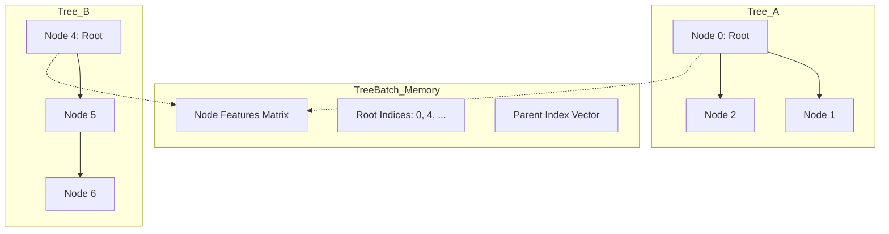

# Conceptual Understanding: lmcos Meta-Controller

The goal of `lmcos` is to build a **meta-controller** that decides optimally when to "think" (expand the search tree) versus "halt" (execute a move).

## The Core Problem

We want to decide if expanding one more node in a search tree is worth the cost. This is difficult because the "true" value of the search is only known after the search is finished. We break this into two sub-problems:

### 1. Summarizing the "Thinking Tree" (Supervised Pre-training)
We need a neural network (the **GNN**) to look at a partial search tree $T$ and summarize its internal state. Specifically, we want to query the GNN for the potential "future" of the search.

*   **Prefix Sampling:** To train this, we don't just use full trees. We take a finished "Oracle" tree $\omega$ and chop it into prefixes $T_k$ (e.g., the state of the tree after 10, 20, or 40 expansions). This creates a "history" of how the search evolved.
*   **Slot-Conditioned Readout:** Traditionally, a GNN might output one value for the root. Here, we use a "Slot Head." We provide the GNN with the root embedding AND a specific move (a "slot"). The GNN then predicts the WDL for *that specific move* based on the entire tree structure.
*   **The Question:** "Given this partial tree $T$, what *would be* the Win/Draw/Loss (WDL) probability of each immediate action $a$ from the root if I were to search much deeper?"

### 2. Normative Decisions (Optimal Stopping)
Even if we can predict the future of the search, we need to know if the improvement in move quality is worth the added "cost of thinking" $C$.

*   **The Experiment:** For an oracle sequence of trees $T_0, T_1, \dots, T_{64}$, we can determine the "correct" decision at each step $k$ using Dynamic Programming:
    *   **Value of Halting:** $R(\text{halt}, k) = V(T_k)$, which is the value of the best action under search state $k$.
    *   **Value of Continuing:** $R(\text{continue}, k) = \text{Value}(\text{next state}) - \text{incremental\_cost}(k)$.
*   **The DP Sweep:** Since we have the full sequence $\omega$, we can work backward from the budget cap (where you MUST halt) to find the optimal policy for every intermediate step.

## GNN Architecture: The "Search Accelerator"

The GNN performs **representation learning** over the tree structure. It is designed to "compress" the deep information of the search tree into a summary at the root.

### 1. Initial Encoding
*   **Node MLP:** Each node's raw scalars are embedded into a high-dimensional vector.
*   **Slot Encoding:** Edges are augmented with **Sinusoidal Slot Encodings**. This gives the GNN "spatial" awareness—it knows which child corresponds to which move slot (e.g., move 1 vs move 50).

### 2. Message Passing (Mixing Information)
The GNN runs $k$ rounds of alternating messages:
*   **Upward (Children $\to$ Parent):** Uses **Multi-Head Attention (MHA)**. The parent "listens" more closely to promising or complex branches while ignoring noisy ones.
*   **Downward (Parent $\to$ Child):** A linear projection that gives each node context about the global goal (the root's perspective).
*   **Sequential Propagation:** This is a key trick. By iterating in topological order (leaves-to-root), information can travel across the entire tree depth in a single round.

### 3. The State Update (GRU)
Each node's representation is updated via a **GRU (Gated Recurrent Unit)**.
*   **Input:** The incoming message (Upward or Downward).
*   **Hidden State:** The node's current understanding.
*   **Why?** The GRU helps the node "remember" its original heuristic value while integrating new information from its neighbors, preventing the signal from fading.

### The "Flattened Forest" (Tensorization)
Because GPUs prefer contiguous memory, we pack multiple trees into a single batch of tensors. This transforms a set of hierarchical objects into a flat "Parts Catalog."

## Code Map

| Concept | File | Key Function/Class |
| :--- | :--- | :--- |
| **Search Logic** | `tree.py` | `SearchTree` |
| **Tree Growth** | `cts_pretrain.py` | `generate_partial_tree_from_provider` |
| **Prefix Sampling**| `cts_pretrain.py` | `derive_prefix_pretrain_example` |
| **GNN Encoder** | `GNN.py` | `TreeNN` |
| **Slot Querying** | `GNN.py` | `ChildWdlHead` |
| **Slot Encoding** | `GNN.py` | `SinusoidalSlotEncoding` |
| **DP / Oracle** | `controller_oracle.py` | `compute_oracle_policy` |
| **Environment** | `cts_episode_envs.py` | `GeneratedTreeHaltEnv` |

## Glossary

*   **Oracle ($\omega$):** A deeply searched tree used as ground truth.
*   **Thinking Cost ($C$):** A penalty (usually linear) applied to each expansion step.
*   **Consolidation:** The process of turning raw edge statistics (visits/Q-values) into per-node teacher labels.
*   **Topological Sweep:** Processing nodes in order from leaves to root (or vice versa) so that information propagates fully in one pass.
