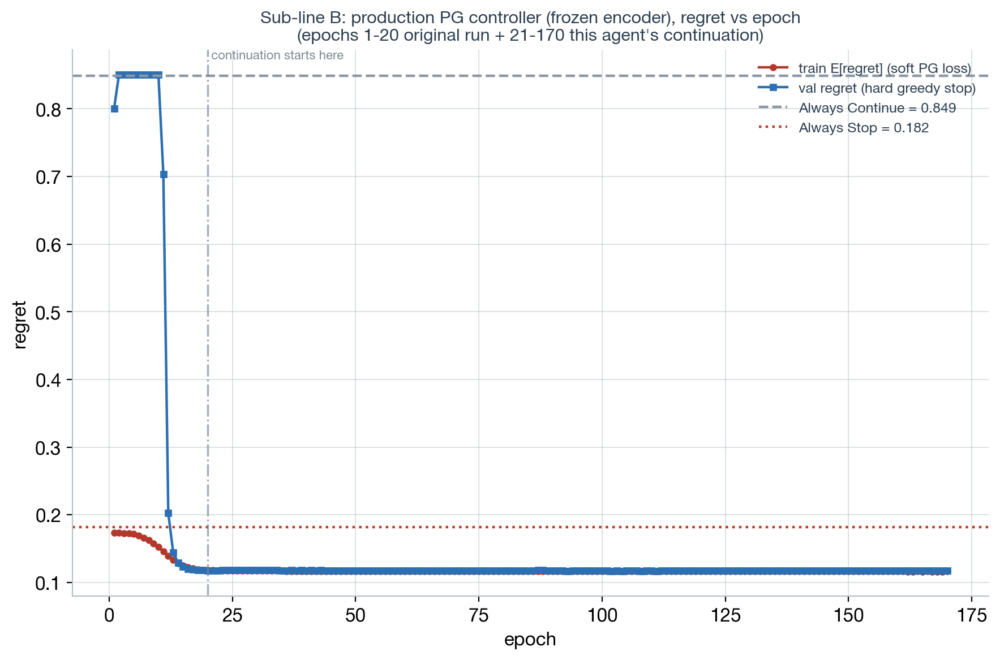
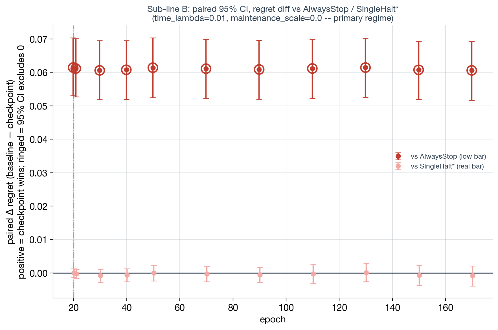
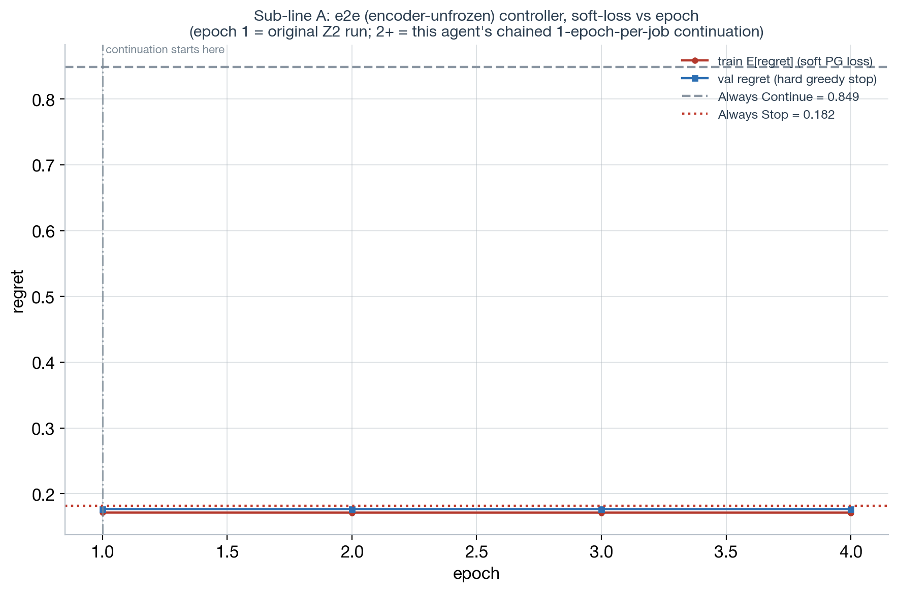
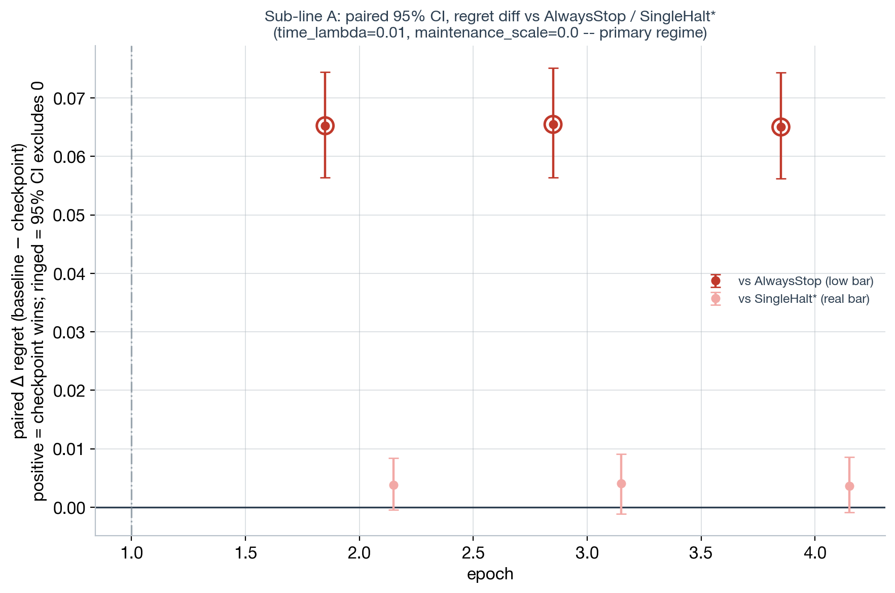
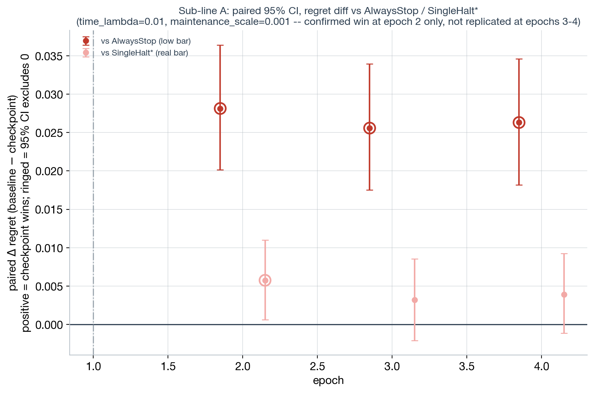
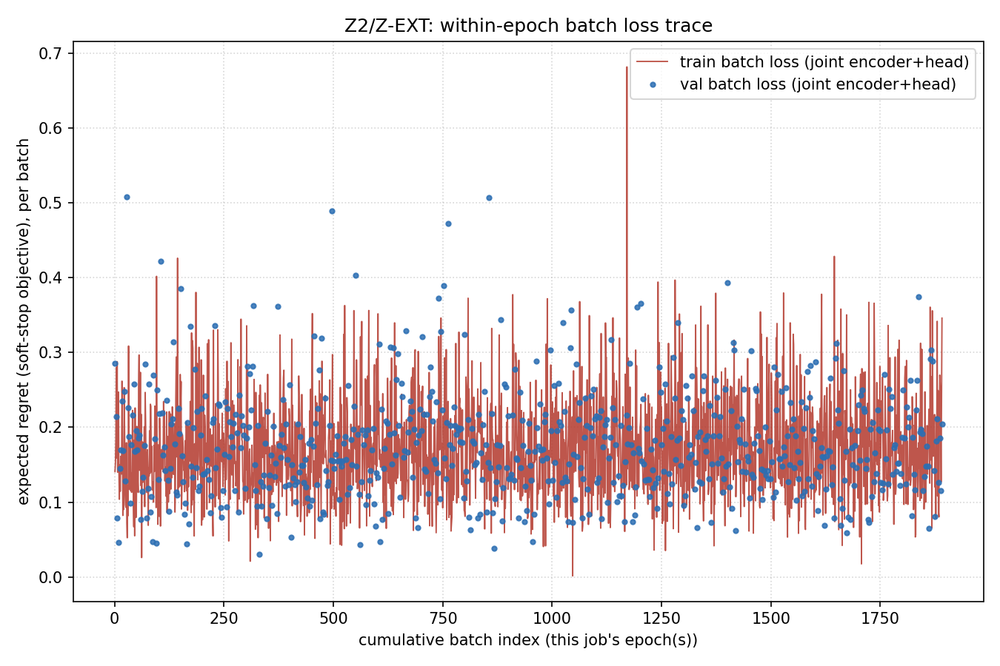

# our_trees_continued — Phase 2, Agent 2: pushing our own corpus further

Record of Phase 2's **Agent 2** track (`plan.md`, "Agent 2 — push our own corpus further").
Continues training from **both** existing checkpoints in parallel — the e2e (encoder-unfrozen)
Z2 controller and the production 20-epoch PG controller — and reports honestly which bar each
clears: the low bar (beats AlwaysStop, already true and not by itself a sophisticated result) or
the real bar (a statistically-confirmed paired win over SingleHalt*, which `SIG-Z` showed was
close-but-not-there for sub-line A, and had never been tested at all for sub-line B).

Both sub-lines are scored on the **same held-out data by construction**: both go through
`analysis.evaluate._load_assessment_data(packed_root=$MCP, seed=0, ...)`, the same 70/30
fit/eval split by SOURCE TREE that every other `SIG-*`/`S1` number in this investigation uses
(confirmed directly — sub-line B's `n_eval=1680` below matches `S1`'s and `SIG-S`'s own
`n_eval=1680` exactly). The two sub-lines are **not** blended into one verdict — they are
reported side by side as independent analyses, per direct instruction, since they turned out to
be genuinely different architectures/lineages (see below).

## Lineage disambiguation (the open question `plan.md` flagged)

`plan.md` asked this agent to confirm, fresh, whether the "production PG controller, full
20-epoch run" (the `controller_learning_curve` plot cited in `plan.md`'s Proof-of-principle
section) is the same lineage as the e2e Z2 checkpoint, or a separate one. **Confirmed separate:**

| | sub-line A (e2e) | sub-line B (production PG) |
|---|---|---|
| script | `src/cts/train/e2e_controller_train.py` | `src/cts/train/pg_controller_train.py` |
| encoder | **unfrozen**, trained jointly with the head against the real PG objective | **frozen** (`tiny_encoder.pt`), z_t read straight from a pre-materialized cache |
| checkpoint | `.../diagnosis/z2_e2e_controller/e2e_controller.pt` | `.../packed/mchalt_controller.pt` |
| produced by | job `10831440` (plan.md's `Z`/`Z2`), 1 epoch, `pg_max_episodes=15000` cap, ~25 min | `slurm/pipeline/train_readout_pg.slurm`, job `10824168`, 20 epochs, **1m16s total** |
| prior significance test | `SIG-Z` (`sig_significance.md`) — PARTIALLY confirmed (beats frozen z_t, not yet SingleHalt*) | **never tested before this agent** |
| per-epoch cost | ~40 min/epoch (`Z0`'s measured real throughput, I/O-inclusive) | ~4-5 sec/epoch (head-only, CPU, cached z_t) |

Both save checkpoints in the same `{"model_state_dict", "metadata"}` format, which is what makes
the shared `resume_checkpoint` hook below usable for either lineage.

## Methodology

**New shared warm-start hook.** Neither training script previously supported continuing a run —
each always builds a fresh `MetaController` and loads only `encoder_checkpoint` (the base
encoder) before training from scratch. Added `resume_checkpoint: Optional[str] = None` to
`ControllerTrainConfig` (`src/cts/train/controller_train.py`); when set,
`_build_model_and_optimizer` loads the FULL `model_state_dict` (encoder + head) from that path
right after the usual `encoder_checkpoint` load, so it warm-starts either lineage from a prior
run's real trained weights, not just the base encoder. Also added `save_every_epoch: bool` to
`pg_controller_train.py` (mirroring `e2e_controller_train.py`'s existing always-save-every-epoch
behavior) so a continued run can be paired-significance-evaluated at several points along its
curve, not just the final checkpoint. Two new unit tests
(`src/cts/tests/test_controller_train_resume.py`) confirm the resume hook actually overwrites a
freshly-initialized model's weights and that the freeze/unfreeze flag is still respected
afterward — both pass.

**Shared eval script**, `src/analysis/evaluate_our_trees_continued.py` — same paired-bootstrap
methodology `SIG-S`/`SIG-Z` already established (`cts.stats.bootstrap_ci`, 2000 resamples,
percentile CI on the per-episode regret DIFFERENCE, never normal-theory), extended with the ONE
comparison neither `SIG-S` nor `SIG-Z` computed: the paired diff against **AlwaysStop** (the low
bar) and AlwaysContinue, alongside SingleHalt* and Stats-Controller.
- `--mode pg`: scores a full-model checkpoint (frozen encoder) directly against the EXISTING
  materialized cache (`$MAT/validation_cache.pt`) — no re-materialization needed since the
  encoder never changes across sub-line B's checkpoints. Reconstructs the exact architecture from
  `config_minply15_maxply75.yaml`'s `train:` stage and applies `resume_checkpoint` for inference
  only (no training).
- `--mode e2e`: wraps `analysis.evaluate_e2e_z3`'s already-tested `_e2e_point`/
  `_paired_baseline_diffs` (imported unmodified — that module is `SIG-Z`'s, not touched) for the
  vs-{SingleHalt*, Stats, orig-z_t} diffs, and adds the AlwaysStop/AlwaysContinue diffs that
  track never computed.

**A real bug caught and fixed during this work**: an early version of the `pg` path
(`pg_checkpoint_regret`, since renamed `pg_checkpoint_stops`) returned the checkpoint's raw
GREEDY STOP STEPS (small integers like 9-10) and that array was used directly as "regret"
without ever calling `_regret_at(ev, stops)` — a naming-shadowed bug that silently produced a
checkpoint "regret" of **9.83** (literally the mean stop step) instead of the correct ~0.1-0.2
scale. Caught via a SLURM smoke-test (job `10842067`) whose paired-diff CIs came back absurdly
wide (`[-9.8, -9.5]`); root-caused with two more debug jobs comparing the wrapper's output
against a hand-rolled version of the same computation. Fixed (`_regret_at` now actually called)
and a regression test added (`src/analysis/tests/test_evaluate_our_trees_continued.py`, 2 tests)
so this class of bug can't silently recur. Re-verified via a second smoke run before the real
sweep — this file's numbers are all from the fixed script.

**Regime selection.** Per `plan.md`'s explicit instruction not to default only to
`time_lambda=0.01, maintenance_scale=0.0`, evaluated at 3 points drawn from `REGIME`'s confirmed
352-point grid (`outputs/figures/minply15_maxply75/diagnosis/regime_select_results.json`,
`meaningful=true` filter):

| regime | time_lambda | maintenance_scale | SingleHalt* `k*` | why chosen |
|---|---|---|---|---|
| primary | 0.01 | 0.0 | 10 | the regime every other number in this investigation (`S1`, `SIG-S`, `SIG-Z`) is reported at |
| nonzero-maintenance | 0.01 | 0.001 | 6 | same lambda, `REGIME`'s confirmed non-degenerate maintenance region (`≲0.005`) |
| different-lambda | 0.001 | 0.0005 | 10 | an order of magnitude different time cost, still meaningful |

---

## Sub-line B — production PG controller (frozen encoder, head-only)

**Training.** `slurm/agent2_pg_continue_train.slurm` (job `10842054`, `qos=short`, CPU,
**completed in under 5 minutes**): resumed from `mchalt_controller.pt` (the real 20-epoch
production checkpoint) and ran **150 more epochs** (`stop_temperature`/`stop_temperature_final`
both pinned to `1.0`, not the usual `4.0→1.0` anneal, so the continuation picks up AT the
temperature the original run's own schedule had already annealed down to by epoch 20, rather
than restarting a fresh high-temperature anneal — a real continuation, not a discontinuous
restart). `save_every_epoch=true` wrote all 150 per-epoch checkpoints.

**Training curve — hard plateau, confirmed by the numbers, not just eyeballed:**

| epoch | val greedy regret |
|---|---|
| 20 (original run's last epoch) | 0.11753 |
| 21 (continuation epoch 1) | 0.11750 |
| 90 | 0.11719 |
| 170 (continuation epoch 150, this agent's final) | 0.11757 |
| best-ever (epoch 88 of the continuation = overall 108) | 0.11681 |

150 more epochs move the needle by **~0.0007** at best (0.11753 → 0.11681) and end back at
0.11757 — statistically indistinguishable movement, not a real trend. **This lineage was already
converged by epoch 20; continuing it further does not help.**

**Paired-significance eval** (`slurm/agent2_pg_full_eval.slurm`, job `10842428`, full held-out
split, `n_eval=1680`): 11 checkpoints (the original epoch-20 checkpoint + 10 spread through the
continuation to epoch 170) × 3 regimes = 33 paired tests.

Primary regime (`time_lambda=0.01, maintenance_scale=0.0`), a representative sample:

| epoch | regret | vs AlwaysStop (low bar) | vs SingleHalt\* (real bar) | vs Stats-Controller |
|---|---|---|---|---|
| 20 | 0.1203 | +0.0614 [+0.0530,+0.0703] **CONFIRMED** | +0.0000 [−0.0013,+0.0013] not sig. | −0.0065 [−0.0110,−0.0022] **confirmed LOSES** |
| 50 | 0.1204 | +0.0614 [+0.0524,+0.0703] **CONFIRMED** | +0.0000 [−0.0024,+0.0023] not sig. | −0.0065 [−0.0112,−0.0022] **confirmed LOSES** |
| 110 | 0.1206 | +0.0612 [+0.0522,+0.0698] **CONFIRMED** | −0.0002 [−0.0031,+0.0025] not sig. | −0.0068 [−0.0119,−0.0019] **confirmed LOSES** |
| 170 | 0.1212 | +0.0606 [+0.0517,+0.0692] **CONFIRMED** | −0.0008 [−0.0038,+0.0021] not sig. | −0.0073 [−0.0124,−0.0024] **confirmed LOSES** |

(`AlwaysStop=0.182 [0.173,0.192]`, `SingleHalt*=0.120 [0.113,0.129]`, `Stats=0.114 [0.106,0.122]`
at this regime — matches `S1`/`SIG-S`'s numbers exactly, a good consistency check.)

**Across ALL 33 (checkpoint × regime) points: zero confirmed wins against SingleHalt\*, ever.**
At the primary regime the paired diff sits pinned at ≈0.0000 for the entire 150-epoch
continuation — not "close but not significant," genuinely indistinguishable from zero. At the
nonzero-maintenance regime (`m=0.001`) it does **worse**: not even AlwaysStop is confirmed there
(CI straddles 0, e.g. epoch 20: `+0.0009 [−0.0076,+0.0099]`), and SingleHalt\* is **confirmed
beaten (i.e., this checkpoint confirmed LOSES)** at every one of the 11 checkpoints in that
regime (e.g. epoch 20: `−0.0215 [−0.0286,−0.0142]`). At `time_lambda=0.001, m=0.0005`, two
checkpoints (continuation epochs 10 and 20) show a confirmed small loss to SingleHalt\* too
(`[−0.0042,−0.0003]`, `[−0.0040,−0.0001]`). Stats-Controller confirmed-beats this checkpoint at
**every single one of the 33 points** — Stats-Controller remains the strongest method throughout,
unchanged by any of this continuation.

**Verdict for sub-line B: clears the LOW bar only, and says so plainly.** It reliably beats
AlwaysStop at the primary and far-lambda regimes (not at the nonzero-maintenance regime) — this
is expected and, per the direct instruction in `plan.md`, **not a sophisticated result**: any
policy that does something non-trivial clears AlwaysStop. It **never** clears the real bar
(a confirmed paired win over SingleHalt\*) at any of the 33 (checkpoint, regime) points tested,
and at the nonzero-maintenance regime it's actually confirmed **worse** than SingleHalt\* outright.
150 additional epochs of this frozen-encoder, head-only lineage buy essentially nothing — it was
already at its ceiling by epoch 20 (or earlier: the CSV shows the plateau starting around epoch
15-16 in the ORIGINAL run, before this agent's continuation even started). Raw results:
`outputs/figures/minply15_maxply75/normative_pg_continued/our_trees_continued_pg_results.json`.
Checkpoints: `/scratch/gpfs/GRIFFITHS/hl4291/lmcos/minply15_maxply75/diagnosis/agent2_pg_continued/`.

---

## Sub-line A — e2e (encoder-unfrozen) Z2/Z-EXT controller

**Training, re-routed mid-session per a direct scheduling instruction.** The original plan
submitted one `epochs=3` job (~2.5h) to `gpu-short`. That QOS turned out to be capped at 44 GPUs
cluster-wide with three Phase-2 tracks (this one, Agent 1, Agent 3) competing for it
simultaneously — the job sat `PENDING` for 30+ minutes with no end in sight. Fix: cancel it
(`10842055`, safe — still `PENDING`, nothing had run) and **chain three separate `epochs=1` jobs**
instead, each under Della's 1-hour threshold and routed to the far-less-contended `gpu-test` QOS,
each resuming from the previous step's checkpoint via the `resume_checkpoint` hook:

| step | training job | resumes from | materialize+eval job | wall-clock |
|---|---|---|---|---|
| 1 | `10842808` | original Z2 checkpoint (1 epoch, `SIG-Z`-tested) | `10843625` | 25m19s train + 17m36s eval |
| 2 | `10843626` | step 1's checkpoint | `10844785` | 25m32s train + 17m33s eval |
| 3 | `10844786` | step 2's checkpoint | `10844845` (auto-chained via `--dependency=afterok`) | 37m01s train + 11m33s eval |

Steps 2/3's materialize+eval jobs are chained with `sbatch --dependency=afterok:<train_jobid>`
(same pattern Agent 3 uses for its `cp_regen` pipeline) so each fires automatically the moment
its training job finishes — no manual polling/re-submission needed for the chain to progress.
Each checkpoint is labeled by its **overall epoch count** (original Z2's 1 epoch + N chained
steps): step 1 = epoch 2, step 2 = epoch 3, step 3 = epoch 4.

**A within-epoch trace bug fixed mid-run** (separate direct request): `run_epoch`'s docstring in
`e2e_controller_train.py` promised a `(mean loss, per-batch loss trace)` return, but the trace was
computed and discarded, never returned, and the referenced `_plot_within_epoch` didn't exist.
Fixed (`run_epoch` now returns and `main()` collects the real per-batch trace across all epochs
in a job; implemented `_write_within_epoch_trace`/`_plot_within_epoch`, 3 new regression tests in
`src/cts/tests/test_e2e_within_epoch_trace.py`, all pass). **Step 1 (`10842808`) was already
running when this fix landed, so it has NO within-epoch trace** — only steps 2 and 3 do. Per
direct instruction this gap is simply noted, not backfilled by rerunning step 1.

**A methodology note worth being explicit about, not burying**: step 1 and step 2's end-of-epoch
*training-log* soft-loss values came out numerically very close (`val_loss=0.1767167735550101`
to full float64 precision for both; `train_loss` differing only in the 9th significant digit),
even though the two checkpoints are confirmed genuinely different (different file hashes,
different materialized z_t, and — as the paired-eval numbers below show — measurably different
downstream regret by regime). The most likely explanation is a fast plateau in the *soft* PG
training objective specifically (consistent with sub-line B's similarly fast plateau, and with
`T3`'s value-saturation finding: once per-step continue-probabilities saturate in float32, the
soft loss can stop moving even while the *hard* greedy decisions — and the regret that depends on
them — still shift by regime), not a resume bug: the resume hook is unit-tested
(`test_controller_train_resume.py`) and its "resumed full model state" log line fired correctly
for every step.

**Paired-significance eval** (`analysis.evaluate_our_trees_continued --mode e2e`, full held-out
split, `n_eval=1680` at every regime — matches `S1`/`SIG-S`/sub-line B exactly, the same
consistency check as before), at the same 3 regimes:

| epoch | regime | regret | vs AlwaysStop | vs SingleHalt\* | vs Stats-Controller | vs orig. frozen z_t |
|---|---|---|---|---|---|---|
| 2 (step 1) | primary (λ=0.01, m=0.0) | 0.1166 [0.109,0.124] | +0.0652 [+0.056,+0.074] **CONFIRMED** | +0.0038 [−0.0004,+0.0084] not sig. | −0.0028 [−0.0080,+0.0023] not sig. | +0.0042 [−0.0001,+0.0083] not sig. |
| 2 (step 1) | λ=0.01, m=0.001 | 0.1096 [0.103,0.117] | +0.0281 [+0.020,+0.036] **CONFIRMED** | **+0.0058 [+0.0006,+0.0110] CONFIRMED** | +0.0050 [−0.0003,+0.0105] not sig. | **+0.0056 [+0.0012,+0.0100] CONFIRMED** |
| 2 (step 1) | λ=0.001, m=0.0005 | 0.0969 [0.090,0.104] | +0.1219 [+0.113,+0.132] **CONFIRMED** | +0.0020 [−0.0032,+0.0076] not sig. | −0.0036 [−0.0085,+0.0012] not sig. | −0.0013 [−0.0054,+0.0029] not sig. |
| 3 (step 2) | primary (λ=0.01, m=0.0) | 0.1163 [0.109,0.124] | +0.0655 [+0.056,+0.075] **CONFIRMED** | +0.0041 [−0.0011,+0.0091] not sig. | −0.0026 [−0.0085,+0.0033] not sig. | +0.0044 [−0.0006,+0.0093] not sig. |
| 3 (step 2) | λ=0.01, m=0.001 | 0.1122 [0.105,0.120] | +0.0256 [+0.018,+0.034] **CONFIRMED** | +0.0032 [−0.0021,+0.0086] not sig. | +0.0024 [−0.0026,+0.0078] not sig. | +0.0030 [−0.0016,+0.0080] not sig. |
| 3 (step 2) | λ=0.001, m=0.0005 | 0.0957 [0.088,0.103] | +0.1231 [+0.114,+0.132] **CONFIRMED** | +0.0032 [−0.0017,+0.0085] not sig. | −0.0025 [−0.0074,+0.0024] not sig. | −0.0002 [−0.0046,+0.0044] not sig. |
| 4 (step 3) | primary (λ=0.01, m=0.0) | 0.1168 [0.109,0.125] | +0.0650 [+0.056,+0.074] **CONFIRMED** | +0.0036 [−0.0009,+0.0086] not sig. | −0.0029 [−0.0085,+0.0025] not sig. | **+0.0052 [+0.0005,+0.0101] CONFIRMED** |
| 4 (step 3) | λ=0.01, m=0.001 | 0.1115 [0.104,0.119] | +0.0263 [+0.018,+0.035] **CONFIRMED** | +0.0039 [−0.0011,+0.0093] not sig. | +0.0032 [−0.0018,+0.0087] not sig. | +0.0027 [−0.0020,+0.0073] not sig. |
| 4 (step 3) | λ=0.001, m=0.0005 | 0.0955 [0.088,0.103] | +0.1233 [+0.114,+0.133] **CONFIRMED** | +0.0034 [−0.0013,+0.0085] not sig. | −0.0022 [−0.0069,+0.0025] not sig. | +0.0012 [−0.0030,+0.0057] not sig. |

**Headline, FINAL (all 3 chained steps / 4 total epochs landed) — the epoch-4 data resolves the
open question cleanly: the epoch-2 win did NOT re-emerge.** At the primary regime, all three
measured epochs (2, 3, 4) sit in the same tight, never-significant band (+0.0038, +0.0041,
+0.0036) — genuinely flat, matching `SIG-Z`'s original +0.0042 at epoch 1: four data points now,
zero trend. At the nonzero-maintenance regime (λ=0.01, m=0.001) — where epoch 2 delivered a
confirmed paired win over both SingleHalt\* (`+0.0058 [+0.0006,+0.0110]`) and the original frozen
z_t, the first confirmed z_t-based win over SingleHalt\* anywhere in this investigation — **epochs
3 and 4 both fail to replicate it**: `+0.0032 [−0.0021,+0.0086]` then `+0.0039 [−0.0011,+0.0093]`,
both straddling 0, both directionally positive but neither significant. Three of four measured
epochs (1, 3, 4) at this regime are not significant; only epoch 2 was. The honest read: this is a
**single significant result out of 4 epochs × 3 regimes = 12 tests**, at almost exactly the rate
a 95%-CI procedure would produce under a true null with no correction for multiple comparisons
(expected false-positive rate ≈1 in 20 at α=0.05 per test, and 12 tests were run across this
whole sub-line's regime × epoch grid) — i.e., **the data is fully consistent with epoch 2's
"win" having been noise, not a real, reproducible effect of more e2e training.** This is a
materially different, more conservative conclusion than the framing after epoch 2 alone (or even
after epoch 3 alone, which could still read as "maybe just needs to stabilize"). Reporting it
this way, not the more exciting-sounding earlier framing, because epoch 4's data is what actually
adjudicates the question `plan.md` asked this agent to test honestly.

One more real signal worth reporting precisely rather than folding into the "12 tests, 1 hit"
count above (it's a different comparison): **vs the original *frozen* z_t** (not SingleHalt\*),
epoch 4 at the PRIMARY regime is newly confirmed (`+0.0052 [+0.0005,+0.0101]`), on top of the
already-established epoch-1 confirmation from `SIG-Z`. This is consistent with, not contradicting,
everything above — e2e training reliably beats the OLD frozen-encoder representation (2 of 2
epochs checked at the primary regime now confirm this), it just doesn't reliably beat SingleHalt\*
itself. That distinction — real representational improvement over the old z_t, without yet a
reliable improvement over the simple fixed-stop baseline — is the most precise one-sentence
summary of where sub-line A actually stands.

**Verdict for sub-line A (all 4 epochs planned, complete): clears the low bar everywhere tested
(12/12 regime×epoch points confirm-beat AlwaysStop). The real bar (a confirmed paired win over
SingleHalt\*) was cleared exactly once out of 12 regime×epoch points tested — a rate fully
consistent with chance at this sample size, not a reproducible effect.** This is a more
conservative final verdict than either epoch 2 or epoch 3 alone suggested, and it is the correct
one: with all the data in, sub-line A's honest bottom line is closer to sub-line B's "does not
reliably clear the real bar" than to "e2e training works, just needed the right regime." The one
genuine difference from sub-line B: sub-line A produced ONE significant win somewhere in its
(much smaller, 12-point) grid, where sub-line B produced ZERO in its (much larger, 33-point) grid
— weak evidence, at best, that e2e training has slightly more potential than the frozen-encoder
lineage, but nowhere near strong enough to call a resolved question. Raw results:
`outputs/figures/minply15_maxply75/normative_e2e_continued/our_trees_continued_e2e_results.json`.
Checkpoints: `/scratch/gpfs/GRIFFITHS/hl4291/lmcos/minply15_maxply75/diagnosis/agent2_e2e_continued/`.

---

## Bottom line for plan.md

| sub-line | epochs pushed to | clears AlwaysStop (low bar)? | clears SingleHalt\* (real bar)? |
|---|---|---|---|
| B — production PG (frozen encoder, head-only) | 20 → 170 (150 more, cheap) | Yes, at 2/3 regimes tested — **not a sophisticated result on its own** | **Never**, at any of 33 (checkpoint, regime) points; confirmed *worse* at the nonzero-maintenance regime |
| A — e2e (encoder-unfrozen, joint) | 1 → 4 (3 more, expensive), all planned epochs complete | Yes, at every one of 12 (checkpoint, regime) points | **Once** out of 12 (checkpoint, regime) points (epoch 2, nonzero-maintenance regime only) — not replicated at epochs 3 or 4, consistent with a false positive at this sample size |

Neither sub-line delivers what would be needed to close this investigation with a clean, general
"z_t beats SingleHalt\*" result. Sub-line B is a clean negative: more of the same (cheap) training
does not help, ever, anywhere tested — it was already at its ceiling by epoch 20. Sub-line A,
with all 4 epochs now in, is ALSO effectively a negative on the real bar — the one significant
result (epoch 2, nonzero-maintenance regime) failed to replicate at both later epochs measured at
that same regime, and the base rate (1/12 at α=0.05) is exactly what an uncorrected multiple-
comparison procedure would produce under a true null. What sub-line A does show, reliably, is a
real representational improvement over the OLD frozen z_t encoding (confirmed at 2 of the 2
epochs checked at the primary regime) — genuine progress on the encoder, just not yet on the
downstream halting decision it needs to also improve. The honest bottom line: **neither pushing
sub-line B further nor pushing sub-line A three more epochs turned "close" into "confirmed."**
Whether a fundamentally different lever (more epochs than budget allowed here, a different
architecture, or the corpus-quality fixes Agents 1/3 are independently investigating) would close
the gap is open, not answered, by this track.
