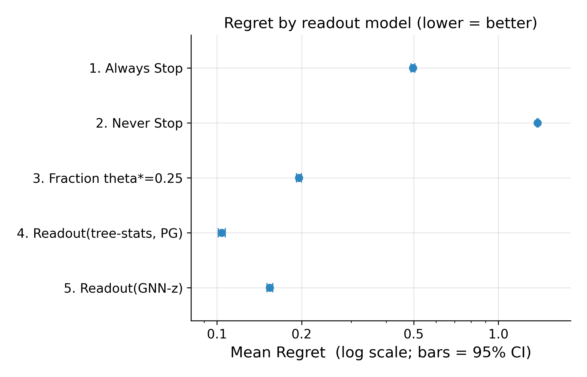
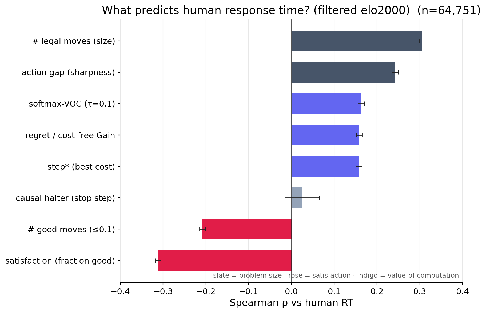

<ChessBackground />

  <h1 class="m-0" style="line-height: 1.0; font-size: 3rem; color: white !important;">
    Learned Meta-control of Tree Search
  </h1>
  
Yotam Sagiv & Jordan Lei

  

    The Great Reunification — sprint plan · June 2026
  

<!--
Map beats are CLICK-driven (one persistent <ThoughtMap seq=.../> per slide): the camera PANS, children REVEAL,
questions RESOLVE, the next one BLINKS — all on click. map↔content slide changes use a simple fade
transition. Content slides are normal. Set `clicks:` = (sequence length − 1). Sequences live in
ThoughtMap.vue. Source: reports/board.md, allply.md, treesearch.md, engine.md.

Structure (three parts under one root):
  Part 1  How do people actually think?  →  (a) game/board features [ply, legal, clock]
                                             (b) how do we model planning? [engine, gain, action-gap, frac-good]
  Part 2  What is thinking worth?        →  when to stop · optimal stopping step (OSS/GSS) · meta-controller
  Part 3  Do human & normative agree?    →  empty for now (pivot only)

Correlation numbers are final from the allply run (board matrix n=1M; engine matrix n=109,434). The
Part 3 pivot still cites the separate treesearch analysis (n≈65k). Each content slide has THREE parts:
  (a) .mdl-proc      — what we did      (b) .mdl-intuition — how to read it      (c) .mdl-conv — takeaway
-->

---
layout: default
class: mdl-slide
transition: fade
clicks: 5
---

  
<ThoughtMap seq="build" />

---
layout: default
class: mdl-slide
transition: fade
---

  

    

      
Part 1 · Game / board featuresPly — how far into the game?

      
<strong>Model-free</strong> — board feature vs human log(RT), all plies. This leaf: <strong>ply</strong> = game stage.

      
Intuition Game stage — a candidate difficulty proxy.

      
Near-null Ply ↔ log(RT): <strong>+0.08</strong>. Weak — game stage, not decision width.

    

    

  

---
layout: default
class: mdl-slide
transition: fade
clicks: 2
---

  
<ThoughtMap seq="ply" />

---
layout: default
class: mdl-slide
transition: fade
---

  

    

      
Part 1 · Game / board featuresLegal moves — the width of the decision

      
<strong># legal moves</strong> vs log(RT) — how many options the player must weigh.

      
Intuition More options to weigh → longer think.

      
Strongest board feature Legal moves ↔ log(RT): <strong>+0.26</strong>. Holds within ply tertiles.

    

    

  

---
layout: default
class: mdl-slide
transition: fade
clicks: 2
---

  
<ThoughtMap seq="legal" />

---
layout: default
class: mdl-slide
transition: fade
---

  

    

      
Part 1 · Game / board featuresClock left — how much time remains?

      
<strong>Clock (time left)</strong> vs log(RT).

      
Intuition Clock falls as the game runs on — tracks game stage.

      
Game-stage complex Clock ↔ log(RT): <strong>−0.16</strong>. Moves with ply — yet width isn't reducible to it.

    

    

  

---
layout: default
class: mdl-slide
transition: fade
clicks: 2
---

  
<ThoughtMap seq="clock" />

---
layout: default
class: mdl-slide
transition: fade
---

  

    

      
Part 1 · Game / board featuresHow the board features relate

      
<strong>Spearman matrix</strong> over the board features and log(RT), n = 1M.

      
Key parts <strong>Legal moves +0.26</strong> is the top row's strongest RT tie; ply / clock / game-fraction move together (the game-stage complex) and each is weaker.

      
Width wins Decision width is not reducible to the game-stage complex — no board feature beats the raw legal-move count.

    

    

  

---
layout: default
class: mdl-slide
transition: fade
clicks: 2
---

  
<ThoughtMap seq="feats" />

---
layout: default
class: mdl-slide
transition: fade
---

  

    

      
Part 1 · How do we model planning?Model planning as a search tree

      
<strong>AlphaZero-style PUCT tree</strong>, no rollouts: a heuristic values nodes, a selector expands. Value features are read off the tree.

      
Read it as Prior weights <em>which</em> child; value is backed up from leaves. Best-first → narrow &amp; deep; UCB → broad.

      
Now we can ask Uniform priors ⇒ PUCT = <strong>UCB</strong>. With a tree in hand, what does an engine's <em>value</em> say about think-time?

    

    <TreeGrowth />
  

---
layout: default
class: mdl-slide
transition: fade
clicks: 2
---

  
<ThoughtMap seq="plan" />

---
layout: default
class: mdl-slide
transition: fade
---

  

    

      
Part 1 · How do we model planning?Which engine do we use?

      
<strong>lc0 → Stockfish</strong> for ~1000× CPU speedup. Cost: prior → uniform, value → N-node SF search (WDL).

      
Three knobs, kept distinct <strong>N</strong> = leaf-eval nodes · <strong>M</strong>=96 = planning budget · <strong>UCI_Elo</strong> = play handicap.

      
Safe swap RT correlations stable across the change. Only <strong>N</strong> moves the eval; <strong>UCI_Elo is a no-op</strong> (SF-1350 ≡ SF-2000).

    

    

      

lc0 (before)

<strong>prior:</strong> trained policy head <strong>value:</strong> trained value head (WDL) slow on CPU · requires GPU

      

Stockfish (after)

<strong>prior:</strong> uniform — α-β has no policy head <strong>value:</strong> eval→WDL from an N-node search ~1000× faster on CPU

    

  

---
layout: default
class: mdl-slide
transition: fade
clicks: 2
---

  
<ThoughtMap seq="engine" />

---
layout: default
class: mdl-slide
transition: fade
---

  

    

      
Part 1 · How do we model planning?Gain — value of computation

      
<strong>Gain</strong> = value the full search finds beyond its own first guess. vs log(RT).

      
Intuition People should think where thinking pays off.

      
As predicted, but weaker Gain ↔ RT: <strong>+0.08</strong> — below the legal-moves width effect.

    

    

  

---
layout: default
class: mdl-slide
transition: fade
clicks: 2
---

  
<ThoughtMap seq="gain" />

---
layout: default
class: mdl-slide
transition: fade
---

  

    

      
Part 1 · How do we model planning?Action gap — decisiveness

      
<strong>Greedy action-gap</strong> = top-1 − top-2 of the root values, pre-search. vs RT.

      
Intuition One move clearly best → less to weigh → faster.

      
Null Action gap ↔ RT: <strong>+0.01</strong> — no signal.

    

    

  

---
layout: default
class: mdl-slide
transition: fade
clicks: 2
---

  
<ThoughtMap seq="agap" />

---
layout: default
class: mdl-slide
transition: fade
---

  

    

      
Part 1 · How do we model planning?Frac-Good — how many good moves?

      
<strong>Greedy frac-good</strong> = fraction of moves within 0.1 of best, pre-search. vs RT.

      
Intuition More good-enough options → satisfice → faster.

      
Satisficing signature Frac-good ↔ RT: <strong>−0.10</strong> — more good moves, less time.

    

    

  

---
layout: default
class: mdl-slide
transition: fade
clicks: 2
---

  
<ThoughtMap seq="fracgood" />

---
layout: default
class: mdl-slide
transition: fade
---

  

    

      
Part 2 · Optimal stopping stepDoes the stop step track think-time?

      
<strong>OSS</strong> (optimal stop step) vs human RT.

      
Expected If people meta-control, they think longer when the oracle stops later.

      
As predicted, but weak OSS ↔ RT: <strong>+0.06</strong> — far below the width effect.

    

    

  

---
layout: default
class: mdl-slide
transition: fade
clicks: 2
---

  
<ThoughtMap seq="oss" />

---
layout: default
class: mdl-slide
transition: fade
---

  

    

      
Part 2 · Meta-controllerHow to train a meta-controller?

      
<strong>RL readout (policy gradient)</strong> halts each step on the <strong>advantage</strong> (continue − halt value). Compare halt rules on regret.

      
The models blind: always · never · fraction-θ* · learned: GNN-z (embedding) · tree-stats (raw [h, w, n]).

      
Answer <strong>tree-stats ≻ GNN-z ≻ fraction ≻ always/never.</strong> Raw structure wins — but low regret is self-consistency, not a match to people.

    

    

  

---
layout: default
class: mdl-slide
transition: fade
clicks: 2
---

  
<ThoughtMap seq="meta" />

---
layout: default
class: mdl-slide
transition: fade
---

  

    

      
Part 2 · What is thinking worth?The engine signals, all at once

      
<strong>Spearman matrix</strong> — engine value / stop signals, board structure, RT (SF-1 n1md36, n = 109k).

      
Key parts The top row (vs RT) is uniformly faint — every engine signal <strong>|ρ| ≲ 0.17</strong>. GSS↔OSS <strong>+0.91</strong> (near-identical), and each signal ties to <strong>legal moves</strong> more than to RT.

      
Thinking's value is faint No value-of-computation signal approaches the +0.26 width effect — they collapse toward the move count.

    

    

  

---
layout: default
class: mdl-slide
transition: fade
clicks: 2
---

  
<ThoughtMap seq="q1a" />

---
layout: default
class: mdl-slide
transition: fade
---

  

    

      
Part 3 · the pivotDo the human and normative model agree?

      
<strong>Every model signal</strong> — regret, step*, VOC — vs human RT (Spearman, n≈65k, bootstrap CIs).

      
Expected If people meta-control like the model, VOC signals should lead.

      
Answer — NO Structural drivers win: legal moves <strong>+0.31</strong>, good-move fraction <strong>−0.31</strong>. Every VOC signal only +0.12…+0.16. Our measure is mis-specified.

    

    

  

---
layout: default
class: mdl-slide
transition: fade
clicks: 1
---

  
<ThoughtMap seq="qmatch" />

