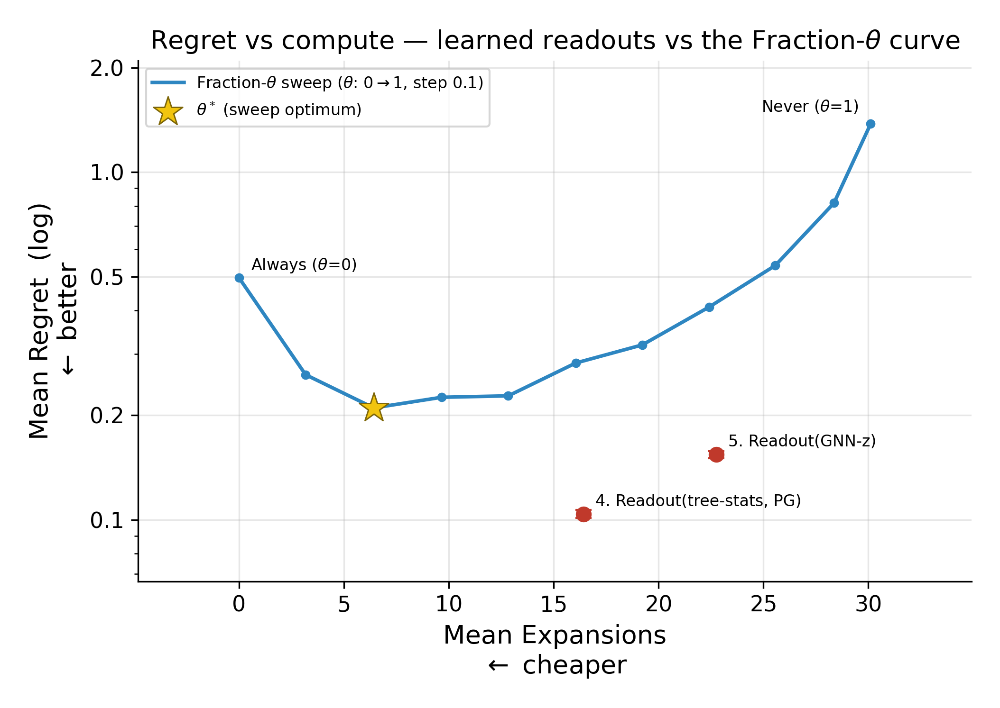
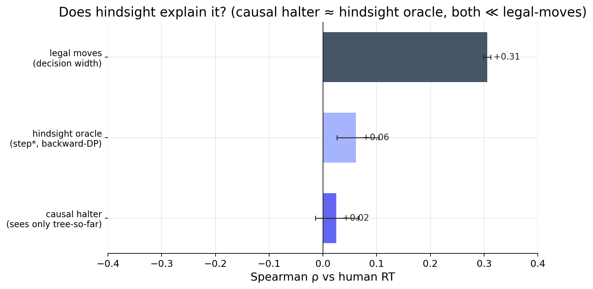

Meta-control of tree search · human deliberation time

# Learned Meta-Control of Search — Analysis

One root question, three parts: how do people actually think, what is thinking worth, and do the two agree?

SF leaf-eval search trees on 2023 human-game FENs · ~63k positions · ~65k human moves · board analysis on 1.97M Lichess games → 135M non-zero-time moves.

<!--
Map beats are CLICK-driven (one persistent <ThoughtMap seq=.../> per slide): the camera PANS, children REVEAL,
questions RESOLVE, the next one BLINKS — all on click. map↔content slide changes use a simple fade
transition. Content slides are normal. Set `clicks:` = (sequence length − 1). Sequences live in
ThoughtMap.vue. Source: reports/board.md, treesearch.md, engine.md, lmcos_small.md.

Structure: Part 1 = model-free board analysis · Part 2 = normative model · Part 3 = human-vs-model.
Hindsight section (why the mismatch: cost shape / cost type / evaluator strength) is temporarily CUT —
qmatch's children were removed from ThoughtMap.vue and the slides truncated; restore together from git.

Each content slide has THREE parts:
  (a) .mdl-proc      — what we did (procedure line)
  (b) .mdl-intuition — what we expected / how to read the slide
  (c) .mdl-conv      — the bottom takeaway
-->

---
layout: default
class: mdl-slide
transition: fade
clicks: 5
---

  
<ThoughtMap seq="build" />

---
layout: default
class: mdl-slide
transition: fade
---

  

    

      
Part 1 · How do people actually think?Decision width — how many legal moves?

      
<strong>Model-free</strong> — board feature vs human log(RT), 135M moves. This leaf: <strong># legal moves</strong> = decision width.

      
Intuition More options to weigh → longer think.

      
Strongest board feature Legal moves ↔ log(RT): <strong>+0.20</strong>. Holds within ply tertiles.

    

    

  

---
layout: default
class: mdl-slide
transition: fade
clicks: 2
---

  
<ThoughtMap seq="b_legal" />

---
layout: default
class: mdl-slide
transition: fade
---

  

    

      
Part 1 · board featureRealized value of search — Gain (ΔUC)

      
<strong>Gain = ΔUC at depth 5</strong> — does deeper search improve the eval? vs log(RT).

      
Intuition People should think where thinking pays off.

      
Weaker than width Gain ↔ log(RT): <strong>+0.10</strong> — half the legal-moves effect. (Russek 2022: +0.096.)

    

    

  

---
layout: default
class: mdl-slide
transition: fade
clicks: 2
---

  
<ThoughtMap seq="b_gain" />

---
layout: default
class: mdl-slide
transition: fade
---

  

    

      
Part 1 · board featureOwn material — how many pieces?

      
<strong>Own non-pawn material</strong> vs log(RT). Falls with game stage.

      
Intuition More pieces → more interactions — or just a game-stage proxy?

      
Weak Material ↔ log(RT): <strong>+0.04</strong> — near the floor, redundant with ply/clock.

    

    

  

---
layout: default
class: mdl-slide
transition: fade
clicks: 2
---

  
<ThoughtMap seq="b_material" />

---
layout: default
class: mdl-slide
transition: fade
---

  

    

      
Part 1 · back to the rootAction gap → the correlation summary

      
<strong>Action gap</strong> (best − 2nd-best) vs log(RT), then back to the root: the feature-correlation map.

      
Intuition Big gap = one clear move = less to weigh → negative tie.

      
Width wins — not reducible Gap <strong>−0.06</strong>. Legal-moves is the strongest tie (ρ ≈ +0.26), not reducible to ply/material/clock. Even lc0's H(π) is subsumed (partial ρ ≈ +0.05).

    

    

  

---
layout: default
class: mdl-slide
transition: fade
clicks: 2
---

  
<ThoughtMap seq="b_gap" />

---
layout: default
class: mdl-slide
transition: fade
---

  

    

      
Part 2 · Question 2How do we model planning?

      
<strong>AlphaZero-style PUCT tree</strong>, no rollouts: a heuristic values nodes, a selector picks what to expand.

      
Read it as Prior weights <em>which</em> child; value is backed up from leaves. Best-first → narrow &amp; deep; UCB → broad.

      
Answer Uniform priors ⇒ PUCT = <strong>UCB</strong>. Already a heuristic best-first search; the lever is selector + cost.

    

    <TreeGrowth />
  

---
layout: default
class: mdl-slide
transition: fade
clicks: 2
---

  
<ThoughtMap seq="q2" />

---
layout: default
class: mdl-slide
transition: fade
---

  

    

      
Part 2 · Question 3Which engine do we use?

      
<strong>lc0 → Stockfish</strong> for ~1000× CPU speedup. Cost: prior → uniform, value → N-node SF search (WDL).

      
Three knobs, kept distinct <strong>N</strong> = leaf-eval nodes · <strong>M</strong>=96 = planning budget · <strong>UCI_Elo</strong> = play handicap.

      
Safe swap RT correlations stable across the change. Only <strong>N</strong> moves the eval; <strong>UCI_Elo is a no-op</strong> (SF-1350 ≡ SF-2000).

    

    

      

lc0 (before)

<strong>prior:</strong> trained policy head <strong>value:</strong> trained value head (WDL) slow on CPU · requires GPU

      

Stockfish (after)

<strong>prior:</strong> uniform — α-β has no policy head <strong>value:</strong> eval→WDL from an N-node search ~1000× faster on CPU

    

  

---
layout: default
class: mdl-slide
transition: fade
clicks: 2
---

  
<ThoughtMap seq="q3" />

---
layout: default
class: mdl-slide
transition: fade
---

  

    

      
Part 2 · Question 4When should the search stop?

      
<strong>step* = argmaxs(V(s) − cost(s))</strong> from a budgeted-oracle DP. RL readout halts on the <strong>advantage</strong> (continue − halt value).

      
Beat the blind rules always-stop · never-stop · fixed fraction-θ*.

      
Answer Yes — a <strong>tree-stats readout</strong> [height, width, n_nodes] wins on regret at less compute. Stopping is solvable.

    

    

  

---
layout: default
class: mdl-slide
transition: fade
---

  

    

      
Part 2 · Question 4 · the readout zooWhich stop model wins?

      
<strong>Every halt rule's regret</strong> on held-out trees.

      
The models always · never · fraction-θ* · GNN-z (learned embedding) · tree-stats (raw [h, w, n]).

      
Answer <strong>tree-stats ≻ GNN-z ≻ fraction ≻ always/never.</strong> Raw structure beats the embedding — but low regret is self-consistency, not a match to people.

    

    

  

---
layout: default
class: mdl-slide
transition: fade
clicks: 2
---

  
<ThoughtMap seq="q4" />

---
layout: default
class: mdl-slide
transition: fade
---

  

    

      
Part 2 · stopping · a hindsight check on step*Does step*'s backward DP inflate it?

      
<strong>step* uses backward DP</strong> — it "knows the future." Swap in a <strong>causal halter</strong> (tree-so-far only); compare both to legal-moves.

      
Read it as If hindsight inflated step*, the oracle would sit far above the causal halter.

      
No inflation Causal halter ≈ hindsight oracle, and <strong>both ≪ legal-moves</strong>. The gap to people is real.

    

    

  

---
layout: default
class: mdl-slide
transition: fade
clicks: 2
---

  
<ThoughtMap seq="h7" />

---
layout: default
class: mdl-slide
transition: fade
---

  

    

      
Part 3 · the pivotDo the human and normative model agree?

      
<strong>Every model signal</strong> — regret, step*, VOC — vs human RT (Spearman, n≈65k, bootstrap CIs).

      
Expected If people meta-control like the model, VOC signals should lead.

      
Answer — NO Structural drivers win: legal moves <strong>+0.31</strong>, good-move fraction <strong>−0.31</strong>. Every VOC signal only +0.12…+0.16. Our measure is mis-specified.

    

    

  

---
layout: default
class: mdl-slide
transition: fade
clicks: 1
---

  
<ThoughtMap seq="qmatch" />

