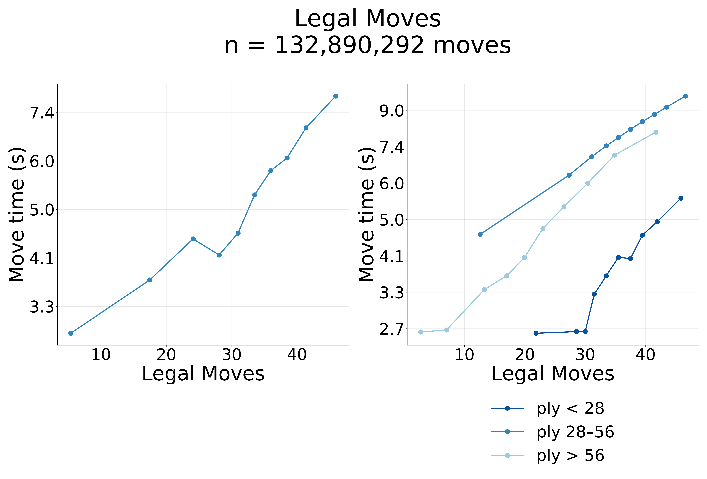
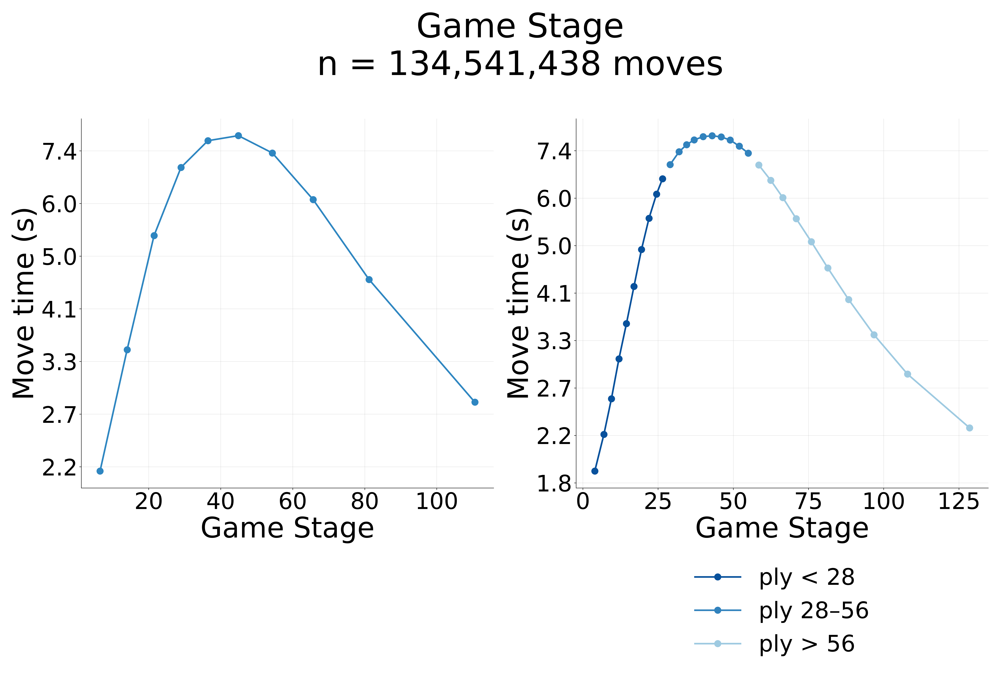
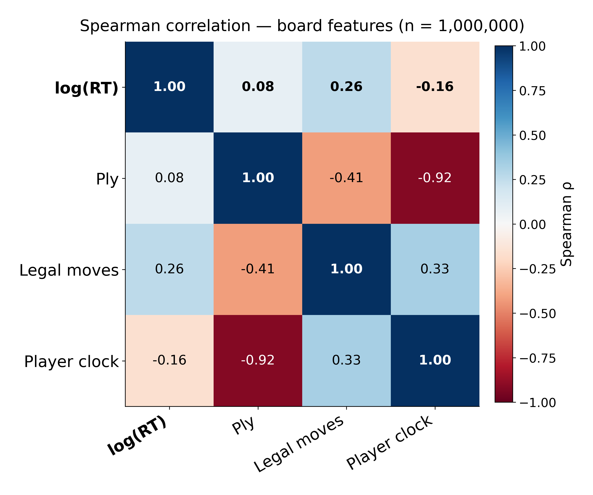
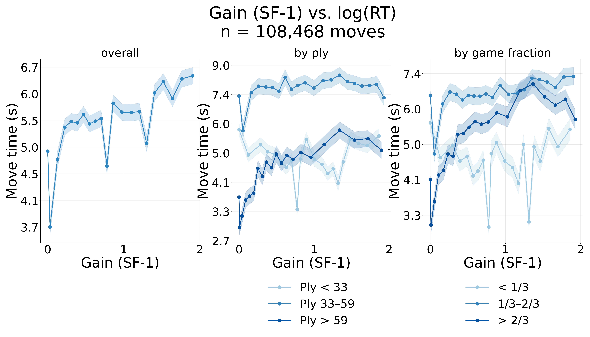
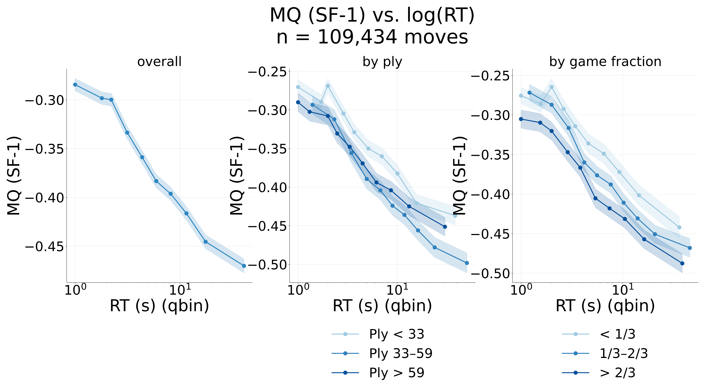
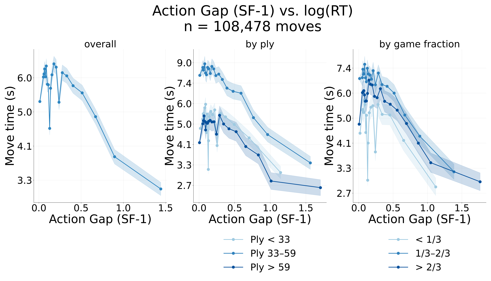
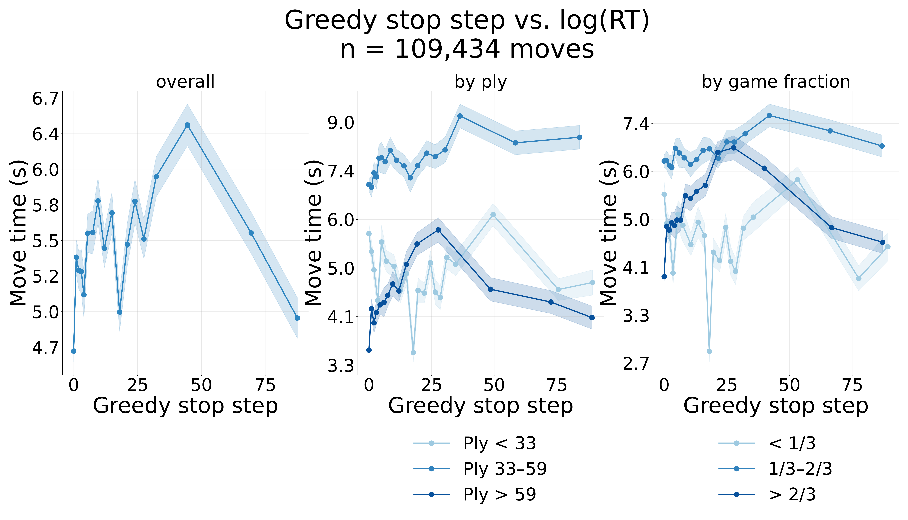
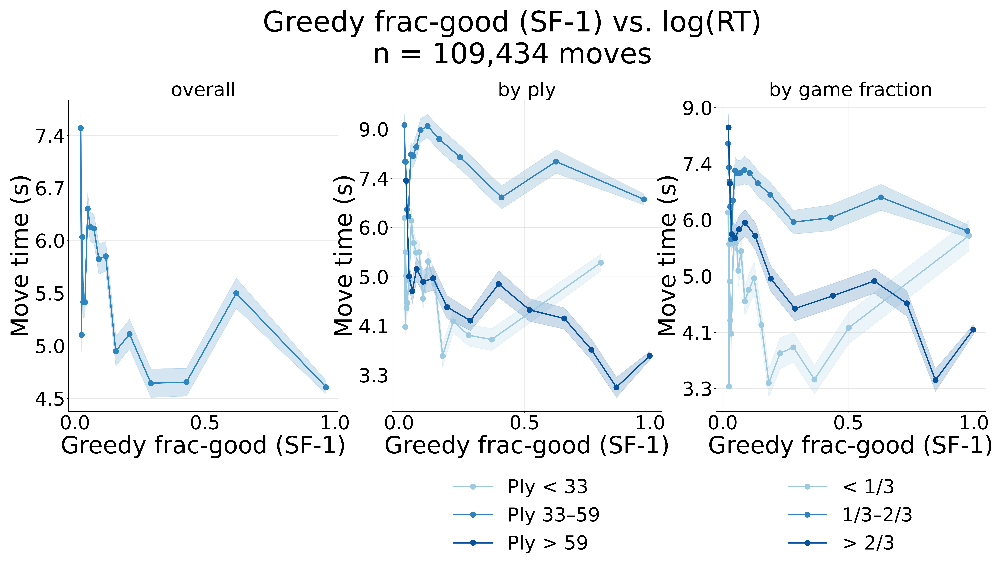
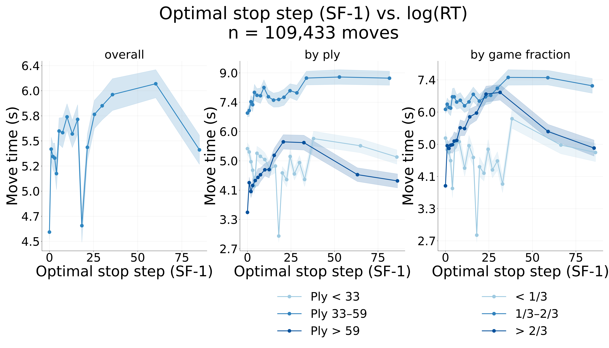
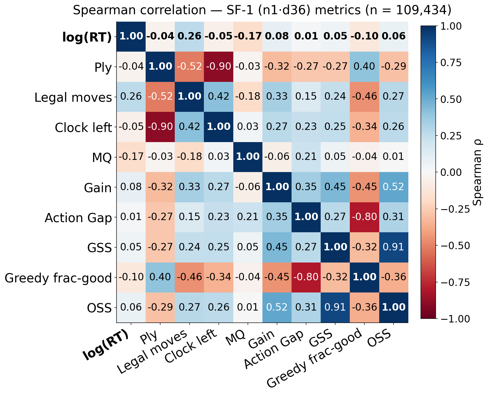

# When do people think? A search-model account of human deliberation time

**Thesis chapter (1 of 3) — `allply` run.** This is one chapter of the thesis; the other two
projects are complete and written up separately. This report is the synthesis for the **`allply`**
run — **all plies, no ply filter** — assembled from the per-inquiry reports in
[`reports/`](reference.md). *(A ply-windowed variant following Russek et al. 2025, plies 15–75, is
available as `config_minply15_maxply75.yaml`; this report is the full-data run.)*

> **The one-line story.** Humans deliberate longest when the decision is *wide* — many legal moves to weigh.
> The number of legal moves is the strongest predictor of think time, but that is the **fact to explain, not a
> model**: a count has no normative content. So the question is not "what beats legal-moves" (we chased that and
> everything *correctly* collapsed onto it); it is **"is it resource-rational to spend effort proportional to your
> options?"** The result we are after is a resource-rational planner — one that pays per operation and stops when
> the marginal value no longer justifies the cost — that **reproduces** the `size − satisfaction` curves, i.e.
> *explains* the legal-moves effect rather than rivaling it.

The chapter has **three sections**, matching the figure categories in `figures/allply/{board,engine,normative}`:

1. **Board** — model-free board regressors. *Legal moves dominate; think-time is log-normal.*
2. **Engine** — Stockfish value-of-computation signals. *They track RT only weakly, and every one collapses toward the move count.*
3. **Normative (TODO)** — the resource-rational planner that should *reproduce* the move-count effect. *Future work; one positive sign so far.*

> **Run.** Figures live under `figures/allply/`. Cells marked **⟨REFRESH⟩** are placeholders to fill
> from this run as it lands; provisional values shown are from the earlier full-data run and should
> match closely.

---

## Data

Lichess **10+0** games (600 s base, 0 increment), **both players Elo ≥ 2000**, over the ingested date
window. Games with negative move-times, berserk (halved-clock) starts, or opponent time-grants are
dropped in preprocessing (`src/analysis/preprocess.py`). The move is the unit of analysis; think
time is `move_time` (seconds on the mover's clock). **No ply filter is applied for this run** (the
window is a no-op); the analysis set is all non-instant moves.

**Filtering stages** (cumulative; the non-instant row is the set the Board/Engine sections analyze):

| Stage | Filter | Moves | Games |
|---|---|---:|---:|
| Parsed half-moves | 10+0, both Elo ≥ 2000, date-windowed; berserk / negative-clock / time-grant games dropped | 145,142,731 | ⟨REFRESH⟩ |
| **Analysis set** | **`move_time > 0`** (drop premoves / 0-s moves) | **135,482,903** | 1,921,082 |
| Engine subset | analysis-set moves matched to an SF-1 `n1md36` tree (distinct FENs, 250k sampled by `filter_trees.py`) | ⟨REFRESH: engine join⟩ | — |

- Distinct root FENs available for tree generation: **⟨REFRESH: filter_trees log⟩** (250k sampled).
- Engine analysis matches an analysis-set move to a generated tree by FEN.

---

## Board — how do people allocate thinking time?

Humans do not spend equal time on every move. Working **model-free** — no engine, just features
*of the position itself* — we ask which features predict how long a person thinks. Full inquiry:
[(R-MOVETIME-BOARD)](board.md).

First, the shape of the target. Log(move time) is approximately **normal** — move time is
**log-normal**, not exponential — so people scale thinking *multiplicatively* with difficulty.

> **Decision:** Work in **log(RT)** throughout (think time is log-normal, Weber's law), and screen
> structural features with **Spearman** rank correlation — they are skewed/bounded, so rank
> correlation is the honest measure.

Then the regressors. Each board feature gets the same dashboard (global + by game-stage tertile,
K=10 tie-safe quantile bins with per-bin SEM):

<!-- ⟨REFRESH⟩ game_fraction.png pending: new board covariate (move_ply / game length). -->

*Numbers below are **⟨REFRESH⟩** from this run; values shown are provisional (earlier full-data run).*

| Feature (from the position) | ρ with log(RT) | Reading |
|---|---|---|
| **legal moves** | **+0.343** *(prov.)* | more candidate moves → more to weigh |
| ply | **−0.248** *(prov.)* | later in the game → faster (fewer pieces, more forced) |
| clock (time left) | **+0.122** *(prov.)* | more time on the clock → more willing to spend it |
| game fraction (ply / game length) | **⟨REFRESH⟩** | new covariate — how far through the game |

The legal-move count is the strongest single board-feature tie to RT, and it is **not** reducible to
the ply/material/clock complex (which all move together as games progress).

> **Result:** The **width of the decision — the number of legal moves — is the strongest single
> predictor of human think time**, stronger than ply or clock. This is the fact the rest of the
> chapter has to explain.

---

## Engine — can an engine's value tell us when to think?

The legal-moves effect is suggestive but *structural* — it says nothing about whether thinking is
*worth it*. The resource-rational hypothesis is sharper: people should think longer where an engine
would *gain* more from searching. To test it we read value quantities off a **Stockfish search tree**
on the same position — the canonical **SF1** set (`n1md36`: Stockfish, n=1 leaf eval, depth-36, no
pruning; **n = ⟨REFRESH: matched moves⟩** analysis-set moves matched). The analysis lives inline in
`src/analysis/engine.py`.

The signals, in the user's terms:

- **Gain** — *value of computation*: how much value the full search finds beyond its own first guess.
- **MQ (move quality)** — *satisfaction of the played move*: `final_Q(played) − final_Q(best)` ≤ 0.
- **Greedy action-gap** — *decisiveness*: top-1 minus top-2 of the root children's value, computed *myopically* (pre-search).
- **GSS / OSS** — *stop step*: when a greedy / cost-optimal stop locks onto its best move.
- **Greedy frac-good** — fraction of moves within ≤ 0.1 of the best, computed myopically.

*Numbers below are **⟨REFRESH⟩** from this run; values shown are provisional (earlier full-data run).*

| Metric (SF1 `n1md36` tree) | ρ with log RT | Direction |
|---|---|---|
| **Gain** (value of computation) | **+0.140** *(prov.)* | as predicted — more to gain, longer think |
| **MQ** (played-move quality) | **−0.172** *(prov.)* | longer thinks land on *worse* moves |
| greedy action-gap (decisiveness) | **+0.061** *(prov.)* | small/near-null |
| GSS (greedy stop step) | **+0.096** *(prov.)* | as predicted |
| greedy frac-good (≤ 0.1 of best, myopic) | **−0.166** *(prov.)* | more good moves → faster (satisficing) |
| OSS (optimal stop step) | **+0.120** *(prov.)* | as predicted |

**Why these are all myopic (pre-search) signals.** The *deep* (post-search) action gap is a
post-search **outcome** confounded with think-time — a tree that searched longer has, by
construction, a more resolved gap — so the engine plots use the **pre-search myopic** values
throughout, which are the genuine inputs available *before* deciding how long to think. This is also
why **sharpness was dropped**: the deep action-gap that once looked like a "sharpness" signal was a
post-search artifact, and the myopic gap is ~null.

> **Clarification (H(π) is degenerate).** Stockfish has no policy head — its prior is **uniform** — so
> the policy entropy H(π) ≡ log(#legal moves): it is the move count relabeled, not a real signal. Its
> apparent correlation dies completely once legal-moves is partialled out (partial | legal ≈ 0).
> We do not present it as an engine result.

Every magnitude here is faint (|ρ| ≲ 0.17), and the values are **stable** across depth/eval budget.
The dominant driver of human RT is the **move count**, not value — and indeed each engine signal
collapses toward it.

> **Result:** The engine's value-of-computation quantities track human RT only **weakly** (|ρ| ≲ 0.17),
> and every one collapses toward the **legal-move count**. The engine captures the *direction* of the
> resource-rational effects but offers no value-based account of the dominant driver. That sets up the
> normative question: legal-moves is the thing to *explain*, not a rival to beat.

---

## Normative (TODO) — does a resource-rational planner explain the move-count effect?

This section carries the chapter's thesis. `figures/allply/normative/` is where the fit lands; the
closing figure and result line below are **⟨REFRESH⟩** placeholders.

**The reframing.** The legal-move count is the **explanandum, not a floor to beat.** A count has no
normative content: "RT correlates with legal moves" is a fact in search of a mechanism, not a model.
The goal is therefore **not** to find a value signal that *beats* legal-moves in magnitude (we
chased that across VOC, pruning, and construal proxies, and everything *correctly* collapsed onto the
count). The goal is a **resource-rational planner** — one that pays a cost per operation and stops
when the marginal value of more search no longer justifies the cost — that **reproduces** the
`size − satisfaction` curves. Such a planner would *explain* the legal-moves effect (more options ⇒
more to consider ⇒ longer, satisficing down when many moves are good) rather than rival it.

**The one positive sign we have.** A **no-prune node-cost stop** — a planner that simply pays per
expanded node and stops at the cost-adjusted value peak — already reproduces the two key signs:
**+size** (RT grows with the number of options) and **−satisfaction** (RT shrinks when more moves
are good). Code: `src/analysis/normative_curves.py`.

**Positioning vs Russek et al. (2025).** They report that RT *tracks the value of computation*; we
find the VOC signal, measured cleanly off SF-1 trees, is **weak and collapses onto option count**.
The reconciling claim this chapter advances: the VOC effect, properly decomposed, **is**
option-consideration cost — a per-option-inclusion price paid over a rationally-built consideration
set — which is exactly what the normative fit should demonstrate.

**Future work (the fit + plots).** Take the resource-rational planner with sensible cost parameters
and show it **regenerates the `RT-vs-{n_moves, fraction_good}` curves** with the right shape (the
satisficing concavity: high-satisfaction positions plateau low, low-satisfaction ones stay steep).

<!-- ⟨REFRESH⟩ figure pending: normative_curves.py output for the allply run. -->

> **Result (so far):** A no-prune node-cost stop reproduces **+size** and **−satisfaction** — the
> move-count effect *falls out of* a resource-rational stop. The full model fit and the normative
> plots are **⟨REFRESH⟩** (future work). Target read: **⟨REFRESH: fitted cost params + curve match⟩**.

---

## What is settled, and what is open

| Claim | Status | Evidence |
|---|---|---|
| Human think-time is log-normal; decision **width** (legal moves) is its strongest single predictor | **Settled** | board regressors; survives ply / clock — **⟨REFRESH ρ⟩** |
| Engine value-of-computation tracks RT only weakly, and every signal collapses toward the move count | **Settled** | SF1 `n1md36` — **⟨REFRESH ρ table⟩** |
| H(π) is **not** a real engine signal (uniform SF prior ⇒ H(π) ≡ log #legal-moves) | **Settled** | partial \| legal ≈ 0 |
| Sharpness is dropped — the deep action-gap was a post-search artifact; the myopic gap is ~null | **Settled** | engine plots use pre-search myopic values |
| Searching for a signal that **beats** legal-moves | **Retired (wrong target)** | a count is the *explanandum*, not a rival model; everything correctly collapses onto it |
| A resource-rational (per-op cost) stop **reproduces** +size and −satisfaction | **Settled (one sign)** | `src/analysis/normative_curves.py` |
| A resource-rational model **reproduces** the `size − satisfaction` *curves* with sensible cost params | **Open (the fit)** | future work; check RT-vs-{n_moves, fraction_good} |

> **The working conclusion.** RT tracks **decision width** with a **satisficing signature**, and that is the
> **fingerprint of resource-rational option-consideration** — *not* "people irrationally count moves," and *not* a
> phenomenon waiting for a signal that beats it. Legal-moves is what a cost-based planner *should* produce; the
> open work is the **fit** — does such a planner regenerate the RT curves with reasonable parameters? That is an
> *explanation* of the legal-moves effect, which a bare count can never be.

---

## Pointers (per-inquiry reports & methods)

- Board regressors & log-normal RT: [`board.md`](board.md)
- Engine value-of-computation signals: [`engine.md`](engine.md)
- Reproducible run (config, filtering, pipeline): repo-root `config_allply.yaml`, `slurm/pipeline/` (manifest `pipeline.yaml` + `submit_all.sh`)
- Report/deck conventions & index: [`reference.md`](reference.md)
