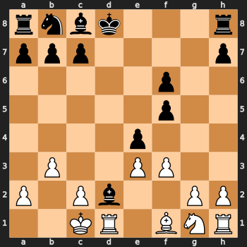
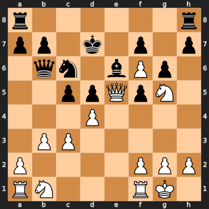
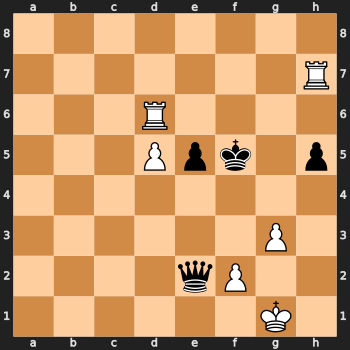
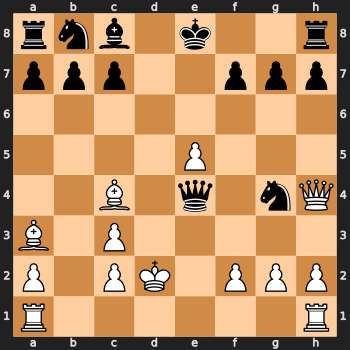
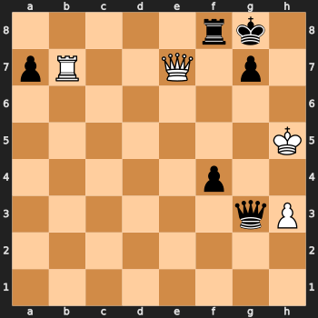

# Human response time — what board features predict it

**Ref:** `R-MOVETIME-BOARD` · [Index](reference.md)

## What board features predict how long humans think?

Humans don't spend equal time on every move. Working model-free (no engine), we ask which
features *of the position itself* predict how long a human thinks before moving — on
**89,218,280** non-zero-time moves from Lichess **10+0** games (Elo ≥ 2000, no berserk,
Oct–Dec 2023), windowed to **ply 15–75** (`filtered_moves_minply15_maxply75`; Russek et al.'s
window, chosen to sit past the memorized-opening phase and before very-late-game noise). Legal
captures/checks (`n_captures_avail`, `n_checks_avail`) come from a python-chess enumeration over
the run's **84,034,834** distinct FENs (`board_features_minply15_maxply75`), joined back to every
move-instance.

Every dashboard below is the same **1×3 layout**: marginal histogram (left), the overall trend
(middle), the trend split by ply tertile (right, Ply < 32 / 32–49 / > 49). Below the surface-level
shape, four of these curves turned out to bend in ways that aren't simply "harder position → more
thinking" — an inverted U, a set of staggered dips, an uneven jagged histogram, and a bump-then-dip.
Each gets its own investigation, backed by the actual conditional means / counts / FEN examples
that either confirm or debunk the obvious confounds.

> **Result:** Response time is driven most by the **width of the decision** (legal moves,
> ρ ≈ +0.20 with log RT) — more than by material, clock, or checks/captures available — but three
> of the "secondary" board features (checks available, material imbalance, own material) show
> real non-monotonic wrinkles once you look past the headline trend.

### How is response time distributed?

Log-scale summary stats (`exp(mean(ln RT))` / `exp(median(ln RT))`): **mean 6.5 s** (key:
`board/rt/mean_s`), **median 6.4 s** (key: `board/rt/median_s`) — the two are close, which is the
signature of a symmetric distribution *in log-space*. The middle panel is a **P-P plot**
(probability–probability, both axes 0–1: theoretical quantile probability vs. the empirical
quantile's probability under the fitted Normal CDF) — it hugs the y = x line closely across the
bulk of the distribution, with mild tail deviation. In raw seconds the picture looks different: the
arithmetic mean is **11.4 s** and the (exact, non-log) median is **6.0 s** — the long right tail of
slow, effortful moves pulls the arithmetic mean well above the typical move, exactly what you'd
expect if RT is **log-normal** rather than normal on its raw scale.

The third panel (RT vs ply, whole game, unwindowed) shows RT rising from the opening, peaking
around ply 40–45 (**> 7.4 s**), then falling through the endgame — the grey band marks this
report's analysis window [15, 75], which sits on the rising-into-peak part of that arc, not at
either extreme.

> **Result:** Response time is **log-normal**, not exponential or uniform — so players scale
> thinking *multiplicatively* with difficulty. This is why every trend panel in this report plots
> RT on a log y-axis, and why Pearson correlations below are computed against **log(RT)**.

### How does remaining clock time affect response time?

RT vs. remaining clock is an **inverted U**: it rises from ~7.1 s at very low clock, peaks around
**8.4 s near 300 s remaining**, then falls sharply to ~3.3 s as clock approaches the full 600 s.
Pearson r(log RT, clock) = **−0.135** (key: `board/corr/pearson/player_clock_time`) overall — a modest negative correlation that is really
averaging over two different regimes glued together. The by-ply-tertile panel makes the likely
reason legible: the three tertiles occupy *different, only-partly-overlapping clock ranges* (Ply <
32 sits at high clock/low RT on the right, Ply > 49 sits at low clock on the left), and each
tertile's own within-band trend is far closer to monotonically *falling* as clock rises within its
own narrow range, with only a gentle hump. In other words, the sharpest part of the "hump" (fast
moves at full clock) is disproportionately early-opening moves — which are fast for reasons
(memorized/forced opening theory) that have little to do with clock pressure per se — while the
low-clock-collapse end is genuine time pressure (endgame time scrambles, verified by the fact all
three tertiles converge to fast RT as their own clock runs low).

> **Clarification:** The apparent inverted-U is a **mix of two real but distinct effects**: fast
> opening moves happen to co-occur with a still-full clock (a game-stage effect, not a clock
> effect), while the fall at the low-clock end is real time pressure (present within every ply
> tertile). We have not fully isolated the two (that would need clock conditioned tightly within
> narrow ply bins), so treat the single-peaked overall curve as descriptive, not as evidence that
> clock time itself is non-monotonically related to RT once game stage is held fixed.

### How do legal moves affect response time — and why does the curve dip at 9–10?

Legal moves is the strongest board-feature correlate of RT (Pearson r(log RT, legal moves) =
**+0.198**, key: `board/corr/pearson/n_possible_moves`; consistent with the larger literature's finding that decision **width** — not depth —
is what people are seen to spend time on). The overall trend is not simply monotonic, though: RT
rises sharply from 1 legal move (fastest, ~2.5 s) to a local peak around **7 legal moves** (~5.2 s),
then **dips at 9–10** (~3.7–3.9 s) before resuming a long, almost-linear climb out past 60 legal
moves (~11 s). The same bump-then-dip shape appears within every ply tertile.

**Is this the in-check effect?** In-check positions are drastically restricted (block / capture /
king-move only), so they concentrate at low legal-move counts — and if in-check RT differs
systematically from non-check RT at the same move count, mixing the two populations at exactly the
point where in-check's population share collapses could produce a dip that has nothing to do with
the move count itself. Rather than argue this from a table, the supplementary dashboard below
re-runs the exact same analysis with in-check rows excluded entirely (`n = 84,210,269`, 94.4% of the
windowed table):

The dip is simply **gone**: 6→**3.33 s**, 7→3.40 s, 8→3.54 s, 9→3.59 s, 10→3.65 s, 11→3.79 s,
12→3.94 s, 13→**4.06 s** — a clean, monotonic rise straight through the range that used to dip, in
every ply tertile. The main dashboard's dip is a **composition-shift artifact**: in-check moves are
slower than not-in-check moves at the same legal-move count (a high-stakes, carefully-checked
decision even with few options — not a fast reflex), and in-check's population share collapses
sharply right around legal-moves 8–10 (from roughly three-fifths of rows down to under a tenth),
dragging the *pooled* mean down toward the (flat, non-dipping) not-in-check mean exactly there. Once
that sub-population is removed rather than averaged over, there's no dip left to explain.

Two examples at legal moves = 9, one in-check and one not, showing why they land at the same move
count for very different reasons:

<table><tr>
<td align="center"> in check (RT 9 s, ply 45) <code>r4rk1/pp3ppp/2n2q2/3p4/7R/1NP4Q/PP3KPP/RB6 w - -</code></td>
<td align="center"> not in check (RT 5 s, ply 55) <code>8/1p2k3/4pp1p/p2pPp2/5K2/2P2PPP/PP6/8 w - -</code></td>
</tr></table>

The in-check example is a forced king-safety scramble under a rook check on the h-file; the
not-in-check example is a quiet king-and-pawn endgame where only a handful of pawn levers are
legal — both land at 9 legal moves for very different reasons, and only the first one is inflating
the pooled mean.

> **Clarification:** The dip in the legal-moves curve at 9–10 is a **composition-shift artifact**:
> in-check positions carry a real, higher RT premium at every fixed move count, and their
> population share falls off a cliff right at 8→10 legal moves — not evidence that ~9–10 legal
> moves are themselves an easier decision than 7 or 11.

### How does own material affect response time?

RT climbs steadily with own material from a fast ~1.7 s near-empty board up to a broad ~7–9 s
plateau in the 25–39 range — more material, more piece interactions to weigh — but the plateau is
visibly **jagged**, with uneven spikes and dips rather than a smooth curve (e.g. around
self-material 35/37/38/39).

**Is 39 really "full army"?** Weighted material excludes the king and uses P/N/B/R/Q =
1/3/3/5/9: a completely untouched army is 8 pawns + 2 knights + 2 bishops + 2 rooks + 1 queen =
8(1) + 2(3) + 2(3) + 2(5) + 9 = **39**, and self-material = 39 is indeed one of the highest-count
values in the table (4,596,768 rows).

**Why the jaggedness?** Because the weight function collapses many different piece losses onto
the same integer, adjacent integers can have wildly different *populations behind them* — some
totals correspond to exactly one real board configuration, others to a genuine mixture of
qualitatively different ones (a knight traded vs. a bishop traded, since N = B = 3). We verified
this directly by parsing the piece counts (mover's side) off a sample of real FENs at each total:

| self-material | row count (full table) | mean RT | dominant piece-count combo(s) in a real-FEN sample |
|---:|---:|---:|---|
| 39 | 4,596,768 | 8.59 s | **100%** 8P·2N·2B·2R·1Q (no losses at all — the starting army) |
| 38 | 7,548,663 | 10.01 s | **100%** 7P·2N·2B·2R·1Q (lost exactly 1 pawn) |
| 37 | 2,505,884 | 12.52 s | **100%** 6P·2N·2B·2R·1Q (lost exactly 2 pawns) |
| 35 | 8,226,020 | 11.34 s | **53%** 7P·1N·2B·2R·1Q (knight-for-pawn) / **46%** 7P·2N·1B·2R·1Q (bishop-for-pawn) |

38 (7.5M rows) and 35 (8.2M rows) are the two densest points in the whole covariate — but for
*different* reasons. 38 is dense because "traded/lost exactly one pawn, nothing else" is simply a
very common real game state. 35 is dense **and structurally different**: it pools two genuinely
different tactical histories (a lost knight vs. a lost bishop) that happen to weigh the same,
because N and B share weight 3. 37, by contrast — "lost exactly two pawns with *zero* piece
losses" — is a comparatively rare, narrow state (2.5M rows, the local minimum in the sawtooth), and
sits between the two much denser 38 and 39.

<table><tr>
<td align="center"> self-material = 39 full army, no losses</td>
<td align="center"> self-material = 37 2 pawns down, no piece losses</td>
</tr><tr>
<td align="center"> self-material = 35 knight-for-pawn</td>
<td align="center"> self-material = 35 bishop-for-pawn (same total, different piece lost)</td>
</tr></table>

Unlike the legal-moves dip (§ above), we are **not** claiming this jaggedness is a pure small-n
noise artifact — every bin in the jagged region (34–39) has millions of rows, far above the
`min_bin_count=300` floor, so per-bin SEM is tiny. It is a real feature of the *display*: adjacent
integer totals sample structurally different, unevenly-sized mixtures of real game trajectories
(some totals map to one board state, others to several qualitatively different ones), and the
zigzag in mean RT tracks that shifting composition rather than a smooth causal dependence on the
material total itself.

> **Clarification:** The jaggedness near 35–39 is a genuine **population-mixture** effect, not
> sampling noise (bins are all multi-million-row) and not a real non-monotonic causal effect of
> material *per se* — it reflects that N = B = 3 (and other coincidental weight collisions) let
> different real board states collide onto the same integer, at uneven and non-smoothly-varying
> rates as the total approaches the full-army ceiling.

#### Why doesn't `smoke_bivariate_self_material.pdf` match `bivariate_self_material.pdf`?

Despite the "smoke_" filename, this pair is **not** a small-sample-vs-full-sample comparison — both
are (nearly) full-table runs, from **two different versions of `board.py`**:

| | `bivariate_self_material.pdf` (older on-disk artifact) | `smoke_bivariate_self_material.pdf` (current working-tree code) |
|---|---|---|
| layout | 1×2 (overall, by ply — no histogram panel) | 1×3 (+ histogram panel) |
| display clip on the trend | none — the trend spans the **full raw range**, self-material 0 up to a merged tail at ≥ 40 | `(14, 40)`, with a `filter_query` that **excludes** rows below 14 |
| n | 89,218,280 (the full windowed table, unfiltered) | 82,373,600 (89,218,280 − 6,844,680 rows with self-material < 14, verified by direct count — an exact match) |

We checked the obvious first hypothesis — that the older file uses quantile (`ntile`) binning on
this integer covariate while the newer one uses `bin_mode="integer"` (one point per value) — by
literally re-running the currently-**committed** `board.py`'s exact `Analyzer` call (`tie_safe=True`,
no `bin_mode` override, i.e. its actual default) against the same table. That reproduction gives
exactly **10** quantile-tie-safe points (mean-x running from 11.6 up to 39.0, e.g. the first point
already averages self-material 0–15 together into one point at RT ≈ 4.7 s). That is **not** what's
on disk: pixel-counting the marker dots in `bivariate_self_material.png`'s "overall" panel shows
roughly one point per integer across the full range (0 to a merged tail ≥ 40) — the same
one-point-per-value resolution as the newer plot, not a 10-point quantile curve. So the currently
*committed* source no longer matches either on-disk PDF; the older artifact must have come from an
in-between, no-longer-present iteration of `board.py` that had already switched to integer binning
before the display-clip and histogram-panel changes landed. We flag this rather than paper over it:
the **binning-mode** story from the committed-vs-working-tree diff doesn't hold up under direct
reproduction, so it is not the operative mechanism here.

What **does** hold up, directly: the display-clip difference. The older, unclipped plot's leftmost
points are real per-integer values near the empty board — self-material 0 (523 rows, geometric-mean
RT **1.75 s**) and self-material 1 (2,294 rows, 1.75 s), climbing to 2.32 s by self-material 3 — a
genuine fast "near-empty-board" tail that the newer `(14, 40)`-clipped version's row filter removes
from the data entirely, not merely from the display. At the other end, the older plot's rightmost
point merges everything self-material ≥ 40 into one point (only **691** rows total across
self-material 40–55, hence the wide, visibly fraying confidence band at the right edge) — that
merged-tail mechanism (`integer_tail_cut`) is common to both plots, just landing at a different
place once the clip bound moves. The jagged high end discussed above (35/37/38/39) is likewise
common to both and not the source of the discrepancy.

> **Clarification:** The "smoke_" prefix here is a **misnomer carried over from ad hoc testing**,
> not this project's actual smoke-test convention (a genuine ~50,000-row sample). Every other
> `smoke_bivariate_*` file in the current output directory has **the same n as its non-smoke
> counterpart** (e.g. `n_checks_avail`, `material_imbalance`: both 89,218,280) — only
> `self_material` differs in row count, and that's from the newer clip's row filter (verified exact:
> 89,218,280 − 82,373,600 = 6,844,680 = the count of rows with self-material < 14), not sampling.
> The dominant driver of the visibly different curve *shape* is the **clip-range change dropping
> the near-zero, fast-RT tail** (self-material 0–13) from the data, not a change in binning
> resolution — both on-disk artifacts bin at one point per integer value once you actually count
> the rendered points, which the raw code diff alone would not have told us. A real `--smoke` mode
> is planned as a parallel change and will resolve the naming collision by making "smoke_" mean an
> actual small sample everywhere, not "whatever a WIP run happened to produce."

### How does material imbalance affect response time — direction, magnitude, and the staggered dips?

**Is being ahead the same as being behind?** No — not even close. The `material_imbalance` feature
is the SIGNED value (self − opponent, weighted, mover POV; positive = mover ahead), plotted directly
below, and it is sharply asymmetric, not a mirror-image U around 0:

| imbalance | −15 | −10 | −5 | −3 | −1 | 0 | +1 | +3 | +5 | +10 | +15 |
|---:|---:|---:|---:|---:|---:|---:|---:|---:|---:|---:|---:|
| geo. mean RT | 2.78 s | 2.95 s | 4.16 s | **4.45 s** | 6.64 s | 6.75 s | **8.02 s** | 7.37 s | 6.70 s | 5.04 s | 3.80 s |

Three things stand out. First, the curve **peaks just past parity, at +1** (8.02 s), not at 0 — being
*slightly* ahead is the single most deliberated state, more than being exactly even. Second, the two
arms are wildly asymmetric: at the same magnitude, being ahead is always slower than being behind
(+5 → 6.70 s vs. −5 → 4.16 s; +10 → 5.04 s vs. −10 → 2.95 s) — a mover who is losing plays
consistently faster than a mover who is winning by the same amount. Third, there's a local dip
exactly at **−3** (4.45 s, a genuine drop below both −2's 6.10 s and −4's 4.80 s neighbors) — this is
the same |imbalance| = 3 "staggered dip" the analysis below finds in the absolute-value view, and
here it's directly visible *which side* drives it: the dip lives almost entirely on the "mover
behind" side, not spread symmetrically across both signs.

> **Result:** Material imbalance's effect on RT is not just "bigger gap → more decided → faster" —
> it is fundamentally about **who is ahead**. A mover who is behind plays fast (consistent with
> urgency / fewer good options / more forcing continuations to check), while a mover who is ahead by
> the same amount deliberates much longer (consistent with converting an advantage carefully) — and
> the very top of the whole curve is a *small* advantage (+1), not a large one.

**How much does the magnitude of the gap matter, regardless of direction?** The companion feature
`abs_material_imbalance` (|self − opponent|) answers a different question — not "who's ahead" but
"how decided is this position" — and reveals its own wrinkle: staggered dips rather than a smooth
decline.

RT falls steadily as the material imbalance (|self − opponent|, weighted) grows — a bigger material
gap makes the position more decided, and decided positions are handled faster — but the fall is not
smooth: it's punctuated by sharp step-down dips, most visible in the **Ply < 32** tertile, with the
sharpest drops around imbalance ≈ 3 and again ≈ 9–10.

**Is this small-n noise?** No. Within Ply < 32 specifically, imbalance = 3 has **1,714,662** rows
and imbalance = 9 has **83,981** rows (both far above `min_bin_count=300`; out of 30,890,416 total
Ply < 32 rows). Note imbalance = 3 even has *more* rows than imbalance = 2 (1,273,073) — bin
population itself is non-monotonic here, a first hint that something about exactly these totals is
structurally different, not just sparse.

**Is there a population confound?** Yes — a strong one, and it's the same ahead/behind asymmetry the
signed curve above already showed directly (behind is fast, ahead is slow) — this splits it out
explicitly, tertile by tertile, to pin down exactly where the abs-value dips come from. Splitting
each dip point by whether the *mover* is the one ahead or behind (sign of the signed, non-absolute
`material_imbalance`) within Ply < 32:

| \|imbalance\| | mover **behind** (n, mean RT) | mover **ahead** (n, mean RT) | ratio behind:ahead |
|---:|---|---|---:|
| 2 (no dip, for comparison) | 816,282 rows, 9.08 s | 456,791 rows, 13.19 s | 1.8 : 1 |
| **3** (dip) | 1,504,604 rows, **5.39 s** | 210,058 rows, 12.64 s | **7.2 : 1** |
| **9** (dip) | 80,505 rows, **3.81 s** | 3,476 rows, 9.92 s | **23.2 : 1** |

At both dip points the population is overwhelmingly made up of moves played by the side that is
*behind* on material, and the behind-mover's RT is much faster than the ahead-mover's RT at the
same imbalance magnitude (5.4 s vs. 12.6 s at |imbalance| = 3; 3.8 s vs. 9.9 s at |imbalance| = 9) —
so the pooled/marginal mean at exactly these imbalance levels is pulled down by an increasingly
lopsided mix of fast "behind" moves. The skew itself gets more extreme as |imbalance| grows (1.8:1
→ 7.2:1 → 23.2:1), which tracks the steepening of the dips.

We also checked whether these are narrow, short-lived states (consistent with "a piece was just
dropped/sacrificed" rather than a stable, long-run material gap): counting **distinct games** vs.
rows, within Ply < 32 —

| \|imbalance\| | distinct games | rows | rows per game |
|---:|---:|---:|---:|
| 0 (balanced) | 1,753,565 | 21,694,828 | 12.4 |
| 1 | 1,256,709 | 5,465,969 | 4.3 |
| 2 | 430,645 | 1,273,073 | 3.0 |
| **3** | 1,037,270 | 1,714,662 | **1.65** |
| 9 | 77,926 | 83,981 | 1.08 |

A balanced position (imbalance = 0) lingers for ~12 moves per game on average within this window;
imbalance = 3 is visited only ~1.65 times per game and imbalance = 9 essentially once — consistent
with these being **transient, quickly-resolved states** rather than settled material gaps, though
we have not traced the exact game-level narrative (opening theory vs. blunder vs. voluntary
sacrifice) behind the ahead/behind asymmetry itself.

Example positions at the two dip points, one from the majority ("behind") sub-population and one
from the minority ("ahead") sub-population:

<table><tr>
<td align="center"> |imbalance| = 3, mover behind (majority) RT 1 s, ply 29</td>
<td align="center"> |imbalance| = 3, mover ahead (minority) RT 2 s, ply 19</td>
</tr><tr>
<td align="center"> |imbalance| = 9, mover behind (majority) RT 2 s, ply 23</td>
<td align="center"> |imbalance| = 9, mover ahead (minority) RT 1 s, ply 26</td>
</tr></table>

> **Clarification:** The staggered dips are not small-n noise (every bin is well into six figures),
> but they are **confounded by an ahead/behind composition shift**: the population backing each dip
> is dominated by the disadvantaged mover, who plays consistently faster than the advantaged mover
> at the same imbalance magnitude, and that skew sharpens exactly where the dips are steepest. The
> underlying cause of the skew itself (why "behind" moves so outnumber "ahead" moves at these
> specific imbalance levels) is consistent with these being short-lived, quickly-resolved states —
> evidenced by the low rows-per-game counts — but is not fully traced here (e.g. we did not
> separate genuine blunders from voluntary sacrifices/gambits).

### How does the number of available checks affect response time — and is the inverted-U real?

RT rises from n_checks_avail = 0 (**5.9 s**, 54.5% of rows — most positions offer no check at all)
to a peak at **4 available checks** (**8.2 s**), then falls back down through 8–9 (**7.2–7.0 s**) —
an inverted U, present in the overall trend and within every ply tertile. (This section restates
every number from a fresh, single consistent convention — geometric mean RT,
`exp(mean(ln(move_time)))` — recomputed directly against the live tables for this re-investigation;
the previous draft of this section mixed an arithmetic-mean confound table with a geometric-mean
marginal figure, which is why the absolute levels below read lower than the very first version of
this section. The qualitative shape — peak at 4 — is unchanged.) This section was commissioned as
an adversarial re-test of that shape, addressing three concrete concerns: is the underlying feature
even correctly computed, is the inverted-U actually a disguised endgame/game-phase effect, and is
the "fall" at the sparse high end even real or just small-n noise.

**1. Is n_checks_avail correctly computed — could it be inflated by moves that are illegal because
the mover is still in check?** `calc_captures_checks` (`src/analysis/board.py`) enumerates
`chess.Board(fen).legal_moves`, which is documented to already exclude any move that leaves the
mover's own king in check (full legality, not pseudo-legal). We did not just trust the docs — we
checked it empirically two ways. First, self-play: across 200,000 randomly-played games we
collected in-check positions and, for every legal move python-chess offered, confirmed the position
after `push()` never left the original mover's king attacked (verified directly via
`is_attacked_by`, not just `is_check()`, to avoid a whose-turn bookkeeping mistake). Second, and
more importantly, on **this dataset's own data**: we sampled 280 distinct real in-check FENs from
`filtered_moves_minply15_maxply75` (`in_check = TRUE`) and exhaustively re-enumerated all 995 of
their legal moves — **0 of 995** left the mover's own king in check. `legal_moves` is doing exactly
what it should.

Separately, the user's concern also raises a real chess question: can a move that resolves the
mover's own check *also* deliver check to the opponent (a discovered check while capturing or
blocking the checker, or a king move that unmasks a check from behind)? Yes — this is legitimate
chess (e.g. capturing the checking piece with a piece that itself now attacks the enemy king), and
it does occur in this dataset, not just in principle: of the **5,008,011** rows with `in_check =
TRUE`, **66,662 (1.33%)** join to a `board_features` FEN with `n_checks_avail > 0`
(**66,122 of 4,885,598**, 1.35%, at the distinct-FEN level). Two real examples, verified directly
with python-chess:

<table><tr>
<td align="center"> White's king (c1) is in check from the bishop on d2; the only reply that also checks back is <b>Rxd2+</b> — the rook captures the checking bishop and delivers check itself.</td>
</tr></table>

(A second real example from the dataset: `7k/7p/3pQ3/4q3/1p5B/1P5P/6PK/5r2 w - -`, ply 73 — White's
king on h2 is in check from the black queen on e5 along the e5–h2 diagonal; **Qxe5+** captures the
checking queen and, from e5, delivers check to the black king on h8 along the open e5–h8 diagonal —
resolving White's own check and giving check to Black in the same move.)

> **Result:** This is **not a bug**. `chess.Board.legal_moves` correctly excludes any move that
> would leave the mover's own king in check — confirmed empirically on 995 real legal moves drawn
> from 280 real in-check positions in this exact dataset, zero violations. The rare case the user
> was worried about (an in-check mover whose only escapes also happen to check back) is real,
> legitimate chess — it happens in **1.33% of in-check rows** — and `n_checks_avail` is counting it
> correctly, not inflating it. `calc_captures_checks` does not need a fix.

**2. Is this an endgame/game-phase artifact — do simplified, near-decided endgames drive the
fall?** Checks-available correlates modestly with both ply (r = **+0.234**) and total pieces on the
board (r = **−0.258**, using `n_pieces_on_board_inc_pawns` — both sides, the right variable for
"how simplified is this position", as opposed to `self_material` which is the mover's own material
only) — positions with many available checks do run somewhat sparser (mean **24.7** total pieces at
checks = 0 down to **18.1** at checks = 9) and somewhat later. We tested the game-phase hypothesis
four separate ways, more thoroughly than the original tertile check:

*Fine ply-bin stratification* (6 bins across the [15,75] window, not just 3 tertiles) shows the
peak location and the two amplitudes (rise = peak − RT at 0; fall = peak − RT at 9) are **not**
ply-invariant — but not in the way "trivial endgame" would predict:

| Ply bin | n (this bin) | peak at k= | RT(0) | RT(peak) | RT(9) | rise | fall |
|---|---:|---:|---:|---:|---:|---:|---:|
| [15,25) | 18,359,039 | 9 (still rising) | 4.56 s | 8.96 s | 8.96 s | 4.40 s | **0.00 s** |
| [25,35) | 17,745,805 | 6 | 6.59 s | 9.00 s | 8.73 s | 2.41 s | 0.27 s |
| [35,45) | 16,390,272 | 4 | 7.22 s | 9.17 s | 8.36 s | 1.96 s | 0.81 s |
| [45,55) | 14,372,591 | 4 | 6.86 s | 9.04 s | 7.69 s | 2.18 s | 1.35 s |
| [55,65) | 11,963,818 | 4 | 5.94 s | 8.28 s | 6.83 s | 2.34 s | **1.45 s** |
| [65,76) | 10,386,755 | 4 | 4.85 s | 6.98 s | 5.67 s | 2.13 s | 1.31 s |

The **rise** (0 → peak) is present at essentially the same ~2.0–2.4 s magnitude from ply 25 onward
— it is not a phase effect. The **fall** (peak → 9), by contrast, genuinely is phase-linked: it is
completely **absent** in the earliest bin (ply 15–25 — the curve is still climbing at 9, no
turnover at all), appears mildly at ply 25–35, and grows to its largest relative size (≈15–19% of
peak RT) from ply 45 onward. This partially — not fully — supports the user's hypothesis: the
*shape* (peak at 4) and the *rise* are ply-invariant, but the *fall* specifically strengthens as the
game progresses.

*Holding total pieces fixed* (a band, mirroring the earlier self-material check): within
`n_pieces_on_board_inc_pawns ∈ [22,26]` (28.4M rows), the inverted-U survives essentially intact —
0→**7.03 s**, peak at 4→**9.04 s**, falling to 9→**8.62 s** — and jointly with the legal-moves
`[35,40]` band together (n=183,825 at the peak cell), it still peaks (now a flatter 4–5 s plateau at
~8.47–8.48 s vs. 7.78 s at 0, falling to 8.13 s at 9).

*The sharp test — few vs. many pieces on the board, directly*: restricting to **≤10 total pieces**
(429,498 rows, 0.48% of data — a genuine simplified-endgame slice) and to **≤8** (63,388 rows,
0.07%) both still show a rise-then-fall (peak at k=4, e.g. 3.06 s→**4.89 s**→4.20 s at k=9 for
≤10, noisier for ≤8 given the sparse tail there — n as low as 169–273 rows at k=7–9). Restricting to
**≥20 total pieces** (67.9M rows, **76% of the whole window** — hardly a trivial-endgame subset)
shows a *clean* inverted-U of essentially the same shape as the marginal curve: 6.14 s→**8.89 s**
(peak at 4)→8.34 s at k=9. The genuinely striking result is the *opposite* extreme: restricting to
**≥26 total pieces** (48.9M rows, 54.8% — the piece-richest, least-simplified slice, closest to
early-middlegame) shows **no fall at all** — RT rises monotonically from 5.80 s at 0 all the way to
9.14–9.33 s at k=8–9 (noisy at that tail, n≈8–10k, but there is no turnover, only continued
climbing).

So the "trivial simplified endgame" hypothesis is **not confirmed in the direction the user
proposed**: the fall is not confined to (or strongest in) the sparsest endgames — it is present and
clean already at ≥20 pieces (the bulk of the window), comparable in relative size in the truly
sparse ≤10-piece slice, and it is *only the piece-richest slice* (≥26, the most "opening-like"
positions still in this ply window) where the fall disappears entirely.

Example positions contrasting a piece-rich vs. a sparse-endgame position at the peak (4 checks
available) and at the falling tail (8–9 checks available):

<table><tr>
<td align="center"> k=4 (peak), 28 pieces, ply 31 RT 9 s</td>
<td align="center"> k=4 (peak), 10 pieces, ply 75 RT 5 s</td>
</tr><tr>
<td align="center"> k=8 (tail), 26 pieces, ply 24 RT 9 s</td>
<td align="center"> k=8 (tail), 10 pieces, ply 72 RT 4 s</td>
</tr></table>

> **Clarification:** Game phase / total material **does modulate** the inverted-U, but only its
> **falling half**, and not in the direction "trivial endgame" predicts. The rise (0→peak) is
> ply-invariant and pieces-invariant. The fall (peak→9) is absent at the very earliest ply band and
> in the piece-richest slice, but is already fully present once you leave that narrow piece-rich
> band — including across 76% of the whole dataset (≥20 pieces) — and does not get systematically
> stronger in the most reduced endgames (≤10, ≤8 pieces) than it is in the ≥20-piece majority. This
> is a genuine, quantified, phase-linked modulation of the fall's amplitude — not an explanation
> that makes the inverted-U go away.

**3. Is the fall at the sparse high end (7, 8, 9 available checks) real, or an artifact of how few
rows populate those bins relative to the 54.5%-of-data point-mass at 0?** Row counts at the top of
the range are not actually small in absolute terms (192,335 at k=8; 96,427 at k=9; 82,224 at k=10+)
— but we checked directly with a 2,000-resample percentile bootstrap (never normal-theory) on
`exp(mean(ln(move_time)))` per exact integer bin:

| n_checks_avail | n (exact) | geo. mean RT | 95% bootstrap CI |
|---:|---:|---:|---:|
| 4 (peak) | 1,829,787 | 8.247 s | (8.216, 8.279) |
| 5 | 932,738 | 8.138 s | (8.108, 8.170) |
| 6 | 545,825 | 7.847 s | (7.816, 7.878) |
| 7 | 331,958 | 7.479 s | (7.451, 7.508) |
| 8 | 192,335 | 7.186 s | (7.151, 7.219) |
| 9 | 96,427 | 6.955 s | (6.910, 7.002) |
| ≥10 (merged tail) | 82,224 | 6.766 s | (6.716, 6.815) |

Every adjacent pair of CIs from the peak down through the merged tail is **non-overlapping** — the
decline is a clean, statistically real, monotonic effect at every step, not sampling noise, even
though n shrinks by more than 20× from the peak to the k=9 bin.

We also fit a **Nadaraya–Watson kernel-weighted local regression** treating n_checks_avail as a
continuous ordinal variable (Gaussian kernel over the *exact* per-integer group means — this is
mathematically exact, not an approximation, since a kernel-weighted average of group means equals
the row-level kernel regression when groups are defined by the exact covariate value) — a
fundamentally different, binning-light estimator with no hard integer edges and no tail-merge at
all. At bandwidths h = 0.75, 1.25, and 2.0, it reproduces the same qualitative shape every time:
rising from ~6.1–6.3 s at 0 to a peak of ~7.7–8.2 s somewhere in the 4.5–7.5 range (the peak
flattens and shifts slightly right as bandwidth widens, as expected), then declining to ~6.8–7.4 s
by 10–12. The shape is not an artifact of the specific integer-bin + tail-merge-at-9 scheme.

> **Result:** The fall is **real, not noise**. Non-overlapping bootstrap CIs at every step from the
> peak down through the merged tail, corroborated by an entirely different (kernel local
> regression) estimator that doesn't use hard integer bins at all — both agree on the same
> peak-then-fall shape.

**Overall verdict.** Combining all three checks: the n_checks_avail inverted-U is a **genuine
residual effect**, not a data bug (question 1) and not a binning/sampling artifact (question 3). It
also **survives** — same peak at 4, same order of magnitude — conditioning on legal moves,
self-material, total pieces on the board (banded), and even within the piece-richest 76% of the
data (≥20 pieces) and the sparsest endgame slice (≤10 pieces) separately. But it is not *fully*
independent of game phase either: the falling half of the curve specifically is phase-linked,
growing from completely absent at ply 15–25 / in the piece-richest positions to its largest relative
size by ply 45+. So the calibrated answer is: **(c) survives as a genuine residual effect**, with
the caveat that its falling half (not its rise, not its peak location) is real but
**phase-modulated** — a nuance the original tertile-only check did not surface. What produces the
rise itself (a plausible reading, not directly tested here, is that a moderate number of checking
candidates is maximally construal-costly to weigh) remains an open mechanism.

#### Why does material context flip the direction of the checks-avail effect?

The verdict above deliberately stopped short of explaining *why* a position ends up with many
available checks in the first place. The single most useful follow-up question turned out to be:
does the shape of the checks-vs-RT curve depend on who is materially ahead? Every number below is a
fresh query against the live tables.

**Is a high `n_checks_avail` disproportionately a material-ahead or material-behind position?**
Using the **signed** `material_imbalance` (self − opponent; positive = mover ahead) joined against
`n_checks_avail` over the full 89,218,280-row table:

| n_checks_avail | n | mean signed imbalance | mover ahead | mover behind | material even |
|---:|---:|---:|---:|---:|---:|
| 0 | 48,653,963 | −0.450 | 16.6% | 29.8% | 53.5% |
| 1 | 22,945,215 | −0.292 | 22.4% | 32.1% | 45.5% |
| 2 | 9,870,408 | −0.149 | 29.4% | 34.3% | 36.4% |
| 3 | 3,737,400 | +0.043 | 35.4% | 35.3% | 29.3% |
| 4 (peak) | 1,829,787 | +0.138 | 38.7% | 37.0% | 24.3% |
| 5 | 932,738 | +0.222 | 41.3% | 38.3% | 20.4% |
| 6 | 545,825 | +0.321 | 43.5% | 39.0% | 17.5% |
| 7 | 331,958 | +0.473 | 45.7% | 38.7% | 15.6% |
| 8 | 192,335 | +0.734 | 49.0% | 36.6% | 14.4% |
| 9 | 96,427 | +1.045 | 52.5% | 34.5% | 13.0% |
| ≥10 | 82,224 | +1.666 | 56.4% | 31.7% | 11.9% |

The mean signed imbalance climbs monotonically from mildly-behind (−0.45) at k=0 to solidly-ahead
(+1.67) at k≥10, and "mover ahead" climbs monotonically from 16.6% to 56.4% — but "mover behind"
does **not** monotonically shrink; it *rises* from 29.8% to a plateau around 37–39% through k=5–8,
only falling back below its k=0 level at k=9–10. What collapses monotonically and cleanly is the
**even-material** share (53.5% → 11.9%): as checks-available rises, positions increasingly leave
material parity in *either* direction, and lean more toward "ahead" than "behind" on net, but
material-behind positions do not disappear from the high end. Correlations over the same table
confirm the "decisiveness more than direction" reading: `corr(n_checks_avail, material_imbalance)
= +0.091` (weak), `corr(n_checks_avail, |material_imbalance|)` = **+0.153** (stronger — checks
available tracks how *decisive* the material is more than *who* is ahead), and
`corr(n_checks_avail, self_material) = −0.161` (consistent with the already-established
total-pieces finding: more available checks, less material on the board generally).

**Does conditioning on material change the shape of the checks-avail-vs-RT curve — the direct
interaction test?** Yes, substantially. Splitting the signed `material_imbalance` into five bands
(≤−5 heavily behind, −4..−1 behind, 0 even, +1..+4 ahead, ≥+5 heavily ahead) and plotting the
geometric-mean-RT-vs-`n_checks_avail` curve separately per band:

| band | k=0 | k=4 | k=5 | k=9 | k=10+ | shape |
|---|---:|---:|---:|---:|---:|---|
| ≤−5 (heavily behind) | 3.18 s | 5.88 s | 6.02 s | 6.64 s | **7.26 s** | monotonic **rise, no fall at all** |
| −4..−1 (behind) | 5.10 s | 7.88 s | 7.94 s | 7.54 s | 7.73 s | rises, then a shallow wobble (not a clean fall) |
| 0 (even) | 6.28 s | **9.22 s** | 9.25 s | 7.98 s | 8.20 s | the cleanest inverted-U, peak at 4–5 |
| +1..+4 (ahead) | 7.17 s | 8.71 s | 8.64 s | 7.22 s | 6.97 s | peak shifts **earlier**, then falls hard |
| ≥+5 (heavily ahead) | 5.68 s | 6.36 s | 6.22 s | 5.04 s | **4.76 s** | peaks at k=1, then **monotonic decline** |

We checked this is not a disguised ply/game-phase effect by rerunning the same five-band
cross-tabulation restricted to a single ply band (35–54, the middle of the analysis window): the
same qualitative pattern holds — heavily-behind still rises without turning over (3.28 s → 7.64 s),
heavily-ahead still peaks almost immediately (7.84 s at k=1) and declines to 5.77 s by k≥10, and
even-material still shows the cleanest, largest-amplitude inverted-U (peak 10.15 s at k=4, falling
to 8.79 s by k≥10). We also bootstrap-checked (2,000-resample percentile CIs, never normal-theory)
the two extreme bands' endpoints to make sure the "no fall" / "monotonic fall" readings are not
small-n noise: heavily-behind goes 3.18 s (95% CI 3.16–3.19) at k=0 to 5.88 s (5.84–5.92) at k=4 to
7.26 s (7.03–7.52) at k≥10 — every non-adjacent comparison is clearly non-overlapping, confirming a
real rise with no turnover; heavily-ahead goes 6.36 s (6.32–6.40) at k=4 down to 5.04 s (4.96–5.12)
at k=9 down to 4.76 s (4.69–4.83) at k≥10 — every step here is non-overlapping too, confirming a
real, not noisy, decline.

Two real examples for this contrast (both a real recorded move_time, not fabricated):

<table>
<tr>
<td align="center"> k=8, mover materially crushed (self-material 15, imbalance −8), 16 pieces, ply 54 RT <b>14 s</b> — one of several slow, effortful decisions we see in this band</td>
<td align="center"> k=9, mover comfortably ahead (self-material 21, imbalance +7), 19 pieces, ply 53 RT <b>2 s</b> — a fast decision despite nine available checking moves</td>
</tr>
</table>

Why does more checks available mean *less* time when ahead, if "more options" should mean more to
weigh? A first-pass reading was that material superiority makes many checks "obviously good," so a
mover satisfices — stops searching once an adequate one is found. That reading does not survive
scrutiny: classic satisficing predicts a **plateau** (RT flattens as soon as 2–3 acceptable options
exist, regardless of how many more there are), not the smooth, **continuing** decline actually seen
all the way from k=1 to k=10+. So we checked what else varies continuously alongside k within the
heavily-ahead band (`material_imbalance ≥ +5`) — total pieces still on the board:

| n_checks_avail | 0 | 1 | 2 | 4 | 6 | 8 | 10 | 15 | 20 |
|---:|---:|---:|---:|---:|---:|---:|---:|---:|---:|
| mean total pieces | 19.8 | 19.3 | 18.4 | 17.9 | 17.7 | 17.0 | 16.3 | 16.7 | 15.0 |
| geo. mean RT | 5.68 s | 6.87 s | 6.55 s | 6.36 s | 5.94 s | 5.32 s | 4.77 s | 4.91 s | 3.45 s |

Within this single material band, total pieces on the board falls smoothly and continuously as k
rises — no plateau there either. That points to a different, better-supported story: when ahead, k
is less a count of "candidate moves to weigh" and more a **continuous proxy for how far a winning
conversion has progressed** — the board keeps opening up and simplifying (fewer defenders, more
reach for the attacking pieces, usually the queen), and RT tracks that continuous simplification,
not a discrete "found enough good options" threshold. This fits the earlier, now-trimmed observation
that a high k is usually one or two pieces' mobility fanning out, not many independent ideas: as a
winning technique becomes more mechanical, that mobility (and k along with it) keeps climbing, and
RT keeps falling in step.

> **Result:** Material context **changes the shape**, not just the level, of the checks-vs-RT
> curve — a genuine interaction, confirmed both marginally and within a fixed ply band, with the two
> extremes' trajectories bootstrap-confirmed as real rather than noisy. When the mover is
> comfortably ahead, the curve peaks almost immediately (k=1) and then declines smoothly, in step
> with a continuing, non-plateauing fall in total pieces on the board — consistent with k tracking
> *how far a winning conversion has progressed*, not a satisficing-over-discrete-options process
> (a plateau is what satisficing predicts, and there isn't one). When the mover is significantly
> behind, the opposite holds: RT keeps *rising* all the way through k=10+ with no turnover at all —
> consistent with these being genuinely hard, must-find-the-only-try decisions, though we did not
> verify this reading beyond the RT pattern itself (e.g. we did not check whether these moves are
> actually engine-optimal "only moves" — that would need an engine-eval join this pass didn't do).
> The classic, cleanest inverted-U — the one the original verdict established as real and residual —
> lives specifically in the **material-even** band; ahead and behind positions each pull the curve in
> a different, explicable direction away from it.

### How does the number of available captures affect response time?

RT rises monotonically and smoothly with the number of available captures, from 5.1 s at zero
captures available up to a plateau around 9.2–9.7 s at 9–13 captures available (Pearson r(log RT,
n_captures_avail) = **+0.131**, key: `board/corr/pearson/n_captures_avail`). Unlike checks-available, there is no inverted-U here — more
capture options is uniformly more to weigh, all the way out. The tail (n_captures_avail ≥ 10, where
row counts fall from 68,242 down to 249) does get visibly noisier by ply tertile — the by-ply panel
shows the three tertile lines crossing and diverging above ~10 — consistent with genuinely thin bin
counts out there rather than a real effect, but the bulk of the curve (0–9, which covers >99.9% of
rows: 89,195,179 of 89,218,280) is a clean, monotone relationship.

> **Result:** Captures available is a **clean monotonically-increasing** correlate of RT — more
> capture options always means more deliberation, with no inverted-U of the kind seen for checks
> available. The only wrinkle is a noisy high tail (≥10 captures, <0.03% of rows) that is
> consistent with ordinary small-n bin noise, not a structural effect.

## Methods

- **Dataset:** Lichess **10+0**, Elo ≥ 2000, no berserk, Oct–Dec 2023, from `preprocess` (shared
  `personal.db`). This run's window is **ply 15–75** (`min_ply`/`max_ply` in
  `config_minply15_maxply75.yaml`).
- **Pipeline (`src/analysis/filter_and_sample.py` → `src/analysis/board.py`):**
  1. `filter_and_sample.py` builds `filtered_moves_minply15_maxply75` — `processed_moves_nonzero`
     windowed to [15, 75] with `game_fraction` (ply / that game's true, unwindowed length) added.
     **89,218,280** rows.
  2. `board.py --featurize` / `--merge` enumerates legal captures/checks (python-chess) over the
     window's **84,034,834** distinct FENs, massively parallel over a Slurm array, merged into
     `board_features_minply15_maxply75`, then joined back to every move-instance by FEN
     (computationally lossless — a pure function of the FEN, not a statistical dedup).
  3. `board.py --plot` runs the four analyses: `move_time_summary` (RT distribution), the
     per-covariate `bivariate_analysis` dashboards (this report), `correlation_matrix`
     (Spearman + Pearson over log RT / ply / every covariate), and `feature_histograms`.
- **Binning house style:** every dashboard is a fixed 1×3 (histogram / overall / by-ply-tertile,
  see `outputs/reports/reference.md`'s Plot standards). Continuous covariates use quantile
  (`ntile`) bins; genuinely discrete/integer covariates (legal moves, self-material, material
  imbalance, captures/checks available) use one bin per integer value with the sparse tail merged
  at a display clip, `min_bin_count=300` per bin. `in_check` and `prev_move_was_capture` are no
  longer tracked as standalone bivariate features (dropped from the battery below `move_ply`); the
  `in_check` decomposition in the legal-moves section above is a one-off diagnostic query, not a
  regenerated dashboard.
- **Material Imbalance is always `|self − opponent|`, weighted** (P/N/B/R/Q = 1/3/3/5/9) — a fixed
  display convention applied in `board_view`'s SQL (`abs(m.material_imbalance)`), not something the
  label spells out per-figure. The signed value is still available upstream in
  `filtered_moves_minply15_maxply75` for anyone who needs mover-POV sign.
- **Correlations quoted in this report** are Pearson r between `ln(move_time)` and the raw
  covariate, computed in SQL over the full windowed table (not a sample) — not the Spearman board
  matrix (that lives in `correlation_matrix`'s output, not regenerated for this report).
- **FEN examples:** rendered with `chess.svg.board` (raw SVG, no rasterization — `cairosvg`/
  `svglib` are not installed in this environment) under
  `outputs/figures/minply15_maxply75/board/svg/`.
- **Numbers this report cites that board.py itself computes** (the RT mean/median, every Pearson r
  above) are registered under a stable key via `analysis.utils.pgfvals` and dumped to one file,
  `outputs/reports/board_stats.tex`, as `\pgfkeyssetvalue{key}{value}` — the `key: ...` next to each
  such number in the prose above traces it back to the exact line of code that produced it. This
  file is only written by a real (non-`--smoke`) run.

> **Decision:** Work in **log(RT)** throughout (response time is log-normal, confirmed above) and
> quote **Pearson r on ln(move_time)** for simple covariate screening in this report; the full
> Spearman/Pearson board matrix is a separate artifact (`board_feature_corr*.pdf`), not
> reproduced here since none of the five investigations needed rank correlation.
