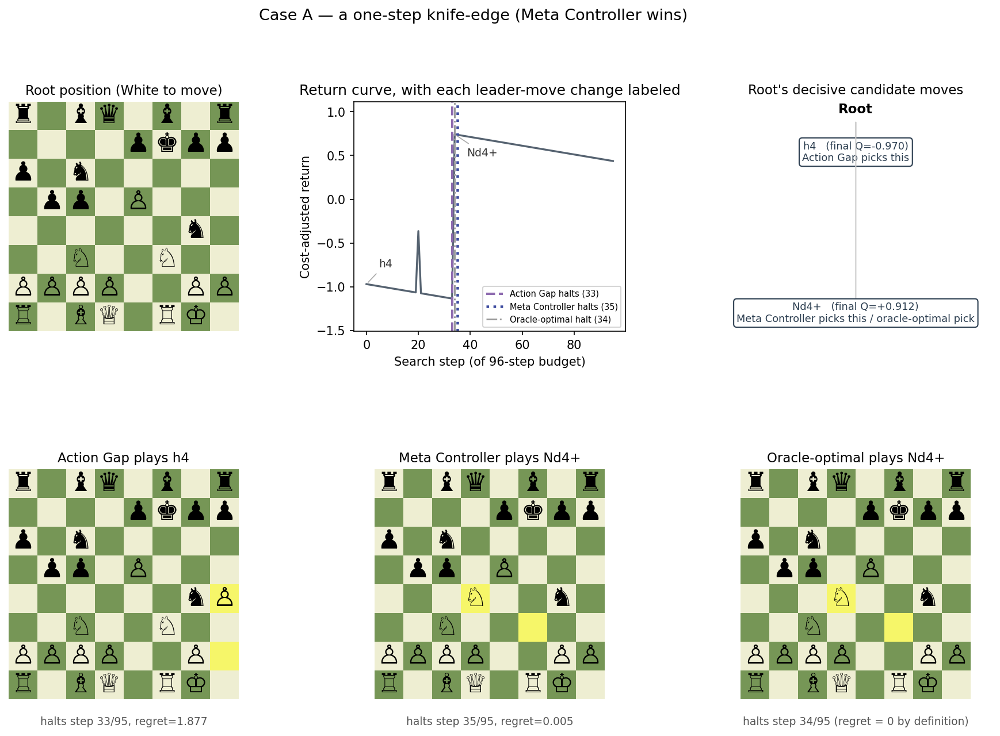
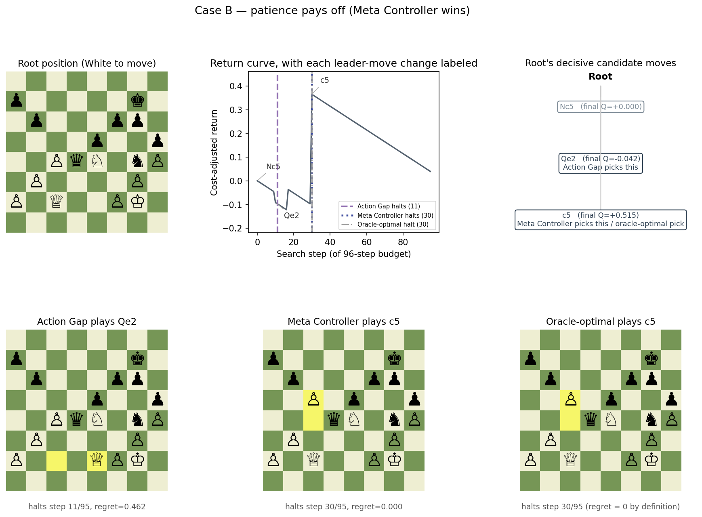
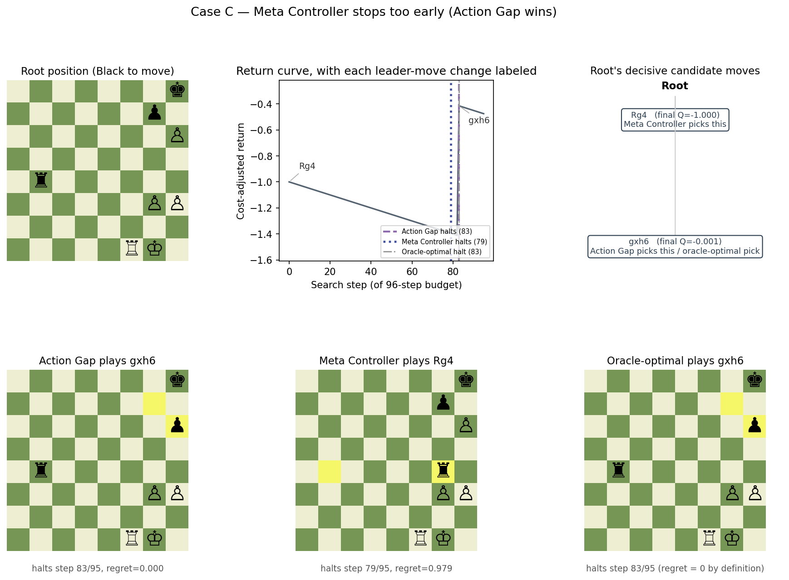

# When Action Gap and Meta Controller disagree, what actually happened?

**Ref:** companion to `R-EVALUATE` ([normative.md](normative.md)) and `R-YSAGIV-XABA` ([ysagiv.md](ysagiv.md)).
Not a standalone scientific-inquiry report — a worked-example supplement: 3 concrete episodes where the
two best stop controllers land on opposite conclusions, walked through move-by-move.

## Overview

`normative.md`/`ysagiv.md` established, in aggregate, that a learned `z_t` readout ("Meta Controller")
beats a hand-crafted action-gap readout ("Action Gap": top1-minus-top2 root Q gap, `_C["ag"]` /
`AGController`) on mean regret across thousands of episodes — but aggregate regret says nothing about
*what the disagreement looks like on one board*. This note pulls 3 individual episodes where the two
controllers' regret differs by roughly 1.0-1.9 — each episode's own return curve spans only about 1.0-1.9
end to end (min to max over its 96 steps), so in each case the losing controller landed close to that
episode's worst possible stop while the other landed close to its best — and reconstructs exactly what
each controller "believed" at the moment it stopped, which move that produced, and how that compares to
the oracle-optimal stop under the same cost model.

**Population:** `ysagiv_xaba100k_minply15_maxply75` history run, `pack_history/validation` (13,658
episodes; 9,561 fit / 4,097 eval, 70/30 split by source tree, seed 0). **Cost regime:** linear,
`time_lambda=0.005`, `maintenance_scale=0` — the regime `history.md` (L124-127) reports as the current
validated result (Meta Controller frontier regret 0.0359 vs. Action Gap 0.0414, Meta Controller wins
10/10 paired comparison). Every episode here has the same fixed 96-step search budget; "short" in the
selection below refers to the size of the explored tree, not the step count (which is constant). See
Methods for exact reproduction steps.

**Selection.** Over all 4,097 eval-split episodes, ranked by `|regret_ActionGap − regret_MetaController|`
(paired, same episode, same cost regime), the top 40 candidates were pulled. The 3 largest-magnitude were
all Meta-Controller wins, but two of those three had a degenerate oracle-optimal stop of step 0-3 (the
position was essentially decided before search even started, which makes for a less informative case);
Case A below is the one of those three with a genuine, non-trivial pivot. Case B was picked further down
the ranked list (still top 40, but not top 3) specifically for having a clean single-discovery structure
at a non-trivial oracle-optimal step; Case C was picked by hand as the clearest Action-Gap win in the
pool, so both directions of disagreement are represented. All three turned out to share the same
underlying shape, described in the synthesis at the end.

## Case A — a one-step knife-edge

Root: `r1bq1b1r/4pkpp/p1n5/1pp1P3/6n1/2N2N2/PPPP2PP/R1BQ1RK1 w - -` (White to move, trajectory
`shard_00013.pt#320`).

| | step halted | move played | fully-converged value of that move | regret |
|---|---|---|---|---|
| Action Gap | 33 | h4 | −0.970 (a blunder) | **1.877** |
| Meta Controller | 35 | Nd4+ | +0.912 (winning) | **0.005** |
| Oracle-optimal | 34 | Nd4+ | +0.912 | 0 (by definition) |

Tracing which root move the search held as "best-so-far" at every step (`oracle_best_move_index`):
h4 leads from step 0 (briefly wobbling to h3 for one step, at step 20, before reverting to h4 at
step 21) all the way through step 33 — then at **step 34** the search discovers Nd4+, and the tentative-best value jumps from
−0.970 to +0.912 in that single expansion. Action Gap halted at step 33, one expansion before the
discovery. Meta Controller halted at step 35, one expansion after it. The two controllers' actual
stop-time gap is 2 steps; the entire regret difference between them is attributable to which side of
this single expansion each one landed on.

> **◆ Observed, not explained.** The data shows precisely *when* the discovery happened and which side
> of it each controller fell on. It does not show *why* Action Gap's top1-top2 gap statistic or Meta
> Controller's learned `z_t` embedding triggered a halt at step 33 vs. 35 specifically — both are
> reacting to some evolving read of the search, not to foreknowledge of the step-34 jump. Treat "Meta
> Controller understood the position better" as unverified for this case; what's verified is where each
> one happened to land relative to a sharp, single-expansion swing.

## Case B — patience pays off

Root: `8/p5k1/1p3pp1/4p2p/2PqN1nP/1P4P1/P1Q2PK1/8 w - -` (White to move, trajectory `shard_00000.pt#309`).

| | step halted | move played | fully-converged value | regret |
|---|---|---|---|---|
| Action Gap | 11 | Qe2 | −0.042 (slightly worse) | **0.462** |
| Meta Controller | 30 | c5 | +0.515 (much better) | **0.000** |
| Oracle-optimal | 30 | c5 | +0.515 | 0 |

Here the leader identity changes three times before settling: Nc5 (0.000, neutral) leads at step 0, Qe2
(−0.042, a small error) takes over at step 10, Kg1 (+0.048, a modest improvement) takes over at step 17,
and only at **step 30** does search discover the pawn push c5 (+0.515 — by far the best move at this
root). Action Gap halted at step 11, one step after the leader had already slipped to the mediocre Qe2
and 19 steps before the real discovery — not a knife-edge miss like Case A, but a comfortably premature
stop. Meta Controller halted at exactly step 30, matching the oracle-optimal stop step exactly and capturing
the full discovery.

> **◆ Observed, not explained.** Unlike Case A, this is not a photo-finish: Meta Controller's stop step
> (30) is a full 19 steps later than Action Gap's (11), landing exactly on the oracle-optimal step rather
> than merely on the right side of a close call. What's verified is that Action Gap's own statistic
> (the root's top1-minus-top2 Q gap) evidently looked "settled enough" as early as step 11 to trigger a
> stop, well before the position actually was settled; what's not verified is why — that would need
> inspecting the actual action-gap trace at each of those steps, which this note doesn't do.

## Case C — Meta Controller stops too early

Root: `7k/6p1/7P/8/1r6/6PP/8/5RK1 b - -` (Black to move, trajectory `shard_00018.pt#190`).

| | step halted | move played | fully-converged value | regret |
|---|---|---|---|---|
| Action Gap | 83 | gxh6 | −0.001 (~drawn) | **0.000** |
| Meta Controller | 79 | Rg4 | −1.000 (lost) | **0.979** |
| Oracle-optimal | 83 | gxh6 | −0.001 | 0 |

The mirror image of Case A: the tentative leader is Rg4 (−1.000, a loss) for the entire search, all the
way through step 82, and only at **step 83** — 12 steps from the end of the 96-step budget — does search
discover gxh6 (−0.001, essentially holding a draw). Action Gap halted at step 83, exactly catching the
discovery (its stop step matches the oracle-optimal step exactly, regret 0 in this instance). Meta
Controller halted 4 steps earlier, at step 79, still inside the long Rg4 plateau, and committed to a
losing move.

> **◆ Observed, not explained.** This is the case in the 40-candidate pool where Action Gap most clearly
> outperforms Meta Controller, and it is not an outlier direction: the validated regret-scatter run for
> this exact population/regime (`slurm/logs/eval_11055290.out`, `[assess] regret scatter`) found Action
> Gap's regret `>=` Meta Controller's on 85% of the 4,097 eval episodes — meaning Action Gap achieves
> strictly *lower* regret than Meta Controller on the other ~15%. This episode is a concrete instance of
> that minority case: a long, flat, uninformative plateau (82 steps of the SAME wrong answer) followed by
> a late payoff, which is exactly the shape a fixed budget can miss if it commits early.

## What's common to all three?

All three cases have the same underlying shape: a **long plateau at one tentative-best move, then a
single sharp expansion that flips the leader to a much better move**. What differs is only which
controller's stop step fell before that expansion and which fell at-or-after it: in Case A both stop
steps are within 2 of the flip (a photo finish either way could have gone the other way); in Case B,
Action Gap stops a comfortable 19 steps before the flip while Meta Controller waits and catches it
exactly; in Case C, the roles are reversed — Meta Controller stops 4 steps before a very late (step 83 of
96) flip while Action Gap waits and catches it. In every case the losing controller isn't "worse at
search" in any broad sense — it simply committed before the one expansion that mattered, and the winning
controller happened to still be running when it landed.

> **◆ Modeling result.** The large-regret-gap episodes in this eval slice are dominated by single-expansion
> discoveries relative to a controller's stop time, not by one controller systematically searching
> "smarter" or "deeper" than the other — the same mechanism produces both a Meta-Controller win (Cases A,
> B) and an Action-Gap win (Case C) depending only on which side of the pivotal expansion each controller's
> own stop step happens to land. This is consistent with — and gives a concrete mechanism for — the
> aggregate finding that Action Gap is a strong baseline that Meta Controller beats only modestly in this
> regime (`history.md` L126: paired `Action Gap − Meta Controller` = +0.0058 mean, a small edge relative to
> the per-episode swings of ~1.0-1.9 shown here, and consistent with Action Gap achieving strictly lower
> regret than Meta Controller on ~15% of episodes overall, per Case C's callout above).

## Methods

1. **Extraction** (`casestudy_scripts/extract.py`, run via `casestudy_scripts/extract.slurm`,
   `sbatch`, qos=test, ~5 min): loads the validation split (`analysis.evaluate._load_assessment_data`,
   `load_action_gaps=True`), fits SingleHalt\*/Stats/Meta-Controller/Action-Gap exactly as
   `analysis.evaluate`'s `frontier`/`regret-scatter` commands do (`_fit_stop_controllers`, seed 0,
   200-epoch PG training), computes per-episode paired regret (`_regret_at`) at each controller's
   eval-split stop step, ranks by `|regret_ag − regret_zt|`, and for the top `N_CANDIDATES` reopens the
   episode's RAW tree snapshot (`RawPretrainExampleRecord`, path recovered from the packed shard's
   `trajectory_source_paths`) to pull `root_position_spec`, `oracle_root_moves`,
   `oracle_root_q_trace`, `oracle_best_move_index`, and the packed return curve — dumped to
   `case_study_candidates.json`. `N_CANDIDATES=40` (widened from an initial 8 — the top 8 clustered
   around degenerate oracle-optimal stops near step 0, see point 2).
2. **Case selection**: of the top 40, the 3 largest-magnitude were all Meta-Controller wins, but two of
   those three had a near-immediate oracle-optimal stop (step 0-3) — not representative of a real search
   unfolding. Case A is the one of those three with a non-trivial pivot (step 34). Case B was picked
   further down the ranked list for having a clean single-discovery structure at a non-trivial
   oracle-optimal step (30) with a wide (not knife-edge) margin between the two controllers' stop steps.
   Case C (largest Action-Gap win in the pool) was added by hand so both directions are represented.
3. **Rendering** (`casestudy_scripts/render.py`, plain `python`, no cluster needed — board drawing via
   `python-chess` + matplotlib, no external SVG/rasterizer dependency): for each case, reconstructs the
   board python-chess plays out from `root_position_spec` + the chosen UCI move, and the "leader
   timeline" from consecutive-run-length changes in `oracle_best_move_index` along the episode's step
   window.
4. Reproduce: `sbatch outputs/reports/casestudy_scripts/extract.slurm` then
   `PYTHONPATH=src python outputs/reports/casestudy_scripts/render.py` from the repo root. Both scripts
   hardcode the `ysagiv_xaba100k_minply15_maxply75` history-run paths and are one-off (not wired into
   `submit_all.sh`).

**Caveat on the callouts throughout:** everything reported as a step number, a move, or a value is
read directly off the packed/raw tree data. Any statement about *why* a controller's own internal
statistic (action gap, `z_t`) triggered a halt at the step it did is explicitly out of scope here — that
would require probing the trained readout heads directly, which this note does not do.
