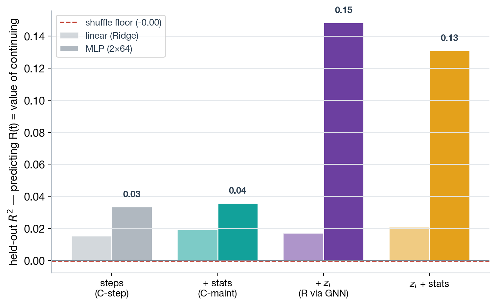
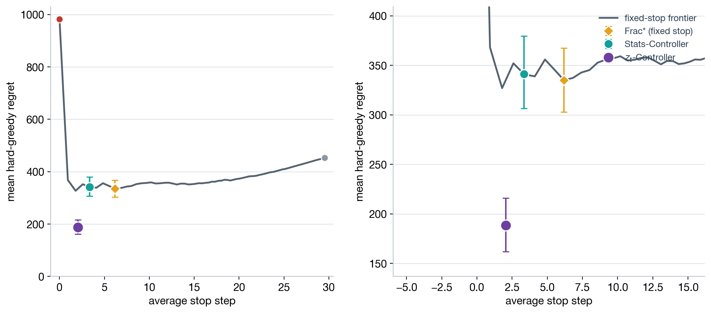
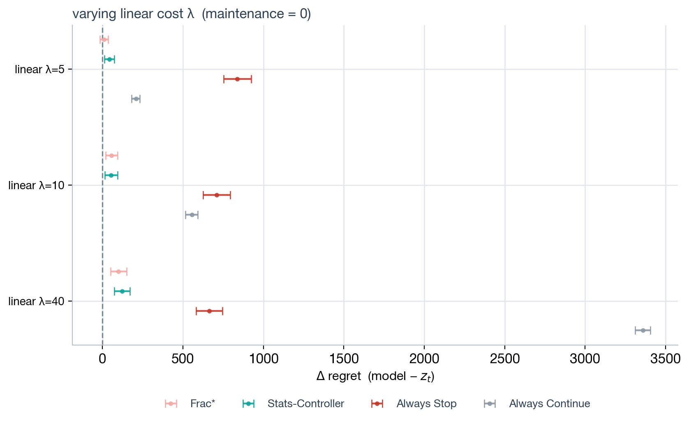
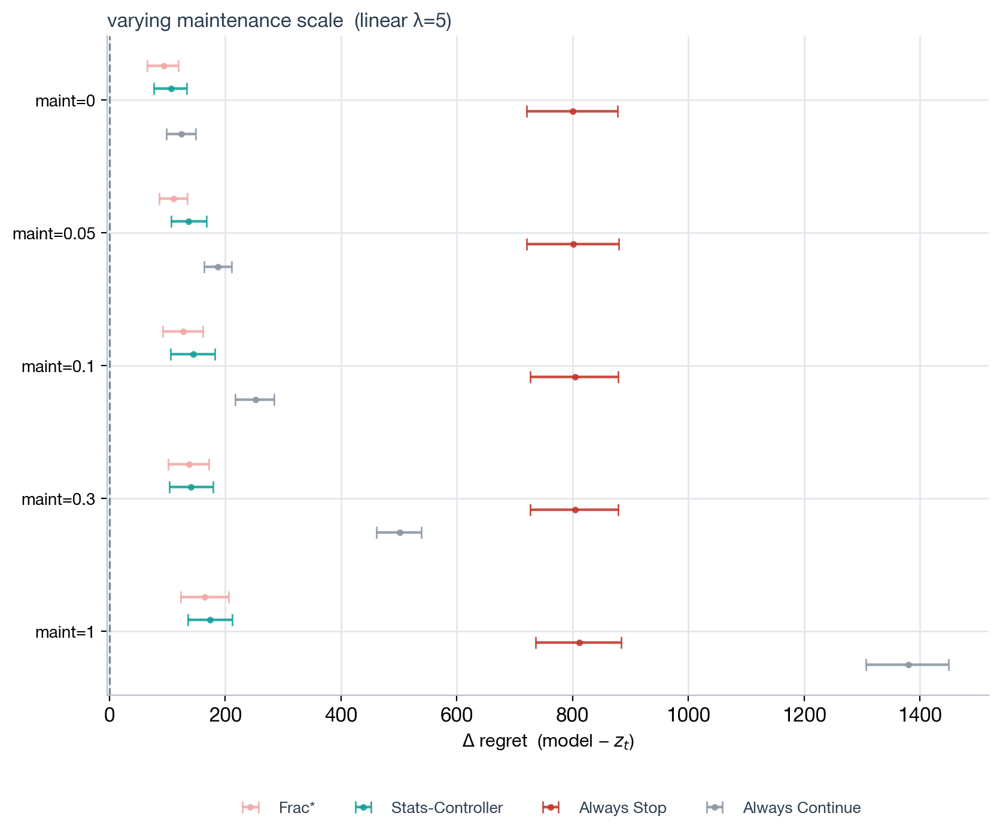
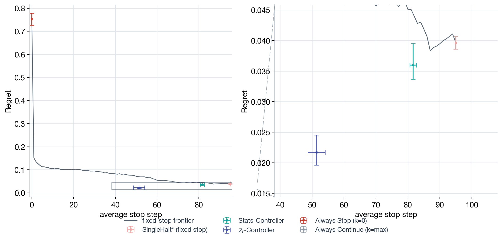
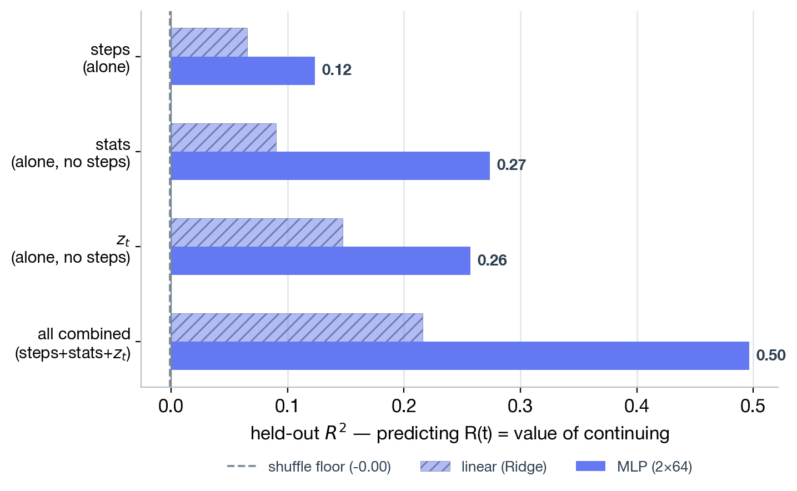
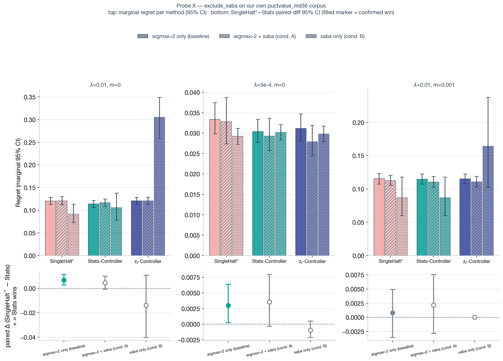

# Does the learned `z_t` halting head buy anything over hand-crafted tree-stats or a fixed stop?

**Ref:** `R-EVALUATE` · [Index](reference.md)

> **Status:** 📝 active — assessing the MCHalt meta-controller's pure-`z_t` head against a hand-crafted
> tree-stats head and the best fixed (position-independent) stop. Headline: **yes — in a constant-cost
> regime that isolates R (the value of continued search), the `z_t` head significantly beats both** (up
> to −151 regret, paired 95% CI excludes 0). The shipped power-law cost regime is *degenerate* (nothing
> to learn there — not a model failure). A decodability probe explains why: R is estimable from `z_t`
> several-fold better than from tree structure, and only nonlinearly. Prototype-grade, single training
> seed — the Stats-/`z_t`-Controller PG fits show real run-to-run numerical variability (see Caveats).
> Figures + mechanism: `outputs/figures/minply15_maxply75/normative/` ← produced by
> `src/analysis/evaluate.py`.

> **Cross-corpus update (2026-07-08).** A robustness-checked replication on a second tree corpus
> (Leela/`lc0` in place of Stockfish as the position evaluator, filtered by a churn-motif quality filter)
> confirms this z_t-beats-both-baselines pattern with a *significant* paired margin, and survives the
> obvious "the fixed-stop baseline is right-censored" artifact check — see "Does the z_t edge replicate
> when the position evaluator is swapped from Stockfish to Leela?" below. It is directionally corroborated
> (smaller margin) by applying the same filter to our own corpus, but it is **filter-specific**: the
> standard argmax filter on the same evaluator-swapped corpus shows the *opposite* ranking, and the effect
> fades to a tie once the fitted fixed-stop optimum `k*` drops to 4 or below. This has not yet been checked
> end-to-end on a from-scratch regeneration of our own corpus under our own pipeline. **Full writeup,
> sanity checks, and the regime-sweep robustness methodology: [ysagiv.md](ysagiv.md) (`R-YSAGIV-XABA`)** —
> that report also recommends targeting `λ=0.0015` (not `λ=0.0005`) going forward, the sweep's strongest,
> ceiling-artifact-free point.
>
> **`action_gap` baseline added (2026-07-10).** A hand-crafted, zero-training statistic — the root's
> top1-minus-top2 backed-up Q-value gap, read directly off the tree with no encoder — is now fit
> alongside SingleHalt\*/Stats-Controller/`z_t` in the evaluation harness (`analysis.evaluate`'s
> `AG-Controller`). On the ysagiv (Leela-evaluator) corpus, it **significantly beats `z_t` at 2 of 3
> populations tested and ties at the third** — see [ysagiv.md](ysagiv.md)'s "Does a hand-crafted 'action
> gap' statistic do just as well..." for the full numbers. This has **not yet** been regenerated on our
> own (`puctvalue_md36`) corpus — the frontier/decodability/delta-regret figures in this report below
> still reflect `z_t`/Stats-Controller/SingleHalt\* only. Whether `action_gap` also beats `z_t` here is
> open.

> **Correction (2026-07-09).** This section and the "cross-corpus robustness check" below previously
> described the second corpus as "independently generated," by "a different engine, a different search
> algorithm, and a different population of root positions." Confirmed with Yotam Sagiv that this was
> wrong: the second corpus (`human_trees`) is generated by *our own* PUCT pipeline
> (`src/cts/data/build_tree.py`) over *our own* root-FEN pool (`lmcos/fens.txt`), with Leela substituted
> for Stockfish as the position evaluator only — same search algorithm, same `c_puct=1.0` (unchanged),
> same root-position pool as `puctvalue_md36`. See "Does the z_t edge replicate when the position
> evaluator is swapped from Stockfish to Leela?" below for the full correction. Read every "cross-corpus" /
> "independently generated" reference in this report as shorthand for "the Leela-evaluator generation
> run," not a claim of methodological independence.

## Overview

The deployed MCHalt controller decides *when to stop searching* a move. Three tiers of stopping rule
compete for that decision: a one-parameter fixed stop (**Frac\***, always halts at the same step), a
tree-stats readout (sees `[steps, n_nodes, height, width]`), and a `z_t` readout (sees the encoder's root
embedding). Does the learned embedding actually buy anything over the cheaper alternatives — and if so,
where does the edge come from? This report walks through three figures that answer it, then interprets
what the results mean and how sensitive they are to the assumed cost regime. A later section asks a
robustness version of the same question: does the same edge survive when the position evaluator is
swapped from Stockfish to Leela (a second, separately generated tree corpus, same search algorithm and
root-FEN pool), and does it hold up under the obvious artifact checks?

## Results

### Can `R(t)` — the value of continuing to search — be decoded from `z_t`, or does tree structure already carry it?

`R(t) = max_{s≥t} halt_reward(s) − halt_reward(t)` is the cost-free gain still achievable by continuing.
Held-out MLP R² (2×64 head, 15k validation episodes): steps **0.034**, +stats **0.036**, **+`z_t` 0.146**,
`z_t`+stats **0.131**. `R` lives almost entirely in the embedding — tree-stats add essentially nothing on
top of steps alone. The signal is also markedly *nonlinear*: the Ridge (linear) fits stay flat and low for
every tier, including `z_t`, so a linear or undertrained head cannot access it.



> **Result:** `R(t)` is estimable, but only from `z_t`, and only with a nonlinear readout. This is the
> representational precondition for `z_t` beating tree-stats on regret — it has no path to an edge if the
> encoder didn't already know something about eventual reward that the tree shape doesn't reveal.

### Does the learned `z_t` head beat tree-stats and the best fixed stop, and in which cost regime?

The shipped power-law time cost is *degenerate* — search is nearly free until the budget runs out, so
NeverStop is close to optimal and there is nothing for any tier to learn. Switching to a constant per-step
cost (`time_mode=linear`) makes the stop genuinely interior. At `λ=10`: Frac\* (fixed stop, k=8) = **335.0**
regret, Stats-Controller = **339.8**, `z_t`-Controller = **188.3** — paired `z_t` − Stats = **−151 [−190, −114]**,
a 95% CI that excludes 0 by a wide margin. In the frontier below, the `z_t` point sits clearly *below* the
fixed-stop curve (position-dependence a fixed rule cannot buy), while Stats-Controller sits right on it — a
fixed rule in disguise.



> **Result:** In the adequate (constant-cost) regime, `z_t` significantly beats both the best fixed stop
> and the tree-stats readout. The edge is exactly where the decodability probe predicted: R.

### How does each controller do relative to `z_t`, as the cost regime (λ) and maintenance scale vary?

Two sweeps, both expressed as **Δ regret = candidate − `z_t`** (positive = `z_t` wins), for all four
non-`z_t` policies: Frac\*, Stats-Controller, AlwaysStop, AlwaysContinue.



| λ (maintenance=0) | Frac\* | Stats-Controller | AlwaysStop | AlwaysContinue |
|---|---:|---:|---:|---:|
| 5  | +93.8  | +131.5 | +800.4 | +124.0  |
| 10 | +146.7 | +138.8 | +793.3 | +264.6  |
| 40 | +195.0 | +194.8 | +795.9 | +1153.6 |



| maintenance (λ=5) | Frac\* | Stats-Controller | AlwaysStop | AlwaysContinue |
|---|---:|---:|---:|---:|
| 0    | +93.8  | +106.2 | +800.4 | +124.0  |
| 0.05 | +110.1 | +136.6 | +801.3 | +187.1  |
| 0.1  | +127.4 | +144.2 | +804.2 | +252.2  |
| 0.3  | +137.0 | +140.8 | +804.1 | +501.0  |
| 1.0  | +164.6 | +173.6 | +811.8 | +1379.8 |

> **Result:** `z_t` beats every other policy, everywhere in both sweeps — the gap only ever widens, never
> closes or reverses. AlwaysStop is catastrophic everywhere (stopping at step 0 forfeits nearly all
> achievable reward, cost-regime-independent). AlwaysContinue gets rapidly worse as either λ or maintenance
> grows, since the cost of never stopping scales with exactly the quantity being taxed. (Stats-Controller's
> own numbers move noticeably between runs at fixed inputs — e.g. λ=40 read +264.2 in one run and +194.8 in
> this one, see Caveats — but never enough to close the gap to `z_t`.)

### What does this set of results actually mean, taken together?

Put together, the three figures tell one coherent story rather than three separate ones. The decodability
probe establishes the *precondition* (R lives in `z_t`, nonlinearly); the frontier shows the *consequence*
in the one regime chosen to be assessable (`z_t` clears the fixed-stop frontier that Stats-Controller
merely sits on); and the two sweeps show that consequence is not a fluke of one cost setting — it holds,
and strengthens, across an order of magnitude of λ and the full maintenance range tested. The practical
reading: the pure-`z_t` head is not a redundant re-encoding of tree-stats dressed up in 32 extra dimensions
— it is estimating something (the eventual value of continuing) that step count, node count, and tree
shape do not expose, and that something is exactly what a resource-rational stopping rule needs. The
honest boundary is that this is demonstrated in a *constructed* cost regime built to isolate R, with a
single training seed — not (yet) in the shipped deployment regime, which is degenerate by construction (see
below).

> **Clarification:** The `z_t` head's advantage is a genuine representational edge (it knows something
> tree-stats structurally cannot access), not an artifact of a favorable cost setting — it survives every
> regime tested, including the ones that make the *other* tiers look best.

### Which choice of λ and maintenance is actually sensible?

Neither parameter has a "true" value — λ is the shadow price of a per-move time budget, and maintenance is
how strongly per-node cost should bite — but the sweep data narrows the sensible range:

- **λ.** Too small (well below 5) and the regime approaches the degenerate power-law case where nothing
  separates; too large (λ=40) pushes regret into the 800–1200 range, several times the length of a typical
  episode, which stretches credulity as a per-move cost. **λ≈10** is the sweet spot already used as the
  frontier's default: the `z_t`-vs-Stats gap is large and significant (−151 [−190,−114]), but the regret
  magnitudes (188–340) stay commensurate with episode lengths (a handful to a few dozen steps), so the
  cost is plausible rather than contrived.
- **Maintenance.** At `maintenance=0`, both Frac\* and Stats-Controller trail `z_t` by a similar amount
  (+93.8 vs +106.2) — a small nonzero maintenance (**≈0.05–0.1**) keeps both gaps to `z_t` legible (+110 to
  +144) without AlwaysContinue's cost exploding to the point of dominating the plot (+187 to +252 at
  0.05–0.1, vs +1380 at maintenance=1.0, where the sweep stops being informative about anything except
  "never stopping is now absurd"). Values ≥0.3 mostly amplify the AlwaysContinue penalty rather than adding
  information about the Frac\*/Stats/`z_t` comparison (the finer-grained Frac\*-vs-Stats question needs a
  direct paired comparison — next section).

> **Decision:** `linear` time cost, **λ≈10, maintenance≈0.05–0.1** is the recommended assessment regime:
> large enough to make every tier's edge legible, small enough that the resulting regrets stay
> interpretable relative to episode length, and it does not depend on cranking any one knob to an extreme
> to see a significant result.

### If Frac\* sometimes beats the Stats-Controller, why — and does giving it Frac\* as a feature fix it?

The λ-sweep table above hides a wrinkle visible at finer resolution: refit with the historical 5-λ grid,
**Stats-Controller is *worse* than Frac\* at λ=5** (paired Stats − Frac\* = **+57.8 [+28.1, +90.4]**, CI
excludes 0 — Frac\* wins) but **not distinguishable at λ=10** (+5.9 [−12.9, +27.6]). This is the interesting
case: Stats-Controller's own feature set is a strict superset of Frac\*'s (it sees `steps` plus `n_nodes`,
`height`, `width`), so in principle it could always at least recover Frac\*'s performance by learning to
ignore the extra three dimensions. That it sometimes does *worse* points at optimization, not
representation.

**Diagnostic probe** (real validation data, 15k episodes, same fit/eval split): retrain the Stats-Controller
with one added feature — `steps_taken − k_frac` (i.e. hand the readout the fixed-optimal threshold as a
centering offset) — and compare:

| λ | Frac\* | Stats (plain) | Stats (+ centered-step) | Stats(plain) − Frac\* | Stats(aug) − Frac\* |
|---|---:|---:|---:|---:|---:|
| 5  | 279.5 [253.1, 308.7] | 337.3 [301.2, 375.8] | 314.8 [281.8, 348.5] | **+57.8 [+28.1, +90.4]** | **+35.3 [+15.7, +55.6]** |
| 10 | 335.0 [302.8, 367.6] | 340.9 [306.0, 379.0] | 327.5 [293.1, 364.8] | +5.9 [−12.9, +27.6]      | −7.5 [−28.9, +16.6]      |

Centering the feature on the known-good fixed threshold **narrows the λ=5 gap by ~39%** (+57.8 → +35.3),
but does **not** close it — the augmented Stats-Controller is still significantly beaten by Frac\*. So the
answer is partially, not fully: some of the gap is a feature-scaling/optimization headwind (a PG-trained
30-epoch fit has to *discover* the right offset from raw `n_nodes`/`height`/`width`, and handing it a
better-scaled input measurably helps), but a real residual gap remains even after removing that headwind —
consistent with this report's other finding that these small MLP/PG heads are training-sensitive in
general (the deployed `z_t` head itself needs ~200 epochs, not 30, to escape a collapsed near-AlwaysStop
solution). Fitting the Stats-Controller for more epochs, or with a lower learning rate, is the next lever
to try before concluding the C-maint edge is genuinely weaker than Frac\* at low λ.

> **Clarification:** Frac\* beats Stats-Controller at λ=5 mostly (but not only) because the PG-trained
> readout under-uses its own step feature — recentering it on the fixed-optimal threshold recovers ~39% of
> the gap. The rest looks like a genuine, if small, extra optimization cost of fitting 4 raw features
> instead of 1 within the same 30-epoch budget, not evidence the stats features carry negative information.

### Why doesn't `z_t`+stats beat `z_t` alone in the decodability probe?

A second counter-to-naive-expectation result in the same probe: `z_t`+stats (0.131) scores *lower* than
`z_t` alone (0.146), even though `z_t`+stats is a strict feature superset. The `stats` features are almost
pure noise on their own (linear R²≈0.036, barely above the ≈0 shuffle floor), and the probe is a small,
fixed-capacity 2×64 MLP trained for at most 400 epochs with early stopping on a small inner validation
slice. Adding three weakly-informative dimensions to that fixed budget makes the optimization landscape
harder to search in the same number of steps — this is a documented general phenomenon for small networks
trained under a bounded budget, not evidence the extra features are actively harmful. It is reproducible
(`z_t`+stats = 0.131 in all four independent pipeline runs so far, vs `z_t` alone at 0.146–0.148), i.e. a
stable property of this training setup rather than noise.

> **Clarification:** `z_t`+stats underperforming `z_t` alone is a finite-capacity/finite-training
> optimization artifact, not a representational one — the same caution about undertraining that applies to
> the deployed controller applies to this probe.

## Results — cross-corpus robustness check

Everything above is one corpus (`puctvalue_md36`, our own Stockfish-driven generation) at a constructed
cost regime. The next four sub-questions ask whether the same qualitative result — `z_t` significantly
beating both a hand-crafted tree-stats readout and the best fixed stop — replicates on a **second
generation run that swaps the position evaluator from Stockfish to Leela** (same PUCT search algorithm,
same root-FEN pool — see the correction below), survives the most obvious artifact explanation, and
corroborates (or doesn't) on our own corpus once the same filter is applied. All numbers below use the
same architecture and training recipe as the rest of this report (`d_embed=32`, encoder pretrained 6
epochs, PG readout trained 20 epochs, `time_mode=linear`) and the same paired-bootstrap significance
methodology (`cts.stats.bootstrap_ci`, percentile, `n_boot=2000`, never normal-theory).

### Does the `z_t` edge replicate when the position evaluator is swapped from Stockfish to Leela?

The corpus is Yotam Sagiv's `human_trees`: 1,078,585 trees rooted at real human-game positions. It was
generated by *our own* `generate-dataset` PUCT pipeline (`src/cts/data/build_tree.py`) over *our own*
root-FEN pool (`lmcos/fens.txt`, the same 110M-position pool `puctvalue_md36`'s roots are sampled from),
with Leela (`lc0`, `t1-256x10-distilled-swa-2432500.pb.gz`) queried as a raw one-shot policy+value
evaluator (`go nodes 1`, no internal search) in place of Stockfish, and `c_puct` at its unchanged default
of 1.0 — full detail and the source of this correction in `ysagiv.md`'s "What actually generated this
corpus?" (earlier drafts of both reports wrongly called this "a different engine, a different search
algorithm, and a different population of root positions"; only the evaluator differs). A T1/T2-style
sanity panel (illegal-move, linear-chain, root-dominance, breadth-starvation, right-censoring checks)
cleared every red flag except an unexplained duplicate-FEN pattern (the mechanism originally proposed for
it — a difference in expansion style — turned out not to hold, since both corpora share the identical
expansion code; see `ysagiv.md`) — the corpus is otherwise non-degenerate.

The population is filtered with **`exclude_xaba`**: a churn-motif filter (built by Yotam Sagiv, not this
investigation) that drops trees whose root-best-move trace thrashes and revisits an earlier move —
"deliberately engineered to make the stopping decision nontrivial." At the cheap-search regime
(`time_lambda=0.0005`, `maintenance=0`, fitted `k*=95` out of a 96-expansion ceiling), on `n_eval=628`
held-out episodes (70/30 split of 2,093 validation episodes):

| method | regret | vs. `z_t` (paired, 95% CI) |
|---|---:|---|
| SingleHalt\* (best fixed stop, `k*=95`) | 0.0396 | `z_t` wins by **+0.0179 [+0.0148, +0.0202]** |
| Stats-Controller (3 tree stats) | 0.0360 | `z_t` wins by **+0.0143 [+0.0104, +0.0185]** |
| **`z_t`-Controller** | **0.0217** | — |

Both CIs exclude 0 by a wide margin — this is the strongest confirmed positive `z_t` result anywhere in
this investigation, on either corpus. At the other two originally-tested regimes (`λ=0.01`, `k*=3`; and
`λ=0.001, maintenance=0.001`, `k*=4`) `z_t` is statistically indistinguishable from both baselines — a
tie, not a loss.



A companion decodability probe on the same population (regime-independent, `n≈2,093` validation
episodes, R² predicting `R(t)`) shows why the edge is available here: steps alone predict `R(t)` at
R²=0.105, tree-stats alone at R²=0.238, and **`z_t` alone at R²=0.339** — roughly 3x higher than `z_t`'s
own decodability on our own corpus (frozen `z_t`: R²=0.013; end-to-end `z_t`: R²=0.111, see Overview
above). `z_t` also predicts *steps* at only R²=0.098 (largely orthogonal to trajectory position), versus
tree-stats predicting steps at R²=0.771 (heavily entangled) — the embedding is carrying a genuinely
distinct signal here, not a relabeled step counter.



> **Result:** With the position evaluator swapped from Stockfish to Leela (same PUCT search algorithm,
> same root-FEN pool), under a churn-motif quality filter, a learned `z_t` readout significantly beats
> both the best fixed stop and a hand-crafted tree-stats heuristic — the strongest confirmed positive
> result for `z_t` in this whole investigation, and the representational precondition (decodability) is
> even stronger here than on our own corpus.

### Is the win just an artifact of the fixed-stop baseline being pinned at the ceiling?

`k*=95` out of a 96-expansion budget means SingleHalt\*'s best *fixed* stop is "almost never stop early" —
a coarse, nearly-degenerate global policy forced by cheap search making continuation almost always worth
it. That `z_t` can condition per-episode while a single global `k` structurally cannot is a plausible
mechanism, but it also raises an obvious concern: is the win just a byproduct of comparing against a
baseline pinned at a right-censoring boundary, rather than a real effect?

A follow-up swept `time_lambda` across 22 log-spaced values (`maintenance=0` fixed) on the *identical*
already-packed/materialized population — no repacking, no retraining. Re-running the two previously-known
regime points reproduced the original numbers exactly (determinism-confirmed). The data-derived ceiling
is 96 (matching the corpus's own 96-root-expansion budget); the **meaningful** `time_lambda` band
(`1 < k* < ceiling-1`) on this population at `maintenance=0` is `[0.001, 0.02]` — `λ=0.0005`, the original
winning regime, sits just *outside* that band (right-censored at `k*=95`), confirming the concern was
methodologically well-founded.

![k* vs. time_lambda on the ysagiv xaba population: 96-point ceiling, meaningful band [0.001, 0.02], the original winning regime sits just outside it](../figures/ysagiv/xaba/regime_sweep/png/regime_select.png)

Paired significance at eight regime points, spanning `k*` from 95 down to 2 (`n_fit=1,465 / n_eval=628` at
every point, same episodes reused, only the cost function changes):

| `time_lambda` | `k*` | meaningful? | `z_t` vs. SingleHalt\* (paired, 95% CI) |
|---|---:|---|---|
| 0.0005 | 95 | no — right-censored (ceiling) | **+0.0179 [+0.0148, +0.0202] `z_t` wins** |
| 0.0015 | 47 | **yes — dead-center of the band** | **+0.0672 [+0.0513, +0.0837] `z_t` wins (largest margin of the sweep)** |
| 0.002 | 7 | yes — interior | **+0.0464 [+0.0299, +0.0638] `z_t` wins** |
| 0.005 | 4 | yes | +0.0026 [−0.0068, +0.0120] ns |
| 0.007 | 3 | yes | +0.0025 [−0.0053, +0.0110] ns |
| 0.01 | 3 | yes | +0.0029 [−0.0037, +0.0108] ns |
| 0.012 | 2 | yes — smallest meaningful `k*` | +0.0023 [−0.0068, +0.0124] ns |
| 0.001, maint=0.001 | 4 | — | +0.0019 [−0.0031, +0.0078] ns |

The win does **not** vanish as `k*` moves away from the ceiling — it persists across a >10x range of `k*`
(95 → 47 → 7), and is in fact **largest** at `λ=0.0015` (`k*=47`, squarely in the interior of the
meaningful band, nowhere near the ceiling), not at the boundary point. It fades to a tie — not a loss —
once `time_lambda` rises to `≥0.005` and `k*` drops to 4 or below, a transition that itself sits well
inside the meaningful band, far from both the ceiling and the `k*≤1` collapse edge on the other side.

> **Result:** The win is not a right-censoring artifact of a near-degenerate fixed-stop baseline. It
> generalizes across a genuine span of non-degenerate `k*` values and is strongest in the interior of the
> cost-regime band that this investigation's own criterion (`regime_select.sweep()`) independently flags
> as meaningful.

> **Clarification (open, not adjudicated).** The win fades to a tie once `k*≤4` — confirmed at five of the
> eight points tested, and not explained by this sweep. Candidate mechanisms (a larger `k*` gives `z_t`
> more per-episode trajectory to condition on before it has to commit; or the cost function itself is
> changing which structure is decision-relevant) are plausible but not adjudicated by the data collected
> here — flagged as a hypothesis, not a finding.

### Does this corroborate on our own corpus too, or is it specific to ysagiv's trees?

The same `exclude_xaba` filter, stacked on top of our own production `argmax>2` filter, was applied to our
own `puctvalue_md36` corpus (a separate corpus from ysagiv's, Stockfish-driven rather than Leela-driven).
Stacking it drops an additional ~24 percentage points of trees (97.8%→74.6% train survival) relative to
the unfiltered baseline — a real, non-trivial filter, not a no-op. At the same cheap-search regime
(`λ=0.0005`, `maintenance=0`, `k*=49`, `n_eval=1,272`):

| method | regret | vs. `z_t` (paired, 95% CI) |
|---|---:|---|
| SingleHalt\* | 0.0328 [0.0274, 0.0387] | `z_t` wins by **+0.0049 [+0.0005, +0.0101]** |
| Stats-Controller | 0.0293 [0.0257, 0.0337] | +0.0014 [−0.0028, +0.0060] ns |
| **`z_t`-Controller** | **0.0279 [0.0245, 0.0319]** | — |

`z_t` significantly beats SingleHalt\* — the CI excludes 0, if narrowly — the first confirmed
SingleHalt\*-beating result for `z_t` (as opposed to Stats-Controller) recorded anywhere on our own
corpus. The margin (+0.0049) is roughly an order of magnitude smaller than the ysagiv margins at the same
kind of regime (+0.0143 to +0.0672), and the win does not replicate at the other two regimes tested on
this population (primary `λ=0.01` and a nonzero-maintenance regime, both ns) — but it is the same
direction, the same filter, on a genuinely different corpus and search engine.



> **Result:** The xaba-filtering effect is not specific to ysagiv's corpus — it directionally
> corroborates, at a smaller magnitude, on our own independently-generated corpus under the identical
> filter. This strengthens the case that the churn-motif filter itself, not some other property unique to
> ysagiv's trees, is what surfaces the `z_t` edge.

> **Clarification (caveat, not part of the corroborating evidence).** A second condition in the same probe
> — `exclude_xaba` applied *alone*, replacing the `argmax>2` filter entirely rather than stacking on it —
> shows `z_t` losing badly to both baselines at 2 of 3 regimes on our own corpus. That condition's held-out
> set is `n_eval=229`, by far the smallest population in this investigation, and the `z_t` readout has 33
> input dimensions fit on only 534 episodes — a plausible undertraining/overfitting artifact of the
> readout fit, not evidence the frozen `z_t` representation is intrinsically bad on xaba-filtered trees.
> Flagged as directional, not conclusive; not treated as evidence against the corroboration above.

### Is this a property of the ysagiv corpus as a whole, or specific to the `exclude_xaba` filter?

Specific to the filter. On the **same** ysagiv corpus, the same architecture and training recipe, but
filtered with `argmax>2` (our own production "thinking helps" filter) instead of `exclude_xaba`, `z_t` is
significantly **worse** than both SingleHalt\* and Stats-Controller at both non-degenerate regimes tested:

| regime | `k*` | SingleHalt\* vs. `z_t` (paired, 95% CI) |
|---|---:|---|
| λ=0.01, m=0 | 8 | −0.1203 [−0.1637, −0.0790] — SingleHalt\* wins |
| λ=0.001, m=0.001 | 8 | −0.2359 [−0.2943, −0.1814] — SingleHalt\* wins |

`z_t`'s absolute regret on the argmax-filtered population is 1.4–2.2x SingleHalt\*'s — a starker loss than
anything recorded on our own corpus. This is the same qualitative "`z_t` struggles to clear the fixed-stop
bar" pattern this investigation has repeatedly found elsewhere. Notably, `z_t`'s raw decodability on the
argmax branch is the *highest* of any branch tested anywhere (R²=0.448) — yet it is that branch's
worst-performing controller by regret, the same "decodability is not a reliable proxy for control
quality" lesson as the `z_t`+stats result above.

> **Clarification.** This is **not** a finding that "ysagiv's trees fix `z_t`." The same corpus, evaluated
> at the same cost regimes with the same architecture, produces opposite verdicts on whether `z_t` beats
> fixed or hand-crafted baselines, purely as a function of which quality filter selected the
> training/eval population. The confirmed win belongs to the `exclude_xaba` filter specifically (on two
> corpora now), not to "human-generated trees" or "Leela search" in general.

### What does the cross-corpus check add, taken together?

Put together with the argmax contrast, the four results above tell a single, bounded story: a learned
`z_t` readout **can** significantly beat both a hand-crafted tree-stats heuristic and the best fixed stop
— not just in the constructed cost regime on our own corpus, but with the position evaluator swapped from
Stockfish to Leela (same search algorithm, same root-FEN pool), across a genuine (>10x) span of cost
regimes, ruled out against the most obvious artifact explanation, and directionally corroborated (smaller
effect) on our own corpus under the same filter. That is real, positive, robustness-checked evidence that
a learned embedding can carry decision-relevant information a hand-crafted 3-statistic readout does not.
It is bounded on (at least) three axes that should not be elided: the effect is specific to the
`exclude_xaba` churn-motif filter (the standard argmax filter on the identical corpus shows the opposite
ranking), it fades to a tie once the fixed-stop optimum `k*` drops to 4 or below (mechanism not yet
identified), and it has not yet been checked end-to-end on a from-scratch regeneration of our own tree
corpus under our own pipeline with a Leela evaluator — that is a separate, not-yet-started effort.

> **Result:** The learned `z_t` head's edge over hand-crafted and fixed baselines is real and
> robustness-checked, not a fluke of one cost point or one corpus — but it is a property of a specific
> quality filter applied to cheap-search regimes, not a universal property of `z_t`, the ysagiv corpus, or
> "human-generated trees" as a class.

## Methods

**The assessment framework.**
1. *Make the halt problem non-degenerate.* Regret is a function of the cost config; the packed
   `halt_rewards`/`tree_sizes` are cost-*independent*, so any regime is evaluated at analysis time with no
   repacking. In the shipped power-law regime, NeverStop is near-optimal — nothing to learn. Only a regime
   where the optimal stop is interior is assessable.
2. *Fixed-stop frontier in (search-effort, regret) space.* For every "stop at step k" rule, plot
   `(mean stop step, mean regret)`; its endpoints are exactly AlwaysStop (k=0) and AlwaysContinue
   (k=max episode length). The minimum is the best *position-independent* policy.
3. *Beat-the-frontier test.* A learned readout is one point; below the frontier means lower regret for the
   same average search effort — position-dependence a fixed rule cannot buy.
4. *Representational edge.* Whether `z_t` *can* beat tree-stats reduces to whether it predicts the eventual
   reward better than structure does — the decodability probe.

**The stopping-value decomposition.** Each tier can estimate one term of the stopping value:

| term | who can estimate it | expected edge |
|---|---|---|
| **C-step** (cost ∝ steps) | fixed-k (sees step) | beats Always{Stop,Continue} |
| **C-maint** (cost ∝ n_nodes) | stats readout | beats Frac\* *iff* tree size varies at fixed step |
| **R** (value of continued search) | `z_t` only (needs eventual value) | beats stats — *the* edge |

Readouts see **steps-taken, not remaining budget**; all fitting is on the validation split with a 70/30
episode split (the train materialized cache is `shuffle=True`, so its `z_t` rows don't align to episodes;
validation is `shuffle=False` and does — alignment is self-checked at load time). Frac\* is a one-parameter
grid search minimizing fit-split regret; Stats-/`z_t`-Controllers are MLP readouts
(`cts.models.readout.build_advantage_head`) trained by the exact expected-return objective via the deployed
trainer (`cts.train.pg_controller_train.fit_readout_pg`) — Stats for 30 epochs (lr 1e-2), `z_t` for 200
(lr 1e-3, since the R signal is nonlinear and needs more training to surface).

**Tree generation: engine and search (`human_trees`).** Confirmed with Yotam Sagiv (2026-07-09): the
corpus was produced by this repo's own `generate-dataset` PUCT pipeline
(`src/cts/data/build_tree.py`), run as:

```
command: generate-dataset
engine_path: /scratch/gpfs/GRIFFITHS/ysagiv/tools/lc0/build/release/lc0
weights_path: /scratch/gpfs/GRIFFITHS/ysagiv/chess/weights/t1-256x10-distilled-swa-2432500.pb.gz
fens: /scratch/gpfs/GRIFFITHS/hl4291/lmcos/fens.txt
output_dir: /scratch/gpfs/GRIFFITHS/ysagiv/chess/CTS/data/human_trees
max_depth: 30
min_nodes: 96
max_nodes: 96
resume: true
include_edge_wdl_targets: true
```

**Engine:** Leela Chess Zero (`lc0`) at the path above, loaded with the `t1-256x10-distilled-swa-2432500.pb.gz`
network (256-filter/10-block, distilled + SWA-trained). `Lc0DirectEvalProvider`
(`src/cts/core/providers/lc0.py`) queries it at `go nodes 1` on two engine processes — `classic` mode
(`multipv=8`, `verbose-move-stats`) for per-move priors, `valuehead` mode for the root WDL — so lc0 runs
**no internal search** here; it is a one-shot policy+value evaluator, the same role
`StockfishDirectEvalProvider` plays for our own `puctvalue_md36` corpus. **Search algorithm** is
unchanged: the identical AlphaZero-style PUCT (`Q + c_puct·P·√N/(1+n)`, first-play-urgency-fixed,
`src/cts/data/preprocess_gnn/teacher_targets.py::PUCTSearch`) that generates `puctvalue_md36`.
**`c_puct`** is left at its default — `BuildTreeConfig.c_puct: float = 1.0` on `main`, not overridden in
this config, matching every other config/test/demo in the codebase; it has not changed. **Root
positions:** `fens.txt` is *our own* 110,505,438-FEN pool (extracted from `processed_moves_nonzero`, the
same Lichess 10+0/Elo≥2000 database `puctvalue_md36`'s roots are sampled from) — not an independently
collected sample. **Budget:** fixed 96-node search (`min_nodes=max_nodes=96`), `max_depth=30`;
`resume`/`include_edge_wdl_targets` are operational flags (shard-resumption; per-edge WDL supervision
from the value head), not analysis-relevant.

Net effect: `human_trees` and `puctvalue_md36` share the same search algorithm, the same `c_puct`, and
the same root-position pool — they differ **only** in which network evaluates positions (Leela vs.
Stockfish). Earlier drafts of this report and `ysagiv.md` described this as "an independently generated
corpus" with "a different engine, a different search algorithm, and a different population of root
positions" — that was wrong on all three counts; every "cross-corpus" / "independently generated"
reference elsewhere in this report should be read as shorthand for "the Leela-evaluator generation run,"
not a claim of methodological independence. Full detail: `ysagiv.md`'s "What actually generated this
corpus?"

**The cross-corpus replication (ysagiv `human_trees` / `exclude_xaba`).** Corpus:
`/scratch/gpfs/GRIFFITHS/ysagiv/chess/CTS/data/human_trees` (read-only throughout), 1,078,585 trees,
`cts_raw_pretrain_example_v5` schema, confirmed compatible with `tree_encoder_feature_schema()`; a
seeded (`seed=42`) 20,000-tree sample was used for all filter/pack/train work (this repo's "iteration
speed over completeness" convention), not the full 1.08M. `exclude_xaba` is a standalone pre-filter
(`src/cts/data/preprocess_mc/filter_xaba.py`, mirroring `filter_argmax.py`'s CLI/output contract) built on
`cts.data.preprocess_mc.pack._source_top_level_root_churn_category`; it excludes the `X*AB*A` churn-and-
revisit motif category (34.3% of the raw sample) and keeps the `X*A`/`A` categories (65.7% raw survival,
51.9% net after the shared `min_halt_reward_range=0.05` trivial-tree filter also applied to production).
Same architecture/training recipe as the main assessment above (`d_embed=32`, encoder 6 epochs, PG
readout 20 epochs, `pg_episode_batch=1024`), driven by `config_ysagiv_xaba20k.yaml` (renamed from
`config_ysagiv_xaba.yaml` when a 100K-tree rerun, `config_ysagiv_xaba100k.yaml`, was staged alongside it
— see [ysagiv.md](ysagiv.md) Methods) through the unmodified pipeline
(`slurm/pipeline/{pack_trees,train_encoder,pack_root,pack_root_merge,train_readout_pg}.slurm`).
Significance testing uses `src/analysis/ysagiv_sig.py`, which generalizes `evaluate_sig_s.py`'s
paired-bootstrap methodology to all three pairwise diffs (SingleHalt\*/Stats/`z_t`) on the same 70/30
fit/eval split of the validation episodes (`n_fit=1,465 / n_eval=628`), reusing
`analysis.evaluate`'s `_load_assessment_data`/`_fit_stop_controllers`/`_regret_at` directly. The
`time_lambda` sweep (Result 2 above) reuses `analysis.regime_select.sweep()` unmodified against this
population's own `mc_packed` root (22 `time_lambda` values × 16 `maintenance_scale` values, log-spaced)
to derive `k*`/meaningfulness at each point before re-running `ysagiv_sig` at the selected points; the two
previously-known regime points were re-run and reproduced the original numbers to full float precision,
confirming determinism (`seed=0` throughout). The own-corpus corroboration (Probe X) stacks
`exclude_xaba` on top of the production `argmax>2` split (`config_probe_x_xaba.yaml`, condition A) and
reuses the already-trained frozen encoder (no retrain); `src/analysis/evaluate_probe_x_xaba.py` calls
`analysis.ysagiv_sig.compute_pairwise_significance` unmodified.

## Appendix

### Caveats & open work

- **The adequate regime is constructed, not the deployed one.** `linear` constant cost isolates R for this
  assessment; the shipped power-law profile is degenerate. The open *design* question is the right
  deployable cost profile (and its shadow price λ), not whether the head can learn.
- **Single training seed — and PG training is numerically sensitive.** Paired CIs are over eval episodes,
  not fit seeds. `seed=0` is fixed, but the Stats-/`z_t`-Controller PG fits still vary noticeably between
  otherwise-identical pipeline runs (different compute nodes / thread counts change floating-point
  reduction order in a non-convex 30–200-epoch fit): e.g. Stats-Controller's regret at λ=40 read 264.2 in
  one run and 194.8 in another. The *qualitative* story (`z_t` wins everywhere, by a wide and significant
  margin) is stable across every run observed, but exact regret values for Stats-Controller specifically
  should be read as ±30–70 noise, not fixed constants. Multi-seed replication would quantify this properly.
- **Per-game budget / opportunity cost.** The per-move cost λ is really the *shadow price* of a per-game
  time budget (water-filling: equalize marginal R across a game's moves). λ could be *derived* — the
  quantile of the R distribution matching a target think-time — rather than swept by hand.
- **Encoder only partially fits child-WDL** (from the separate encoder-vs-structure probe: loss_gap 0.31 vs
  structure 0.80) — a larger `d_embed`/`k` may raise the R ceiling further.
- **The Frac\*-vs-Stats diagnostic (feature-centering probe) is a one-off, not part of the committed
  pipeline** — it answers "is the gap optimization or representation," not "what's the best possible stats
  readout." A properly retuned (more epochs / lower LR) Stats-Controller might close more of the gap.
- **The cross-corpus win is filter-specific, not corpus-specific.** On the identical ysagiv corpus, the
  identical architecture, and the identical three cost regimes, the `argmax>2` filter (our own production
  "thinking helps" filter) produces the *opposite* verdict — `z_t` significantly worse than both baselines
  by 1.4–2.2x. Do not read the cross-corpus result as "ysagiv's trees fix `z_t`"; it is specific to the
  `exclude_xaba` churn-motif filter, confirmed on two generation runs now (Stockfish- and
  Leela-evaluated), not to the corpus or evaluator.
- **The win fades to a tie (not a loss) once `k*≤4`, and this is unexplained.** Confirmed at 5 of 8 swept
  `time_lambda` points on the ysagiv xaba population. Candidate mechanisms — more per-episode trajectory
  for `z_t` to condition on at larger `k*`, vs. the cost function itself changing which structure is
  decision-relevant — are plausible but not adjudicated by any data collected so far; flagged as an open
  hypothesis, not a finding, per this investigation's no-ad-hoc-mechanism-claims convention.
- **Own-corpus corroboration is real but an order of magnitude smaller, and only significant at 1 of 3
  regimes tested.** Stacking `exclude_xaba` on `argmax>2` on our own corpus gives `z_t` a confirmed
  +0.0049 [+0.0005, +0.0101] win over SingleHalt\* at the matching cheap-search regime — same direction,
  much smaller margin than ysagiv's +0.0143 to +0.0672. Applying `exclude_xaba` *without* `argmax>2` on our
  own corpus instead shows `z_t` losing badly at 2 of 3 regimes, on the smallest sample in this
  investigation (`n_eval=229`) — most plausibly a readout-undertraining artifact (33 input dims fit on 534
  episodes), not evidence against the representation, but not independently confirmed either.
- **Not yet validated end-to-end on a Leela-evaluator generation run we execute ourselves.** Everything
  above reuses ysagiv's already-generated `human_trees` output as-is, or applies the `exclude_xaba` filter
  post hoc to an already-generated `puctvalue_md36` (Stockfish-evaluator) population. The generation
  pipeline itself is identical (`generate-dataset`, same PUCT code, same `fens.txt`) — the un-tested step
  is running it ourselves with `provider: lc0` end to end (fresh sample, fresh filter, fresh pack/train),
  rather than consuming a corpus someone else already generated. That is a separate, not-yet-started
  effort, and a much narrower gap than "different pipeline" would imply.
- **Decodability is again not a reliable proxy for control quality.** On the ysagiv `argmax>2` branch,
  `z_t`'s raw decodability (R²=0.448) is the *highest* of any branch/corpus tested anywhere in this
  investigation, yet that same branch's `z_t`-Controller is its worst-performing controller by regret —
  the same lesson as the `z_t`+stats decodability result above, from an independent population.
- **A hand-crafted, zero-training `action_gap` statistic significantly beats `z_t` at 2 of 3 ysagiv
  populations and ties at the third** (see [ysagiv.md](ysagiv.md), added 2026-07-10) — the strongest
  hand-crafted baseline tested anywhere in this investigation is not clearly beaten by the learned
  embedding. Not yet checked on our own corpus; every `z_t`-beats-hand-crafted-baseline claim in this
  report used tree-stats, a categorically weaker baseline, as the comparison point.

### Reproduce

All four figures are produced by the canonical module:

```
python -m analysis.evaluate --which all \
  --packed-root <mc_packed> --cache <validation_cache.pt> \
  --out-dir outputs/figures/minply15_maxply75/normative
```

or the pipeline step `sbatch slurm/pipeline/eval.slurm`. `--which {frontier,decodability,separation}` runs
one figure group (`separation` now renders both the λ- and maintenance-sweep panels); `--time-mode`/
`--time-lambda`/`--maintenance-scale` set the frontier's cost regime (default `linear` λ=10, maintenance=0
— the recommended assessment regime above). Figures use bundled Helvetica Neue (`fonts/`). Full-split
topology decodability from `z_t` (a separate question) lives in `python -m cts.analysis.zt_probe`.

The cross-corpus figures/data: `outputs/figures/ysagiv/xaba/{regime_lambda0p0005_m0,regime_lambda0p001_m0p001,
regime_lambda0p01_m0}/{pdf,png}/frontier.*` and `outputs/figures/ysagiv/xaba/{pdf,png}/decodability.*`
(original 3-regime result); `outputs/figures/ysagiv/xaba/regime_sweep/{pdf,png}/regime_select.*` and
`outputs/figures/ysagiv/xaba/ysagiv_sig_xswp_lambda*.json` (the 8-point sweep); `outputs/figures/ysagiv/
argmax/{pdf,png}/decodability.*` and `outputs/figures/ysagiv/argmax/ysagiv_sig_regime_*.json` (the argmax
contrast); `outputs/figures/minply15_maxply75/diagnosis/{pdf,png}/probe_x_xaba_on_own_corpus.*` and
`outputs/figures/minply15_maxply75/diagnosis/probe_x_xaba_results.json` (own-corpus corroboration). Full
source records: `ysagiv_trees.md`, `ysagiv_xaba_regime_sweep.md`, `probe_x_xaba_own_corpus.md`
(repo root).
