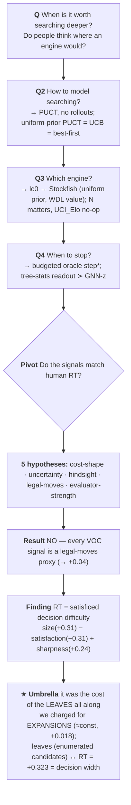

# Tree search & human deliberation: when (and how) ought one to think?

**Ref:** `R-TREESEARCH` · [Index](reference.md)

> **Status:** 📝 active — **the culmination.** The whole project is a graph of choices (the mermaid below; the
> click-driven version is the deck `presentations/src/tree-search.md`) that finally converges on **one umbrella**:
> human think-time is the **cost of the consideration set — the *leaves* you enumerate — which our cost function
> never charged for.** Powered on filtered SF-2000 trees (n≈65k human moves, bootstrap 95% CIs). Calibration
> detail in [(R-HALT-CALIB)](halt_calibration.md); data in [(R-DATA)](reference.md).

## The map

> Each **Q** node opens a junction; the next line **resolves** it; the path converges on the **umbrella**.

## 1 · The question

When is it worth searching deeper in a position, and do people deliberate longer where an engine would search
more? Both need a model of "searching" — so we build one.

## 2 · Q2 — How do we model searching?

`build_tree` grows an **AlphaZero-style PUCT tree** — **no rollouts**; a heuristic values each node and a
selector chooses what to expand. The selector shapes the tree: **Best-First** (greedy, narrow & deep) vs **MCTS**
(UCB + Monte-Carlo rollout) vs **PUCT** (Q + prior + exploration). Two heads are easy to conflate: the **prior**
`P(child)` weights only *which child to visit*; the **value** is backed up from leaves.

> **Answer:** with **uniform priors**, PUCT reduces to **UCB** — so we are already running a heuristic
> **best-first search with a UCT selector**, breadth-leaning early. The construal can be read off the *existing*
> trace; the lever is the selector + cost, not "MCTS vs BeFS."

## 3 · Q3 — Which engine evaluates the tree?

Originally **lc0** (policy-head prior + value-head value). We swapped to **Stockfish** (~1000× faster on CPU):
**uniform prior** (α-β has no policy head) + **WDL value** from an N-node search. Three knobs, kept distinct:
**N**=`sf_search_limit_nodes` (the leaf heuristic — *matters*, n1≠n100 ρ≈0.93) · **M**=`search_budget`=96 (the
planning) · **`UCI_Elo`** (a play handicap — *no-op* for the eval; SF-1350 ≡ SF-2000 bit-identical
[[sf-uci-elo-noop-for-eval]]).

> **Answer:** the swap didn't change the science; the value is now **WDL/win-prob** (not centipawns) and the
> prior went **uniform** — which is exactly why the search is breadth-leaning UCB.

## 4 · Q4 — When should the search stop?

A budgeted-oracle DP gives **step\*** = argmaxs[V(s) − cost(s)]; **regret = reward − cost**. A learned
readout should beat the blind rules (always-stop / never-stop / fraction-θ):

 

> **Answer:** solvable — a **tree-stats** readout `[height, width, n_nodes]` ≻ GNN-z ≻ fraction
> ([(R-LMCOS-TINY)](lmcos_small.md)). But low regret is *self-consistency*, not a match to people.

## 5 · The pivot — do the signals match human RT?

Correlate every signal with human log-RT:

> **Answer — NO.** The drivers are **structural**: # legal moves **+0.31**, fraction-good **−0.31**; every
> value-of-computation signal is only +0.12…+0.16; the causal halter ≈ 0. Not "people are irrational" — **our
> measure is mis-specified.**

## 6 · The five hypotheses

- **H1 — wrong cost shape?** Sweep it → **no** (regret flat, a monotone transform of Gain; step\* tops at +0.12). *(`cost_sweep_rt`)*
- **H2 — missing uncertainty?** Softmax-VOC (value of *sharpening* the policy) → **recovers** the argmax value (~+0.16), never exceeds it. *(`voc_tau_sweep`)*
- **H3 — hindsight asymmetry?** A causal halter (sees only the tree-so-far) → **no** (≈0). *(`regret_by_model`)*
- **H4 — just a legal-moves proxy?** Partial out legal-moves → **YES**: every signal collapses to **≈+0.04**; legal-moves survives at +0.22. *(`rt_partials`)*
- **H5 — was the engine not weak enough?** Reframed: the worry isn't that the evaluator is too *strong* — it's
  whether a human's "gut" is far *weaker/noisier* than even our cheapest engine, so that **weakening** it would
  move RT toward the human. Test by stepping the leaf-eval budget down, **SF-100 → SF-1**. → **no movement**: the
  RT-correlations are near-identical (legal +0.30/+0.31, gain +0.16/+0.16); the per-position values differ
  (n1≠n100, ρ≈0.93) but the RT story doesn't budge; `UCI_Elo` is a no-op. So within reach, engine strength is not
  the lever — the **open** question is whether a genuinely human-weak evaluator (qualitatively noisier, not just
  fewer SF nodes) would. *(`sf_n1_vs_n100`)*

> **Result:** no value-of-computation or stopping-time signal tracks RT beyond ≈+0.04 over legal-moves.

## 7 · The finding — RT is satisficed decision difficulty

 

`RT ≈ size(+0.31) − satisfaction(−0.31) + sharpness(+0.24)` — more options slow you down, more *good* options
speed you up. And **satisfaction reshapes the whole RT-vs-n curve** (high-satisfaction → plateau low; low →
steep): the **satisficing** signature — stop once good-enough, not bare problem-size.

## ★ 8 · The umbrella — it was the cost of the *leaves* all along

The five hypotheses and the finding all fold into **one** thing: **our cost charged for *expansions*, not
*leaves*.** When the tree expands a node it **enumerates all its legal children as leaves**; the root alone lists
all `n` legal moves. Three candidate costs (n≈4k trees):

| cost ∝ | charges for | median | ρ vs **RT** | ρ vs **legal-moves** |
|---|---|---|---|---|
| `n_expanded` (= `n_steps`) | **expansions** — internal nodes; *what the oracle used* | **96** | **+0.018** | +0.022 |
| `n_total` | **all nodes incl. enumerated leaves** | 2666 | **+0.323** | **+0.857** |
| `n_leaf` | leaves (frontier) only | 2570 | +0.323 | +0.857 |
| *reference* | legal moves | — | +0.292 | — |

Two facts crack it open:

1. **`n_expanded == n_steps`, and it's ≈ constant at the budget (96).** So it correlates with RT at **+0.018** —
   noise. *Every* step\*/regret/VOC signal was riding this near-constant; that is why they were all weak.
2. **The cost we omitted — the leaves** (we set `maintenance_scale = 0`) — `n_total` / `n_leaf` ↔ RT = **+0.323**,
   the **strongest single signal in the project**, beating raw legal-moves. And it is **0.857-collinear with
   legal-moves**, because the leaves *are* the enumerated candidates.

> **The unification:** the **legal-moves effect is the enumeration floor of a leaf-cost.** "Decision width," "the
> consideration set," "satisfaction," and "the cost we mis-specified" are **one object — the cost of the leaves
> you bring into consideration.** We spent the project measuring internal expansions (a constant the budget
> fixes) while the actual lever — the leaves — sat at +0.32, zeroed out.

## 9 · The model & the plan

**Why the reward knobs were all dead ends — and the cost is the only live one.** In hindsight the no-ops
(evaluator strength, `UCI_Elo`, hindsight-vs-causal) were *predictable*. We **filtered the trees for reward to
planning** — positions where searching deeper improves the value (roughly monotone gain with depth). On that
filtered set the **reward profile is held roughly fixed**, so manipulating it barely moves *when* it is worth
stopping: the value curve stays monotone, and the optimal stop is pinned by the **cost**, not the reward. To move
the optimal stop you must change the **cost profile** — which is exactly what **value-pruning** does: drop the
implausible leaves, the leaf-cost (hence the cost) falls, and *where* stopping is optimal re-shapes. This is the
one lever we have not pulled, and it is the subject of a dedicated sub-report **[(R-PRUNING)](pruning.md)**.

Human think-time = the cost of **building the consideration set**, under a resource-rational stop.

> **The framing correction (the load-bearing one).** Legal-moves is **not a rival hypothesis to beat** — it is a
> *count*, the **explanandum**. The question is *not* "what signal beats the +0.34 floor / survives partialling
> it" (that treats a measurement as a model); it is **"is there a resource-rational reason it is *correct* to
> spend effort ∝ your options?"** A cost-based planner whose predicted think-time **collapses onto legal-moves is
> the explanation landing on its target**, not a failure. Collinearity with legal-moves is the *goal*. We spent a
> long stretch scoring "beats the floor"; that was backwards.

- **What we've shown (read correctly).** A resource-rational stop with a **per-operation (node) cost** already
  produces a predicted think-time `n_total(OSS)` that **scales with legal-moves** ([(R-PRUNING)](pruning.md);
  `oss_nodecost`) — i.e. the cost model *predicts* the size effect. The satisficing (`−satisfaction` sign) is the
  optimal stop. These are the **normative derivation** of the phenomenon, not nulls.
- **The model's job (restated).** A 1–2-parameter resource-rational planner (per-operation cost `c`, value =
  decision quality, stakes term) should **reproduce the curves** — RT-vs-`n_moves`, RT-vs-`fraction_good`,
  RT-vs-`action_gap` — with *sensible* parameters, *and* have the relative size/satisfaction/sharpness weights
  **fall out of the cost-benefit** (not be fit one-by-one). That is what makes it an explanation rather than
  "people enumerate."
- **Start no-prune.** The unpruned trees already carry the value landscape; there is no threshold to fit, only the
  cost. Fit `c` (+ stakes) to RT and check the three curves. Pruning is a *later* refinement, not the first step.

> **Root question — the working conclusion:** RT tracks **decision width** with a **satisficing signature**, and
> this is the **fingerprint of resource-rational option-consideration** — not "people irrationally count moves,"
> and not a phenomenon waiting for a signal that beats it. The remaining work is the **fit**: does a
> resource-rational planner *regenerate* `size − satisfaction + sharpness` with reasonable cost parameters?
> [(R-PRUNING)](pruning.md)

---

## Appendix — definitions

- **N / M / `UCI_Elo`**: leaf-eval nodes (the heuristic) / PUCT expansions (the planning) / play handicap (no-op).
- **step\* / regret**: step\* = argmaxs[V(s) − cost(s)]; regret = oracle_value − return(stop).
- **tree-stats** = per-step `[height (deepest node), width (max nodes at a depth), n_nodes (total)]`.
- **n_expanded / n_total / n_leaf**: internal (= n_steps) / all incl. enumerated leaves / frontier leaves.
- **softmax-VOC** = Σc softmax(qs,c/τ)·Vdeep(c); benefit of thinking = the sharpening.
- **size / satisfaction / sharpness** = # legal moves / fraction within ε of best / top-1 − top-2 action gap.
- Figures: `/analysis/make_rt_figures.py`; ρ = Spearman + percentile-bootstrap 95% CIs
  ([[bootstrap-cis-always]]). Deck: `presentations/src/tree-search.md`.
