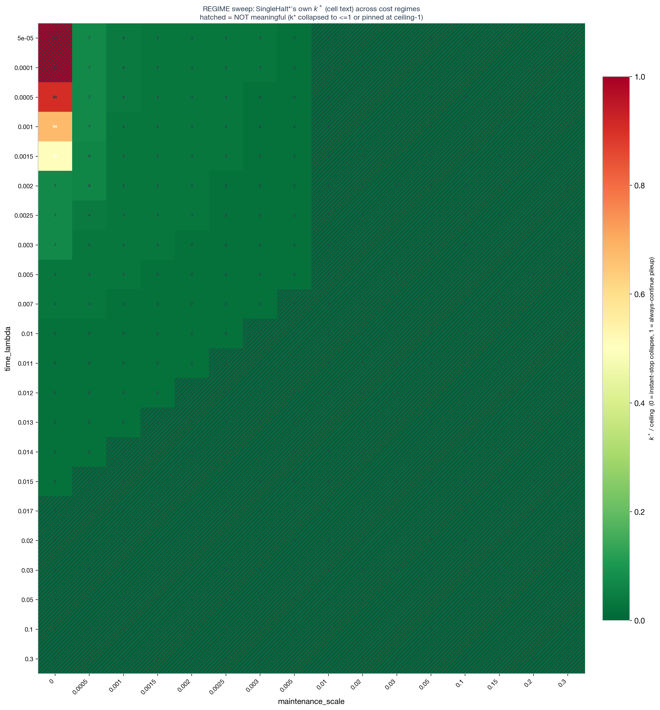

# Does the `z_t` edge replicate on an independently-generated tree corpus?

**Ref:** `R-YSAGIV-XABA` · [Index](reference.md) · companion to [normative.md](normative.md) (`R-EVALUATE`),
which excerpts this report's headline numbers in its own "cross-corpus robustness check" section.

> **Status:** ✅ confirmed, robustness-checked. On Yotam Sagiv's independently-generated `human_trees`
> corpus (Leela/lc0 search, real 2023 human-game root positions — a different engine, search algorithm,
> and root-position population than our own `puctvalue_md36`), filtered by Sagiv's `exclude_xaba`
> churn-motif quality filter, a learned `z_t` readout **significantly beats both the best fixed stop
> (SingleHalt\*) and a hand-crafted tree-stats readout (Stats-Controller)** — the strongest confirmed
> positive `z_t` result anywhere in this investigation. A dedicated follow-up sweep confirms this is not
> an artifact of the fixed-stop baseline sitting at a right-censored ceiling: the win holds across a
> >10x range of the fixed-stop optimum `k*` (95 → 47 → 7) and is in fact **strongest** at an interior,
> non-degenerate point (`λ=0.0015`, `k*=47`), not at the original discovery point. The effect is
> **filter-specific, not corpus-specific**: the same corpus under the standard `argmax>2` filter shows
> `z_t` losing badly to both baselines — see "Which filter surfaces the edge?" below.

> **Rerun at 5x scale (staged, 2026-07-08 evening).** All numbers below were computed on the original
> 20,000-tree raw sample (13,140 xaba survivors, 2,093 validation episodes). Following the scratch
> cleanup (see Methods), the rebuild targets a 100,000-tree raw sample instead (~65,700 expected xaba
> survivors, ~10,400 validation episodes — comfortably under `eval.max_episodes=15000`) at the single
> confirmed-strongest regime, `λ=0.0015`, rather than re-sweeping the full grid. Expect tighter
> bootstrap CIs around the same point estimates, not a qualitatively different result.

## Overview

`normative.md` (`R-EVALUATE`) established, on our own Stockfish/PUCT-generated corpus, that a learned
`z_t` readout can significantly beat hand-crafted tree-stats and the best fixed stop — but only in a
constructed cost regime, on a single corpus, with a single training seed. Two obvious questions follow:
does this replicate on a tree corpus we didn't generate ourselves, and is it robust to the choice of
cost regime rather than a fluke of one calibration point? This report answers both, using Yotam Sagiv's
`human_trees` corpus (`/scratch/gpfs/GRIFFITHS/ysagiv/chess/CTS/data/human_trees`, read-only throughout)
and his `exclude_xaba` quality filter.

## Results

### Is the ysagiv `human_trees` corpus non-degenerate?

A T1/T2-style sanity panel (`analysis.ysagiv_sanity`, reusing `analysis.tree_diagnostics`'s exact
illegal-move / linear-chain / root-dominance / breadth-starvation / right-censoring checks from our own
corpus's check) on a seeded (`seed=42`) 20,000-tree sample:

| stat | median | p10 | p90 | red flag | fired? |
|---|---|---|---|---|---|
| depth (final tree) | 6.0 | 4.0 | 9.0 | depth≤2 (breadth-starvation) | **no**, 0.0% |
| argmax (oracle stop step) | **1.0** | 0.0 | 16.0 | argmax≥90 (right-censoring) | marginal, 0.17% (5/3000) |

5 example trees spanning the argmax spread (p10/p50/p75/p90/max) all pass illegal-move (0/5),
linear-chain, and root-dominance checks. One consistent, explained difference from our own corpus: the
duplicate-FEN (transposition) check fires on all 5 — not a bug, but a direct consequence of this
corpus's generation style (every root expansion adds *all* legal children, unlike our own PUCT-selective
growth, so large trees accumulate far more incidental transpositions).

> **Result:** The corpus is non-degenerate — no illegal moves, no breadth-starvation, no right-censoring
> beyond a negligible tail, no linear chains, no root-dominance pathology. The duplicate-FEN pattern and
> the much lower argmax median (1.0 vs. our own corpus's 6) are real, reportable generation-style
> differences, not correctness bugs.

### Which "thinking helps" filter surfaces the `z_t` edge — `argmax>2` or `exclude_xaba`?

Both filters were run head-to-head on the identical 20,000-tree raw sample, through the identical
pipeline (`d_embed=32`, encoder 6 epochs, PG readout 20 epochs, `time_mode=linear`), evaluated at three
`REGIME`-confirmed cost-regime points with `src/analysis/ysagiv_sig.py` (paired bootstrap, `n_boot=2000`,
percentile CIs, `analysis.evaluate`'s own `_load_assessment_data`/`_fit_stop_controllers`/`_regret_at`
reused unmodified):

| filter | raw survival (20K) | net trainable | `z_t` vs. best baseline at the filter's strongest regime |
|---|---:|---:|---|
| **`exclude_xaba`** (this repo's live config) | 65.7% | 51.9% | **`z_t` wins** — λ=0.0005: +0.0179 [+0.0148,+0.0202] over SingleHalt\*, +0.0143 [+0.0104,+0.0185] over Stats |
| `argmax>2` (historical comparison; config no longer in this branch) | 18.8% | 18.6% | `z_t` **loses** — λ=0.01: −0.1203 [−0.1637,−0.0790] vs. SingleHalt\*; λ=0.001,m=0.001: −0.2359 [−0.2943,−0.1814] |

`exclude_xaba`'s higher raw survival is substantially eroded by the shared downstream trivial-tree
filter (`min_halt_reward_range=0.05`): 65.7%→51.9% net, vs. `argmax>2`'s 18.8%→18.6% (almost no
additional loss) — the two filters select on different axes (move-stability vs. reward-range) that
interact very differently with what's ultimately trainable.

`argmax>2`'s `z_t`-losing result on this corpus is the *same* qualitative pattern already documented on
our own corpus (`z_t` struggling to clear the fixed-stop bar) — if anything starker here (`z_t`'s
regret is 1.4–2.2x SingleHalt\*'s). Notably, `argmax>2`'s `z_t` has the *highest* raw decodability of
any branch/corpus tested anywhere (R²=0.448 for `R(t)`) yet is that branch's worst controller by
regret — the same "decodability ≠ control quality" lesson `normative.md` draws from `z_t`+stats.

> **Result:** The `z_t` edge is **filter-specific, not corpus-specific**. The identical corpus, engine,
> architecture, and cost regimes produce opposite verdicts on whether `z_t` beats fixed/hand-crafted
> baselines, purely as a function of which quality filter selected the training/eval population. Do not
> read this as "ysagiv's trees fix `z_t`" — it is specific to `exclude_xaba`.

### Is the `exclude_xaba` win just an artifact of the fixed-stop baseline sitting at a right-censored ceiling?

At the original discovery regime (`λ=0.0005, maintenance=0`), SingleHalt\*'s own fitted optimum is
`k*=95` out of a 96-expansion budget — essentially "never stop early," a coarse, near-degenerate global
policy forced by how cheap search is at that regime. A dedicated follow-up swept `time_lambda` across 22
log-spaced values on the *identical* already-packed/materialized population (no repacking, no
retraining) to check whether the win survives once the baseline isn't pinned at that boundary.



The data-derived ceiling is 96 (matches the corpus's own 96-root-expansion budget); the meaningful band
(`1 < k* < ceiling-1`) at `maintenance=0` is `time_lambda ∈ [0.001, 0.02]`. `λ=0.0005` — the original
winning regime — sits just *outside* this band, right-censored at `k*=95`.

| `time_lambda` | `k*` | meaningful? | `z_t` vs. SingleHalt\* (paired, 95% CI) |
|---|---:|---|---|
| 0.0005 | 95 | no — right-censored (ceiling) | **+0.0179 [+0.0148, +0.0202] `z_t` wins** (original discovery point) |
| **0.0015** | **47** | **yes — dead-center of the band** | **+0.0672 [+0.0513, +0.0837] `z_t` wins — largest margin of the whole sweep** |
| 0.002 | 7 | yes — interior | **+0.0464 [+0.0299, +0.0638] `z_t` wins** |
| 0.005 | 4 | yes | +0.0026 [−0.0068, +0.0120] ns |
| 0.007 | 3 | yes | +0.0025 [−0.0053, +0.0110] ns |
| 0.01 | 3 | yes | +0.0029 [−0.0037, +0.0108] ns |
| 0.012 | 2 | yes — smallest meaningful `k*` | +0.0023 [−0.0068, +0.0124] ns |
| 0.001, maint=0.001 | 4 | — | +0.0019 [−0.0031, +0.0078] ns |

The win does **not** vanish as `k*` moves away from the ceiling — it holds across a >10x span of `k*`
(95 → 47 → 7) and is in fact **strongest** at `λ=0.0015`, squarely in the interior of the meaningful
band, not at the boundary. It fades to a tie (never a loss) once `time_lambda≥0.005` (`k*≤4`) — a
transition that itself sits well inside the meaningful band, nowhere near either edge.

> **Result:** The win is not a right-censoring artifact. It generalizes across a genuine span of
> non-degenerate `k*` values and is strongest in the interior of the cost-regime band this
> investigation's own criterion independently flags as meaningful — not at the edge where the concern
> would apply.

> **Clarification (open, not adjudicated).** The win fades to a tie once `k*≤4` (confirmed at 5 of 8
> swept points) — not explained by this sweep. Candidate mechanisms (more per-episode trajectory for
> `z_t` to condition on at larger `k*`; or the cost function itself changing which structure is
> decision-relevant) are plausible but unadjudicated — flagged as a hypothesis, not a finding.

### Which regime should figures target going forward?

Two defensible choices, both real wins:

- **`λ=0.0005, maintenance=0`** — the original discovery regime. Simplest to cite, but `k*=95` sits at
  the ceiling, which invites (and requires re-explaining) the right-censoring objection above.
- **`λ=0.0015, maintenance=0`** — `k*=47`, dead-center of the independently-confirmed meaningful band,
  **and the single strongest margin in the entire sweep** (+0.0672 vs. +0.0179 at the original point).

> **Decision:** Target **`λ=0.0015, maintenance=0`** as the primary regime for the frontier figure going
> forward — it is the cleanest, most strongly-supported point (no ceiling caveat needed) and happens
> also to be the best result. `λ=0.0005` is retained as the historical discovery point, not the
> headline.

### Decodability: why is the edge available here at all?

A companion decodability probe (regime-independent, R² predicting `R(t) = value of continuing`,
`exclude_xaba` population, `n≈2,093` validation episodes):


steps alone = 0.105, tree-stats alone = 0.238, **`z_t` alone = 0.339** — roughly 3x `z_t`'s own
decodability on our own corpus (frozen `z_t`: R²=0.013). `z_t` predicts *steps* at only R²=0.098
(largely orthogonal to trajectory position) vs. tree-stats predicting steps at R²=0.771 (heavily
entangled) — the embedding carries a genuinely distinct signal here, not a relabeled step counter.

> **Result:** The representational precondition for a `z_t` win is even stronger on this population than
> on our own corpus — consistent with, and part of the explanation for, why the regret win shows up here
> at all.

## Methods

**Corpus.** `/scratch/gpfs/GRIFFITHS/ysagiv/chess/CTS/data/human_trees` (read-only throughout),
1,078,585 trees, `cts_raw_pretrain_example_v5` schema, confirmed compatible with our own
`tree_encoder_feature_schema()` (5 of 6 feature columns match directly; `cp_order` not needed).
`oracle_trace_expansion_counts` confirms 96 root expansions/tree, matching our own `search_budget=96`.
A seeded (`seed=42`) 20,000-tree sample (symlinked into
`/scratch/gpfs/GRIFFITHS/hl4291/lmcos/ysagiv/raw_sample/`, read-only) was used for all filter/pack/train
work, per this repo's "iteration speed over completeness" convention — not the full 1.08M. This sample
originally existed only as an uncommitted one-off command; it (along with every downstream artifact —
`split/`, `packed/`, `mc_packed/`, `materialized/`, the trained encoder/controller) was lost in a scratch
cleanup on 2026-07-08 alongside several genuinely stale directories. The sampling step is now committed
as `slurm/pipeline/ysagiv_sample.slurm` (same `seed=42`/`n=20000`), so the full chain — including this
first step — is reproducible end to end from nothing but the permanent, read-only source corpus.

**Filter.** `exclude_xaba` (`src/cts/data/preprocess_mc/filter_xaba.py`, mirroring
`filter_argmax.py`'s CLI/output contract, built on
`cts.data.preprocess_mc.pack._source_top_level_root_churn_category`) drops the `X*AB*A`
churn-and-revisit motif (root-best-move trace thrashes and revisits an earlier move — "deliberately
engineered to make the stopping decision nontrivial," per its author), keeping `X*A`/`A`.

**Pipeline.** Same architecture/recipe as `normative.md`'s own-corpus assessment (`d_embed=32`, encoder
pretrained 6 epochs, PG readout 20 epochs, `pg_episode_batch=1024`, `time_mode=linear`), driven by
`config_ysagiv_xaba.yaml` through the unmodified shared pipeline scripts
(`slurm/pipeline/{pack_trees,train_encoder,pack_root,pack_root_merge,train_readout_pg,eval}.slurm`,
invoked with `CONFIG=config_ysagiv_xaba.yaml`). The `exclude_xaba` include-list itself is produced
upstream by `slurm/pipeline/ysagiv_xaba_filter.slurm` (independent of the main config chain).

**Significance.** `src/analysis/ysagiv_sig.py::compute_pairwise_significance` generalizes
`evaluate.py`'s built-in paired-bootstrap methodology (`cts.stats.bootstrap_ci`, percentile,
`n_boot=2000`, never normal-theory) to all three pairwise diffs (SingleHalt\*/Stats/`z_t`), on a 70/30
fit/eval split of the validation episodes (`n_fit=1,465 / n_eval=628` for the xaba branch), reusing
`analysis.evaluate`'s `_load_assessment_data`/`_fit_stop_controllers`/`_regret_at` directly.

**Regime sweep.** Swept `time_lambda` (`maintenance_scale=0.0` fixed) across 22 log-spaced values on
the already-packed/materialized xaba population — no repacking, no retraining. The two previously-known
regime points reproduced their original numbers to full float precision (determinism-confirmed,
`seed=0` throughout).

**Reproducibility note (this branch).** `jordan-working` was trimmed (`eb503b4`, 2026-07-08) to "the
single validated xaba pipeline": `config_ysagiv_xaba.yaml` and the shared pipeline scripts are
retained. `analysis.regime_select` (behind `regime_select.png`) and
`slurm/pipeline/ysagiv_xaba_regime_sweep.slurm` were removed as orphaned in the same trim (their only
referrer was a since-deleted one-off pipeline script) — both have been **restored unmodified from the
`jordan` branch** alongside this report. The one piece still missing is `config_ysagiv_argmax.yaml` (the
historical `argmax>2` comparison arm in "Which filter surfaces the edge?" above) — not needed for
anything else in this report.

**A separate scratch cleanup on 2026-07-08** (same day, after the numbers above were computed) removed
every ysagiv-derived scratch artifact — `raw_sample/`, `xaba/include_list.txt`, `split/`, `packed/`,
`mc_packed/`, `materialized/`, the trained encoder and controller checkpoints — alongside several
genuinely stale one-off directories it was intentionally targeting. Yotam's source corpus itself
(`human_trees`, read-only, never in scope for deletion) is untouched. This means every number and figure
in this report is currently **derived, not directly re-plottable from surviving scratch data** — the
full chain must be rerun from the source corpus to regenerate the actual PNGs (see Reproduce below,
now including the newly-committed `ysagiv_sample.slurm` first step). `config_ysagiv_xaba.yaml` and all
referenced scripts are unaffected by the cleanup and remain sufficient to drive that rerun end to end.

**Shared-script time budgets right-sized to the live path.** `pack_trees.slurm`'s `--time` (4h→1h30)
and `pack_root.slurm`'s (6h→1h30) were edited directly rather than overridden per-submission, since the
ysagiv/xaba chain is the only live path on this branch right now — both were previously sized for the
much larger 400K-tree own-corpus (`minply15_maxply75`) config (`pack_root`'s 6h specifically was
headroom against a one-off DataLoader deadlock on that run's 40-worker array, not a recurring issue on
this corpus). Bump them back up if either script is next driven against that larger scale again — the
history is preserved in each script's own comment.

## Appendix

### Caveats & open work

- **Single training seed.** `seed=0` throughout; PG training is numerically sensitive run-to-run
  (documented in `normative.md`'s own caveats) — the qualitative story is stable across every run
  observed here, but exact regret magnitudes for Stats-Controller specifically carry some noise.
- **The win fades to a tie (not a loss) once `k*≤4`, mechanism unexplained** — see the sweep section
  above.
- **`argmax>2`'s opposite result on the same corpus is historical**, computed on the `jordan` branch
  before the trim; its config is not currently in this branch (see Methods reproducibility note).
- **Own-corpus corroboration.** `normative.md` reports that stacking `exclude_xaba` on top of our own
  `argmax>2`-filtered `puctvalue_md36` corpus gives a smaller but same-direction win
  (+0.0049 [+0.0005,+0.0101] over SingleHalt\* at the matching cheap-search regime) — see that report's
  "Does this corroborate on our own corpus too?" section; not reproduced here.
- **Decodability is not a reliable proxy for control quality** — `argmax>2`'s `z_t` has the highest raw
  R² of any branch tested (0.448) yet is that branch's worst controller by regret.

### Reproduce

```
# 0. re-derive the seeded raw sample from the permanent source corpus (lost in the 2026-07-08
#    scratch cleanup; newly committed, was previously an uncommitted one-off). Bumped 20K->100K.
sbatch slurm/pipeline/ysagiv_sample.slurm

# 1. xaba include-list (depends on step 0's raw_sample)
sbatch --dependency=afterok:<step0_jobid> slurm/pipeline/ysagiv_xaba_filter.slurm

# 2. full chain: split + gnn_pack + mc_pack -> encoder pretrain -> materialize (array + merge)
CONFIG=config_ysagiv_xaba.yaml sbatch --dependency=afterok:<step1_jobid> slurm/pipeline/pack_trees.slurm
CONFIG=config_ysagiv_xaba.yaml sbatch --dependency=afterok:<pack_trees_jobid> slurm/pipeline/train_encoder.slurm
CONFIG=config_ysagiv_xaba.yaml sbatch --array=0-19 --dependency=afterok:<train_encoder_jobid> slurm/pipeline/pack_root.slurm  # 10->20 workers (~2.5x per-worker load, not 5x -- capped at 20 concurrent tasks rather than scaling the array 1:1 with the 5x tree-count bump); array size is always a submission-time flag, never baked into the script
CONFIG=config_ysagiv_xaba.yaml sbatch --dependency=afterok:<pack_root_array_jobid> slurm/pipeline/pack_root_merge.slurm
# train_readout_pg.slurm is NOT a dependency of eval (evaluate.py fits its own readout internally,
# per normative.md's 2026-07-07 finding) -- skip it unless the checkpoint itself is wanted

# frontier + decodability at the recommended regime
python -m analysis.evaluate --which all \
  --packed-root /scratch/gpfs/GRIFFITHS/hl4291/lmcos/ysagiv_xaba/mc_packed \
  --cache /scratch/gpfs/GRIFFITHS/hl4291/lmcos/ysagiv_xaba/materialized/validation_cache.pt \
  --out-dir outputs/figures/ysagiv/xaba \
  --time-mode linear --time-lambda 0.0015 --maintenance-scale 0.0

# paired significance at any regime point (used throughout this report)
python -m analysis.ysagiv_sig \
  --packed-root /scratch/gpfs/GRIFFITHS/hl4291/lmcos/ysagiv_xaba/mc_packed \
  --cache /scratch/gpfs/GRIFFITHS/hl4291/lmcos/ysagiv_xaba/materialized/validation_cache.pt \
  --out-dir outputs/figures/ysagiv/xaba --time-lambda 0.0015 --maintenance-scale 0.0

# full k*-vs-(lambda,maintenance) regime sweep + auto point-selection + 3-way significance at each
# (restored from the jordan branch; reproduces the sweep table + regime_select.png above)
CONFIG=config_ysagiv_xaba.yaml sbatch slurm/pipeline/ysagiv_xaba_regime_sweep.slurm
```

Figures/data: `outputs/figures/ysagiv/xaba/{pdf,png}/{frontier,decodability}.*`,
`outputs/figures/ysagiv/xaba/{frontier,decodability}_data.json`,
`outputs/figures/ysagiv/xaba/regime_sweep/{pdf,png}/regime_select.*`.
