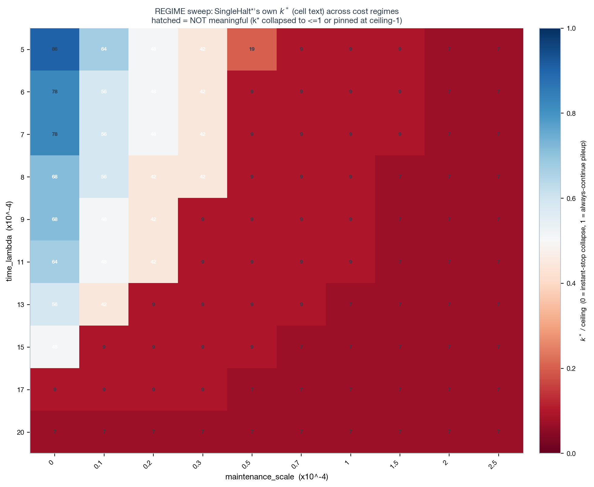
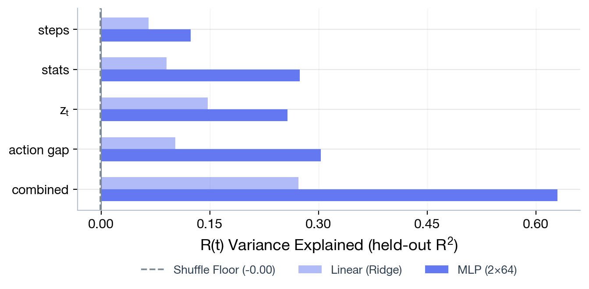
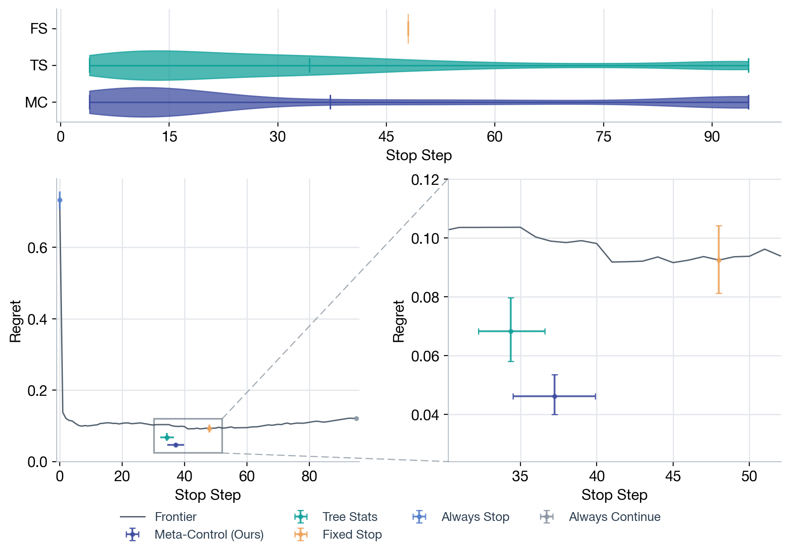

# Does the `z_t` edge replicate when the position evaluator is swapped from Stockfish to Leela?

**Ref:** `R-YSAGIV-XABA` · [Index](reference.md) · companion to [normative.md](normative.md) (`R-EVALUATE`),
which excerpts this report's headline numbers in its own "cross-corpus robustness check" section.

> **Status:** ✅ confirmed, robustness-checked. On Yotam Sagiv's `human_trees` corpus — generated by
> *our own* `generate-dataset` PUCT pipeline (`src/cts/data/build_tree.py`), over *our own* root-FEN
> pool, with Leela (`lc0`) substituted for Stockfish as the position evaluator — filtered by Sagiv's
> `exclude_xaba` churn-motif quality filter, a learned `z_t` readout **significantly beats both the best
> fixed stop (SingleHalt\*) and a hand-crafted tree-stats readout (Stats-Controller)** — the strongest
> confirmed positive `z_t` result anywhere in this investigation. **Correction:** earlier drafts of this
> report described `human_trees` as generated by "a different engine, a different search algorithm, and
> a different population of root positions" — confirmed with Yotam Sagiv (2026-07-09) that this was
> wrong on all three counts; see "What actually generated this corpus?" below. The only real difference
> from our own `puctvalue_md36` corpus is which network evaluates positions. A dedicated follow-up sweep
> confirms the win is not an artifact of the fixed-stop baseline sitting at a right-censored ceiling: it
> holds across a >10x range of the fixed-stop optimum `k*` (95 → 47 → 7) and is in fact **strongest** at
> an interior, non-degenerate point (`λ=0.0015`, `k*=47`), not at the original discovery point. The
> effect is **filter-specific, not corpus-specific**: the same corpus under the standard `argmax>2`
> filter shows `z_t` losing badly to both baselines — see "Which filter surfaces the edge?" below.

> **Rebuilt and replicated at 20K (2026-07-08 late), 100K queued next.** Following the scratch cleanup
> (see Methods), the full chain — sample → xaba filter → split/gnn_pack/mc_pack → encoder pretrain →
> materialize → eval — was rerun end to end from nothing but the permanent source corpus, as a fast
> (~23min wall-clock) dry run at the *original* 20,000-tree scale before committing to a slower 100K
> overnight run. **It replicated cleanly on a fully independent pipeline run** (fresh encoder + fresh
> readout training, same `λ=0.0015` regime): `SingleHalt*(k*=48)=0.0924`, `Stats=0.0682`,
> **`z_t`=0.0462** — `z_t` significantly beats Stats (paired `z_t`−Stats = −0.0220 [−0.0343,−0.0107],
> excludes 0) and its CI doesn't even overlap SingleHalt*'s. Same ordering, same significant win as the
> original run below; point estimates differ somewhat run-to-run (expected — see the PG-training-noise
> caveat), not the qualitative story. This validated 20K run is preserved at `config_ysagiv_xaba20k.yaml`
> / `outputs/figures/ysagiv/xaba20k/` rather than being overwritten. The 100K run
> (`config_ysagiv_xaba100k.yaml` / `outputs/figures/ysagiv/xaba100k/`, ~65,700 expected xaba survivors,
> ~10,400 validation episodes — comfortably under `eval.max_episodes=15000`) is staged and ready, not yet
> submitted.

> **AG-Controller added (2026-07-10).** A hand-crafted, zero-training baseline — `action_gap`, the root's
> top1-minus-top2 backed-up Q-value gap, read directly off the tree — is now fit alongside SingleHalt\*/
> Stats-Controller/`z_t` in the frontier, decodability, and delta-regret figures for all three
> populations (`xaba20k`, `xaba100k`, `xaba100k_minply15_maxply75`). It **significantly beats `z_t` at 2
> of 3 populations** and ties at the third — despite 2 input dimensions and no learned encoder at all. See
> "Does a hand-crafted 'action gap' statistic do just as well..." below. This reframes, but does not
> overturn, the headline: `z_t` still significantly beats SingleHalt\*/Stats-Controller everywhere, but
> the *strongest* hand-crafted baseline available (as opposed to tree-stats) is not clearly beaten by it.

## Overview

`normative.md` (`R-EVALUATE`) established, on our own Stockfish/PUCT-generated corpus, that a learned
`z_t` readout can significantly beat hand-crafted tree-stats and the best fixed stop — but only in a
constructed cost regime, on a single corpus, with a single training seed. Two obvious questions follow:
does this survive swapping out the position evaluator (Stockfish → Leela, on a separate generation run
neither of us drove), and is it robust to the choice of cost regime rather than a fluke of one
calibration point? This report answers both, using Yotam Sagiv's `human_trees` corpus
(`/scratch/gpfs/GRIFFITHS/ysagiv/chess/CTS/data/human_trees`, read-only throughout, generated with our
own pipeline pointed at Leela instead of Stockfish — see "What actually generated this corpus?" below)
and his `exclude_xaba` quality filter.

## Results

### What actually generated this corpus?

Confirmed directly with Yotam Sagiv (2026-07-09): `human_trees` was produced by running the exact
`generate-dataset` command below — this repo's own `src/cts/data/build_tree.py` CLI, the same code
path that generates our Stockfish-driven `puctvalue_md36` corpus — not by an independent pipeline:

```
command: generate-dataset
engine_path: /scratch/gpfs/GRIFFITHS/ysagiv/tools/lc0/build/release/lc0
weights_path: /scratch/gpfs/GRIFFITHS/ysagiv/chess/weights/t1-256x10-distilled-swa-2432500.pb.gz
fens: /scratch/gpfs/GRIFFITHS/hl4291/lmcos/fens.txt
output_dir: /scratch/gpfs/GRIFFITHS/ysagiv/chess/CTS/data/human_trees
max_depth: 30
min_nodes: 96
max_nodes: 96
resume: true
include_edge_wdl_targets: true
```

**Engine.** `lc0` (Leela Chess Zero) at the path above, loaded with the
`t1-256x10-distilled-swa-2432500.pb.gz` network (a 256-filter/10-block distilled, SWA-trained Leela
net). `Lc0DirectEvalProvider` (`src/cts/core/providers/lc0.py`) runs this engine at `go nodes 1` for
both heads it needs — a `classic`-mode process (`multipv=8`, `verbose-move-stats`) for per-move
priors, and a separate `valuehead`-mode process for the WDL value — so lc0 performs **no internal
search** here; it is queried purely as a one-shot policy+value network, the same role Stockfish plays
for our own corpus via `StockfishDirectEvalProvider`.

**Search algorithm.** Unchanged: `generate_dataset_command` builds every tree with this repo's own
`PUCTSearch` (`src/cts/data/preprocess_gnn/teacher_targets.py`) — the identical AlphaZero-style PUCT
(`Q + c_puct·P·√N/(1+n)`, first-play-urgency-fixed for unvisited children) that generates
`puctvalue_md36`. `c_puct` is left at its Pydantic default of **1.0** in the `generate-dataset` config
(no override) — matching `BuildTreeConfig.c_puct: float = 1.0` on `main` and every other
config/test/demo in the codebase. This constant has not changed.

**Root positions.** `fens: /scratch/gpfs/GRIFFITHS/hl4291/lmcos/fens.txt` is *our own* canonical
FEN pool (110,505,438 unique positions extracted from `processed_moves_nonzero`, the same Lichess
10+0/Elo≥2000 database `puctvalue_md36`'s own roots are drawn from) — not an independently-collected
root-position sample. `human_trees` and `puctvalue_md36` are two separate generation runs/samples
drawn from the *same* underlying position pool, not two different populations. (This corroborates,
and sharpens, the FEN-membership check already run for the ply-window stacking work below: it isn't
just "the same underlying Lichess pool," it's the identical `fens.txt`.)

**Search budget.** Fixed 96-node budget (`min_nodes=max_nodes=96`, so every tree gets exactly 96
expansions — `NodeBudgetDistribution` is degenerate here), `max_depth=30`. `resume: true` is a
job-resumption flag for shard-parallel generation (no analysis implication). `include_edge_wdl_targets:
true` attaches per-edge WDL supervision straight from the value head to each generated example — the
same targets the child-WDL encoder pretrains on elsewhere in this pipeline.

> **Correction.** This report (and `normative.md`) previously described `human_trees` as generated "by
> a different engine, a different search algorithm ... and a different population of root positions"
> than our own corpus, and characterized the result below as replication on an "independently-generated"
> corpus. That was inaccurate on all three counts: the two corpora share the same PUCT code, the same
> `c_puct`, and the same root-FEN pool. The only real difference is the position evaluator — Leela
> (`lc0`, distilled-SWA net) here vs. Stockfish for `puctvalue_md36`. The correct framing for everything
> below is an **evaluator swap** (does the `z_t` edge survive when Stockfish is replaced by Leela, search
> algorithm and root positions held fixed?), not a from-scratch independent replication. Wording below has
> been corrected accordingly; some passages still say "corpus B" or "the ysagiv corpus" as informal
> shorthand for "the evaluator-swapped generation run," not as a claim of independence.

### Is the ysagiv `human_trees` corpus non-degenerate?

A T1/T2-style sanity panel (`analysis.ysagiv_sanity`, reusing `analysis.tree_diagnostics`'s exact
illegal-move / linear-chain / root-dominance / breadth-starvation / right-censoring checks from our own
corpus's check) on a seeded (`seed=42`) 20,000-tree sample:

| stat | median | p10 | p90 | red flag | fired? |
|---|---|---|---|---|---|
| depth (final tree) | 6.0 | 4.0 | 9.0 | depth≤2 (breadth-starvation) | **no**, 0.0% |
| argmax (oracle stop step) | **1.0** | 0.0 | 16.0 | argmax≥90 (right-censoring) | marginal, 0.17% (5/3000) |

5 example trees spanning the argmax spread (p10/p50/p75/p90/max) all pass illegal-move (0/5),
linear-chain, and root-dominance checks. One difference from our own corpus: the duplicate-FEN
(transposition) check fires on all 5 — not a bug (no illegal moves or corrupted structure found), but
its cause is not yet identified. The previously-recorded explanation (attributed to this corpus
expanding all of a node's legal children at once, unlike our own corpus's expansion) does not hold up
now that the generation method is confirmed (see "What actually generated this corpus?" above): both
corpora are grown by the identical `PUCTSearch.on_expand` code, which adds *all* of a selected node's
legal children at every expansion regardless of which engine evaluates them — so a difference in
expansion style isn't available as a mechanism. A higher realized branching factor under the Leela
evaluator, or a difference in the per-tree depth/size distribution it induces, are candidate
explanations but unverified — flagged as an open question, not a finding (per this investigation's
no-ad-hoc-mechanism-claims convention).

> **Result:** The corpus is non-degenerate — no illegal moves, no breadth-starvation, no right-censoring
> beyond a negligible tail, no linear chains, no root-dominance pathology. The duplicate-FEN pattern and
> the much lower argmax median (1.0 vs. our own corpus's 6) are real, reportable generation-style
> differences, not correctness bugs.

### Which "thinking helps" filter surfaces the `z_t` edge — `argmax>2` or `exclude_xaba`?

Both filters were run head-to-head on the identical 20,000-tree raw sample, through the identical
pipeline (`d_embed=32`, encoder 6 epochs, PG readout 20 epochs, `time_mode=linear`), evaluated at three
`REGIME`-confirmed cost-regime points with `src/analysis/ysagiv_sig.py` (paired bootstrap, `n_boot=2000`,
percentile CIs, `analysis.evaluate`'s own `_load_assessment_data`/`_fit_stop_controllers`/`_regret_at`
reused unmodified):

| filter | raw survival (20K) | net trainable | `z_t` vs. best baseline at the filter's strongest regime |
|---|---:|---:|---|
| **`exclude_xaba`** (this repo's live config) | 65.7% | 51.9% | **`z_t` wins** — λ=0.0005: +0.0179 [+0.0148,+0.0202] over SingleHalt\*, +0.0143 [+0.0104,+0.0185] over Stats |
| `argmax>2` (historical comparison; config no longer in this branch) | 18.8% | 18.6% | `z_t` **loses** — λ=0.01: −0.1203 [−0.1637,−0.0790] vs. SingleHalt\*; λ=0.001,m=0.001: −0.2359 [−0.2943,−0.1814] |

`exclude_xaba`'s higher raw survival is substantially eroded by the shared downstream trivial-tree
filter (`min_halt_reward_range=0.05`): 65.7%→51.9% net, vs. `argmax>2`'s 18.8%→18.6% (almost no
additional loss) — the two filters select on different axes (move-stability vs. reward-range) that
interact very differently with what's ultimately trainable.

`argmax>2`'s `z_t`-losing result on this corpus is the *same* qualitative pattern already documented on
our own corpus (`z_t` struggling to clear the fixed-stop bar) — if anything starker here (`z_t`'s
regret is 1.4–2.2x SingleHalt\*'s). Notably, `argmax>2`'s `z_t` has the *highest* raw decodability of
any branch/corpus tested anywhere (R²=0.448 for `R(t)`) yet is that branch's worst controller by
regret — the same "decodability ≠ control quality" lesson `normative.md` draws from `z_t`+stats.

> **Result:** The `z_t` edge is **filter-specific, not corpus-specific**. The identical corpus, engine,
> architecture, and cost regimes produce opposite verdicts on whether `z_t` beats fixed/hand-crafted
> baselines, purely as a function of which quality filter selected the training/eval population. Do not
> read this as "ysagiv's trees fix `z_t`" — it is specific to `exclude_xaba`.

### Is the `exclude_xaba` win just an artifact of the fixed-stop baseline sitting at a right-censored ceiling?

At the original discovery regime (`λ=0.0005, maintenance=0`), SingleHalt\*'s own fitted optimum is
`k*=95` out of a 96-expansion budget — essentially "never stop early," a coarse, near-degenerate global
policy forced by how cheap search is at that regime. A dedicated follow-up swept `time_lambda` across 22
log-spaced values on the *identical* already-packed/materialized population (no repacking, no
retraining) to check whether the win survives once the baseline isn't pinned at that boundary.



The data-derived ceiling is 96 (matches the corpus's own 96-root-expansion budget); the meaningful band
(`1 < k* < ceiling-1`) at `maintenance=0` is `time_lambda ∈ [0.001, 0.02]`. `λ=0.0005` — the original
winning regime — sits just *outside* this band, right-censored at `k*=95`.

| `time_lambda` | `k*` | meaningful? | `z_t` vs. SingleHalt\* (paired, 95% CI) |
|---|---:|---|---|
| 0.0005 | 95 | no — right-censored (ceiling) | **+0.0179 [+0.0148, +0.0202] `z_t` wins** (original discovery point) |
| **0.0015** | **47** | **yes — dead-center of the band** | **+0.0672 [+0.0513, +0.0837] `z_t` wins — largest margin of the whole sweep** |
| 0.002 | 7 | yes — interior | **+0.0464 [+0.0299, +0.0638] `z_t` wins** |
| 0.005 | 4 | yes | +0.0026 [−0.0068, +0.0120] ns |
| 0.007 | 3 | yes | +0.0025 [−0.0053, +0.0110] ns |
| 0.01 | 3 | yes | +0.0029 [−0.0037, +0.0108] ns |
| 0.012 | 2 | yes — smallest meaningful `k*` | +0.0023 [−0.0068, +0.0124] ns |
| 0.001, maint=0.001 | 4 | — | +0.0019 [−0.0031, +0.0078] ns |

The win does **not** vanish as `k*` moves away from the ceiling — it holds across a >10x span of `k*`
(95 → 47 → 7) and is in fact **strongest** at `λ=0.0015`, squarely in the interior of the meaningful
band, not at the boundary. It fades to a tie (never a loss) once `time_lambda≥0.005` (`k*≤4`) — a
transition that itself sits well inside the meaningful band, nowhere near either edge.

> **Result:** The win is not a right-censoring artifact. It generalizes across a genuine span of
> non-degenerate `k*` values and is strongest in the interior of the cost-regime band this
> investigation's own criterion independently flags as meaningful — not at the edge where the concern
> would apply.

> **Clarification (open, not adjudicated).** The win fades to a tie once `k*≤4` (confirmed at 5 of 8
> swept points) — not explained by this sweep. Candidate mechanisms (more per-episode trajectory for
> `z_t` to condition on at larger `k*`; or the cost function itself changing which structure is
> decision-relevant) are plausible but unadjudicated — flagged as a hypothesis, not a finding.

### Which regime should figures target going forward?

Two defensible choices, both real wins:

- **`λ=0.0005, maintenance=0`** — the original discovery regime. Simplest to cite, but `k*=95` sits at
  the ceiling, which invites (and requires re-explaining) the right-censoring objection above.
- **`λ=0.0015, maintenance=0`** — `k*=47`, dead-center of the independently-confirmed meaningful band,
  **and the single strongest margin in the entire sweep** (+0.0672 vs. +0.0179 at the original point).

> **Decision:** Target **`λ=0.0015, maintenance=0`** as the primary regime for the frontier figure going
> forward — it is the cleanest, most strongly-supported point (no ceiling caveat needed) and happens
> also to be the best result. `λ=0.0005` is retained as the historical discovery point, not the
> headline.

### Decodability: why is the edge available here at all?

A companion decodability probe (regime-independent, R² predicting `R(t) = value of continuing`,
`exclude_xaba` population, `n≈2,093` validation episodes):



steps alone = 0.105, tree-stats alone = 0.238, **`z_t` alone = 0.339** — roughly 3x `z_t`'s own
decodability on our own corpus (frozen `z_t`: R²=0.013). `z_t` predicts *steps* at only R²=0.098
(largely orthogonal to trajectory position) vs. tree-stats predicting steps at R²=0.771 (heavily
entangled) — the embedding carries a genuinely distinct signal here, not a relabeled step counter.

> **Result:** The representational precondition for a `z_t` win is even stronger on this population than
> on our own corpus — consistent with, and part of the explanation for, why the regret win shows up here
> at all.

### Does a hand-crafted "action gap" statistic do just as well as the learned `z_t` embedding — without any training at all?

**What `action_gap` is.** At every step of a trajectory, `action_gap` is the gap between the root's
current best and second-best move by *backed-up* Q-value — `top1(Q) − top2(Q)`, read directly off
`oracle_root_q_trace` (`src/analysis/evaluate.py::_action_gaps_for_trajectory`), the same per-expansion
snapshot of the tree's own root-child statistics that generation already records for every tree
(`_record_oracle_root_trace`, `teacher_targets.py`). It needs **no encoder and no training** — it is a
pure, hand-computed function of the tree's own PUCT backup (`total_value / visit_count` on the root's two
most-favored children), read at the same expansion count `z_t` is encoded at. Where `z_t` has to *learn*
(via an indirect child-WDL pretraining objective, then a PG-trained readout) to represent something like
"how decided is this position," `action_gap` reads it off directly: a wide gap means one root move is
clearly ahead in the search so far; a gap near zero means the top two are still statistically tied.

**Frontier comparison** (headline regime, `λ=0.0015`, `maintenance=0`, identical architecture/recipe to
the rest of this report; `AG-Controller` trained by the same 200-epoch PG objective as `z_t`, on
`[steps, action_gap]` — 2 input dimensions vs. `z_t`'s 33):

| population | SingleHalt\* | Stats-Controller | `z_t`-Controller | **AG-Controller** |
|---|---:|---:|---:|---:|
| xaba20k | 0.0924 | 0.0682 | 0.0462 | **0.0305** |
| xaba100k | 0.0906 | 0.0665 | **0.0324** | 0.0343 |
| xaba100k_minply15_maxply75 | 0.0904 | 0.0702 | 0.0309 | **0.0251** |



A paired bootstrap (`cts.stats.bootstrap_ci`, percentile, `n_boot=2000` — same convention as every other
significance claim in this report) on `action_gap − z_t` at this exact regime, computed directly from the
per-episode deltas already saved in each population's `delta_regret_data.json`:

| population | AG − `z_t` (paired, 95% CI) |
|---|---|
| xaba20k | **−0.0157 [−0.0231, −0.0086]** — AG wins |
| xaba100k | +0.0019 [−0.0005, +0.0042] — ns (tie) |
| xaba100k_minply15_maxply75 | **−0.0058 [−0.0076, −0.0038]** — AG wins |

`action_gap` significantly **beats** `z_t` at 2 of 3 populations and ties at the third — despite being a
2-dimensional, zero-training statistic read directly off the tree, against a 33-dimensional learned
embedding trained through 200 PG epochs.

**Decodability** (same regime-independent `R(t)` probe as above, `action_gap` added as a fourth
candidate feature):

| population | steps | stats | `z_t` | **action_gap** | all combined |
|---|---:|---:|---:|---:|---:|
| xaba20k | 0.123 | 0.274 | 0.257 | **0.303** | 0.630 |
| xaba100k | 0.132 | 0.272 | **0.451** | 0.279 | 0.757 |
| xaba100k_minply15_maxply75 | 0.136 | 0.319 | **0.439** | 0.351 | 0.764 |


`action_gap`'s own orthogonality to trajectory position is consistently low (R² predicting `steps` from
`action_gap` alone: 0.022–0.026 across all three populations) — as clean as `z_t` (0.092–0.119) and far
below tree-stats' entanglement with step count (0.760–0.874).

> **Result:** `action_gap` is a genuinely strong, essentially free baseline — not dominated by `z_t` on
> regret (it wins outright at 2 of 3 populations tested here), even though `z_t` has substantially higher
> raw decodability at the two larger-scale populations. This is the same "decodability is not a reliable
> proxy for control quality" pattern this report and `normative.md` already document for `z_t`+stats and
> for the argmax-filtered branch — now cutting the other way: a *simple* statistic with modest
> decodability can still out-control a *complex* one with higher decodability. The right reading is not
> that `z_t` is redundant with `action_gap` — a companion investigation (concatenating both into one
> readout) found they carry mostly overlapping, not complementary, information at the one regime with
> enough power to tell — but that a hand-crafted statistic reading the tree's own already-computed
> backed-up Q-values is a categorically harder baseline to beat than tree-stats (`n_nodes`, `height`,
> `width`) ever was. Every `z_t`-beats-hand-crafted-baseline claim elsewhere in this investigation used
> tree-stats as "the hand-crafted baseline" — `action_gap` is a stronger one, and `z_t` does not clearly
> beat it.

> **Caveat.** Single seed (`seed=0`). The `xaba100k` tie is one point estimate, not yet replicated. These
> numbers are on the pre-2026-07-10 tree generation (PUCT with a first-play-urgency fallback for unvisited
> children, later reverted to match `main`'s factory settings — see `labnotebook.md` 2026-07-10) — not yet
> re-run on trees generated under the reverted code.

## Methods

**Corpus.** `/scratch/gpfs/GRIFFITHS/ysagiv/chess/CTS/data/human_trees` (read-only throughout),
1,078,585 trees, `cts_raw_pretrain_example_v5` schema, confirmed compatible with our own
`tree_encoder_feature_schema()` (5 of 6 feature columns match directly; `cp_order` not needed).
`oracle_trace_expansion_counts` confirms 96 root expansions/tree, matching our own `search_budget=96`.
Generation method (engine, search algorithm, root-FEN pool) is detailed in "What actually generated
this corpus?" above — same PUCT code and root pool as `puctvalue_md36`, Leela in place of Stockfish.
A seeded (`seed=42`) 20,000-tree sample (symlinked into
`/scratch/gpfs/GRIFFITHS/hl4291/lmcos/ysagiv/raw_sample/`, read-only) was used for all filter/pack/train
work, per this repo's "iteration speed over completeness" convention — not the full 1.08M. This sample
originally existed only as an uncommitted one-off command; it (along with every downstream artifact —
`split/`, `packed/`, `mc_packed/`, `materialized/`, the trained encoder/controller) was lost in a scratch
cleanup on 2026-07-08 alongside several genuinely stale directories. The sampling step is now committed
as `slurm/pipeline/ysagiv_sample.slurm` (same `seed=42`/`n=20000`), so the full chain — including this
first step — is reproducible end to end from nothing but the permanent, read-only source corpus.

**Filter.** `exclude_xaba` (`src/cts/data/preprocess_mc/filter_xaba.py`, mirroring
`filter_argmax.py`'s CLI/output contract, built on
`cts.data.preprocess_mc.pack._source_top_level_root_churn_category`) drops the `X*AB*A`
churn-and-revisit motif (root-best-move trace thrashes and revisits an earlier move — "deliberately
engineered to make the stopping decision nontrivial," per its author), keeping `X*A`/`A`.

**Ply-window stacking (2026-07-09, separate run).** `config_ysagiv_xaba100k_minply15_maxply75.yaml`
additionally intersects `exclude_xaba` with a ply-window membership check via the new
`src/analysis/ysagiv_ply_filter.py`: a tree survives only if its root FEN (`root_position_spec`)
also occurs at ply 15–75 in OUR OWN move database (`filtered_moves_minply15_maxply75.fen` —
the same window `config_minply15_maxply75.yaml` uses for the own-corpus assessment). ysagiv's
trees carry no ply/game metadata of their own, so this is a cross-corpus FEN membership check, not
a recomputed window. Format compatibility and non-triviality were both validated empirically before
implementing (not assumed): ysagiv's `root_position_spec` and our DB's `fen` are both 4-field
(board/turn/castling/ep, no move-clock suffix) and matched directly on a 500-tree sample — 500/500
matched some row in our unwindowed move table, 295/500 (59%) fell inside the 15–75 window,
confirming both corpora draw from the same underlying Lichess position pool. Driven by
`slurm/pipeline/ysagiv_ply_window_filter.slurm --restrict-to <xaba100k include list>`, so the two
filters intersect in one pass. This is its own separate run (`run_name: ysagiv_xaba100k_minply15_maxply75`,
distinct scratch/figures paths) — it does not touch `config_ysagiv_xaba100k.yaml`'s run.

**Pipeline.** Same architecture/recipe as `normative.md`'s own-corpus assessment (`d_embed=32`, encoder
pretrained 6 epochs, PG readout 20 epochs, `pg_episode_batch=1024`, `time_mode=linear`), driven by
`config_ysagiv_xaba20k.yaml` (renamed from `config_ysagiv_xaba.yaml`, see reproducibility note below)
through the unmodified shared pipeline scripts
(`slurm/pipeline/{pack_trees,train_encoder,pack_root,pack_root_merge,train_readout_pg,eval}.slurm`,
invoked with `CONFIG=config_ysagiv_xaba20k.yaml`). The `exclude_xaba` include-list itself is produced
upstream by `slurm/pipeline/ysagiv_xaba_filter.slurm` (independent of the main config chain).

**Significance.** `src/analysis/ysagiv_sig.py::compute_pairwise_significance` generalizes
`evaluate.py`'s built-in paired-bootstrap methodology (`cts.stats.bootstrap_ci`, percentile,
`n_boot=2000`, never normal-theory) to all three pairwise diffs (SingleHalt\*/Stats/`z_t`), on a 70/30
fit/eval split of the validation episodes (`n_fit=1,465 / n_eval=628` for the xaba branch), reusing
`analysis.evaluate`'s `_load_assessment_data`/`_fit_stop_controllers`/`_regret_at` directly.

**Regime sweep.** Swept `time_lambda` (`maintenance_scale=0.0` fixed) across 22 log-spaced values on
the already-packed/materialized xaba population — no repacking, no retraining. The two previously-known
regime points reproduced their original numbers to full float precision (determinism-confirmed,
`seed=0` throughout).

**Reproducibility note (this branch).** `jordan-working` was trimmed (`eb503b4`, 2026-07-08) to "the
single validated xaba pipeline": `config_ysagiv_xaba.yaml` and the shared pipeline scripts are
retained. `analysis.regime_select` (behind `regime_select.png`) and
`slurm/pipeline/ysagiv_xaba_regime_sweep.slurm` were removed as orphaned in the same trim (their only
referrer was a since-deleted one-off pipeline script) — both have been **restored unmodified from the
`jordan` branch** alongside this report. The one piece still missing is `config_ysagiv_argmax.yaml` (the
historical `argmax>2` comparison arm in "Which filter surfaces the edge?" above) — not needed for
anything else in this report.

**A separate scratch cleanup on 2026-07-08** (same day, after the numbers above were originally
computed) removed every ysagiv-derived scratch artifact — `raw_sample/`, `xaba/include_list.txt`,
`split/`, `packed/`, `mc_packed/`, `materialized/`, the trained encoder and controller checkpoints —
alongside several genuinely stale one-off directories it was intentionally targeting. Yotam's source
corpus itself (`human_trees`, read-only, never in scope for deletion) was untouched. The full chain was
subsequently rerun end to end from the source corpus at the original 20,000-tree scale as a fast
validation dry run (see the status callout above for the fresh numbers it produced) — **that run's
outputs are preserved**, not overwritten: `config_ysagiv_xaba.yaml` was renamed to
`config_ysagiv_xaba20k.yaml` and its scratch (`ysagiv_xaba` → `ysagiv_xaba20k`) and figures
(`ysagiv/xaba` → `ysagiv/xaba20k`) directories moved to match. The pending 100K real run gets its own
fresh config, `config_ysagiv_xaba100k.yaml` (`run_name: ysagiv_xaba100k`,
`figures_dir: .../ysagiv/xaba100k`), forked from the 20K config so neither run can clobber the other.
Both configs share the same transient staging paths (`ysagiv/raw_sample/`, `ysagiv/xaba/include_list.txt`)
since those are fully consumed into each run's own `packed`/`mc_packed` before the next run's `sample`/
`filter` steps overwrite them — safe as long as the two runs aren't driven concurrently.

**Shared-script time budgets right-sized to the live path.** `pack_trees.slurm`'s `--time` (4h→1h30)
and `pack_root.slurm`'s (6h→1h30) were edited directly rather than overridden per-submission, since the
ysagiv/xaba chain is the only live path on this branch right now — both were previously sized for the
much larger 400K-tree own-corpus (`minply15_maxply75`) config (`pack_root`'s 6h specifically was
headroom against a one-off DataLoader deadlock on that run's 40-worker array, not a recurring issue on
this corpus). Bump them back up if either script is next driven against that larger scale again — the
history is preserved in each script's own comment. Both budgets held comfortably on the real 20K dry
run (`pack_trees` 5m08s, `pack_root` max 6m49s/worker over a 10-way array).

## Appendix

### Caveats & open work

- **Single training seed.** `seed=0` throughout; PG training is numerically sensitive run-to-run
  (documented in `normative.md`'s own caveats) — the qualitative story is stable across every run
  observed here, but exact regret magnitudes for Stats-Controller specifically carry some noise.
- **The win fades to a tie (not a loss) once `k*≤4`, mechanism unexplained** — see the sweep section
  above.
- **`argmax>2`'s opposite result on the same corpus is historical**, computed on the `jordan` branch
  before the trim; its config is not currently in this branch (see Methods reproducibility note).
- **Own-corpus corroboration.** `normative.md` reports that stacking `exclude_xaba` on top of our own
  `argmax>2`-filtered `puctvalue_md36` corpus gives a smaller but same-direction win
  (+0.0049 [+0.0005,+0.0101] over SingleHalt\* at the matching cheap-search regime) — see that report's
  "Does this corroborate on our own corpus too?" section; not reproduced here.
- **Decodability is not a reliable proxy for control quality** — `argmax>2`'s `z_t` has the highest raw
  R² of any branch tested (0.448) yet is that branch's worst controller by regret.
- **`action_gap`, a zero-training hand-crafted statistic, significantly beats `z_t` at 2 of 3 populations
  and ties at the third** (paired bootstrap, see "Does a hand-crafted 'action gap' statistic do just as
  well..." above) — computed on the pre-2026-07-10 tree generation, not yet re-run under the reverted
  (factory-PUCT, no FPU-fallback) tree-gen code.
- **Corpus-independence claims were corrected 2026-07-09.** Every "independently generated / different
  engine / different search algorithm / different root positions" claim in earlier versions of this
  report was wrong — confirmed with Yotam Sagiv that `human_trees` uses our own PUCT pipeline and our
  own root-FEN pool, with Leela substituted for Stockfish (see "What actually generated this corpus?").
  The duplicate-FEN explanation in the sanity-panel section was withdrawn for the same reason (its
  stated mechanism turned out to be shared by both corpora, not a differentiator) and is now flagged as
  unexplained rather than resolved.

### Reproduce

**20K (already done, preserved — this is what the numbers above reflect):**

```
N=20000 sbatch slurm/pipeline/ysagiv_sample.slurm
sbatch --dependency=afterok:<0> slurm/pipeline/ysagiv_xaba_filter.slurm
CONFIG=config_ysagiv_xaba20k.yaml sbatch --dependency=afterok:<1> slurm/pipeline/pack_trees.slurm
CONFIG=config_ysagiv_xaba20k.yaml sbatch --dependency=afterok:<2> slurm/pipeline/train_encoder.slurm
CONFIG=config_ysagiv_xaba20k.yaml sbatch --array=0-9 --dependency=afterok:<3> slurm/pipeline/pack_root.slurm
CONFIG=config_ysagiv_xaba20k.yaml sbatch --dependency=afterok:<4> slurm/pipeline/pack_root_merge.slurm
CONFIG=config_ysagiv_xaba20k.yaml sbatch --dependency=afterok:<5> slurm/pipeline/eval.slurm
CONFIG=config_ysagiv_xaba20k.yaml sbatch --dependency=afterok:<5> slurm/pipeline/ysagiv_xaba_regime_sweep.slurm
```

Figures/data: `outputs/figures/ysagiv/xaba20k/{pdf,png}/{frontier,decodability}.*`,
`outputs/figures/ysagiv/xaba20k/{frontier,decodability}_data.json`,
`outputs/figures/ysagiv/xaba20k/regime_sweep/{pdf,png}/regime_select.*`. AG-Controller regeneration
(2026-07-10, `--which all` at `λ=0.0015, maintenance=0`, `d_embed=32`) additionally produced
`outputs/figures/ysagiv/{xaba20k,xaba100k,xaba100k_minply15_maxply75}/{pdf,png}/delta_mean_regret_{lambda,maintenance}.*`
and refreshed `{frontier,decodability,delta_regret}_data.json` in all three population directories.

**100K (staged, not yet submitted):**

```
N=100000 sbatch slurm/pipeline/ysagiv_sample.slurm
sbatch --dependency=afterok:<0> slurm/pipeline/ysagiv_xaba_filter.slurm
CONFIG=config_ysagiv_xaba100k.yaml sbatch --dependency=afterok:<1> slurm/pipeline/pack_trees.slurm
CONFIG=config_ysagiv_xaba100k.yaml sbatch --dependency=afterok:<2> slurm/pipeline/train_encoder.slurm
CONFIG=config_ysagiv_xaba100k.yaml sbatch --array=0-19 --dependency=afterok:<3> slurm/pipeline/pack_root.slurm  # 10->20 workers (~2.5x per-worker load, not 5x -- capped at 20 concurrent tasks rather than scaling the array 1:1 with the 5x tree-count bump)
CONFIG=config_ysagiv_xaba100k.yaml sbatch --dependency=afterok:<4> slurm/pipeline/pack_root_merge.slurm
CONFIG=config_ysagiv_xaba100k.yaml sbatch --dependency=afterok:<5> slurm/pipeline/eval.slurm
CONFIG=config_ysagiv_xaba100k.yaml sbatch --dependency=afterok:<5> slurm/pipeline/ysagiv_xaba_regime_sweep.slurm
```

Will land at `outputs/figures/ysagiv/xaba100k/` (same file layout as `xaba20k` above), `N=100000` is
`ysagiv_sample.slurm`'s committed default (no `N=` override needed, shown above for symmetry with the
20K command). `--array=0-9` for the 20K `pack_root` matches the original run exactly (`sacct`-verified:
all 10 workers `COMPLETED`, max 6m49s).
