# Master plan: diagnose and fix z_t's failure to beat baselines

Single current record of the z_t investigation. Every step produces a plot as its proof of success (tables only where a plot genuinely adds nothing).

## Status dashboard

**Paused 2026-07-08 evening, per direct instruction — all SLURM jobs cancelled, all subagents
told to stop, health-check cron deleted.** Consolidated cross-track synthesis for review:
[`investigation_synthesis_2026-07-08.md`](investigation_synthesis_2026-07-08.md). Agent 5 and
Agent 6 are genuinely incomplete (cancelled mid-run, zero eval numbers); everything else below is
either fully closed or has real numbers pulled directly from source, pending only a write-up pass.

*Snapshot from the live agents — refreshed as they report in, not a static record. ✅ done · 🟡 in progress · ⬜ not started.*

| Track | Status | Where it's at |
|---|---|---|
| **Diagnosis phase** | | |
| `SIG` — significance checks | ✅ Done | Stats-Controller **CONFIRMED** beats SingleHalt*; e2e z_t beats the old frozen z_t, **not yet** SingleHalt*/Stats. [`sig_significance.md`](sig_significance.md) |
| `CP` — value-relabel probe | ✅ Done | **Negative** — desaturation doesn't buy headroom; most-desaturated setting is significantly worse. [`cp_recalibration.md`](cp_recalibration.md) |
| `G` — plotting/pipeline cleanup | ✅ Done | `normative/`/`trees/` folders live, engine steps disabled. [`g_cleanup.md`](g_cleanup.md) |
| `REGIME` — regime grid-search | 🟡 Write-up pending | Grid itself is done (352 points, 102 meaningful, raw JSON on disk) — redeployed agent still writing `regime_select.md`. |
| **Phase 2 (active, launched 2026-07-08)** | | |
| Agent 1 — ysagiv `human_trees` | 🟡 xaba branch done, argmax branch pending | **xaba branch COMPLETE, verified** ([`ysagiv_trees.md`](ysagiv_trees.md)): at `λ=0.0005, m=0` (k\*=95/96), z_t **significantly beats both** SingleHalt\* (+0.0179 [+0.0148,+0.0202]) and Stats-Controller (+0.0143 [+0.0104,+0.0185]) — the strongest positive z_t result anywhere in this investigation. At the other 2 regimes (k\*=3, k\*=4) z_t is statistically indistinguishable from both baselines — not a universal win, regime-specific. Decodability on this population is much higher than ours (z_t alone R²=0.339 vs. our frozen z_t's 0.013). **Caveat I'm adding on top of the agent's own (already-present) one**: k\*=95 out of a 96-expansion ceiling is uncomfortably close to the exact right-censoring boundary that `REGIME`'s own auto-criterion (`regime_select.md`) explicitly excluded on *our* corpus at a nearby low-λ point ("m=0 itself is NOT meaningful here — k\*=95, right-censored"). Different corpus, so not directly transitive, but it means SingleHalt\* at this regime is functionally "almost never stop early" — closer to AlwaysContinue than a genuinely-optimized fixed policy. Doesn't invalidate the result, but the honest framing is "z_t beats a near-degenerate fixed baseline by exploiting per-episode heterogeneity a single k structurally can't," not "z_t beats a well-optimized SingleHalt\*." Worth a follow-up check at a λ where ysagiv's own k\* lands mid-band. **argmax branch IN PROGRESS**: preliminary read at the primary regime is z_t trending significantly *worse* than SingleHalt\* — opposite direction from xaba. Job `10845263` (`ysagiv-eval-multi`) still running (23min in); Agent 1 will finalize once it lands. |
| Agent 2 — push our own trees | ✅ Done | **Verified** ([`our_trees_continued.md`](our_trees_continued.md)). **Sub-line B (frozen-encoder PG)**: clean negative — val regret plateaus immediately, never significantly beats SingleHalt* across 33 checkpoint×regime points, confirmed small loss at some points. **Sub-line A (e2e, encoder-unfrozen)**: 4 epochs × 3 regimes = 12 points tested; cleared SingleHalt* significantly exactly **once** (epoch 2, nonzero-maintenance regime) — did not replicate at epochs 3 or 4, a hit rate the agent correctly calls indistinguishable from a false positive at uncorrected α=0.05. One real positive: e2e training reliably beats the *old* frozen z_t encoding (confirmed 2/2 epochs checked) — genuine representational improvement, just not yet a reliable win over SingleHalt*. |
| Agent 3 — real CP regen + pruning | ✅ Done (1 follow-up still running) | **Verified** ([`cp_regen.md`](cp_regen.md)). Negative result, but a real and more informative one than CP's replay probe: at the primary regime (λ=0.01, m=0), every controller has *less* headroom on `cp_regen` than on the WDL baseline (fraction_recovered: SingleHalt* 0.338→0.165, Stats 0.374→**0.000**, z_t 0.336→0.242). **Stats-Controller totally degenerates onto AlwaysStop** (identical regret 0.2303, identical k=0) — with argmax-filter yield collapsed to 7.4% (vs. baseline's ~24.7%), there's structurally too little "thinking helps" signal left for a population-level stats fit to find. **z_t is the one controller that doesn't collapse**, and significantly beats the now-degenerate Stats-Controller (Δ=−0.0558, CI [−0.1147,−0.0003]) — narrow but genuine evidence z_t retains information beyond simple structural stats even in this regime. **Recommendation: do not scale this recipe (T=300, prune_epsilon=0.1) up** — suggest a smoke-scale grid over T first to find a setting where argmax doesn't collapse. One non-m=0 sanity-check regime still running (`10845982`), will append to the doc when done, not blocking. |
| Probe X — xaba on our own corpus | 🟡 In progress | **Condition A** (xaba stacked on argmax>2): mc_pack done, survival ~74.3-74.6%; materialize running (`10845256`, ~16min in). **Condition B** (xaba alone, no argmax pre-filter, 30K-tree seeded subsample for tractability): chain `10845867→10845868` queued behind test-QOS cap. Combined eval `10845873` depends on both, will report all 3 populations (argmax-only baseline, argmax+xaba, xaba-only) in one table/plot. `probe_x_xaba_own_corpus.md` blocked on `10845873`. |
| Probe Y — subtree-weighted encoder eval | ✅ Done | **Verified** ([`probe_y_subtree_weighted_eval.md`](probe_y_subtree_weighted_eval.md)). Subtree-weighted z_t (0.2625) has the lowest point estimate vs. SingleHalt* (0.2676) and Stats (0.2701), but neither paired diff is significant (both CIs straddle 0) — directionally favorable, unconfirmed. **The historical 0.024 figure does not replicate**: this apples-to-apples measurement is ~0.26, ~11x higher, corroborating the git-archaeology track's independent scale-artifact finding. (One OOM incident mid-run, diagnosed and fixed — 6G mem limit vs. ~6.3GB actual usage — see doc for detail.) |
| Agent 5 — ysagiv xaba encoder capacity sweep | 🟡 Just dispatched | Testing whether the tiny production GNN (`d_embed=32, k=1`) is capacity-limited on the winning xaba-filtered population — 2 new arms vs. the existing baseline: wider (`d_embed=64, k=1`) and deeper (`d_embed=32, k=2`, "+1 layer"), varied independently. Tempered by existing S-2 evidence that the same-size encoder already recovers structural signal (R²=0.84-0.95) under a different training objective, suggesting the objective—not capacity—is the likelier bottleneck; this sweep tests the capacity side directly. Deliverable: `ysagiv_xaba_capacity_sweep.md` (new, isolated file). |
| Agent 4 — ysagiv xaba λ-regime sweep | ✅ Done — major positive result, verified | **The xaba win is NOT a right-censoring artifact.** ([`ysagiv_xaba_regime_sweep.md`](ysagiv_xaba_regime_sweep.md)). REGIME's own criterion, freshly applied to this population, confirms the original λ=0.0005 point (k*=95/96) does sit just outside the meaningful band `[0.001,0.02]` — the suspicion was well-founded. But across 8 regimes tested, z_t significantly beats both SingleHalt*/Stats not only there but at λ=0.0015 (k*=47, dead-center mid-band, margin **+0.0672** vs SingleHalt* — ~4x stronger than the ceiling point) and λ=0.002 (k*=7, interior, +0.0464). Effect only disappears (not reverses) once k*≤4 (λ≥0.005) — a real, unexplained transition, flagged as open. Determinism check passed (re-run known points match `ysagiv_trees.md` exactly). |
| Git archaeology — 0.024 figure | ✅ Done | **Not comparable** to current ~0.11-0.12 numbers: traced to commit `4bca905`, `time_lambda=18.537` (~1854x today's calibrated value), power-law cost shape, unfiltered population — a lineage the codebase's own historical labnotebook already flagged as likely degenerate, never resolved before that checkpoint was trained. [`git_archaeology_greedy_regret.md`](git_archaeology_greedy_regret.md) |
| `F` — final synthesis | ⬜ Not started | Blocked on Agent 1 (argmax branch), Agent 2 (epoch 4), Agent 3 (write-up), Probe X (condition B), Probe Y (results). |

**Nothing currently blocked on you.** All three Phase 2 agents have verified real SLURM activity; I'll fold each `*.md` in here as it lands.

## External expert input (Yotam Sagiv, 2026-07-08 evening)

Yotam — architect of `human_trees`, the xaba-exclusion filter, and the original `oracle96`/subtree-weighted controller lineage — reviewed a summary of this investigation. Key points, and what follows from them:

1. **The xaba filter was deliberately engineered to make the stopping decision nontrivial.** Directly relevant to Agent 1's head-to-head filter test (already running on `human_trees`) — but we have **never applied it to our own `puctvalue_md36` corpus**. If it demonstrably helps there too, that's a cheap, high-value lever we haven't pulled. → **Probe dispatched below.**
2. **"Certainly the tree statistic version is basically just a proxy for the GNN output."** Reframes Stats-Controller's win over z_t not as "z_t failed" but as "a cheap proxy currently beats an expensive, under-extracting version of the same information" — consistent with `hypotheses.md`'s S-2/S-3 rows and S2's R²=0.87-0.95 finding (the structural signal is learnable, the frozen objective just wasn't extracting it).
3. **"With a pretty trivial dataset that isn't filtered for critical positions where really careful metacontrol is important, it's not that crazy that these heuristics are similar."** A candidate answer to T-5 (wrong tree population?) and a new angle beyond it: even the *right* population might not show the GNN's edge unless specifically filtered for positions where deliberation matters.
4. **Recommended honest framing** (his words): report that this "trains well, earns more reward than these baselines but not others — work remains to be done investigating under what if any circumstances an approach like this really pays off," and discuss at a high level what weaknesses of the heuristics the GNN approach should hypothetically address.
5. **A concrete prior result to reconcile**: his own `oracle96`/subtree-weighted lineage (`tree_encoder_child_wdl_async_k1_subtree_weighted.pt`, encoder pretrained with edge cross-entropy weighted by child subtree size, + fitted controllers on top — `[z_t,T_t]`: recorded regret 0.024; `[z_t]` only: 0.076; `[T_t]` only: 0.212-0.234) — recorded as "much better than the one trained on human trees." All 4 checkpoints confirmed still on disk. **Caveat, not yet resolved**: that lineage's own labnotebook shows "greedy regret" at wildly different scales across entries over time (same instability class as our own `time_lambda` miscalibration history) — the 0.024 number is not safely comparable to our ~0.11-0.12 figures without re-measuring it under our own current, calibrated methodology. → **Probe dispatched below**, not a claimed result yet.

### Overnight probes dispatched (2026-07-08 evening)

- **Probe X — xaba filter on our own corpus.** Apply `exclude_xaba` (already-implemented in `preprocess_mc/pack.py`) to `puctvalue_md36`, re-fit/re-evaluate SingleHalt*/Stats-Controller on the filtered subset, compare against the unfiltered numbers already throughout this doc. **Two conditions, per direct instruction (added 2026-07-08 evening)**: (a) `exclude_xaba` stacked on top of our own existing argmax>2 filter (already run — survival ~74.3-74.6%, down from ~97.8-98.1% with argmax>2 alone); (b) `exclude_xaba` **alone, replacing our filter entirely** — `split.include_list` left unset so `pack_trees.slurm` skips the argmax pre-filter (already-supported, no new plumbing needed per that script's own comment), `exclude_xaba=True` is the only filter applied. Both conditions get the same eval/significance treatment, reported side by side, not merged.
- **Probe Y — apples-to-apples eval of the subtree-weighted encoder.** Load `tree_encoder_child_wdl_async_k1_subtree_weighted.pt` as a frozen z_t encoder, materialize it against a `human_trees` validation split, run it through our current paired-significance methodology (`SIG`'s pattern). **Framing constraint, per direct instruction**: this is NOT a cross-corpus absolute-number comparison (`human_trees` regret vs. `puctvalue_md36` regret) — different populations can have structurally different regret magnitudes for reasons unrelated to methodology. The valid test is entirely within `human_trees`: does the subtree-weighted z_t significantly beat SingleHalt*/Stats-Controller measured on that *same* population, and by how much relative to Stats-Controller's own margin there.
- **Git archaeology — the 0.024 figure's own methodology.** Separate, parallel investigation (read-only, no eval): find the divergence point / historical commits around 2026-05-20/21 that produced `fittedq_subtree_weighted_zt_tt.pt`, extract the exact cost-model/regret-definition used then, and check whether that lineage has its own later-discovered miscalibration (independent of Probe Y's relative-comparison result).

**Not yet dispatched, documented as a candidate for after this family lands** (per direct instruction — triage toward the most promising leads once initial results are in, not dispatch everything at once): replicating the subtree-size-weighted pretraining objective on our *own* corpus as a new encoder-training approach, distinct from anything S1/S2/E-track tried. Worth pursuing only if Probe Y shows the subtree-weighted objective itself (not just the different corpus/filtering) is doing real work.

## Operating principles (confirmed 2026-07-08)

- **Breadth first, then depth**: get a basic picture + directional evidence from every track before committing deep effort to any one. Once evidence shows a track isn't working, stop pursuing it rather than grinding on it.
- **Iteration speed over completeness at this stage**: smoke-scale everything — subsets, truncated epochs, diminished embedding sizes are all fine. Target under ~2 min per test where reasonable (e2e RL training is the explicit exception — that will genuinely take longer). Extend scale later once a direction looks promising.
- **TDD preferred** for any new reusable code (probe scripts, the e2e training loop, tree-diagnostic plotting functions) — use the existing pytest infrastructure (`src/analysis/tests/`, etc.), a few well-chosen sanity tests per new function rather than exhaustive suites.
- **T3 grid finalized**: `{1, 10, 50}` — coarse is fine, no need for fine-grained sweeps at this stage.

## Proof of principle

Two learning curves confirm the underlying components are trainable at all, not just mistuned:

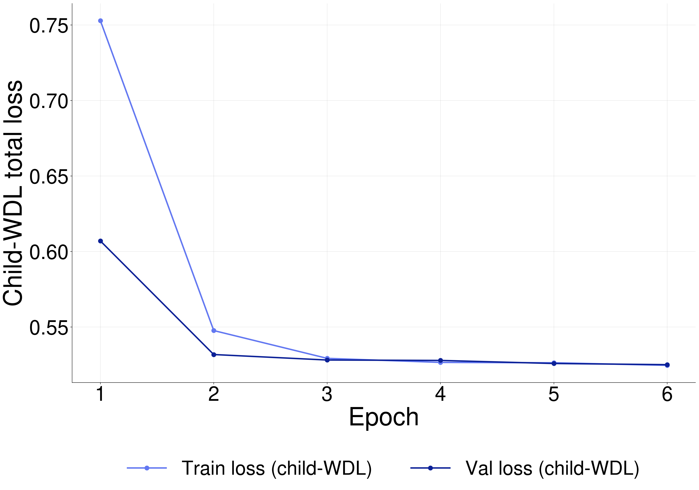

Child-WDL encoder pretraining: loss drops fast, then hits a real ceiling (train loss 0.5158→0.5157 over epochs 20-30) — genuine objective ceiling, not undertraining (see E3).

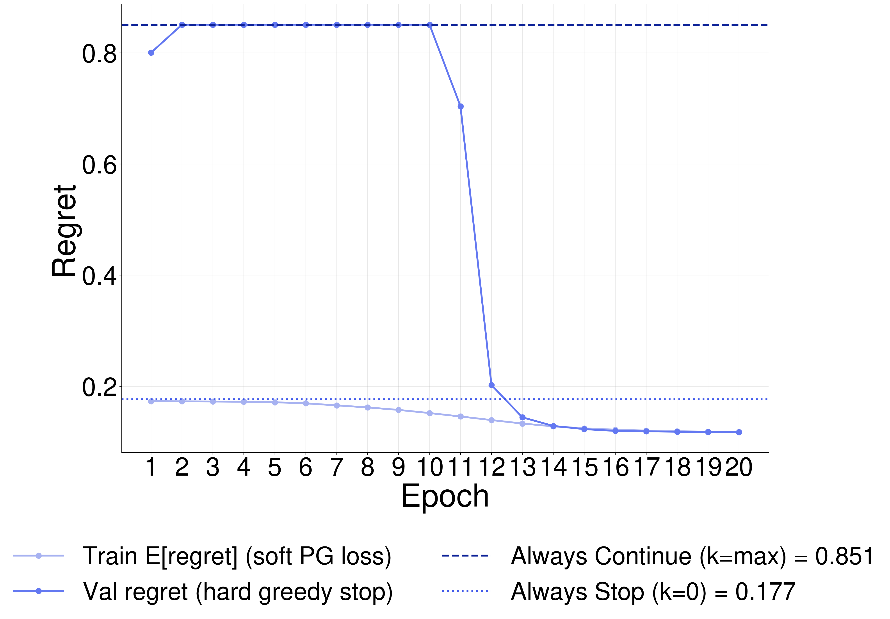

Production PG controller, full 20-epoch run: regret collapses from 0.80 (near "Always Continue") to 0.1175, crossing below SingleHalt* by epoch ~14 — the controller is learning a real policy, not memorizing a trivial fixed one.

**Decision (2026-07-08): 6 epochs is enough for the child-WDL encoder.** The plateau starts at epoch 2 and is still flat at epoch 30 (0.5158→0.5157) — confirmed genuine ceiling, not undertraining. No further extension planned; production encoder pretraining stays at 6 epochs.

---

**Goal:** a model that beats FixedHalt* (SingleHalt*) under *any* cost regime, not just the single validated point (`maintenance_scale=0, time_lambda=0.01`).

## T1 — graphviz tree shape sanity (5 examples)

**Procedure**: from the real argmax-filtered validation set, pick 5 trees at argmax≈p10 (~3-4), p50 (~6), p75 (~11), p90 (~19), and max (~89) — deliberately spanning the spread, not random, so shape-vs-argmax correlation is visible. Render each via graphviz: node color/size encodes backed-up Q or visit count, edges labeled with UCI move.

**Red flags**: (a) a duplicate FEN appearing at two different nodes (transposition/generation bug); (b) a fully linear chain with zero branching on any of the 5; (c) one child capturing most of the visit budget within the first handful of expansions, before enough information could justify it (FPU/prior bug signature); (d) a move that looks illegal given its parent FEN (correctness bug, not just a shape issue).

**Result (2026-07-08):** all 5 example trees pass illegal-move, linear-chain, and root-dominance checks. One flag: the `max` example (argmax=89, the deepest/widest outlier in the whole validation set) fails the duplicate-FEN check — **133 duplicate FEN pairs** found within that single tree (transposition — the same position reached via different move orders at two different nodes). This is a real, genuine chess phenomenon, not necessarily a generation bug; the 4 non-extreme examples (p10/p50/p75/p90) all pass clean. Raw check output: `outputs/figures/minply15_maxply75/diagnosis/t1_summary.json`.

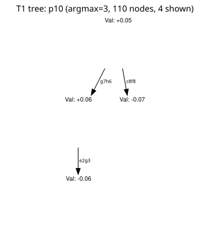
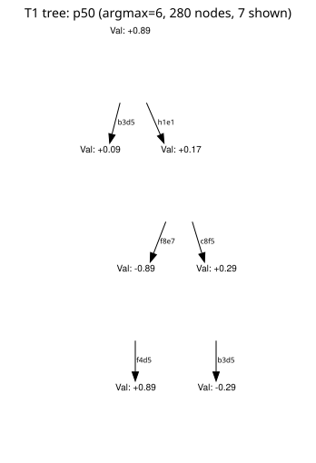
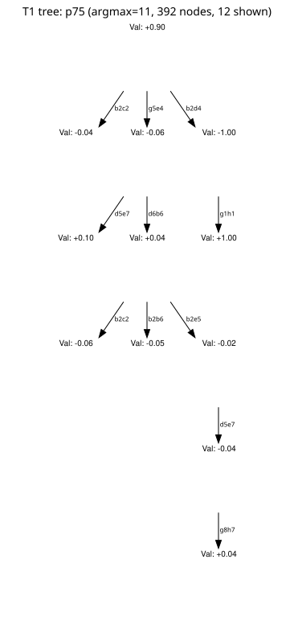
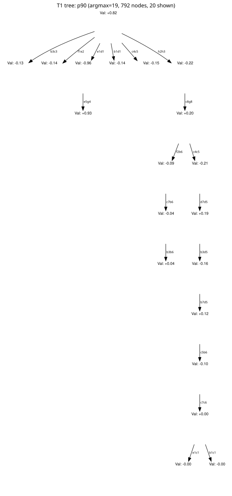
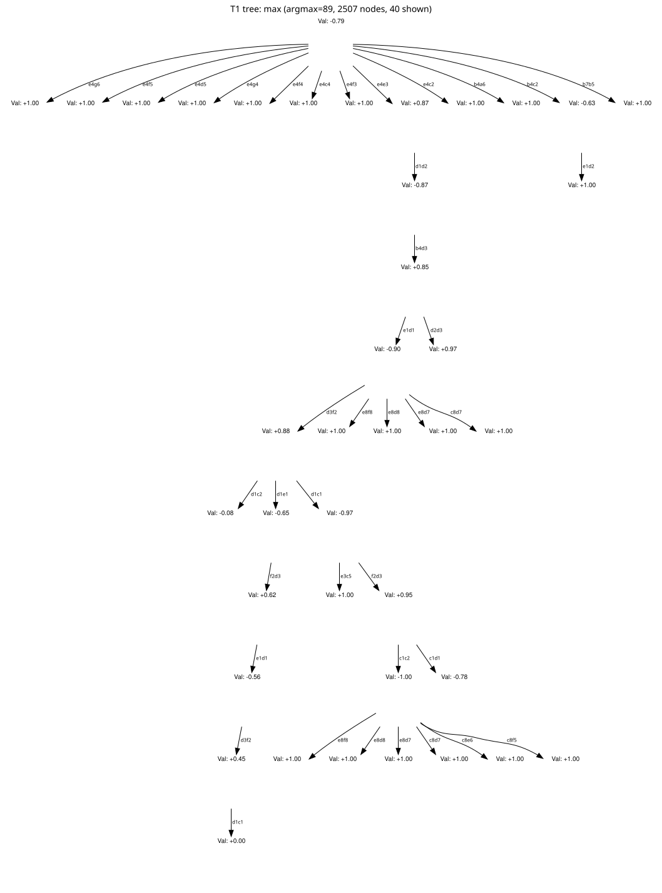

## T2 — histograms: depth, width, optimal stopping step

**Procedure**: pull `heights`/`widths`/argmax for all ~5,599 validation episodes. One 1×3 panel figure: depth histogram, width histogram, argmax histogram, with red-flag thresholds marked as vertical lines.

**Red flags**: depth piled at ≤2 (breadth-starvation); width pinned at the legal-move ceiling at every depth (no commitment) or pinned at 1 (tunnel vision); argmax piled near the 96-expansion budget ceiling (right-censoring).

**Result (2026-07-08, n=5,599 validation episodes):** all red flags clear. Depth: median=12, p10=7, p90=18, **0.0% at depth≤2**. Width: median=709, p10=408, p90=1433 — much wider than deep (this asymmetry motivated T3's pruning companion). Argmax: median=6, p10=3, p90=19, max=89, **0.00% at argmax≥90** (no right-censoring).

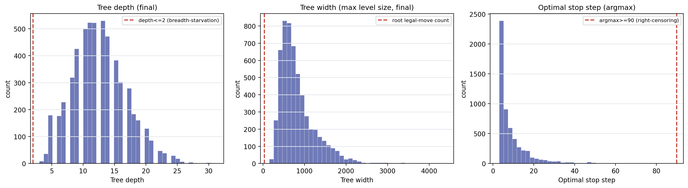

## T3 — quiescence sweep (+ pruning companion, added 2026-07-08)

**Procedure**: generate trees at `sf_search_limit_nodes ∈ {1, 10, 50}` and `prune_epsilon ∈ {off, 0.1, 0.3}` (finalized coarse grids). Per grid point measure generation cost, a reward-noise proxy (mean |Δhalt_reward| between consecutive steps), and argmax>2 yield %.

**Result (2026-07-08, 200 trees/grid-point, bootstrapped CIs):**

- **Quiescence: no significant effect on anything.** Noise proxy, yield%, depth/width, and generation cost all overlap across `{1, 10, 50}`. More per-leaf Stockfish search does not measurably change tree quality in this regime.
- **Pruning: shrinks width but doesn't buy anything else.** ε=0.1 significantly cuts median width (1099→425) but does **not** redirect the freed budget into depth as T2's imbalance suggested (depth actually drops slightly, 8→7); noise proxy gets nominally worse; yield doesn't improve. Combined quiescence+pruning cells show no compounding benefit.
- **Deploy recommendation: keep current defaults** (`sf_search_limit_nodes=1`, no pruning) — no point in this grid showed a significant, clearly-beneficial effect.
- **Related discovery (found while inspecting node data for this sweep): severe value-scale saturation.** 56% of all nodes and 89% of leaf nodes have `|value| ≥ 0.99`. The raw `cp_order` is *not* saturated (continuous, median 268) — the saturation comes entirely from Stockfish's win/loss-probability conversion, a hard step function around ~300cp (0% saturated below, 94% above; 60% of all nodes sit above it). This plausibly explains why quiescence showed no effect — the problem is a miscalibrated *conversion curve*, not insufficient search. **Flagged as the most promising untested lever for next session** (see Next steps below) — never executed: relabel via `tanh(cp_order/T)`, replay PUCT's backup over the existing tree topology holding shape fixed, recheck regret/headroom.

Raw grid data: `/scratch/gpfs/GRIFFITHS/hl4291/lmcos/minply15_maxply75/diagnosis/t3/t3_grid_results.json`, `t3_bootstrap_ci.json`.

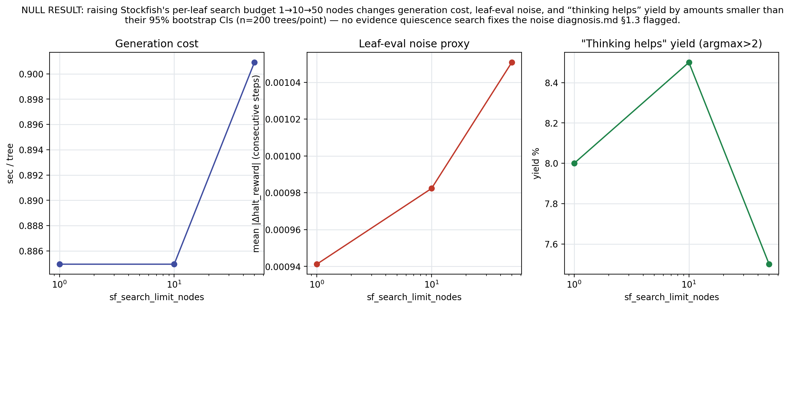
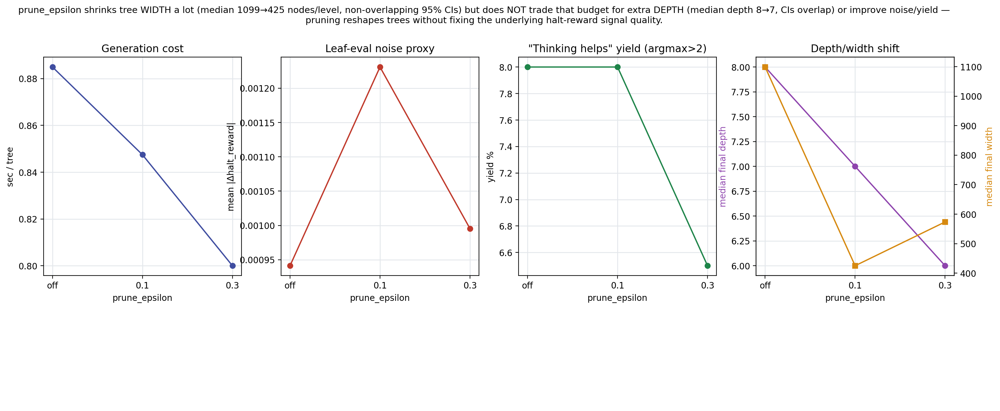

## E2 — stats-decodability from z_t

**Procedure**: predict each of `{n_nodes, height, width}` from `z_t` alone (frozen child-WDL encoder), on the same materialized validation cache. Trivial upper bound (stats predicting themselves, R²≈1) as reference.

**Result (2026-07-08, job `10831415`, full validation split, n_test=161,280 steps):** z_t MLP R² = 0.068 (n_nodes), 0.131 (height), 0.170 (width); trivial upper bound ≈1.0; shuffle floor ≈0. z_t retains a real but weak-to-moderate echo of tree shape — well above noise, far below the ceiling. Full numbers: `outputs/figures/minply15_maxply75/diagnosis/e2_zt_stats_decodability.csv`.

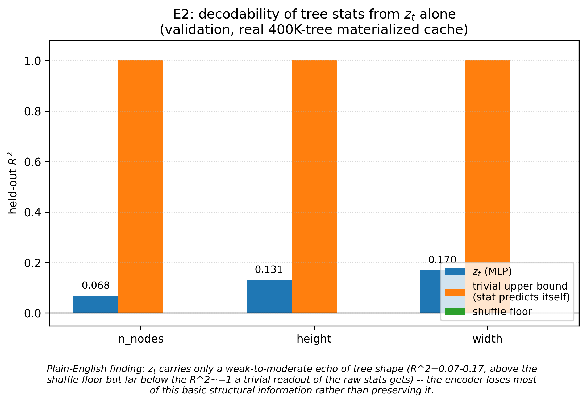

## E3 — synthesis

**Result (2026-07-08):** E1 (proof-of-principle above) = genuine plateau. E2 = partial decodability (0.07-0.17). Diagnosis: **objective/architecture mismatch with partial information loss** — the child-WDL pretraining objective has hit a real ceiling AND doesn't preserve even basic structural stats a trivial readout gets for free. This motivated unfreezing the encoder and training it end-to-end against the actual controller objective — see Z below.

## S1 — stats ablation

**Confirmed stat vector: `{n_nodes, height, width}` (structural only — no `current_value`).** `current_value` (the search-consolidated `halt_reward` at the current step) was excluded: it's a value-backup result, not a shape statistic, and it's architecturally unavailable to z_t-Controller (`CONTROLLER_INPUT_NAMES = ("z_t", "N_t", "T_t")` in `cts/models/mc.py` has no slot for it) — including it would compare "structure-plus-the-answer" against z_t rather than structure alone.

**Result (2026-07-08, job `10832187`, full validation split, n_fit=3919/n_eval=1680, `time_mode=linear, time_lambda=0.01, maintenance_scale=0.0`):** Stats-Controller = `{n_nodes, height, width}`, regret = **0.1138 [0.1061, 0.1218]**, beating SingleHalt* (k=10) = 0.1204 [0.1129, 0.1286]. Matches the original `diagnosis.md` baseline (0.114) — a good consistency check. Full numbers: `outputs/figures/minply15_maxply75/diagnosis/s1_stats_ablation.csv`.

**Significance-tested (2026-07-08, `SIG-S`): CONFIRMED.** Paired bootstrap 95% CI on the regret difference (SingleHalt* − Stats): mean +0.0067, CI [+0.0026, +0.0112], excludes 0. Stats-Controller really does beat SingleHalt\* at this regime, not just on point estimates. Full record: [`sig_significance.md`](sig_significance.md).

## Z — end-to-end joint training (active investigation)

Unfreezing and jointly training the encoder against the real controller objective, gated by E3's diagnosis. Timing (Z0) showed real (I/O-inclusive) throughput ~40 min/epoch, which comfortably fit the full-size architecture (`d_embed=32`) within a capped-epoch budget, so no architecture shrink was needed. Built a training loop reusing `ControllerEpisodeDataset` + `collate_controller_episodes` + unfrozen `MetaController` + `expected_regret_batched` loss (job `10831440`), ran 1 epoch (`pg_max_episodes=15000` cap, ~25 min): train_loss=0.1714, val_loss=0.1767. Checkpoints at `/scratch/gpfs/GRIFFITHS/hl4291/lmcos/minply15_maxply75/diagnosis/z2_e2e_controller/`.

**Comparison result (2026-07-08, `maintenance_scale=0`, reproduced twice: 0.1166 then 0.1161):**

| method | regret |
|---|---|
| SingleHalt* (k=10) | 0.1204 |
| Stats-Controller | 0.1137 |
| original (frozen-encoder) z_t-Controller | 0.1207 |
| **e2e z_t-Controller (1 epoch)** | **0.1161–0.1166** |

**Headline: after just 1 epoch of joint (encoder-unfrozen) training, e2e z_t's point estimate beats SingleHalt\* and the original frozen z_t — the first regime all session where a learned representation outperforms a fixed-threshold baseline — though it's still short of Stats-Controller.**

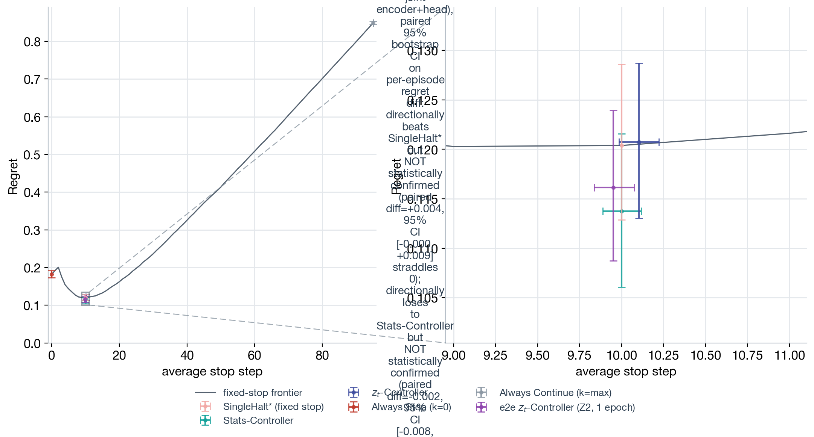

**Updated 2026-07-08 — all four open items below are now resolved or superseded, see [`sig_significance.md`](sig_significance.md), [`regime_select.md`](regime_select.md), [`cp_recalibration.md`](cp_recalibration.md):**
1. **Statistical significance: checked, PARTIALLY confirmed.** e2e z_t significantly beats the *original frozen* z_t (paired diff +0.0046, CI [+0.0000,+0.0091], excludes 0) — real progress. But it does **not yet** significantly beat SingleHalt* (paired diff +0.0042, CI [−0.0004,+0.0090], straddles 0 — close, but the earlier "beats SingleHalt*" claim was a point-estimate read that doesn't survive a proper paired test at 1 epoch's sample size) or Stats-Controller. More training is the natural next lever — see **Agent 2** in Phase 2 below.
2. **The decodability-comparison plot**: rendered correctly, no bug — `evaluate_e2e_z3.py`'s fix works. e2e z_t decodes R(t) at R²=0.111 vs. frozen z_t's 0.013.
3. **The `maintenance_scale∈{0.05,0.1}` collapse**: root-caused by a full grid-search (352 points, 102 meaningful) — not a bug, those values are just outside the meaningful region for this population; the meaningful region turns out to be nonzero-maintenance-friendly but at much smaller magnitudes (roughly `maintenance_scale ≲ 0.005`) than what was swept before. Raw grid: `outputs/figures/minply15_maxply75/diagnosis/regime_select_results.json`.
4. **CP (value-scale recalibration, shape-frozen replay)**: done, **negative**. Headroom does not track desaturation monotonically; the most-desaturated setting (T=600) has significantly *less* headroom than baseline, not more. `CP-RETRAIN` (retraining the encoder on relabeled-only data) is not justified by this evidence — but a real regeneration-from-scratch test is the only way to actually test whether corrected values change search *allocation*, which the replay-only probe structurally cannot see. That's **Agent 3** in Phase 2 below.

Only 1 epoch of e2e training has run — continuing it, with proper caveats about how far it actually gets, is **Agent 2** below.

## F — final synthesis

**Not run — superseded by Phase 2 below**, which is a bigger bet than continuing to refine `F` on the current corpus alone: two of Phase 2's three tracks (ysagiv trees, real CP regeneration) are new data/generation, not just new analysis of what we already have.

---

## Diagnosis phase — closed 2026-07-08

The 4-agent diagnostic wave (`SIG`, `CP`, `REGIME`, `G`) that followed the original DAG above is done. Summary (full detail in each linked file):

| track | result | file |
|---|---|---|
| `SIG-S` | Stats-Controller **significantly** beats SingleHalt* (paired diff +0.0067, CI excludes 0) | [`sig_significance.md`](sig_significance.md) |
| `SIG-Z` | e2e z_t significantly beats the *original frozen* z_t, but **not yet** SingleHalt* or Stats (CI straddles 0 at 1 epoch) | [`sig_significance.md`](sig_significance.md) |
| `REGIME` | 352-point grid over `time_lambda × maintenance_scale`; 102 meaningful (non-degenerate `k*`). Root-causes the `m∈{0.05,0.1}` collapse: those values are just outside the meaningful region, which is nonzero-maintenance-friendly but only at `maintenance_scale ≲ 0.005` | [`regime_select.md`](regime_select.md) (write-up pending; raw grid at `outputs/figures/minply15_maxply75/diagnosis/regime_select_results.json`) |
| `CP` | Negative — desaturating values (shape-frozen replay) does not create headroom; most-desaturated setting is significantly *worse*, not better. `CP-RETRAIN` not justified by this evidence alone | [`cp_recalibration.md`](cp_recalibration.md) |
| `G` | Cleanup done — `normative/`/`trees/` folders live, encoder + controller plots simplified/restyled/relocated, `engine_analysis_pwin/cp` disabled in the pipeline | [`g_cleanup.md`](g_cleanup.md) |

**Dropped, superseded, not revisited:** the S2/S3 track (pretrain an encoder directly against the S1-confirmed stat vector, then swap it in) — Z's e2e success already tests the same question more directly.

---

## Phase 2 — three parallel tracks (drafted 2026-07-08, not yet dispatched — see Open questions below)

The diagnosis phase answered "is anything wrong with the current setup" (mostly no, modulo the value-saturation finding, which a *shape-frozen* test couldn't resolve either way). Phase 2 is three independent bets on what actually moves the needle next, run in parallel — none blocks another:

```
Agent 1 (ysagiv/human_trees)         Agent 2 (push our own trees)         Agent 3 (real CP regen + prune)
─────────────────────────────        ─────────────────────────────       ─────────────────────────────────
sanity-check sample                  pick up existing checkpoint          pick T (arbitrary, proposed: 300)
   │  (T1/T2-style: depth/width/     (e2e Z2, 1 epoch OR production       + prune_mode=relative/epsilon=0.1
   │   argmax hist, dup-FEN,          20-epoch PG — open question)        (already-validated T3 knobs)
   │   illegal-move checks)             │                                     │
   ▼                                    ▼                                     ▼
filter (PUCT-stability ∩ monotone    continue training, more epochs       add value_feature=tanh_cp(T) to
 OR our own argmax>2 — open           (Z0's ~40min/epoch budget)           treegen (parsers.py/build_tree.py)
 question) → clean subset               │                                     │
   │                                    ▼                                     ▼
   ▼                                 paired-sig check vs AlwaysStop        gen_trees → argmax_filter →
pack → train encoder → pack_root      (expected win, low bar) AND         pack_trees → train_encoder →
 → train_readout_pg                   vs SingleHalt* (real bar, not        pack_root → train_readout_pg →
   │                                   yet cleared)                        eval  (submit_all.sh, new value
   ▼                                     │                                 fn baked in from generation,
eval (frontier + decodability,           ▼                                 not post-hoc replay)
 at REGIME's confirmed regime(s),     report honestly: which bar             │
 not just m=0)                        cleared, with sophistication           ▼
   │                                  caveat if only AlwaysStop           compare vs WDL-baseline eval —
   ▼                                     │                                does regenerating under
ysagiv_trees.md + plot                   ▼                                corrected values (which CAN
                                       our_trees_continued.md + plot      change search allocation, unlike
                                                                          CP's replay) change the story?
                                                                             │
                                                                             ▼
                                                                          cp_regen.md + plot
```

### Agent 1 — ysagiv `human_trees` (Leela-generated, real human-game positions)

**Why**: our own `puctvalue_md36` corpus was flagged by T3 as saturating/possibly low-quality; ysagiv's `human_trees` is a separate, independently-generated corpus (lc0/Leela search on 2023 human-game root FENs, not our Stockfish-driven generation) that may not share the same pathology. If it doesn't, it's both a sanity check on whether the "z_t barely beats baselines" story is corpus-specific, and a path to a real result on better-quality data.

**Where**: `/scratch/gpfs/GRIFFITHS/ysagiv/chess/CTS/data/human_trees` — confirmed to exist, **1,078,585** `.pt` files, format `cts_raw_pretrain_example_v5`. Confirmed (via a real sample load) to use the **same CSR tree schema** our own pipeline expects (`parent_index`, `child_ptr`, `children_index`, `is_expanded`, `is_terminal`, `depth`, `node_features`/`feature_names` incl. `value`/`wdl_*`, `edge_wdl_targets`, `oracle_root_q_trace`, etc.) — this is not a format-conversion job, it's a "point the existing pipeline at a different corpus" job. In fact `src/cts/data/preprocess_gnn/pack.py` and `src/cts/data/preprocess_mc/pack.py` already **default** `split_root`/`output_root` to ysagiv paths (`.../pretrain_split`, `.../pretrain_packed`, `.../controller_packed`) — this pipeline was originally built around this exact corpus before our own config overrode it. `src/cts/data/filter_trees_by_trace.py` already implements a quality filter for this exact population (PUCT-stability ∩ monotone-convergence, empirically ~16% intersection survival on an earlier 405K slice — note the directory now has ~1.08M trees, more than that 405K, so this ratio should be re-verified, not assumed current) — default `trees_dir` already points at `human_trees`. **Caution**: `preprocess_gnn/split.py`'s own default `source_root` points at `.../generated_trees`, which a past investigation found empty/stale — do not use that default, point explicitly at `human_trees`.

**Steps**: (1) sanity-check a sample the same way T1/T2 did for our own corpus (depth/width/argmax histograms, duplicate-FEN check, illegal-move check) — proof this corpus isn't degenerate before spending real compute on it; (2) apply a quality filter (see Open Questions — which one) to get a clean training subset; (3) if non-degenerate, pack → train the GNN encoder → pack_root → train_readout_pg on that subset (smoke-scale first, per Operating Principles); (4) run the *same* eval code (frontier + decodability, SingleHalt*/Stats-Controller/z_t-Controller) used throughout this investigation, at regime(s) drawn from `REGIME`'s confirmed set, not just `m=0`; (5) write `ysagiv_trees.md`.

**Proof of success (plot)**: a T1/T2-style sanity panel, plus the standard frontier plot on this corpus.

### Agent 2 — push our own corpus further (de-risked framing)

**Why**: `Z`'s e2e training already significantly beats the *original frozen* z_t and is close on SingleHalt* (CI [−0.0004, +0.0090], barely not significant) after just 1 epoch. `CP` says relabeling alone won't help. The direct next lever, cheap and already-scoped by `Z0`'s timing (~40 min/epoch), is just more epochs.

**Explicit reframing, per direct instruction**: report this honestly regardless of outcome. The floor is "beats AlwaysStop" — already true, already known, and on its own **not a sophisticated result** (a policy that does anything non-random clears that bar) — say so plainly if that's as far as it gets, don't oversell it. The real target is a *significant* paired win over SingleHalt*, which `SIG-Z` showed is close but not yet there. Report whichever bar is actually cleared, with the sophistication caveat attached if it's only the low one.

**Steps**: (1) continue training past 1 epoch (see Open Questions — which checkpoint) using `Z0`'s established throughput budget; (2) at each checkpoint (or a few checkpoints across epochs), run the paired-bootstrap significance check (`SIG`'s methodology) against both AlwaysStop and SingleHalt*, at regime(s) from `REGIME`'s confirmed set; (3) write `our_trees_continued.md` with the training curve and a paired-significance table across epochs, honest about which bar is cleared.

**Proof of success (plot)**: loss/regret-vs-epoch curve (extending the existing one), plus paired-diff CIs plotted per epoch checkpoint so the "when does it cross into significance, if ever" question is visually answered, not just asserted.

### Agent 3 — CP done for real: regenerate under corrected values + prune

**Why**: `CP`'s replay-only test couldn't answer the question that actually matters — does correcting the value scale change what PUCT *chooses to explore*, not just how an already-fixed tree gets scored. The only way to test that is to actually regenerate trees under the new value function and run them through the real pipeline.

**T (temperature)**: per direct instruction, arbitrary — proposing **T=300** (real desaturation, unlike T=100 which was *more* saturating than baseline in `CP`'s sweep; a null, not a significantly-negative, result in the replay test, unlike T=600) — but this is a low-stakes pick, open to override (see Open Questions).

**Pruning**: bake in `treegen.prune_mode: relative`, `prune_epsilon: 0.1` from the start — these are existing, already-validated knobs (`build_tree.py`'s `prune_epsilon`/`prune_mode` fields; T3 already showed ε=0.1 cuts median width 1099→425 with no yield cost) — directly addresses the "keep the tree from getting unwieldy" concern, and matters doubly here since `REGIME` found the meaningful `maintenance_scale` region is tiny (≲0.005) — smaller, pruned trees change the effective node-count-driven cost too, so this isn't just a size concern, it interacts with which regimes end up meaningful for *this* corpus.

**Steps**: (1) add a temperature-scaled `tanh(cp_order/T)` value option to real generation — likely a new `value_feature` variant (config knob already exists, currently `value_feature: value`; the actual value computation lives in `src/cts/core/providers/parsers.py`/`stockfish.py`, consumed by `build_tree.py`) rather than a new mechanism from scratch; (2) generate a fresh corpus with this value function **and** the pruning knobs above, at a smoke-scale sample first, not the full 400K (see Open Questions — starting scale); (3) run the *real* pipeline end to end: `filter_and_sample → gen_trees → argmax_filter → pack_trees → train_encoder → pack_root → train_readout_pg → eval` (`slurm/pipeline/submit_all.sh` or a `RUN_VARIANTS=` branch); (4) compare against the existing WDL-baseline eval numbers — does a real regeneration (which *can* change search allocation, unlike `CP`'s replay) change the regret/headroom story `CP` found negative?; (5) write `cp_regen.md`.

**Proof of success (plot)**: T1/T2-style shape panel on the new corpus (to see if tree shape actually differs from the WDL-baseline corpus — the thing the replay-only test couldn't show), plus the standard frontier plot compared side-by-side with the WDL baseline.

### Open questions before dispatch — resolved 2026-07-08

1. **Agent 1's filter — corrected after initial dispatch**: run **both** our own `argmax>2` filter **and** the xaba-exclusion filter (`exclude_xaba` in `src/cts/data/preprocess_mc/pack.py` — drops trees whose root-best-move trace matches the "X*AB*A" churn motif) **head-to-head**, not just argmax>2 alone. Explicitly **not** the monotone-convergence filter (too strict) — neither alone nor intersected with anything.
2. **Agent 2's checkpoint**: **both, in parallel** — continue the e2e Z2 checkpoint (encoder-unfrozen, already paired-tested by `SIG-Z`) *and* the production 20-epoch PG controller (point-estimate-only training curve so far, never paired-tested, lineage/architecture relative to Z2 to be confirmed by the agent) as two independent sub-lines, both reported in `our_trees_continued.md`.
3. **Agent 3's T and scale**: **T=300, smoke-scale first** (similar order to `CP`'s ~16K-raw/1.1K-filtered scale) before deciding whether to commit to a full-corpus regeneration.

**Two hard constraints added after initial dispatch (apply to Agent 1 throughout):**
- **Never write to or modify `/scratch/gpfs/GRIFFITHS/ysagiv/`** — that whole tree (including `human_trees` and the `pretrain_split`/`pretrain_packed`/`controller_packed` paths some scripts default to) is read-only source data owned by someone else. All split/pack/derived outputs go under `/scratch/gpfs/GRIFFITHS/hl4291/lmcos/...` instead — the scripts' own output-path defaults must be overridden, not used as-is.
- **Figures go under `outputs/figures/ysagiv/`**, not nested under `outputs/figures/minply15_maxply75/` (that path is reserved for our own `puctvalue_md36` corpus).

All three agents launched in parallel; Agent 1 was corrected via follow-up message shortly after dispatch (see above) once these constraints were finalized.
