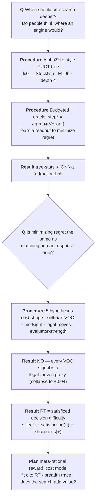

Meta-control of tree search · human deliberation time

# When — and how — ought one to think?

We build a chess tree search, ask when it should stop, then ask whether that explains <em>when people actually think</em>. It doesn't — and chasing why yields a meta-rational account.

SF-2000 search trees on 2023 human-game FENs · ~63k filtered positions · ~65k joined human moves.

<!--
Source: reports/treesearch.md (R-TREESEARCH). Linear narrative: question -> planning box (PUCT, lc0->SF) ->
meta-control (regret; tree-stats > GNN-z) -> pivot (regret != RT) -> 5 hypotheses -> finding (satisficed
decision difficulty) -> model + Q1/Q2 + plan. Figures: /figures/lmcos_tiny/. Tree-growth animation: <TreeGrowth/>.
-->

---
layout: default
class: mdl-slide
---

The mapWhat we tried, found, and followed up on

  
Each <strong>Question</strong> node opens a junction; a <strong>Procedure</strong> resolves it; a <strong>Result</strong> either routes onward or closes a branch. The next slides zoom into each.

---
layout: default
class: mdl-slide
---

Junction 1 · the planning boxHow do we model "searching"?

  
We grow an <strong>AlphaZero-style PUCT tree</strong> — <strong>no rollouts</strong>; a heuristic values each node, and a selector chooses what to expand. How does the selector shape the tree?

  <TreeGrowth />

  
Two heads <strong>prior</strong> P(child) weights only <em>which child to visit</em> (exploration); <strong>value</strong> is backed up from leaves (what a node is worth). They are different things.

  
With <strong>uniform priors</strong> PUCT reduces to <strong>UCB</strong> — so we are already running a heuristic best-first search with a UCT selector, breadth-leaning early. (Q1 later: we may not need a new generator at all.)

---
layout: default
class: mdl-slide
---

  

    

      
Junction 2 · the evaluatorWe swapped lc0 → Stockfish

      
Choosing lc0's heads as the evaluator was somewhat arbitrary. Stockfish is ~1000× faster on CPU — so we swapped it in. What changed?

      <table class="mdl-table mdl-table--sm" style="margin-top:.3rem">
        <thead><tr><th></th><th>prior (exploration)</th><th>value (node)</th></tr></thead>
        <tbody>
          <tr><td><strong>lc0</strong></td><td>policy head (informative)</td><td>value head (WDL)</td></tr>
          <tr><td><strong>Stockfish</strong></td><td><strong>uniform</strong> (α-β has no policy head)</td><td><strong>WDL</strong> from N=100-node search</td></tr>
        </tbody>
      </table>
      
Three knobs <strong>N</strong>=leaf eval nodes (the "gut" — <em>matters</em>, n1≠n100) · <strong>M</strong>=96 expansions (the planning) · <strong>UCI_Elo</strong> (<em>no-op</em> — we read the eval, not the played move).

      
Materially: the value is now <strong>WDL/win-prob</strong> (not centipawns), and the prior went <strong>uniform</strong> — which is exactly why the search became breadth-leaning UCB.

    

    

      <LeelaSearchLoop />
      
The base planner (loop): board → search → value/policy. We replace the engine inside, not the loop.

    

  

---
layout: default
class: mdl-slide
---

Junction 3 · meta-controlWhen should the search stop?

  
A budgeted-oracle DP gives the <strong>optimal stop step</strong> step* = argmaxs[V(s) − cost(s)], and <strong>regret = reward − cost</strong>. Blind rules anchor the scale; a learned readout should beat them:

  

    
A

Always-stop

commit at step 0 — never think

    
N

Never-stop

use the full budget M — always think to the end

    
θ

Fraction-θ*

stop at a fixed fraction θ·M (one parameter)

    
★

Learned readout

GNN-z (embedding) vs tree-stats [height, width, n_nodes]

  

  

    

regret vs compute — the readouts beat the blind rules

    

tree-stats PG ≻ GNN-z — raw structure beats the learned embedding

  

  
<strong>Result:</strong> the meta-control problem is solvable — but low regret is <em>self-consistency</em>, not a match to people. So: is regret even the right target?

---
layout: default
class: mdl-slide
---

  

    

      
The pivotDoes any of this match human think time?

      
We correlate every signal with human log response time. The landscape is blunt:

      

        <ul>
          <li><strong># legal moves (size): +0.31</strong> — the dominant driver.</li>
          <li><strong>fraction of good moves (satisfaction): −0.31</strong> — equal and opposite.</li>
          <li>every value-of-computation signal (regret, step*, softmax-VOC): <strong>+0.12 … +0.16</strong>.</li>
          <li>the causal controller: <strong>≈ 0</strong>.</li>
        </ul>
      

      
<strong>Result:</strong> our <em>measure</em> of optimal stop-time doesn't match human RT. Not "normativity fails" — the model is mis-specified. The next junction enumerates <em>why</em>.

    

    

      
      
What predicts human RT (n≈65k). blue = problem size · red = satisfaction · grey = value-of-computation.

    

  

---
layout: default
class: mdl-slide
---

Junction 4 · the hypothesesWhy doesn't value-of-computation track RT?

  

    
4a

Wrong cost shape?

Sweep it → <strong>no</strong>. Regret is a monotone transform of Gain (position-independent cost); step* swings but tops at +0.12.

    
4b

No uncertainty? (softmax-VOC)

Re-grade a softmax-τ policy on deep values: early flat ⇒ averages good+bad ⇒ low; search <em>sharpens</em> ⇒ value rises. → <strong>recovers</strong> the argmax value (~+0.16), doesn't beat it.

    
4c

Hindsight asymmetry?

step* knows the future; a <em>causal</em> halter doesn't. → <strong>no</strong> (halter ≈ 0, not better than the oracle).

    
4d

Just a legal-moves proxy?

<strong>YES.</strong> Partial out legal-moves ⇒ every value/VOC/step* signal collapses to ≈+0.04; legal-moves survives.

    
4e

Evaluator too strong (squashed)?

Vary N → <strong>N matters</strong> (n1≠n100); separately UCI_Elo is a no-op ⇒ vary the <em>search</em>, not UCI_Elo.

  

  

    

4a · cost sweep

    

4b · softmax-VOC by τ

    

4d · the collapse

  

---
layout: default
class: mdl-slide
---

  

    

      
The findingRT is satisficed decision difficulty

      
The pure-size reading is too dumb. The <strong>good</strong>-moves term flips the sign of the <strong>all</strong>-moves term:

      
RT size(+0.31) − satisfaction(−0.31) + sharpness(+0.24)

      
More <em>options</em> ⇒ slower; more <em>good</em> options ⇒ faster. And — the clincher — <strong>satisfaction reshapes the whole RT-vs-n curve</strong>: high-satisfaction positions <em>plateau low</em> (stop once good-enough), low-satisfaction stay steep.

      
<strong>That is satisficing</strong>, made visible — not bare problem-size (Hick's law), but a stop-when-good-enough rule, which is exactly what a meta-rational model predicts.

    

    

      
      
The sign flip.

      
      
The plateau-shift = the satisficing signature.

    

  

---
layout: default
class: mdl-slide
---

The model & the planA meta-rational account, and two open questions

  
Deliberation time = <strong>optimal compute under a cost</strong>: grow a consideration set while marginal VOC &gt; c, else <strong>satisfice</strong>. Objective = reward − cost = −regret; <strong>~1–2 parameters</strong> (c, prior noise). Fit c to RT; how much of the structure does it reproduce vs the ±0.31 ceiling? (current 1-param: +0.16.)

  

    
Q1

Are we already doing best-first search?

<strong>Yes</strong> — uniform-prior PUCT ≈ UCB, breadth-leaning. Read the construal off the <em>existing</em> trace; lever = selector + per-move cost, not a new generator.

    
Q2

Does the tree search add value?

<em>Open.</em> We stressed the prior (N) but not the search (M). Provisional: it reorders heavily (rank-corr ≈0.33, argmax settles ~step 78/95) — but the value-add is in <em>depth</em>, while RT is <em>breadth</em>-driven.

  

  

    
1

P-FIT

fit c to RT on the breadth-inclusion trace + satisficing stop — the headline number

    
2

Q2-check

1-ply heuristic vs M-converged: is the tree-building the weak link?

    
3

selector / prior

swap UCT→optimism; add a real policy prior — both on existing trees

  

  
If a 1–2-parameter meta-RL reaches the ±0.31 ceiling with the size/satisfaction/sharpness signatures emerging, we have a parsimonious meta-rational account of <em>when people think</em>.

---
layout: default
class: mdl-slide
---

DefinitionsThe vocabulary in one place

  <table class="mdl-table mdl-table--wide">
    <tbody>
      <tr><td><strong>step* / regret</strong></td><td>step* = argmaxs[V(s) − cost(s)]; regret = oracle_value − return(stop)</td></tr>
      <tr><td><strong>tree-stats</strong></td><td>per-step [height (deepest node), width (max nodes at a depth), n_nodes (total expanded)]</td></tr>
      <tr><td><strong>softmax-VOC</strong></td><td>halt value = Σc softmax(qs,c/τ)·Vdeep(c); benefit of thinking = the sharpening</td></tr>
      <tr><td><strong>size / satisfaction / sharpness</strong></td><td># legal moves / fraction within ε of best / top-1 − top-2 action gap</td></tr>
      <tr><td><strong>N / M / UCI_Elo</strong></td><td>leaf-eval nodes (heuristic) / PUCT expansions (planning) / play handicap (no-op for the eval)</td></tr>
    </tbody>
  </table>
  
Source of truth: <code>reports/treesearch.md</code> (R-TREESEARCH). Figures: <code>lmcos_tiny/analysis/make_rt_figures.py</code> · ρ = Spearman with percentile-bootstrap 95% CIs.

