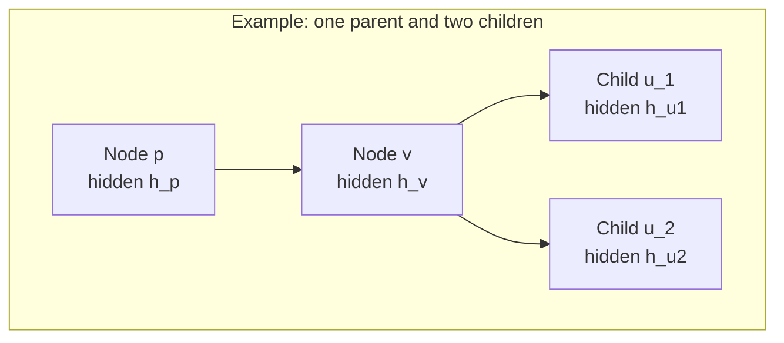
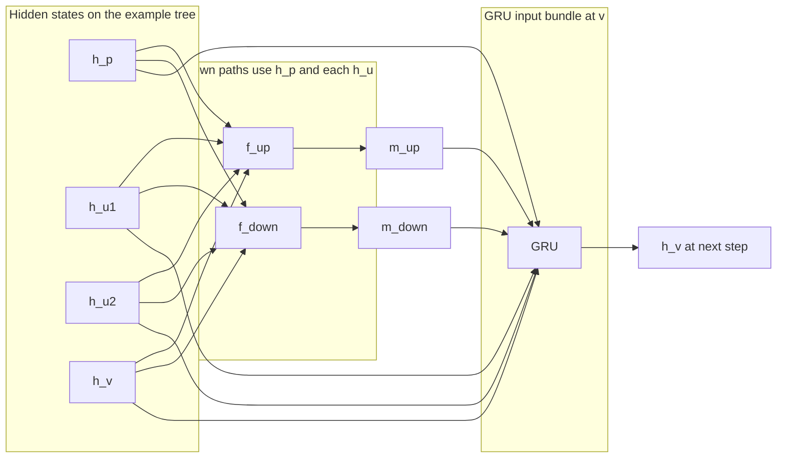
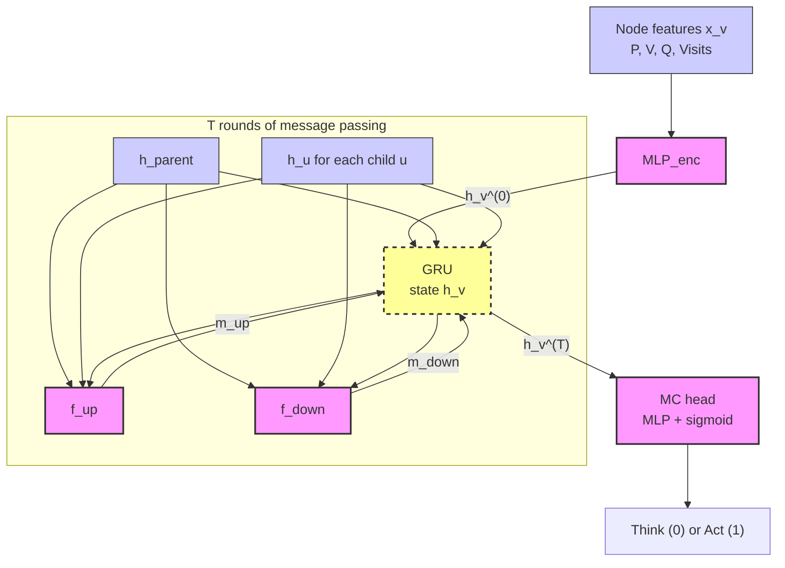

# Project: Chess Meta-control (CMC)

## 1. Objective
To develop a **Meta-Controller (MC)** that manages the trade-off between "thinking" (expanding a Leela Chess Engine search tree) and "acting" (executing a move). The model aims to achieve **Policy Compression**—maximizing win reliability while minimizing computational cost—to mimic human-like reaction times (RT) and resource allocation.

---
## 2. Architecture: Single-Update Tree-GNN
The MC operates over the search tree \(\mathcal{T}\) generated by Leela. At each node \(v\), the update uses the **parent hidden state** \(h_p\) (for \(p = \mathrm{parent}(v)\) when it exists) and **one hidden state per child** \(h_u\) for \(u \in \mathrm{ch}(v)\). Those tensors feed **both** the upward and downward propagation paths **and** the GRU, which also carries the recurrent state \(h_v^{(t)}\). Information is propagated through the tree to a root-level decision head.

### Example topology (parent, focal node, two children)
Edges follow the search tree: parent \(\to v \to\) children. Hidden states \(h_p\), \(h_v\), \(h_{u_1}\), \(h_{u_2}\) live on the corresponding nodes.

### Message passing at \(v\) mapped onto the loop
The same example maps to one round of updates at \(v\): **\(h_p\)** and **\(h_{u_1}, h_{u_2}\)** (and in general every \(h_u\) for \(u \in \mathrm{ch}(v)\)) are inputs to **\(f_{\mathrm{up}}\)** and **\(f_{\mathrm{down}}\)**; their outputs **\(m_{\mathrm{up}}\)** and **\(m_{\mathrm{down}}\)** join **\(h_p\)**, the child states, and **\(h_v^{(t)}\)** in the GRU. For roots, omit \(h_p\) (or use a learned null vector); for leaves, \(\mathrm{ch}(v) = \emptyset\) and the upward path uses an empty set / padding.

### Global module view (per node, \(T\) rounds)
Initial encoding from Leela features is unchanged; the recurrent block matches the loop above: **\(f_{\mathrm{up}}\)** and **\(f_{\mathrm{down}}\)** both receive **\(h_p\)** and **\(\{h_u\}\)** (and \(h_v^{(t)}\)); the GRU consumes **\(h_v^{(t)}\)**, **\(h_p\)**, **\(\{h_u\}\)**, **\(m_{\mathrm{up}}\)**, and **\(m_{\mathrm{down}}\)** (with a fixed-size encoding for the multiset of children, e.g. attention pooling or a small set encoder).

### The Message Passing Protocol
For each node \(v \in \mathcal{T}\), the hidden state \(h_v\) is updated over \(T\) rounds. Write \(p = \mathrm{parent}(v)\), \(\mathrm{ch}(v)\) for the children of \(v\), and \(h_u^{(t)}\) for the child states at round \(t\) (they are updated in the same global schedule as in standard tree message passing).

1.  **Initial encoding:** \(h_v^{(0)} = \mathrm{MLP}_{\mathrm{enc}}(x_v)\), with \(x_v\) from Leela (Value \(V\), Policy \(P\), \(Q\), visits, etc.).
2.  **Upward path** (emphasis on signals from **children**):

    $$m_{\mathrm{up},v}^{(t)} = f_{\mathrm{up}}\!\left(h_v^{(t)},\, h_p^{(t)},\, \{h_u^{(t)}\}_{u \in \mathrm{ch}(v)}\right)$$

    e.g. attention over \(\{h_u\}\) with query \(h_v\) and optional conditioning on \(h_p\).
3.  **Downward path** (emphasis on **parent** context, still using the same tensors):

    $$m_{\mathrm{down},v}^{(t)} = f_{\mathrm{down}}\!\left(h_v^{(t)},\, h_p^{(t)},\, \{h_u^{(t)}\}_{u \in \mathrm{ch}(v)}\right)$$

    e.g. \(\mathrm{MLP}_{\mathrm{down}}\) applied to \(h_p\) and features derived from \(\{h_u\}\) and \(h_v\).
4.  **Unified GRU update:** the cell takes the recurrent state and **explicit** parent and child hiddens, plus the path messages. Let \(\mathrm{Pool}(\cdot)\) denote any fixed-size multiset readout over \(\{h_u\}\) (identity for a fixed small arity in implementation, or attention pooling in general):

    $$h_v^{(t+1)} = \mathrm{GRU}\!\left(h_v^{(t)},\, \left[\,h_p^{(t)};\, \mathrm{Pool}\!\left(\{h_u^{(t)}\}_{u \in \mathrm{ch}(v)}\right);\, m_{\mathrm{up},v}^{(t)};\, m_{\mathrm{down},v}^{(t)}\,\right]\right)$$

    For the **two-child** example above, one may write \(\mathrm{Pool}(h_{u_1}, h_{u_2}) = [\,h_{u_1};\,h_{u_2}\,]\) after ordering, or replace \([\,h_p;\,\mathrm{Pool}(\{h_u\});\,\cdots\,]\) by a single concatenation \([\,h_p;\,h_{u_1};\,h_{u_2};\,m_{\mathrm{up}};\,m_{\mathrm{down}}\,]\) if the GRU input size is fixed by design.

**Two-child instantiation** (\(\mathrm{ch}(v) = \{u_1, u_2\}\)):

$$m_{\mathrm{up}}^{(t)} = f_{\mathrm{up}}\!\left(h_v^{(t)},\, h_p^{(t)},\, h_{u_1}^{(t)},\, h_{u_2}^{(t)}\right), \qquad m_{\mathrm{down}}^{(t)} = f_{\mathrm{down}}\!\left(h_v^{(t)},\, h_p^{(t)},\, h_{u_1}^{(t)},\, h_{u_2}^{(t)}\right)$$

$$h_v^{(t+1)} = \mathrm{GRU}\!\left(h_v^{(t)},\, \left[\,h_p^{(t)};\, h_{u_1}^{(t)};\, h_{u_2}^{(t)};\, m_{\mathrm{up}}^{(t)};\, m_{\mathrm{down}}^{(t)}\,\right]\right)$$

*Boundary cases:* if \(v\) is the root, \(h_p\) is absent or replaced by a learned **\(h_{\varnothing}\)**; if \(v\) is a leaf, \(\{h_u\}\) is empty and \(f_{\mathrm{up}}\), \(f_{\mathrm{down}}\), and the GRU use padding / masks as usual.*

---
## 3. Division of Responsibilities

### **Infrastructure & Integration (Lead: Yotam)**
* **Leela Wrapper:** Interface to pause/resume engine search and extract tree tensors.
* **GNN Core:** Implementation of the unified GRU/Attention logic.
* **RL Training:** Setup of the self-play loop (PPO/Actor-Critic) with a cost-sensitive reward:

    $$R = \text{Outcome} - \lambda \cdot \text{Total Expansions}$$

### **Validation & Psychology (Lead: Jordan)**
* **Baseline Models:**
    * **TreeLSTM:** Bottom-up only (no top-down context).
    * **Log-Entropy Stopping:** Heuristic trigger based on policy \(\pi\) stability.
    * **Linear CP Baseline:** Predicts RT based on centipawn volatility.
* **Human Alignment Metrics:**
    * **RT Regression:** Linear regression of MC "Think" cycles against human Move Times.
    * **Clock Scramble Analysis:** Performance under high-pressure/low-budget regimes.
    * **Feature Analysis:** Correlating "Think" triggers with tactical "Reliability, Volatility, and Controllability."

---
## 4. Development Roadmap
* **Phase 1:** Direct integration (Passing Leela tree tensors to GNN).
* **Phase 2:** RL Training with varied cost penalties (\(\lambda\)).
* **Phase 3:** Psychometric validation against Lichess/FICS human move datasets.
