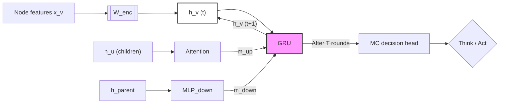

# Project: Chess Meta-control (CMC)

## 1. Objective
To develop a **Meta-Controller (MC)** that manages the trade-off between "thinking" (expanding a Leela Chess Engine search tree) and "acting" (executing a move). The model aims to achieve **Policy Compression**—maximizing win reliability while minimizing computational cost—to mimic human-like reaction times (RT) and resource allocation.

---
## 2. Architecture: Single-Update Tree-GNN

The MC operates over the search tree $\mathcal{T}$ generated by Leela. Information is propagated through the tree to a root-level decision head.

The encoding step is a linear map (weight matrix $W_{\mathrm{enc}}$) applied to $x_v$, matching the usual “MLP first layer” view; the GRU maintains hidden state $h_v$ with a recurrent self-connection.

### The Message Passing Protocol

For each node $v \in \mathcal{T}$, the hidden state $h_v$ is updated via $T$ rounds of message passing:

1.  **Initial encoding:**

    $h_v^{(0)} = \mathrm{MLP}_{\mathrm{enc}}(x_v)$

    where $x_v$ contains node-specific features (Value $V$, Policy $P$, $Q$-values, and visit counts).

2.  **Information aggregation:**

    * **Bottom-Up** — $m_{\mathrm{up}}$:

    $\mathrm{Attention}\!\left(h_v, \{h_u\}_{u \in \mathrm{children}(v)}\right)$ aggregates subtree complexity.

    * **Top-Down** — $m_{\mathrm{down}}$:

    $\mathrm{MLP}_{\mathrm{down}}\!\left(h_{\mathrm{parent}(v)}\right)$ provides root-to-leaf strategic context.

3.  **Unified update:**

    $$
    h_v^{(t+1)} = \mathrm{GRU}\left(h_v^{(t)}, \left[m_{v \leftarrow \mathrm{children}},\, m_{v \leftarrow \mathrm{parent}}\right]\right)
    $$

    *This single-pass integration ensures $h_v$ captures both local tactical depth and global board objectives.*

---
## 3. Division of Responsibilities

### **Infrastructure & Integration (Lead: Yotam)**
* **Leela Wrapper:** Interface to pause/resume engine search and extract tree tensors.
* **GNN Core:** Implementation of the unified GRU/Attention logic.
* **RL Training:** Setup of the self-play loop (PPO/Actor-Critic) with a cost-sensitive reward:

    $$
    R = \text{Outcome} - \lambda \cdot \text{Total Expansions}
    $$

### **Validation & Psychology (Lead: Jordan)**
* **Baseline Models:**
    * **TreeLSTM:** Bottom-up only (no top-down context).
    * **Log-Entropy Stopping:** Heuristic trigger based on policy $\pi$ stability.
    * **Linear CP Baseline:** Predicts RT based on centipawn volatility.
* **Human Alignment Metrics:**
    * **RT Regression:** Linear regression of MC "Think" cycles against human Move Times.
    * **Clock Scramble Analysis:** Performance under high-pressure/low-budget regimes.
    * **Feature Analysis:** Correlating "Think" triggers with tactical "Reliability, Volatility, and Controllability."

---
## 4. Development Roadmap
* **Phase 1:** Direct integration (Passing Leela tree tensors to GNN).
* **Phase 2:** RL Training with varied cost penalties ($\lambda$).
* **Phase 3:** Psychometric validation against Lichess/FICS human move datasets.
