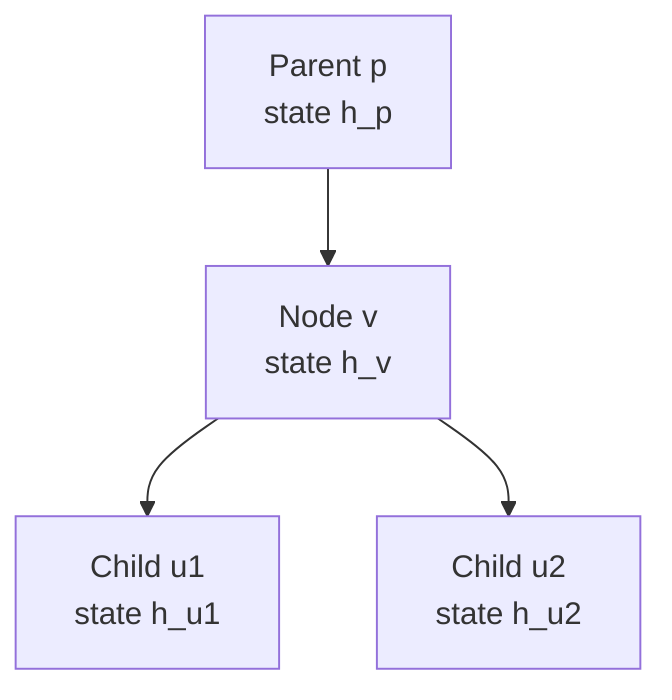
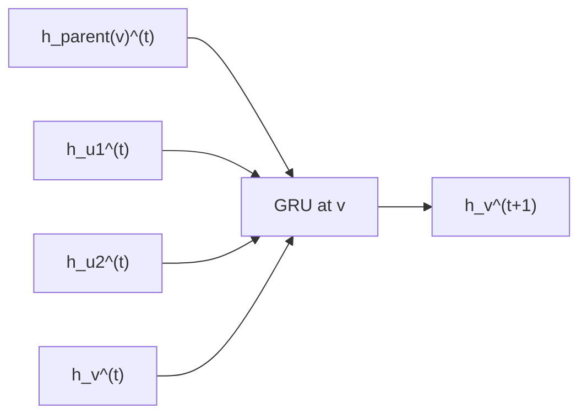
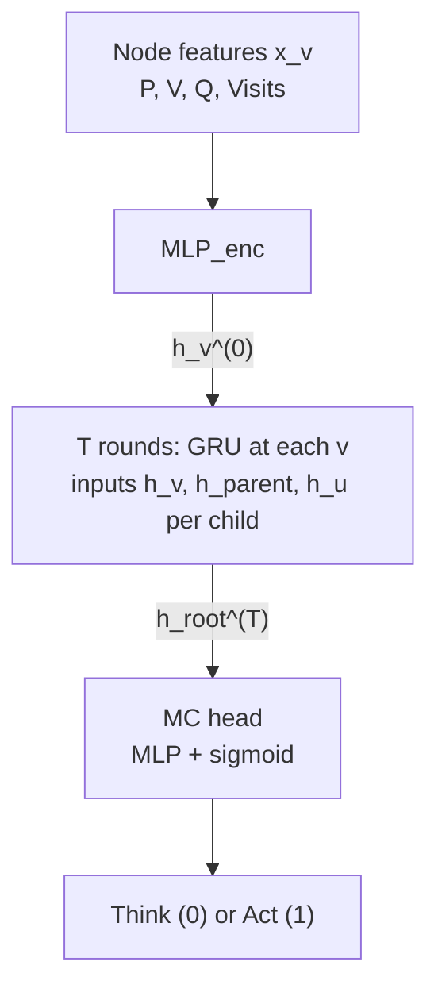

# Project: Chess Meta-control (CMC)

## 1. Objective
To develop a **Meta-Controller (MC)** that manages the trade-off between "thinking" (expanding a Leela Chess Engine search tree) and "acting" (executing a move). The model aims to achieve **Policy Compression**—maximizing win reliability while minimizing computational cost—to mimic human-like reaction times (RT) and resource allocation.

---
## 2. Architecture: Single-Update Tree-GNN
The MC operates over the search tree \(\mathcal{T}\) generated by Leela. At each node \(v\), a **single GRU** consumes the recurrent state \(h_v^{(t)}\), the **parent** hidden state \(h_{\mathrm{parent}(v)}^{(t)}\), and the **child** hidden states \(h_u^{(t)}\) for every \(u \in \mathrm{children}(v)\). Information is propagated for \(T\) rounds, then a root-level head reads \(h_{\mathrm{root}}^{(T)}\).

### Example neighborhood (one parent, two children)
Focus on node \(v\): its parent is \(p\), and its children are \(u_1\) and \(u_2\). Hidden states \(h_p, h_v, h_{u_1}, h_{u_2}\) (after encoding or the previous round) are the quantities wired into the update at \(v\).

### GRU update at node \(v\) (message-passing step)
Each round \(t \to t+1\), the cell at \(v\) takes the **previous** state at \(v\) plus **neighborhood** states from the parent and every child. (Implementation typically packs the parent vector and the multiset \(\{h_u\}\) into one input, e.g. concatenation or a small attention over children.)

### End-to-end block (encoder, \(T\) rounds, decision head)

### The Message Passing Protocol
For each node \(v \in \mathcal{T}\), the hidden state \(h_v\) is updated over \(T\) rounds.

1.  **Initial encoding:** \(h_v^{(0)} = \text{MLP}_{enc}(x_v)\), where \(x_v\) holds node features (Value \(V\), Policy \(P\), \(Q\), visits, etc.).
2.  **Neighborhood-conditioned GRU:** Let \(p = \mathrm{parent}(v)\) and \(\mathrm{ch}(v) = \{u_1, \ldots, u_k\}\). One step is

    $$h_v^{(t+1)} = \mathrm{GRU}\!\left(h_v^{(t)},\, h_p^{(t)},\, h_{u_1}^{(t)},\, \ldots,\, h_{u_k}^{(t)}\right).$$

    For a **variable** number of children, the same interface is implemented by a permutation-equivariant pack (e.g. concatenate after ordering, attention over \(\{h_u\}\) with a fixed query, or sum/mean pooling) so the GRU still receives a fixed-size input.

3.  **Boundary nodes:** The **root** has no parent: use a learned embedding \(h_{\varnothing}\) or skip the parent channel. **Leaves** have no children: use an empty set / zero-padded child block or a learned “no child” vector.

After \(T\) rounds, the meta-controller reads \(\psi(h_{\mathrm{root}}^{(T)})\) for Think vs Act.

---
## 3. Division of Responsibilities

### **Infrastructure & Integration (Lead: Yotam)**
* **Leela Wrapper:** Interface to pause/resume engine search and extract tree tensors.
* **GNN Core:** Neighborhood GRU at each node (parent + per-child \(h_u\) inputs; permutation-equivariant packing when branching factor varies).
* **RL Training:** Setup of the self-play loop (PPO/Actor-Critic) with a cost-sensitive reward:

    $$R = \text{Outcome} - \lambda \cdot \text{Total Expansions}$$

### **Validation & Psychology (Lead: Jordan)**
* **Baseline Models:**
    * **TreeLSTM:** Bottom-up only (no top-down context).
    * **Log-Entropy Stopping:** Heuristic trigger based on policy \(\pi\) stability.
    * **Linear CP Baseline:** Predicts RT based on centipawn volatility.
* **Human Alignment Metrics:**
    * **RT Regression:** Linear regression of MC "Think" cycles against human Move Times.
    * **Clock Scramble Analysis:** Performance under high-pressure/low-budget regimes.
    * **Feature Analysis:** Correlating "Think" triggers with tactical "Reliability, Volatility, and Controllability."

---
## 4. Development Roadmap
* **Phase 1:** Direct integration (Passing Leela tree tensors to GNN).
* **Phase 2:** RL Training with varied cost penalties (\(\lambda\)).
* **Phase 3:** Psychometric validation against Lichess/FICS human move datasets.
