# When do people think? A search-model account of human deliberation time

**The retrospective paper.** This is the single top-to-bottom story the project tells, assembled
from the per-inquiry reports in [`reports/`](reports/reference.md). The didactic, click-driven
version is the deck [`presentations/src/tree-search.md`](presentations/src/tree-search.md); the
per-inquiry detail and methods live in the reports this paper points to. Here we keep one
narrative, in paper order, and say plainly what is **settled** and what is still **open**.

> **The one-line story.** Humans deliberate longest when the decision is *wide* — many legal moves to weigh —
> faster when more of those moves are good, slower when the stakes are sharp. The number of legal moves is the
> strongest predictor, but that is the **fact to explain, not a model**: a count has no normative content. So the
> question is not "what beats legal-moves" (we chased that and everything *correctly* collapsed onto it); it is
> **"is it resource-rational to spend effort proportional to your options?"** It is: a planner that pays per
> operation and stops when the marginal value no longer justifies the cost *predicts* think-time ∝ options,
> modulated down by good-move density (satisficing) and up by stakes. The result we are after is that this
> **resource-rational planner reproduces the `size − satisfaction + sharpness` curves with sensible parameters** —
> i.e. it *explains* the legal-moves effect rather than rivaling it.

The paper moves in four acts:

1. **How do people allocate thinking time?** — model-free board regressors. *Legal moves dominate.*
2. **Can an engine's value tell us when to think?** — Gain, action gap, move-quality. *Weakly.*
3. **Does the normative stopping objective explain when people think?** — the budgeted oracle, its
   cost profile, and five hypotheses. *No — and the reason unifies the whole project.*
4. **Can a learned meta-controller do better — and what would it take to beat the oracle?** — the
   halt-policy zoo, and the open RT frontier.

---

## Act 1 — How do people allocate thinking time?

Humans do not spend equal time on every move. Working **model-free** — no engine, just features
*of the position itself* — we ask which features predict how long a person thinks, on **135M
non-zero-time moves** from 1.97M Lichess games (10+0, both players Elo ≥ 2000). Full inquiry:
[(R-MOVETIME-BOARD)](reports/board.md).

First, the shape of the target. Log(move time) is approximately **normal** — move time is
**log-normal**, not exponential — so people scale thinking *multiplicatively* with difficulty.

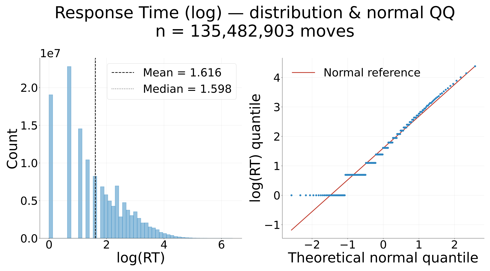

> **Decision:** Work in **log(RT)** throughout (think time is log-normal, Weber's law), and screen
> structural features with **Spearman** rank correlation — they are skewed/bounded, so rank
> correlation is the honest measure.

Then the regressors. Each board feature gets the same dashboard (global + by game-stage tertile,
K=10 tie-safe quantile bins with per-bin SEM):

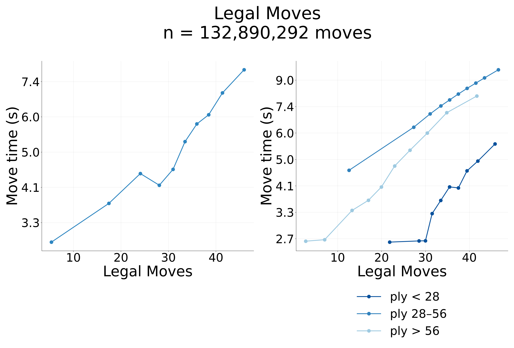
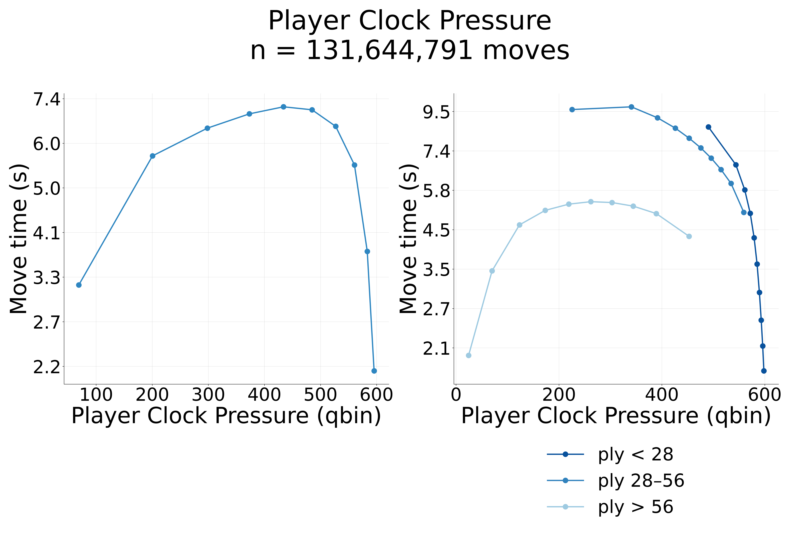

| Feature (from the position) | r with log(RT) | Reading |
|---|---|---|
| **legal moves** | **+0.20** | more candidate moves → more to weigh |
| Gain (engine value-of-search, depth 5) | +0.10 | deeper search demonstrably finds a better move |
| own material | +0.04 | more pieces → more interactions |
| action gap (top-two) | −0.06 | one move clearly best → less to weigh |

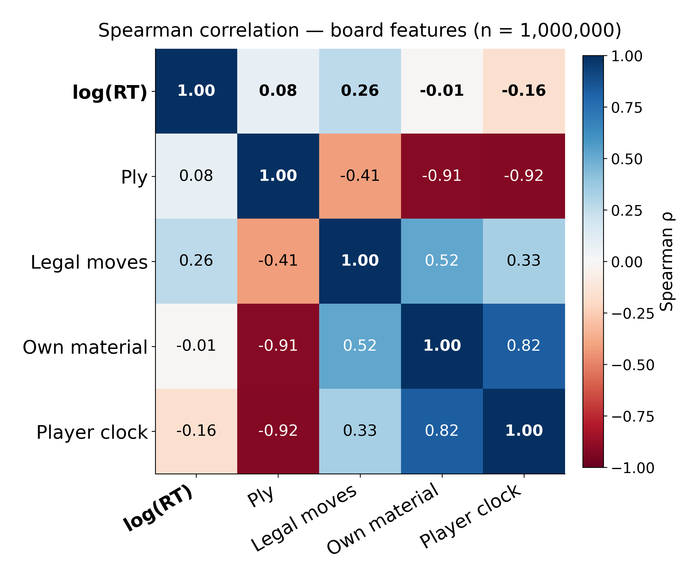

The legal-move count is the strongest single board-feature tie to RT (ρ ≈ +0.26), and it is **not**
reducible to the ply/material/clock complex (which all move together as games progress). It is also
the *fundamental* width axis, not a stand-in for a smarter "effective width": lc0's policy-entropy
H(π) — a plausibility-weighted width — predicts RT *worse* (ρ +0.24 vs +0.33) and is subsumed by
the raw count (partial ρ ≈ +0.05).

> **Result:** The **width of the decision — the number of legal moves — is the strongest predictor
> of human think time**, stronger than realized value-of-search, material, clock, or game stage,
> and not a proxy for any policy-weighted refinement. This is the fact the rest of the paper has to
> explain.

---

## Act 2 — Can an engine's value tell us when to think?

The legal-moves effect is suggestive but *structural* — it says nothing about whether thinking is
*worth it*. The resource-rational hypothesis is sharper: people should think longer where an engine
would *gain* more from searching. To test it we read value quantities off a **Stockfish search tree**
on the same position — now the canonical `n1md36` set (SF, n=1 leaf eval, depth-36, no pruning; 250K
trees, ~104K human moves matched). The analysis lives in `human_analytics/engine.py`.

The three engine signals, in the user's terms:

- **Gain** — *value of computation*: how much value the full search finds beyond its own first
  guess, `final_Q(best @ 96 expansions) − final_Q(best @ 1 expansion)`, both scored on the
  converged Q. The Russek-style account predicts people think longer where Gain is high.
- **Action gap** — *decisiveness*: top-1 minus top-2 of the root children's value. A wide gap means
  one move is clearly best — less to weigh.
- **Move-quality (MQ)** — *satisfaction of the played move*: `final_Q(played) − final_Q(best)` ≤ 0,
  the value the human actually left on the table.

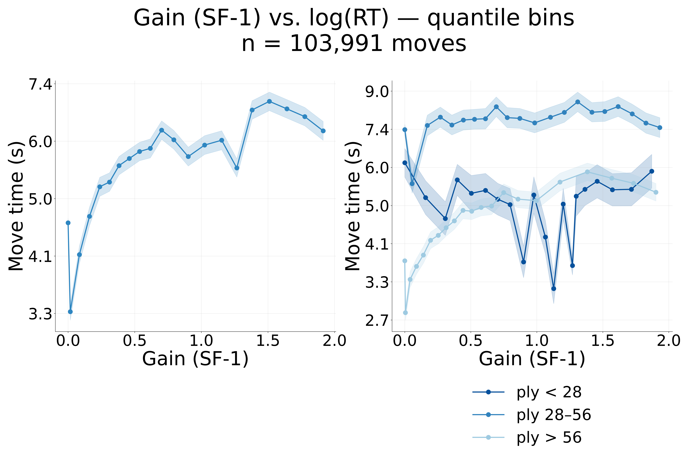

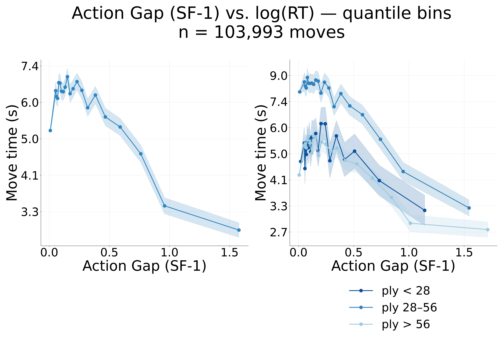

| Metric (SF `n1md36` tree) | r with log RT | Direction |
|---|---|---|
| **Gain** (value of computation) | **+0.136** | as predicted — more to gain, longer think |
| **GSS** (greedy stop step: when the search locks onto its best move) | +0.053 | as predicted |
| **Action gap** (decisiveness) | −0.067 | as predicted — decided → faster |
| **MQ** (played-move quality) | −0.166 | longer thinks land on *worse* moves |
| **H(π)** (policy-entropy "decision uncertainty") | +0.307 | — but **= log(legal moves)**: SF's prior is uniform, so this is the legal-moves effect in disguise (raw ρ +0.33, partial \| legal **+0.002**) |

Every direction is the one a value-of-computation account predicts — but every magnitude is faint
(|r| ≲ 0.17), and the numbers are **stable** from the old SF-2000/md4 run (Gain +0.10→+0.14, MQ
−0.20→−0.17, action-gap −0.06→−0.07) — the engine value signals don't move with depth or eval budget.
The one apparently-strong engine quantity, **H(π), is degenerate**: a uniform prior makes policy
entropy *identically* log(#legal moves), so its +0.31 is decision width relabeled (it dies completely,
+0.002, partialled on legal-moves). For human RT the dominant driver is the **move count**, not value.

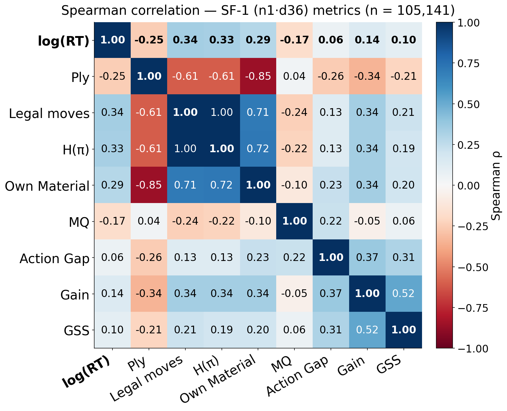

One sub-result is worth flagging because it resists the obvious confound: the **negative MQ↔RT
slope is not just a difficulty artifact**. "Longer thinks land on worse moves" survives within every
engine-difficulty stratum (−0.264 / −0.157 / −0.118 easy→hard), pointing to *selection* (people
deliberate precisely when unsure, and subjective uncertainty predicts errors beyond objective
difficulty) rather than to difficulty alone.

> **Result:** The engine's value-of-computation quantities track human RT only **weakly**, and in
> the *opposite emphasis* from the human: the oracle stops when the **value gap is decided**, humans
> deliberate when the **move set is wide**. The model captures the *direction* of the effects, not
> the dominant driver. This sets up the central question: is the legal-moves effect secretly a
> value signal, or is our value model mis-specified?

---

## Act 3 — Does the normative stopping objective explain when people think?

To ask whether deliberation is *normatively timed* we need an objective for *when to stop*. We grow
an **AlphaZero-style PUCT tree** (no rollouts: a heuristic values each node, a selector picks what
to expand). With **uniform priors** — which Stockfish forces, having no policy head — PUCT reduces
to **UCB**, so the construal is a breadth-leaning best-first search we can read off the existing
trace. A **budgeted-oracle DP** then defines the optimal stop:

> **step\* = argmaxs [ V(s) − cost(s) ]**, and **regret = oracle_value − return(stop)**.

This is the normative target: stop at the cost-adjusted peak. Two engineering checks clear the way
(both [(R-TREESEARCH)](reports/treesearch.md)): the **lc0 → Stockfish swap is safe** (correlations
hold across it — a ~1000× CPU speedup, not a scientific claim), and **`UCI_Elo` is a no-op** for the
evaluation (SF-1350 ≡ SF-2000, bit-identical; only the leaf-eval node budget N changes the values).

### Does the oracle's stopping step track human RT?

Correlate every signal the objective produces — step\*, regret, and the value-of-computation
signals — against human log-RT. **No.** The drivers are structural; every value signal is faint.

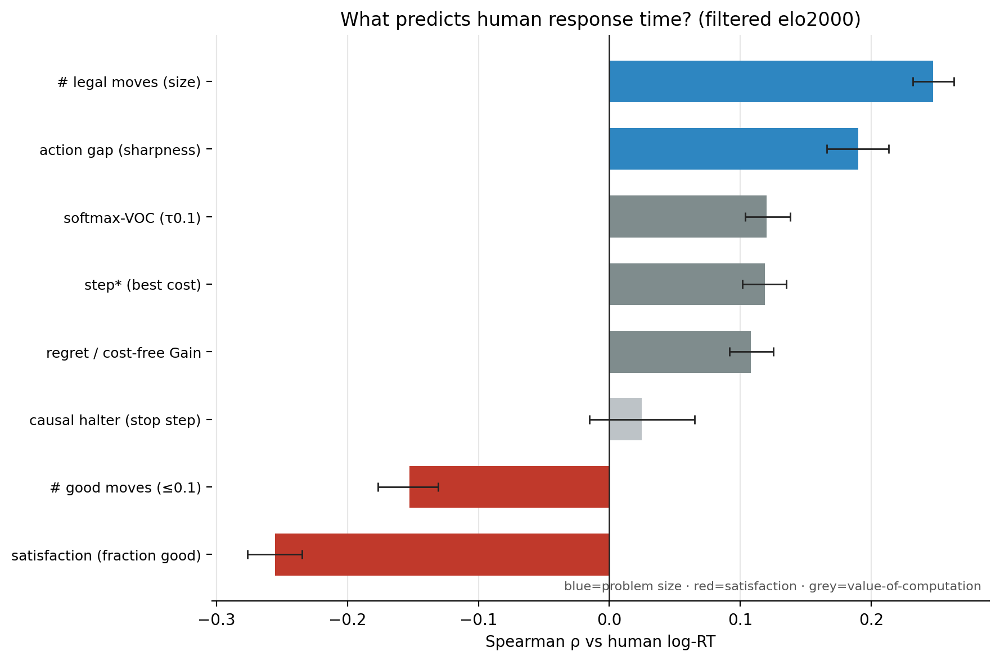

We did not stop there. The objective has knobs, and a mis-specified knob could hide a real value
signal. So we ran the value account down through **five hypotheses**, each a way the objective might
be wrong rather than the theory:

- **H1 — wrong cost *shape*?** Sweep linear / quadratic / power-law and re-derive step\*. **No** —
  regret is flat (a monotone transform of cost-free Gain, ρ=0.98); step\* responds but tops out at
  +0.12, half the legal-moves effect. *(`cost_sweep_rt`)*
- **H2 — missing *uncertainty*?** Re-grade the halt value as the *sharpening* of a softmax policy
  over root-move values (VOC). **No** — at calibrated temperature it *recovers* the argmax value
  (~+0.16) but never exceeds it. *(`voc_tau_sweep`)*
- **H3 — *hindsight* inflation?** step\* is solved by backward DP — it "knows the future." Replace it
  with a **causal halter** that sees only the tree-so-far. **No inflation** — causal halter ≈
  hindsight oracle, and both ≪ legal-moves. The gap to people is real, not an artifact.
- **H4 — just a *legal-moves proxy*?** Partial out the legal-move count from every value/VOC/step\*
  signal. **Yes** — every signal collapses to ≈ +0.04 while legal-moves *survives* the reverse
  control at +0.22. *(`rt_partials`)*
- **H5 — *evaluator too strong*?** Compare SF-1 vs SF-100 (1 vs 100 leaf-eval nodes). **No** — the
  RT correlations are near-identical (legal +0.30/+0.31, Gain +0.16/+0.16); the per-position values
  differ (ρ≈0.93) but the RT story does not move. *(`sf_n1_vs_n100`)*

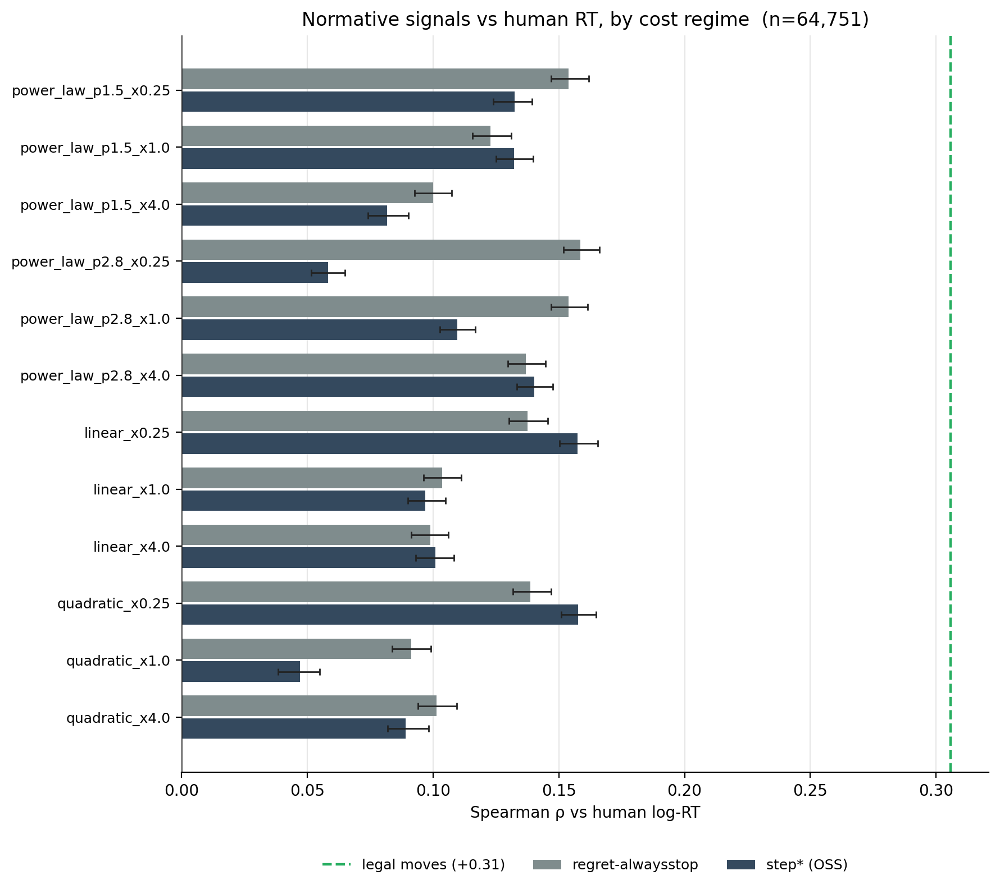
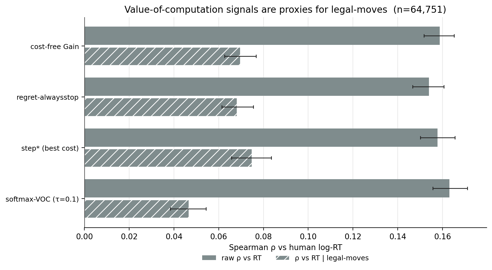

> **Result:** No value-of-computation or stopping-time signal tracks RT beyond ≈ +0.04 once the
> legal-move count is controlled. The value-of-thinking signal was a **decision-width proxy** all
> along — not because people are irrational, but because **our measure is mis-specified**.

### So what *is* think-time?

Decompose RT structurally and the picture is **satisficed decision difficulty**:

> **RT ≈ size (+0.31) − satisfaction (−0.31) + sharpness (+0.24)**

— more options slow you down (size); more *good* options speed you up (satisfaction); a sharper gap
between the best moves speeds you up too. And satisfaction does not just shift the level — it
**reshapes the whole RT-vs-options curve**: high-satisfaction positions plateau low (stop once
good-enough), low-satisfaction ones stay steep. That concavity is the **satisficing signature**.

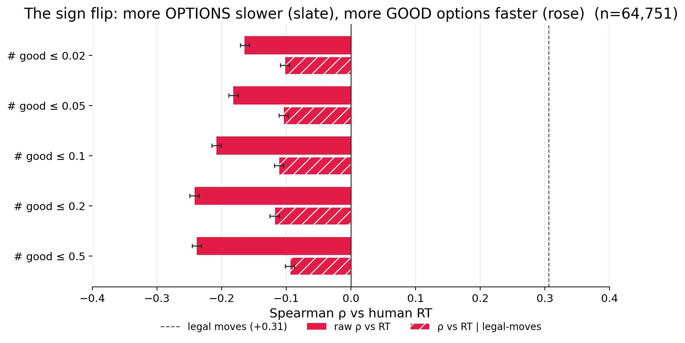
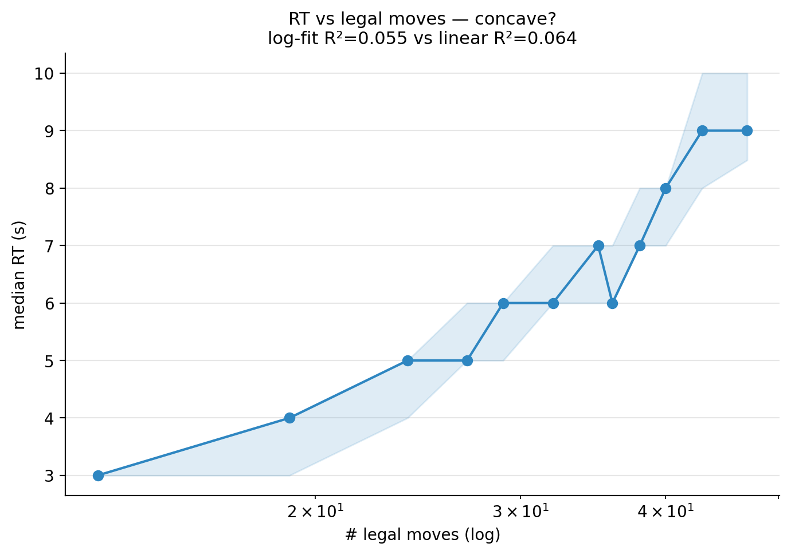

### The umbrella: it was the cost of the *leaves* all along

Here the three cost profiles the user asked us to validate — **# steps (n_inner)**, **# total
nodes**, **# frontier** — crack the whole thing open. When the tree expands a node it **enumerates
all its legal children as leaves**; the root alone lists all *n* legal moves. We had been charging
the oracle for *expansions* and omitting the *leaves* (`maintenance_scale = 0`). On ~4k trees:

| cost ∝ | charges for | ρ vs **RT** | ρ vs **legal-moves** |
|---|---|---|---|
| `n_expanded` (= **# steps / n_inner**) | expansions — *what the oracle used* | **+0.018** | +0.022 |
| `n_total` (**# total nodes**) | all nodes incl. enumerated leaves | **+0.323** | **+0.857** |
| `n_leaf` (**# frontier**) | frontier leaves only | +0.323 | +0.857 |
| *reference* | legal moves | +0.292 | — |

Two facts unify the project:

1. **`n_expanded == # steps`, and it is ≈ constant at the budget (96).** So it correlates with RT at
   **+0.018** — noise. *Every* step\*/regret/VOC signal was riding this near-constant; that is why
   they were all weak, and why every reward-side knob (H1–H3, H5) was a no-op.
2. **The cost we omitted — the leaves** — tracks RT at **+0.323**, the strongest single signal in
   the project, and is **0.857-collinear with legal-moves** because the leaves *are* the enumerated
   candidates.

> **Result (the umbrella):** the **legal-moves effect is the enumeration floor of a leaf-cost**.
> "Decision width," "the consideration set," "satisfaction," and "the cost we mis-specified" are
> **one object — the cost of the leaves you bring into consideration**. We spent the project
> measuring internal expansions, a constant the budget fixes, while the actual lever — the leaves —
> sat at +0.32, zeroed out.

> **Clarification (why the reward knobs were dead ends *by construction*).** We filter trees for
> *reward-to-planning* — positions where deeper search improves the value (roughly monotone gain
> with depth). On that filtered set the reward profile is held ~fixed, so the optimal stop is pinned
> by the **cost**, not the reward. The only live lever on *when to stop* is the **cost profile** —
> and value-pruning is the one way to move it. That is the bridge to Act 4 and the
> [(R-PRUNING)](reports/pruning.md) experiment.

---

## Act 4 — Can a learned meta-controller beat the oracle?

If the objective is right but step\* is just the oracle's hindsight DP, a **learned meta-controller**
that decides — at each expansion — to halt or continue might do better, and might match people. Two
questions: does it solve the *stopping* problem, and does it match *human RT*?

### The stopping problem: solved

On the SF-2000 budgeted oracle we compared five halt policies, all reduced to one decision rule
(stop at the first step with advantage ≤ 0) so the comparison isolates the *signal*. (This halt-policy-zoo
work lives in `lmcos/` and the lab notebook's legacy section, not a standalone report.)

| model | mean regret (95% CI) | mean expansions |
|---|---|---|
| Always-Stop | 0.497 [0.489, 0.505] | 0.0 |
| Fraction-θ\* (=0.25) | 0.196 [0.192, 0.200] | 8.0 |
| **Readout(tree-stats, PG)** | **0.104 [0.101, 0.107]** | 16.4 |
| Readout(GNN-z, PG) | 0.154 [0.151, 0.158] | 22.8 |
| Never-Stop | 1.379 [1.370, 1.387] | 30.1 |

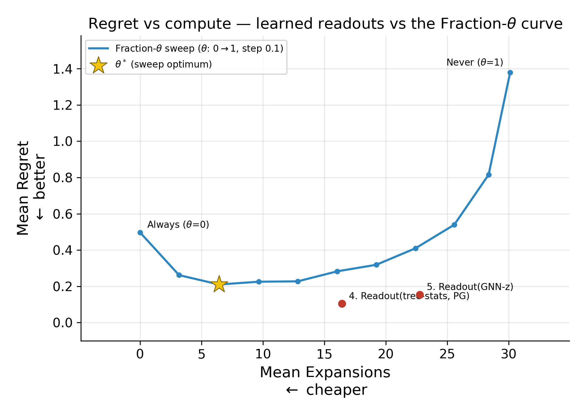

> **Result:** A learned readout clearly beats the blind baselines, and — notably — a **hand-crafted
> tree-stats readout** `[height, width, n_nodes]` **beats the learned GNN embedding** (0.104 vs
> 0.154, non-overlapping CIs) at *less* compute. The stopping problem is solvable, and raw tree
> structure carries the signal. As the user notes, the meta-controller can ride on tree-stats for
> now — no full GNN needed. *(Single rung, single GNN-z run — see the report's caveats.)*

> **Clarification:** Low regret is **self-consistency with the oracle**, *not* a match to people.
> Beating the blind baselines on regret is necessary but not sufficient for the resource-rational
> claim; the next subsection is the part that is not yet done.

### The human-RT frontier: open

This is where the project currently stands, and where Act 4 turns from result to **program**. The
goal is a meta-controller, trained on the regret objective, that (a) beats the alternative halt
models on regret — *done* — **and** (b) **beats the bare legal-moves floor in correspondence with
human RT** — *not done*. As Acts 2–3 established, every value/stopping signal we have so far
collapses to ≈ +0.04 over legal-moves; the meta-controller, trained on the same near-constant
cost, inherits that ceiling. The pruning proxy makes the leverage point concrete — ε dials the
pruned-count along the **size ↔ satisfaction** axis, but no single ε yet beats the +0.34
legal-moves floor in magnitude:

| ε (prune threshold) | ρ(pruned count, RT) | partial \| legal-moves |
|---|---|---|
| *floor: legal moves* | **+0.341** | — |
| 0.0 (aggressive) | −0.163 | −0.085 (a *satisfaction* signal) |
| 0.5 | −0.070 | −0.059 |
| 1.0 | +0.094 | −0.019 |
| *unpruned (n_total)* | +0.319 | +0.112 (deeper branching) |

The partial-controlling-for-legal-moves is non-zero at *both* ends (−0.085 satisfaction, +0.112
deep-branching), so the pruned count *does* carry information beyond raw width — but the proxy is
**post-hoc** (prune a completed tree, no budget redeploy, no stopping dynamics). It can only locate
the action at low ε; it cannot show pruning's value-add. **Regeneration is the real test**
([(R-PRUNING)](reports/pruning.md)): add a prune threshold to the tree-builder so the freed budget
drives deeper, regenerate at ε ∈ {0.05, 0.2, 0.5}, and ask whether the pruned leaf-cost — and a
1–2-parameter satisficing consideration-set model fit to it — recovers *size − satisfaction +
sharpness* **and beats the ±0.31 floor**. Only there does "meta-rational" earn its keep.

#### The pivotal open question: does forward-thinking beat the oracle — and should we even filter?

The user flags a subtlety that is genuinely unresolved, and it is the crux of whether the normative
story can be *won* rather than merely *re-described*:

- The budgeted oracle (step\*) may be **too overpowered** to beat as an RT predictor — it is solved
  by backward DP and "knows the future." H3 showed a causal halter ≈ the hindsight oracle *on
  regret*, but that is self-consistency, not RT.
- The one way the oracle could *fail* to dominate a forward meta-controller on **human** RT is the
  **hindsight asymmetry in reversal positions**: where a position's value reverses with depth, the
  oracle searches far (it can see the reversal coming), but people do not. A forward meta-controller
  that *cannot* see the reversal would stop early — like a person — and could therefore track RT
  *better* than the oracle precisely in those positions.
- But there is a circularity: our **reward-to-planning filter** selects for monotone-gain positions,
  which **removes most reversals** — exactly the positions where forward-thinking would beat the
  oracle. So the filter that makes the cost-profile analysis clean may also be **suppressing the one
  effect that would let the normative model win**.

> **Open question (not a result):** whether a *forward* meta-controller beats the *hindsight* oracle
> in correspondence with human RT is untested, and may hinge on **rejecting the reward-to-planning
> filter** so reversal positions are retained. This is the experiment that could turn "RT
> re-describes decision width" into "a forward normative model genuinely predicts when people
> think." It is the natural successor to the pruning regen, and is flagged here as the live frontier.

---

## What is settled, and what is open

| Claim | Status | Evidence |
|---|---|---|
| Human think-time is log-normal; decision **width** (legal moves) is its strongest single predictor | **Settled** | board regressors, ρ ≈ +0.20/+0.26; survives ply/material/clock; not a policy-weighted-width proxy |
| Engine value-of-computation tracks RT only weakly, with opposite feature emphasis | **Settled** | Gain +0.10, GSS +0.08, MQ −0.20; oracle stops on value-gap, humans on width |
| Every value/VOC/stopping signal is a **legal-moves proxy** (collapses to ≈ +0.04 partialled) | **Settled** | five-hypothesis sweep; H4 partials; H1–H3, H5 no-ops |
| RT = **satisficed decision difficulty** (size − satisfaction + sharpness), with a satisficing concavity | **Settled (correlational)** | RT-decomposition; satisfaction reshapes the RT-vs-n curve |
| The legal-moves effect **is** the enumeration floor of a **leaf-cost** (we charged for expansions, a near-constant) | **Settled** | cost-profile table: n_expanded +0.018 vs n_leaf +0.323, 0.857-collinear with legal-moves |
| A learned meta-controller solves the **stopping** problem; tree-stats ≻ GNN-z ≻ blind baselines | **Settled (one rung)** | regret 0.104 vs 0.154 vs 0.196, non-overlapping CIs |
| Searching for a signal that **beats** legal-moves | **Retired (wrong target)** | a count is the *explanandum*, not a rival model; everything correctly collapses onto it (VOC, pruning, construal, VoI, ratio: partial ≤ +0.06) |
| A resource-rational planner (per-op cost) **predicts** RT ∝ legal-moves | **Settled (mechanism)** | `n_total(OSS)` from a node-cost stop scales with options; the satisficing `−satisfaction` sign is the optimal stop |
| A 1–2-param resource-rational model **reproduces** the `size − satisfaction + sharpness` *curves* with sensible cost params | **Open (the fit)** | start no-prune (no threshold to fit, only `c`); check RT-vs-{n_moves, fraction_good, action_gap} |

> **The working conclusion.** RT tracks **decision width** with a **satisficing signature**, and that is the
> **fingerprint of resource-rational option-consideration** — *not* "people irrationally count moves," and *not* a
> phenomenon waiting for a signal that beats it. Legal-moves is what a cost-based planner *should* produce; the
> open work is the **fit** — does such a planner regenerate the three RT curves with reasonable parameters? That
> is an *explanation* of the legal-moves effect, which a bare count can never be.

---

## Pointers (per-inquiry reports & methods)

This paper is a synthesis; each act's full methods, data lineage, and caveats live in its report
(cross-references are collected in the [index](reports/reference.md), not duplicated here):

- **Act 1** — [(R-MOVETIME-BOARD)](reports/board.md): board regressors, the log-normal RT, the width axis.
- **Act 2** — engine value signals (Gain / MQ / GSS / action gap) on the `n1md36` trees, computed by
  `human_analytics/engine.py` (figures in `figures/engine/`); the former standalone engine report is folded
  in here.
- **Act 3** — [(R-TREESEARCH)](reports/treesearch.md): the search model, the VOC hypotheses, the
  satisficing decomposition, and **the reclaimed result — a resource-rational stop reproduces the curves**.
  The former branching / halt-calibration threads are folded in.
- **Act 4** — [(R-PRUNING)](reports/pruning.md): the cost-profile (pruning) refinement of the
  resource-rational fit. The halt-policy-zoo / PG-training work lives in `lmcos/` + the lab notebook's legacy
  section, not as a standalone report.
- **Data** — [(R-DATA)](reports/reference.md#data-reference-r-data): the human Lichess dataset and the
  search-tree dataset.

All correlations are Spearman ρ with **percentile-bootstrap 95% CIs**; RT is always log(move time);
the click-driven walkthrough is [`presentations/src/tree-search.md`](presentations/src/tree-search.md).
