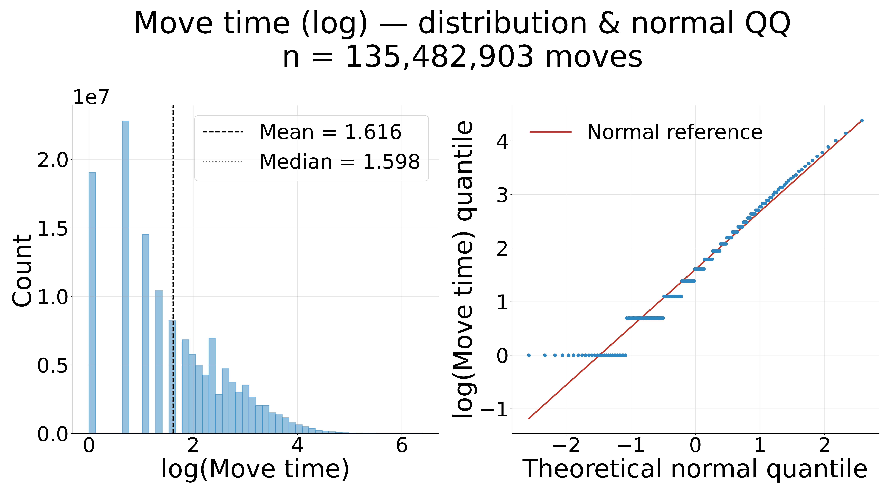
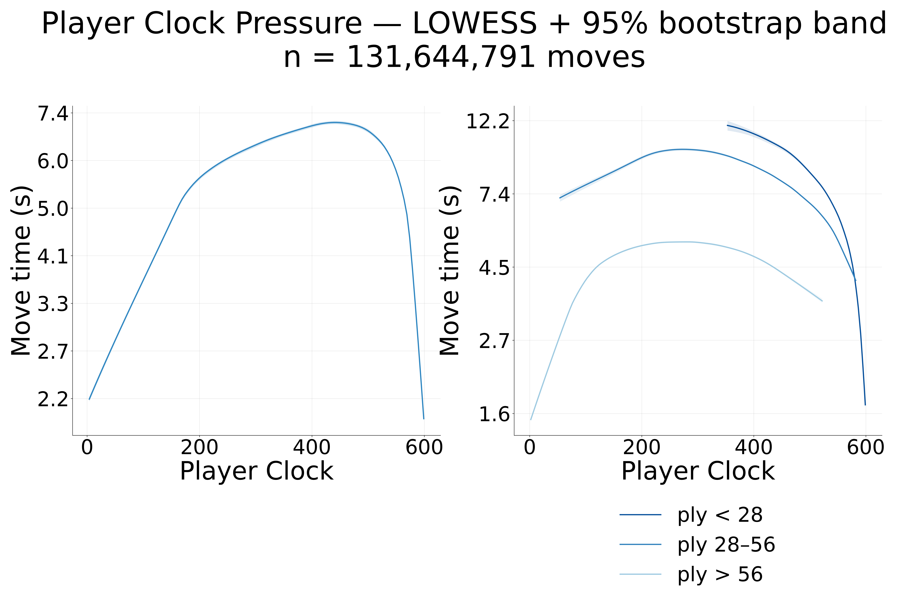
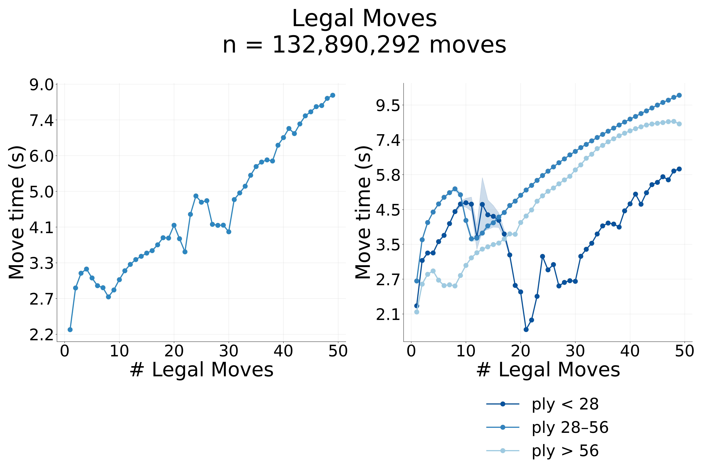
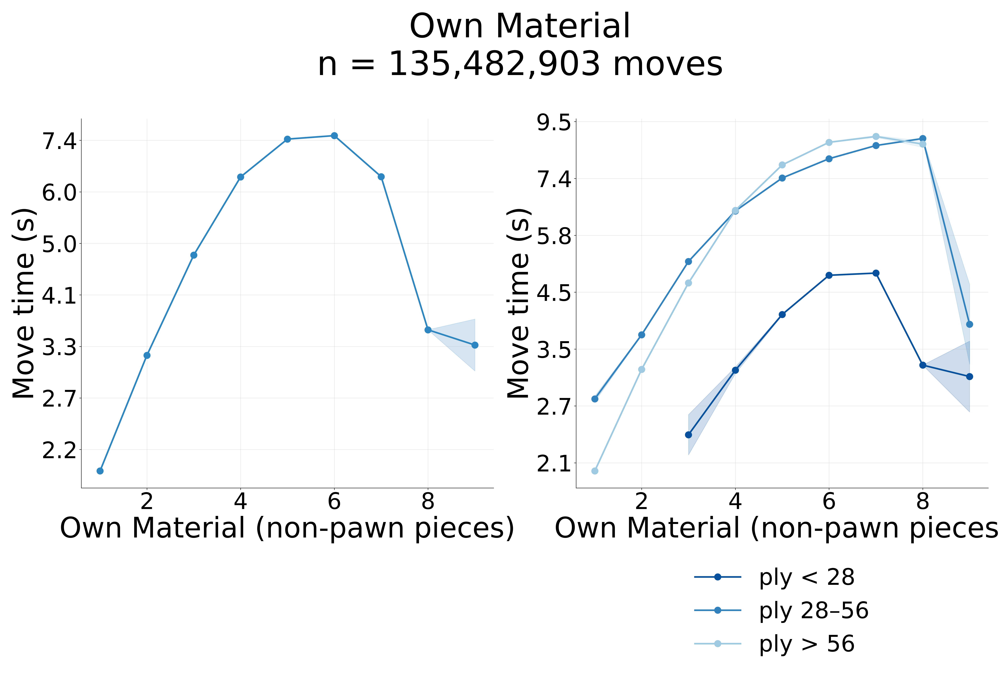
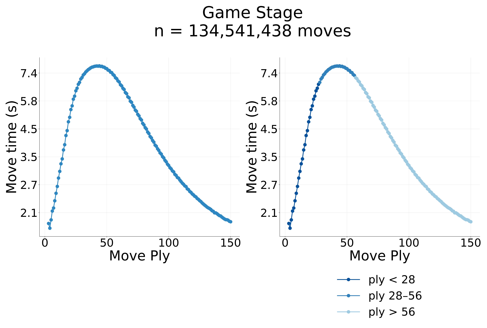
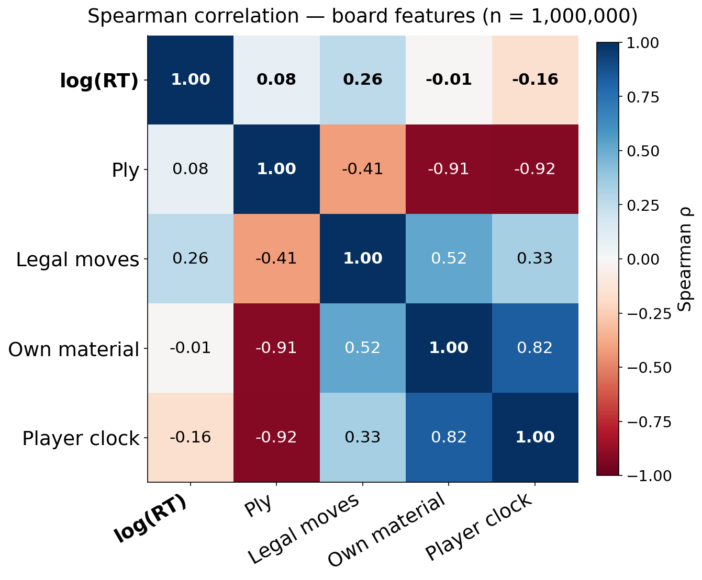

# Human move time — what board features predict it

**Ref:** `R-MOVETIME-BOARD` · [Index](reference.md)

## What board features predict how long humans think?

Humans don't spend equal time on every move. Working model-free (no engine), we ask which
features *of the position itself* predict how long a human thinks — on 135M non-zero-time
moves from 1.97M Lichess games (60+0, Elo ≥ 2000).

> **Result:** Human think time is driven most by the **width of the decision** (branching) —
> more than by material, clock, or game stage.

### How is think time distributed?

Across the full move set, log(move time) is approximately **normal** — i.e. move time is
**log-normal**, not exponential or uniform — so players scale thinking *multiplicatively*
with difficulty.

> **Result:** Think time is log-normal (Weber's law) — the multiplicative scaling that
> justifies working in **log(RT)** throughout.

### Which board features move with think time?

Each board feature gets the canonical quantile-bin dashboard (global + by ply tertile):

| Feature (from position) | r with log(RT) | Reading |
|---|---|---|
| branching factor | **+0.20** | more candidate moves → more to weigh |
| Gain (ΔUC, depth 5) | +0.10 | deeper search demonstrably finds a better move |
| own material | +0.04 | more pieces → more interactions |
| action gap (toptwo) | −0.06 | one move clearly best → less to weigh |

### How do the features relate to each other?

A rank (Spearman) correlation matrix over the board features and log(RT) — no engine:

Branching is the strongest single board-feature tie to RT (ρ ≈ +0.26). Material, clock, and
ply move together (material/clock fall as games progress), so they are largely redundant
with the game-stage axis — yet branching's RT coupling is *not* reducible to that complex.

> **Result:** The **width** of the decision (branching) is the strongest board-feature
> predictor of human think time — stronger than realized value-of-search, and not reducible
> to the ply/material/clock complex.

**Raw branching is the *fundamental* width axis.** A natural worry is that the raw legal-move count
is a crude stand-in for a smarter "effective width." It isn't: lc0's policy-prior entropy H(π) — a
plausibility-weighted effective branching — predicts RT *worse* than the raw count (ρ +0.24 vs +0.33)
and is subsumed by it (partial ρ(H(π), RT | branching) ≈ +0.05). So no policy-weighted refinement beats
the raw legal-move count — branching is not a proxy *for* a better width measure, it *is* the operative
one. See the policy-entropy test in [the engine report](engine.md).

## Methods

- **Dataset:** Lichess 10+0 (60+0), Elo ≥ 2000, no berserk; 1.97M games → 135M
  non-zero-`move_time` moves in `processed_moves_nonzero` (4-field FEN, board counts, ply
  tertiles). Dataset details: the human-data reference in the index.
- **Per-feature dashboards:** `human_analytics/movetime_analysis.py` (`clock`,
  `legal_moves`, `own_material`, `ply`) — the canonical `Analyzer` quantile-bin 1×2
  (global + a-priori ply tertiles). Distribution: `move_time_summary.py`.
- **Board-feature matrix:** `movetime_analysis.py boardcorr` — Spearman ρ over Ply,
  Branching, Own material, Player clock, log(RT) on a 1M-row reservoir sample. Figures land
  in repo-root `figures/`.

> **Decision:** Work in **log(RT)** (think time is log-normal) and use **Spearman** for the
> board matrix — the structural features are skewed/bounded, so rank correlation is the
> honest screen.
