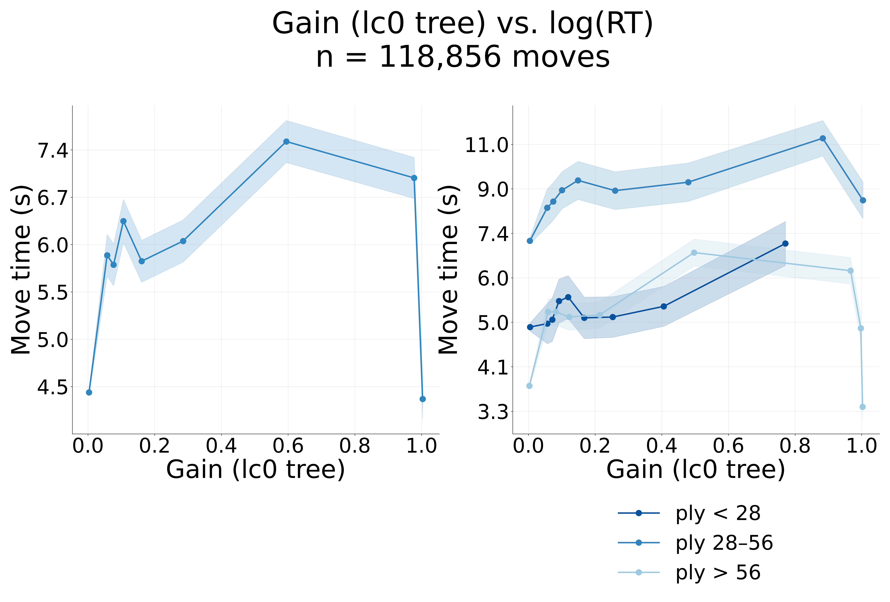
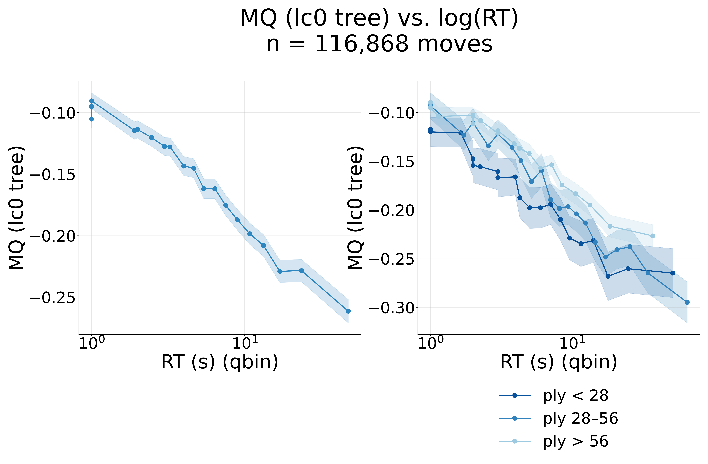
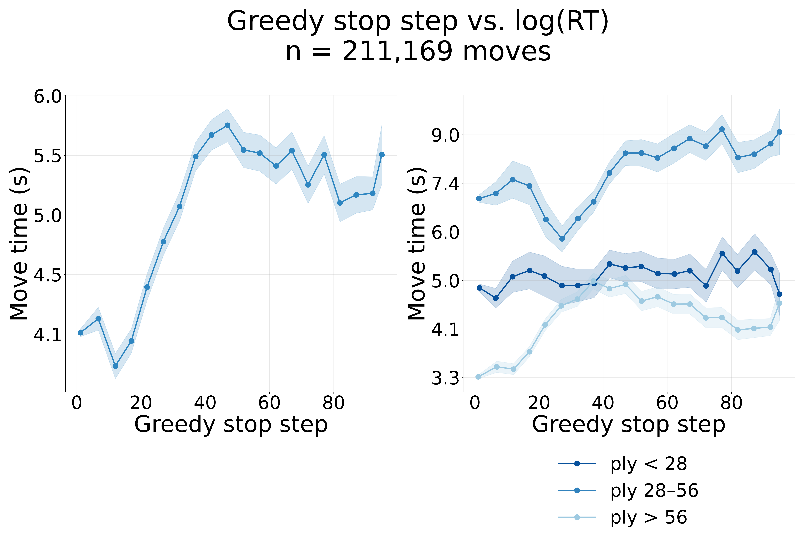
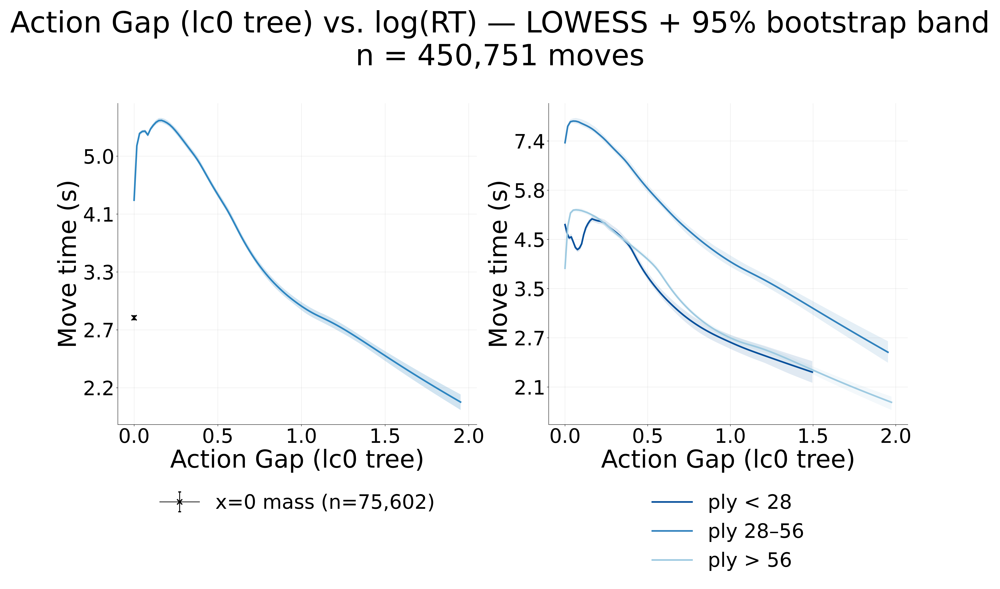
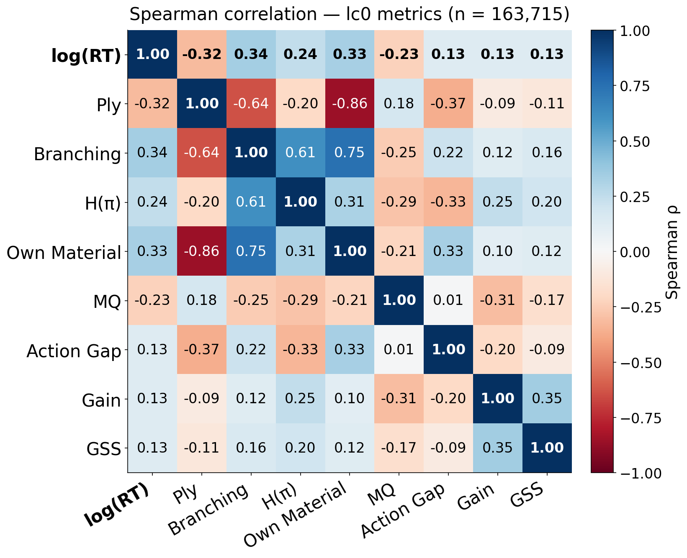

# Human move time — does a normative search model match it?

**Ref:** `R-MOVETIME-MODEL` · [Index](reference.md)

## Does a normative search model reproduce human think time?

Humans deliberate longest when the decision is *wide* (see the board-features inquiry in the
index). Here we ask whether quantities read off a **Stockfish (Elo-2000) search tree on the same position** —
Gain (value of computation), move-quality, and a **greedy stopping step** (how many expansions until the
search locks onto its best move) — track human think time, and where model and humans part ways.

> **Result:** The engine's value-search quantities (GSS, Gain, MQ) track human RT only **weakly**,
> and the LMCOS normative oracle stops on *value-convergence* while humans deliberate on
> *structural complexity* — the model captures the direction of the effects, not the dominant driver.

### Do Stockfish-search quantities track human RT?

On the Stockfish Elo-2000 tree subset (50,000 trees; join over 1,488,187 root moves gives
**57,087 human moves matched across 50,000 FENs**; GSS range 0–95). Spearman ρ vs log RT (lc0
`human_trees` values in parentheses for comparison):

| Metric | Definition (SF Elo-2000 tree) | ρ with log RT |
|---|---|---|
| **GSS** — greedy stopping step | first expansion the eventual-best move is found (greedy, zero-cost) | **+0.078** (lc0 +0.11) |
| **Gain** — value of computation | `final_Q(best @ 96 exp.) − final_Q(best @ 1 exp.)` ≥ 0 | **+0.104** (lc0 +0.085) |
| **MQ** — move quality | `final_Q(played) − final_Q(best)` ≤ 0 | **−0.197** (lc0 −0.151) |
| **Action gap** | top1 − top2 of children's 1-ply value-head backup | **−0.056** (lc0 −0.058) |

> **Re-pointing check (lc0 → SF-2000).** All four value-search metrics **preserve their sign** and
> stay in the same magnitude band as the lc0 `human_trees` run — the re-pointing onto the
> strength-matched Stockfish trees is consistent. GSS is the most attenuated (+0.078 vs +0.11);
> MQ and Gain are slightly stronger on SF (−0.197 / +0.104).



Gain is the value of computation, read from a **single growing oracle tree** at two budgets. The
intuition, in five steps:

1. Take the **shallow tree** (after 1 expansion) and the **deep tree** (after 96).
2. Read the **shallow action** — the best move in the shallow tree (the move the search expands first).
3. On the deep tree, read the **deep action** (`argmax final_Q`) and its value.
4. Look up the **shallow action's value in the deep tree** (its converged `final_Q`).
5. `Gain = value(deep action) − value(shallow action)`.

In one line: **how much value does the full search find beyond its own first guess?** Because the
shallow action is read *from the shallow tree*, it was necessarily expanded there, so it is always
present in the deep tree with a real value — **no filtering is needed at any level** (the earlier
bugs came from taking the shallow action from a *different* source — a 1-ply value head, or a
prior-driven recommendation — that named a move the search never expanded, whose deep value was the
uninitialized 0.0). The coupling is **positive and monotone** — more value-of-computation, longer
thinks — the direction Russek-style accounts predict (SF-2000 ρ = **+0.104**). Gain is zero in ~⅔ of
positions (the first expansion already lands on the search-best move).

> **Definition fix (supersedes two buggy ones).** Two earlier definitions took the shallow action
> from *outside* the shallow tree — a 1-ply value-head best, or a prior-driven recommendation — which
> in **won** positions named a move the search never expanded, so its `final_Q` read the uninitialized
> **0.0** and `Gain` was spuriously pinned at **≈ 1.0** (2.7% of moves), producing a *pathological RT
> dip* at the top bin (humans play obvious wins fast). Reading the shallow action *from the growing
> tree itself* (the first move the search expands) removes the bug at the source — it is always a real,
> visited move — and needs no filtering. The dip is gone, Gain rises monotonically, and the RT coupling
> is **ρ = +0.104** on SF-2000 (lc0 `human_trees`: +0.085 — same sign and band: value of search over
> the search's own first pick, on one converged evaluation).



MQ is the move-quality of the human's *played* move, plotted as the **outcome** of think time
(the same MQ-vs-log-RT relationship, segmented three ways: global, by ply tertile, and by GSS
difficulty stratum). The correlation is **negative**: longer thinks land on worse moves (SF-2000
ρ = **−0.197**). On SF-2000 the slope stays clearly negative inside every GSS stratum —
Easy **−0.264**, Medium **−0.157**, Hard **−0.118** — so it is not a GSS-difficulty confound.

The standing read was that this is purely a **difficulty confound** — long thinks land on harder
positions, where even a deliberating human plays the engine-best move less often. We tested that
directly by segmenting the MQ↔RT slope **within difficulty strata**, using GSS (engine search
effort to find the best move) as the difficulty proxy — the **third panel** above:

| Conditioning (SF-2000) | Spearman ρ(MQ, log RT) |
|---|---|
| overall (pooled) | **−0.197** |
| within GSS easy / med / hard | −0.264 / −0.157 / −0.118 |

> **Correction:** The negative MQ↔RT slope is **not** a GSS-difficulty confound. It stays clearly
> negative inside **every** GSS stratum (Easy −0.264, Medium −0.157, Hard −0.118), so conditioning on
> engine search-effort does not explain it away. Indeed **GSS is a poor difficulty proxy here**: its
> easiest stratum (forced recaptures / only-moves the engine fixes instantly) has the *most* negative
> MQ↔RT slope, because humans who deviate there lose a lot — GSS is engine search-effort, not
> human-perceived difficulty. The **legal-move count** is the stronger difficulty axis (lc0 run:
> ρ(legal moves, MQ) = −0.25, ρ(legal moves, RT) = +0.34), but on lc0 the joint partial on GSS +
> legal moves still left **−0.150 — about ⅔ of the effect intact**. So a real residual "longer thinks
> → worse moves" survives the difficulty controls, pointing to *selection / uncertainty* (people
> deliberate precisely when unsure, and subjective uncertainty predicts errors beyond any objective
> difficulty index) rather than to objective difficulty alone. The sign also holds within every ply
> tertile.




GSS (one point + SEM per integer value) **rises monotonically** with RT across the full range
(no cap needed); the action gap is flat-to-weak.

> **Result:** Every engine value-search quantity tracks human RT only faintly (|ρ| ≲ 0.20 on SF-2000).
> The model is in the right direction but explains little of the variance in human think time.

### Where do the model and humans diverge?

The clearest signal is *which features* drive the oracle versus the human. On 39,668 lc0 trees
the same four features point the same way for the oracle's stop step and human RT (**4/4
directions agree**) — but the emphasis is opposite:

| Feature | r(oracle stop) | r(human RT) |
|---|---|---|
| legal moves | +0.014 | **+0.195** |
| material | +0.011 | +0.039 |
| gain_depth (value gained) | **+0.233** | +0.096 |
| action gap (toptwo) | **−0.290** | −0.064 |

The oracle halts on **value-landscape** features (gain_depth, action gap) and ignores the legal-move
count; humans deliberate on **structural complexity** (legal moves dominate) and barely track Gain. On
matched human-FEN trees the oracle stop step still correlates positively with log(RT) (smoke
r = **+0.091**, n = 497), but gain_depth predicts the *oracle's* halt strongly (+0.463) while
being near-zero for *humans* (+0.020).


> **Result:** The oracle and humans agree on the sign of every feature but not the mechanism:
> the oracle stops when the value gap is decided; humans deliberate when the move set is wide.

### How do the model variables relate?



A rank (Spearman) correlation matrix over the SF-2000 metrics, board structure, and log(RT) — rank,
because Gain / MQ / action gap are zero-inflated and skewed, so Pearson understates (and can flip
the sign of) their monotone relationships. The strongest tie to log(RT) is the **legal-move count**
(still stronger than any engine metric); **MQ ↔ RT** is the difficulty-*plus-residual* effect above;
**GSS** ties to the Gain / action-gap *value-convergence* cluster, not to the legal-move count.

> **Note (no policy-uncertainty metric on SF).** Stockfish trees have **no policy head** — the
> `prior` feature is exactly uniform, so a policy-entropy term H(π) ≡ log(#legal moves) and is just a
> legal-move-count proxy. Empirically its raw ρ vs log RT is +0.243, but the **partial correlation
> conditioning on the legal-move count collapses to −0.015** — it carries no policy-uncertainty
> signal on SF — so H(π) is dropped from this report.

> **Result:** The legal-move count is the connective tissue between human RT and position structure, and the
> engine value-search metrics form a separate, weakly-expressed value-convergence cluster. The driver of human
> deliberation is decision **width**, not realized value-of-computation.

## What can we conclude?

| Claim | Evidence |
|---|---|
| Decision width drives human deliberation — more than engine Gain | legal-moves r ≈ +0.20/+0.33 ≫ Gain; oracle ignores the legal-move count, humans don't |
| The normative model captures direction, not the dominant driver | 4/4 feature directions agree, but oracle halts on value-convergence, humans on structure |
| Engine value-of-computation tracks RT, but weakly | Gain ρ = +0.104 (growing-tree def: best @ 96 vs @ 1 expansion); GSS ρ = +0.078 (SF-2000) |
| "More time → worse moves" is **not just** a difficulty confound | MQ ρ = −0.197 (SF-2000); negative in every GSS stratum (−0.264/−0.157/−0.118) |

> **Result:** Humans look *resource-rational about the width of the decision*; the value-search
> model explains the easy direction but misses what most strongly paces human thought. The
> re-pointing onto strength-matched SF-2000 trees preserves the sign and magnitude band of all four
> value-search metrics, so the model–human mismatch is **not** a strength artifact. Next: isolating
> the selection vs. blunder-after-long-think drivers of the residual MQ↔RT slope.

## Methods

### Definitions

| Quantity | Definition | Source |
|---|---|---|
| **MQ** | `final_Q(played) − final_Q(best)` (≤ 0; 0 = engine-best played) | SF Elo-2000 tree (replaces the retired Stockfish-d5 `e_win_taken − e_win_best`) |
| **Gain** | `final_Q(best @ 96 exp.) − final_Q(best @ 1 exp.)` (≥ 0), both on the converged 96-exp. Q | SF Elo-2000 tree; from the growing oracle search trace (`oracle_root_q_trace`) |
| **GSS** | first expansion `oracle_best_move_index` reaches its final value (greedy, zero-cost) | SF Elo-2000 tree |
| **Action gap** | top1 − top2 of root children's 1-ply value-head backup (`−child.value`) | SF Elo-2000 tree |

> **Why no H(π).** Stockfish trees have no policy head — the `prior` feature is exactly uniform, so a
> policy-entropy term H(π) ≡ log(#legal moves), i.e. a pure legal-move-count proxy (raw ρ vs log RT
> +0.243, but partial ρ | legal-move count = −0.015). It carries no policy-uncertainty signal on SF,
> so it is excluded from this report's metrics.

> **Decision:** GSS is the **greedy** stopping step (the budgeted oracle's stop at *zero* cost = the
> first expansion the best move is found), **not** the cost-aware DP `optimal_stop_step`, which under
> the default time cost bails almost immediately and isn't an interpretable difficulty proxy. Gain is
> read from the **single growing oracle tree**: best @ 96 expansions vs best @ 1 expansion, both scored
> on the converged 96-expansion Q, with the 1-expansion move taken from the search trace's first-visit
> (so it is always a visited move — never an unvisited 0.0). This supersedes two earlier definitions that mixed a
> 1-ply value-head "shallow" against the deep Q and read an unvisited `final_Q == 0.0`, which pinned a
> spurious ~1.0 spike. MQ is the SF-2000 final-Q loss (Stockfish-d5 MQ retired); the tree FEN is
> normalized to 4 fields for the human join.

### Data and pipeline

- **SF Elo-2000 tree subset:** 50,000 Stockfish Elo-2000 trees (`sf_trees/elo2000`), re-pointed from the
  lc0 `human_trees` set for parity with the halt-model pipeline. The join over 1,488,187 root moves yields
  **57,087 human moves matched across 50,000 FENs** on the **4-field** FEN (lc0 run was ≈199K trees / ≈211K
  matched moves); GSS range 0–95. MQ is matched to the human's played UCI.
- `human_analytics/engine.py` (formerly `tree_values_analysis.py`) derives GSS/Gain/Action-Gap/MQ and the
  Spearman matrix; per-tree values are **cached to parquet** (deterministic in trees/n_trees/seed),
  so plot iterations reload the cache locally in seconds. One-time compute via
  `slurm/tree_values.slurm`. All panels use **K=10 tie-safe quantile bins** with per-bin SEM in
  `utils/analysis.py` (tie-safe keeps a repeated integer in one bin, so discrete GSS doesn't split
  across edges; low-cardinality x collapses to ≤10 integer points). For the continuous Gain / MQ /
  action-gap the value point-mass (e.g. Gain's 55%-at-0) is isolated as its own point, and **Gain
  is plotted on a √ x-axis** (Russek 2025: move time fits √ΔUC better than linear, and √ handles
  the zero-mass that log cannot). (Gain is the `voc` column; the figure x is `sqrt(voc)`.)
- **MQ-by-difficulty:** the 3rd panel of `mq_vs_rt.png` is a second `Analyzer` on the same `mq_rt`
  table built with `segment_column="gss"` — the *identical* MQ-vs-RT panel, segmented by GSS stratum
  instead of ply tertile (so it differs from the by-ply panel only in its legend).
  `human_analytics/mq_vs_rt_by_gss.py` prints the within-stratum and partial Spearman ρ (on GSS /
  legal moves), straight from the cache.
- **Oracle (Tier A/B):** `lmcos` `pack.build_compact_trajectory` → `oracle.compute_budgeted_oracle`
  → `analysis/human_oracle_comparison.py`, which validates each tree's FEN against the manifest.
  Tier A: 39,668 lc0 trees (budget 96). Tier B: smoke on 497 clean human-FEN trees (1K job hit the
  1-hour SLURM wall); 10K is the power target.

## Appendix (logs)

### Status

| Step | Status |
|------|--------|
| SF-2000 GSS/Gain/Action-Gap/MQ + Spearman matrix, 50K trees / 57,087 matched moves | ✅ done (`--mode all`, cached) |
| Re-pointing lc0 → SF-2000: all four value-search metrics preserve sign + magnitude band | ✅ GSS +0.078, Gain +0.104, MQ −0.197, action gap −0.056 |
| Gain redefined: best @ 96 vs @ 1 expansion on one growing tree | ✅ supersedes the 1-ply/unvisited-0.0 defs; dip gone, ρ = +0.104 (SF-2000) |
| MQ difficulty-confound audit (within-GSS strata on SF-2000) | ✅ negative in every stratum (−0.264/−0.157/−0.118); not a GSS confound |
| Oracle Tier A (4/4 directions, 39,668 trees, 72 invariant tests) | ✅ done (lc0) |
| Oracle Tier B: 10K human FENs as 20 shards | ✅ submitted; oracle+join+plots ⬜ after jobs |
| SF-2000 strength-matched oracle (CP→WDL) on same FENs | ⬜ gated on Tier B 10K r |
| E[ΔUC] over top-5 depth-1 candidates (Russek Figures 4–5) | ⬜ open |

### Invalid runs (do not cite)

- Tier A initial (5K trees, budget 43, 2026-06-03): two bugs (evolving-Q halt rewards;
  mixed-regime gain_depth) — superseded by the corrected results above.
- Tier A glob `filtered_shard_0000?`: missed shards 00010–00019 — fixed to `filtered_shard_*`.

### Reproduce (SF-2000 metrics)

```bash
# one-time compute (populates the parquet cache), on the cluster:
sbatch human_analytics/slurm/tree_values.slurm
# iterate on plots/matrix later, locally, straight from cache (seconds):
PYTHONPATH=human_analytics python human_analytics/engine.py --mode all
```

*Merges the former R-VOC-MQ (human Gain/MQ vs move time) and R-ORACLE-RT (oracle stop step vs
human RT) reports, folding the R-THEORY validation-tier framework.*
