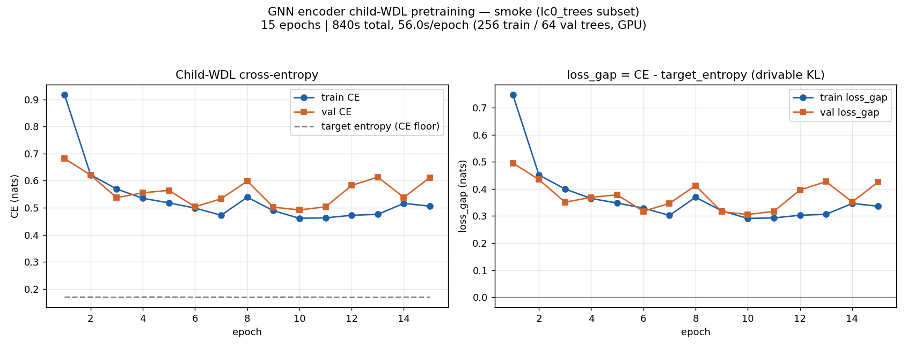

# GNN encoder pretraining (child-WDL objective)

**Ref:** `R-PRETRAIN` · [Index](README.md) · Thread: LMCOS

## Overview / Summary

Can the tree-GNN encoder be supervised-pretrained on the child-edge-WDL objective, and does the
training loop actually work? **Yes.** The dataset decision is forced — only the **`lc0_trees`**
(150,003 trees) carry the `edge_wdl_targets` the loss needs; the ysagiv `human_trees` (1.14M) do
**not**. A smoke run (256 train / 64 val, A100) confirmed a **functioning loop with the loss
descending** (train loss_gap 0.748 → 0.291) and surfaced no bugs. The headline caveat is **timing**:
the smoke is **CPU-tensorization-bound** (56 s/epoch → naive ~9 h/epoch at 150K), so the full run
**must pre-pack** tensorized shards before launch.

## Results

### Smoke loss descends — the loop is functioning, no bugs

256 train / 64 val trees (contiguous slice of `lc0_trees`), `ChildWdlModel` defaults (k=2,
d_embed=128, n_heads=4, d_att=32), **weighted** edge CE (`loss_weight_by_subtree_size=true`),
**Adam lr=1e-2**, batch 16, 15 epochs, A100 80GB via `qos=gpu-short`.

| epoch | train CE | train loss_gap | val CE | val loss_gap |
|---|---|---|---|---|
| 1 | 0.917 | 0.748 | 0.682 | 0.495 |
| 3 | 0.569 | 0.400 | 0.537 | 0.351 |
| 10 (best val) | 0.461 | **0.291** | 0.492 | **0.306** |
| 15 | 0.506 | 0.336 | 0.612 | 0.425 |

- **Verdict: the training loop is FUNCTIONING and the loss goes down — no bugs surfaced.** Train
  loss_gap falls **0.748 → 0.291** against a target-entropy floor ≈ 0.17 nats (the CE floor is real
  and tracked; `loss_gap = CE − target_entropy` is the honest "is it learning" signal).
- **Val diverges after epoch ~10 — expected and healthy:** lr=1e-2 overfits 256 trees fast. That is
  the correct smoke signal (the model has capacity to memorize a tiny set). The best-validation
  snapshot (epoch 10, val loss_gap 0.306) is what `save_best_encoder` persists. For the full run,
  drop to lr ≈ 1e-3 (config default) where val will track train.
- Built-in robustness verified present and working: per-epoch + per-batch logging, `*_resume.pt`
  every epoch (graceful resume), bucketed-KL JSONL, separate best-encoder/decoder saves. No new
  logging/checkpointing code needed for the full run.

### Dataset decision is forced: train on `lc0_trees`

- **ysagiv `human_trees`** (`…/ysagiv/chess/CTS/data/human_trees`, 1,135,085 `.pt`): **NO
  `edge_wdl_targets`** and no `edge_wdl_target_generation_version` (verified across a sample). They
  carry per-node input features (`value, wdl_win/draw/loss, wdl_var, prior`) and a **scalar**
  `node_targets`, but **not** the per-edge search-consolidated child-WDL distribution the loss
  supervises against.
- **`lc0_trees`** (`/scratch/gpfs/GRIFFITHS/hl4291/lc0_trees`, **150,003** `.pt` — not ~100K):
  **DO have `edge_wdl_targets`** of shape `(E, 3)`, rows sum to 1.0, no NaNs. Generated with
  `include_edge_wdl_targets=True` (config `slurm/configs/1_preprocess_data/lc0_trees_150k.yaml`).
- As the code stands, **ysagiv trees cannot drive the current loss:**
  `ChildWdlPretrainer._edge_target_tensor` (`lmcos/src/train/gnn_pretrain.py:291`) raises when
  `edge_wdl_targets` is missing, and the node-target supervision path was deliberately removed
  (commit `69d024e`). One *could* synthesize an edge target from the child's own WDL, but that is
  new code with different semantics. **Recommendation: train on `lc0_trees` — no reason to re-derive
  targets we already have.**

### Timing & convergence ETA (the load-bearing caveat)

- Measured: **56 s/epoch** for 256 trees (840 s / 15 ep), ≈ 10.8k supervised edges/s. This is
  **CPU-tensorization-bound, not GPU-bound** — the raw-directory loader re-tensorizes every batch
  every epoch with `num_workers=0`.
- Naive linear scale to 150,003 trees → **~9 h/epoch. Do NOT run the full job this way.**
- **Fix (the full-run plan):** pre-pack the 150K trees ONCE with `cts.data.preprocess_gnn.pack`
  (`slurm/1_preprocess_data/pack_pretrain_examples_della.slurm`) into tensorized shards, then train
  on the `PackedTensorizedShardDataset` path (the trainer already supports it). This is exactly what
  ysagiv does (`…/CTS/data/train_cache_subtree_weighted_shards/worker_*`); packing moves
  tensorization off the per-epoch hot path so each epoch becomes GPU-bound (expected 1–2 orders of
  magnitude faster). **Action before the full run: pack once, then measure a single packed epoch for
  the real per-epoch wall-clock.** The 56 s/epoch raw number must not size the full run.
- **#epochs to converge cannot be read off this smoke** (a 256-tree overfit run is a different
  regime from full-data training, where val will plateau rather than diverge). It must be read off
  the real run's validation `loss_gap` plateau. Reference: the smoke reached val loss_gap ≈ 0.31
  against a ≈ 0.17–0.19 nats entropy floor on tiny data.

## Methods

### Training machinery (already exists — no new training code)

- **Entry point:** `python -m cts.data.build_tree --config <yaml>` with
  `command: pretrain-child-wdl-encoder` (`build_tree.py: pretrain_child_wdl_encoder_command`).
- **Loads** raw `.pt` examples from `train_dir` / `validation_dir` via
  `load_pretrain_example_dataset` (tensorizes on the fly; no separate pack step for raw dirs).
- **Model:** `ChildWdlModel` = tree encoder (k=2 upward message passing, d_embed=128, n_heads=4,
  d_att=32) + `child_wdl_head`.
- **Loss:** per-edge cross-entropy of predicted child W/D/L vs teacher `edge_wdl_targets`, averaged
  over supervised edges. Optimizer = Adam. Tracks `target_entropy` and `loss_gap = CE −
  target_entropy`.
- **Logging built in:** per-epoch line (`epoch=… train_total_loss=… val_total_loss=…
  train_loss_gap=… val_loss_gap=…`), per-batch progress, optional bucketed-KL JSONL
  (`log_bucketed_kl_path`), resume checkpoint to `<output>_resume.pt` after every epoch, best
  encoder/decoder saves.

### Smoke setup and artifacts

Pre-flight: the 26 `tests/test_supervised_branch.py` cases (the pretrainer path incl. weighted loss)
pass in 7s. Artifacts in `/scratch/gpfs/GRIFFITHS/hl4291/tmp/pretrain_smoke/` (config `smoke_gpu.yaml`,
job `smoke.slurm`, log `smoke_<jid>.out`, best encoder `smoke_encoder.pt`, decoder
`smoke_encoder_decoder.pt`, resume `smoke_encoder_resume.pt`, bucketed-KL `smoke_bucketed_kl.jsonl`).
Regenerate the loss plot: `python -m cts.analysis.plot_pretrain_smoke_loss <log> <png>` (Della
rejects `--partition=gpu`; use `qos=gpu-short`). Job `9829331`.

### Recommended full-run next step (gated on go-ahead — out of smoke scope)

1. `pack` train/val splits of all 150,003 trees (95/5, seeded) → tensorized shards.
2. Time one packed epoch on one A100 → real per-epoch wall-clock.
3. Launch full run: lr ≈ 1e-3, weighted CE, `log_bucketed_kl_path` on, `*_resume.pt` enabled,
   `qos=gpu-short/medium` per the measured epoch time.

## Appendix (Logs)

### Open full-run decisions (defaults assumed where not overridden)

- **Encoder architecture:** keep `build_tree.py` defaults (k=2, d_embed=128, d_message=128,
  n_heads=4, d_att=32, node_embed_hidden=128, decoder_hidden=128) — matches the ysagiv `tree_encoder`
  lineage.
- **Train/val split:** 95/5 random, fixed seed, by *tree* (root position). Open: whether
  `lc0_trees` roots can share a game (leakage risk).
- **Output locations:** checkpoints + JSONL under `…/tmp/pretrain_smoke/`; loss figure under
  `lmcos/analysis/figures/`.
- **"Convergence" definition:** val `loss_gap` plateau (Δ/epoch < ~1% of range) × epoch wall-time;
  match a target val CE / loss_gap from the ysagiv encoder if one is given.
- **Objective:** subtree-size-weighted edge CE is the principled choice (~97% of edges are leaves,
  subtree_size=1, trivial copy, dominating the gradient unweighted). Smoke ran weighted.

### Status

SMOKE TEST PASSED (2026-06-17). Decisions from interview: venue = Slurm GPU; objective =
subtree-size-weighted child-WDL CE; today's scope = smoke + plot + ETA only (no full run).

*This report was reformatted from the repo-root `report_pretrain.md` into the scientific template.*
