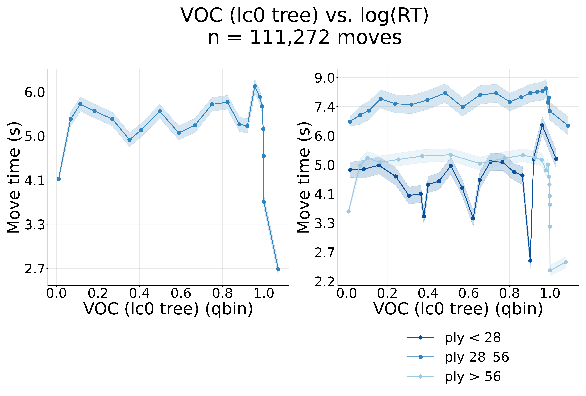
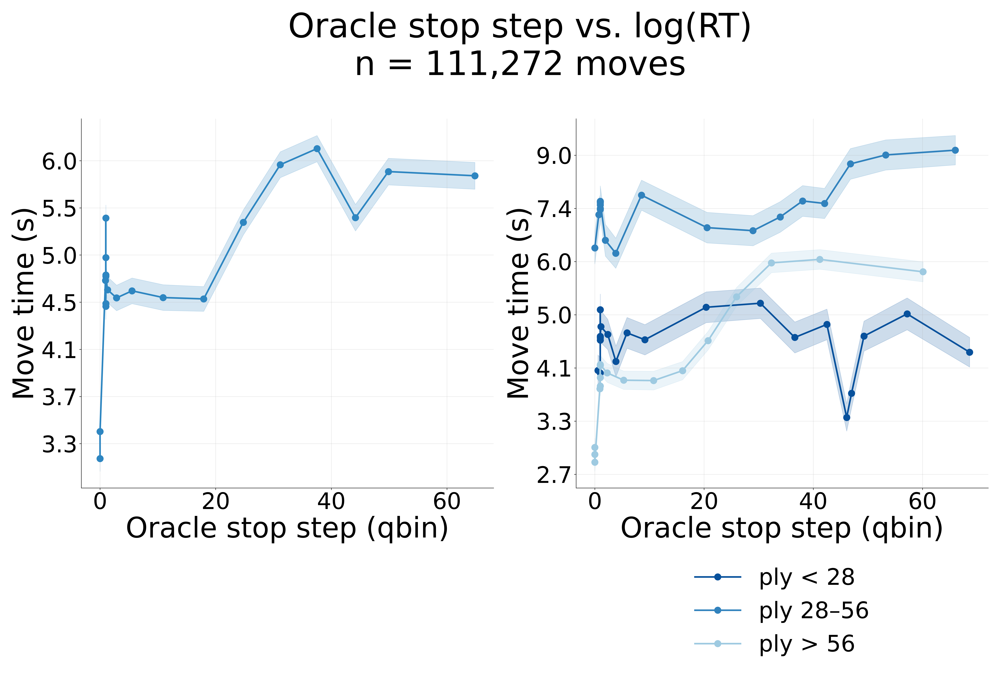

# Human VOC / MQ vs move time

**Ref:** `R-VOC-MQ` · [Index](README.md) · Thread: Human

## Overview / Summary

Does engine-defined **value-of-computation (VOC)** and **move-quality (MQ)** track how long
humans think? On engine-evaluated human positions we find a **weak-but-real positive** coupling
between VOC and log move time (r ≈ +0.10) and a **negative** MQ↔move-time correlation. The
negative MQ↔move-time relationship is **not a sign bug** — it is a **difficulty confound**: long
thinks land on objectively harder positions, where even a deliberating human plays the engine-best
move less often. A second, load-bearing caveat surfaced 2026-06-17: the kept **MQ figure is
computed from Stockfish depth-5, not LC0**, so MQ and the LC0-tree values (OSS / VOC / Action Gap)
are not the same engine regime.

## Results

### MQ vs move time (the headline, and the confound)

- **MQ ≤ 0** by construction (0 = the human played the engine-best move). The mass at exactly 0 is
  large and is lumped via `zero_inflated=True, zero_threshold=0.05`.
- Across the 100K-position Stockfish run, **r(MQ, clock) = −0.098**, negative *within every ply
  tertile*. Players with **more** clock at a given ply tended to have **worse** MQ.
- **The MQ↔move-time negative correlation is a difficulty confound, not a sign error.**
  Investigated 2026-06-17 (N = 1M): **Spearman ρ = −0.119**, and it **survives all controls and
  de-meaning** (by ply, by player). Long thinks land on **hard / high-branching / high-VOC**
  positions — the engine-best-move rate falls **0.62 → 0.49 across move-time deciles**. The
  three-way **MQ × move-time × branching interaction is β ≈ −0.007 (t = −7)**: branching amplifies
  the effect but the magnitude is small. The recommended fix is to recompute MQ from **LC0** and to
  report **difficulty-residualized partials**.

### VOC vs move time

- On the lc0-tree subset, **r(log RT, VOC) = +0.097** (100K Stockfish run gave the same
  +0.097 sign/magnitude). More remaining value-of-computation associates with longer thinks — the
  direction predicted by Russek-style value-of-computation.
- VOC is near-zero-inflated (large mass at 0; `zero_threshold=0.05`); **VOC > 0.005 in ~33%** of
  positions, mean **+0.100**, median 0.000.

### Oracle stop step and Action Gap vs move time

- Oracle stop step (OSS) and Action Gap are the companion lc0-tree "generated values" plotted on
  the same RT subset. They are quantile-binned globally and by ply tertile (the canonical
  `Analyzer` 1×2 dashboard).

## Methods

### Definitions

| Quantity | Definition | Engine regime |
|---|---|---|
| **MQ** (kept figure) | `e_win_taken − e_win_best` (≤ 0; 0 = optimal) | **Stockfish depth-5** (`build_pos_with_engine_eval.py:261` default), **not** LC0 |
| **MQ** (LC0 variant) | post-search root-value loss `final_Q(played) − final_Q(best) ≤ 0` | LC0 tree |
| **VOC** | `V_deep(a_deep) − V_deep(a_shallow)`, shallow best at depth 1 | Stockfish d5/d1, or LC0 tree |
| **toptwo** | `e_win_best − e_win_second_best` | engine deep |

### Data and filters

- **100K run:** Stockfish depth **5/1**, ply **15–75**, `opponent_clock_time ≥ 60s`; flat
  `figures/` naming (`x_vs_y.png`), 50-bin histograms, Analyzer dashboards, axes labelled **log**
  (not ln).
- **MQ "FULL" plot caveat:** the kept MQ figure is a **1M-row ply-15–75, opp_clock ≥ 60s subset**
  (not the full 135M moves). Ply-tertile labels (cuts 27/56) are derived from the whole-dataset
  distribution, so the "Early" panel of this subset has no openings.
- **Tree subset (OSS/VOC/Action Gap):** spans the full ply range, so it is **not
  population-matched** to the MQ subset.
- **Pipeline:** `engine_analysis.py` (MQ, VOC primitives), unified eval
  `build_pos_with_engine_eval.py`, tree-derived values `tree_values_analysis.py` (run on the
  cluster via `slurm/tree_values.slurm`). Figures land in repo-root `figures/`.

### Russek alignment (gaps)

| Item | Status |
|---|---|
| Ply 15–75, opp clock ≥ 60s | Applied in 100K run; DB filters partly open |
| E[ΔUC] over top-5 depth-1 candidates | Not implemented |
| Win prob | WDL direct (not centipawn logistic) |
| MQ at depth=15 (Russek) | Open — current MQ is depth-5 |

## Appendix (Logs)

### Pipeline status (from R-VOC-MQ)

| Step | Status |
|------|--------|
| `engine_analysis.py` MQ/VOC contracts | ✅ done |
| `build_pos_with_engine_eval.py` eval + merge | ✅ done |
| Unit tests `test_engine_analysis.py` (9 tests) | ✅ done |
| E[ΔUC] (Russek Figures 4–5) | ⬜ incomplete |
| Full-dataset loop via `build_selected_moves_with_engine` | ⬜ incomplete |

Pipeline merged and tested (9 unit tests); MQ clamped for aspiration-window edge cases; lc0 VOC ≈ 0
at depth=1 vs Stockfish — engine choice matters.

### Summary stats (n = 100K Stockfish run)

| Column | Mean | p50 |
|---|---|---|
| VOC | +0.100 | 0.000 |
| MQ | −0.116 | 0.000 |
| toptwo | +0.123 | 0.013 |

### MQ vs clock interpretation

Players with **more** clock at a ply tended to have **worse** MQ — consistent with having rushed
through low-VOC positions earlier, and with the 2026-06-17 difficulty-confound finding. Effect may
differ at depth=15 (Russek).

### History

- 2026-06-02: plot conventions settled (flat `figures/`, `x_vs_y.png`, 50-bin histograms, log
  labels). Legacy detail in [(R-ARCH-HUMAN)](archive-lmcos-notebook-legacy.md).
- 2026-06-17: skeptical-subagent audit established the Stockfish-d5 MQ source and the MQ↔MT
  difficulty confound (see `labnotebook.md` 2026-06-17).

*This report merges the former `R-VOC-MQ` (pipeline) and `R-VOC-100K` (100K run) reports.*
