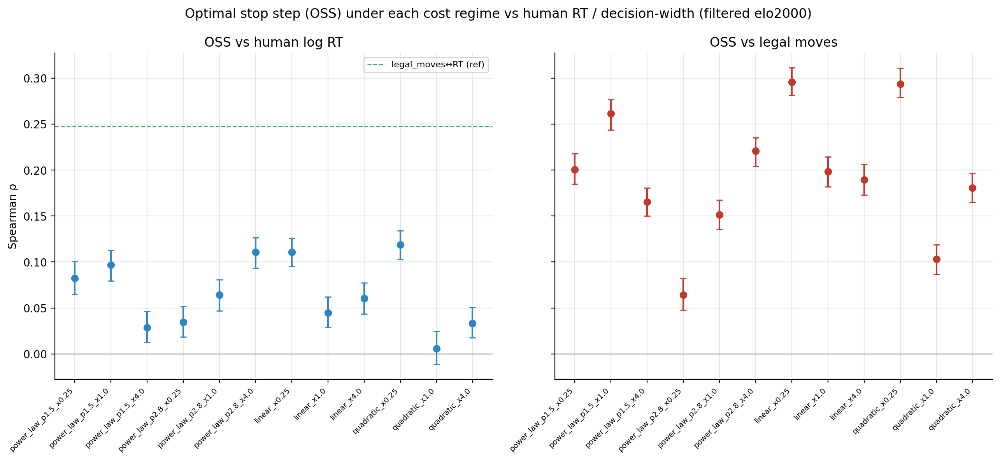

# When ought one think — and is it what people do? A step-by-step account

**Ref:** `R-METAREASON` · [Index](reference.md)

> **Status:** 📝 active. A walk-through of the whole inquiry, **one claim per step, each backed by a figure**.
> Numbers are interim (filtered elo2000, n≈13k move-level / 6.4k for tree-value signals, bootstrap 95% CIs); a
> powered ~61k refresh of every figure is generating overnight (P0/P1). Sibling
> [(R-HALT-CALIB)](halt_calibration.md) holds the step\*↔RT calibration detail.

The question in one line: **can a normative model of *when it is worth thinking* explain *when people actually
think*?** The answer turned out to be *no, not directly* — and chasing *why* produced a positive model. Read
top to bottom.

---

## Step 1 — How were the trees generated, and how were they filtered?

Every analysis sits on a dataset of Stockfish search trees over human game positions.

- **Engine / search.** Stockfish at a fixed strength (`UCI_Elo`), driven by `build_tree`: an outer PUCT/UCT
  tree with **`search_budget = 96` expansions**, **`max_depth = 4`** (shallow + bushy), each leaf valued by a
  **Stockfish search of `sf_search_limit_nodes = 100`**. Priors are **uniform** (α-β has no policy head) — a
  decision that matters later (Step 5). Strength rungs: **SF-2000** (matched to the ≥2000-Elo human
  population) and **SF-1350** (the engine floor; sub-1350 segfaults).
- **Roots.** 250k FENs sampled from the 110.5M-position human pool (`lc0/fens.txt`); index-named trees so the
  set extends by *resume* without recompute.
- **Filter.** Keep trees that are **PUCT-consistent ∧ value-monotone** (≈24.6% pass) → the clean set the
  oracle/readouts run on.
- **The normative object.** A budgeted-oracle DP turns each tree into an **optimal stop step, step\*** =
  `argmax_s [V(s) − cost(s)]` — "how long it's worth thinking here."

The figure below is what the generated trees "believe" about stopping — the step\* distribution. Note the
spike at 0 ("don't think") whose size is governed by the cost (see R-HALT-CALIB).

> **Decision:** SF-2000 trees, budget 96 / depth 4 / 100-node leaf eval, uniform priors, PUCT∧monotone
> filter. This fixes the substrate; everything downstream is read off these trees + the budgeted oracle.

---

## Step 2 — What did the normative (fitted-RL) controllers do?

Before touching humans, we asked the *internal* question: can a learned controller decide when to stop and
beat blind rules on the oracle's own terms (regret vs compute)? Two readouts trained by **policy gradient**
(exact expected-return): a **GNN-z** controller (learned root embedding) vs a **tree-stats** controller
(hand-crafted height/width/size).

The tree-stats PG controller wins (regret ≈0.104 vs GNN-z 0.154, non-overlapping CIs) at *less* compute
([(R-LMCOS-TINY)](lmcos_tiny.md)). So the normative problem is *solvable* — and, tellingly, **raw tree
structure carries more stopping signal than the learned embedding**.

> **Result:** we can fit a good normative "when to stop" (tree-stats PG ≻ GNN-z ≻ blind). But this is
> normative *self-consistency* (low regret), **not** evidence it matches people. That is Step 3.

---

## Step 3 — Why ask what humans do? (and does it matter — yes)

The project's actual goal is **correspondence**: a model that says when one *ought* to think, compared to when
people *do* (their response time). It matters because a normative account that ignores behaviour is untested
metareasoning; and because the prior human-RT work ([(R-MOVETIME-MODEL)](engine.md)) found the oracle stops on
**value-convergence** while humans deliberate on **decision-width** — a concrete gap to explain.

So we correlated every signal with human log-RT. The punchline, previewed here and proven across the next
steps:

The dominant drivers are **problem size (# legal moves, +0.25)** and **satisfaction (fraction of good moves,
−0.26)** — *not* any normative value-of-computation signal (all clustered at +0.11–0.12), and *not* the causal
controller (≈0).

> **Result (carefully):** it is **not** that "normative when-to-think ≠ human when-to-think." It is that our
> **current measure of optimal stop-time** — the budgeted-oracle step\* computed on strong-engine trees with a
> position-independent cost — does not match human when-to-think. "Optimal" here is normative only *with
> respect to that specific model*; it is not a verdict on metareasoning. The dominant human driver
> (decision-width, ~2× any of our signals) says the *model* is mis-specified, and Steps 4–6 enumerate **why**
> (concrete, fixable hypotheses) — not that the enterprise is foolish.

---

## Step 4 — The hypotheses we tried to close the gap, and what each showed

### 4a — Does a better *cost of thinking* align the oracle with RT?

Sweep cost shape × scale. **Regret barely moves** — because cost-aware regret is a near-monotone transform of
the cost-free Gain (ρ=0.98; the cost is position-independent). **step\*** *does* respond to cost but tops out
at +0.12.

**No normative signal vs human RT comes close** (filtered elo2000, bootstrap 95% CIs; softmax-VOC at its best
τ=0.1; "| legal" = partialling out legal-moves):

| normative signal | ρ vs RT | ρ vs RT \| legal-moves |
|---|---|---|
| cost-free Gain | +0.108 [+0.09, +0.13] | +0.036 |
| regret-alwaysstop (best cost) | +0.107 [+0.09, +0.12] | +0.037 |
| step\* (best cost regime) | +0.119 [+0.10, +0.13] | +0.050 |
| softmax-VOC (τ=0.1, deep-tree) | +0.120 [+0.10, +0.14] | — |
| *reference:* **legal moves** | **+0.247** [+0.23, +0.26] | — |

Every normative signal sits at ρ≈+0.11–0.12 — under half the legal-moves reference — and collapses to ≈+0.04
once legal-moves is partialled out. step\* *is* the cost-sensitive one (figure below), but it tops out at the
same ceiling.

> **Result:** cost calibration is a near-dead-end for regret; step\* is the cost-sensitive object but plateaus
> at +0.12 (≈ half the legal-moves effect). *(detail in R-HALT-CALIB.)*

### 4b — Does an *uncertainty-aware* VOC help? (softmax policy, sweep τ)

τ=1 is degenerate (softmax ≈ uniform at win-prob scale → the VOC inverts). At a calibrated **τ≈0.1** it flips
positive and **recovers** the argmax Gain (ρ≈+0.12 vs RT) — but does **not exceed** it. (Deep-tree supervisor;
τ is the only knob — the confusing cur/legal-moves panels are dropped to focus on human RT.)

> **Result:** the uncertainty framing, properly tempered, *re-derives* the value signal; it adds no RT power.

### 4c — Is step\* low only because the oracle *cheats* with hindsight?

The oracle uses backward DP over the full rollout. A **causal tree-stats halter** (sees only the tree-so-far,
like a human) does **not** beat it — both are weak (halter ≈0, oracle +0.06), both ≪ legal-moves (the grey
bar in the Step-3 figure).

> **Result:** removing hindsight does not recover RT signal. The information-asymmetry story is not it.

### 4d — The decisive test: are these signals anything *but* legal-moves proxies?

Partial out legal-moves. **Every** value/VOC/step\* signal collapses (+0.11 → +0.04); legal-moves *survives*
controlling for each of them (+0.23). They were riding on legal-moves the whole time.

> **Result:** the normative signals are **proxies for legal-moves**, not independent deliberation signals. The
> normative deliberation residual is ≈+0.04.

---

## Step 5 — Why "decision difficulty" — and how does it relate to VOC?

The pure-size reading is too dumb (people don't scan every move). The sharpening came from your prediction and
it holds: **# all moves → slower (+0.26), but # *good* moves → faster (−0.12 to −0.20)** — the sign flips,
and survives partialling on size.

So human RT is **decision difficulty**, decomposing into **size (+)**, **satisfaction (−)**, **sharpness (+)**
(the Step-3 landscape).

> **satisfaction** (def.) = the fraction of legal moves that are *near-best* (within ε win-prob of the top
> move) — how *forgiving* the position is. High satisfaction ⇒ many acceptable choices ⇒ the decision is easy
> ⇒ people commit faster (the negative term).

### Are decision-difficulty and VOC the same thing? (the key conceptual point)

Almost — and the gap between them *is* our whole result. Write **VOC = value(thinking) − cost(thinking).**

- **They agree on the value side.** *Satisfaction*: many near-equal good moves ⇒ thinking can't improve your
  choice (you're already near-optimal) ⇒ low VOC **and** easy ⇒ fast. *Sharpness*: a contested/critical move
  ⇒ high VOC **and** hard ⇒ slow. On these, difficulty and VOC predict the *same* thing — and indeed our VOC
  signals capture them (that's the +0.04 they legitimately own).
- **They diverge on the cost side.** Human RT carries an **enumeration cost ∝ size** (you must scan the
  options even to dismiss them) — a cost of the *process*, not the *value of its outcome*. Our oracle's cost
  was **position-independent**, so the VOC ledger never charged for size and missed it entirely.

> **Clarification:** decision difficulty is **not a rival to VOC — it is VOC with a cost calibrated to the
> person's effort.** They coincide exactly when the computation cost scales with the problem (∝ enumeration);
> ours didn't, so our VOC kept only the *value* side (+0.04) and dropped the dominant *cost* side (+0.25). The
> legal-moves effect is the human computation cost our oracle forgot to bill.

### The flip is also an engine-strength litmus test

`# good moves` is defined by the *engine's* values, so the flip appears **only if engine-good = human-good**.
No flip ⇒ a strength mismatch (e.g. a superhuman engine whose "good" humans can't track). The flip is clean at
SF-2000 (the ≥2000 population), which validates that rung; the SF-1350 vs SF-2000 comparison (overnight) finds
the best-matched strength.

---

## Step 6 — Why our optimal-stop measure misses, and what we're doing about it

The Step-3/5 reframe says the failure is a **mis-specified VOC**, in four concrete, separable ways. Each is a
hypothesis with an experiment — and note **"weaken the model" (H3) is only one of them**, not the whole fix.

- **H1 — wrong cost.** Our cost is position-independent; the human cost scales with **enumeration (∝ size)** —
  the +0.25 the VOC ledger never billed. *Fix:* a position-dependent cost ∝ legal-moves. (→ R-HALT-CALIB / P2.)
- **H2 — wrong value / supervisor.** step\* is graded against the *engine's* values; if **engine-good ≠
  human-good** (strength mismatch) it optimizes the wrong objective. *Fix:* the strength ladder + the
  sign-flip litmus. (→ P1.)
- **H3 — generator too smart.** A strong MCTS+SF prunes the breadth humans actually traverse, so the
  tree-stats carry a *machine's* consideration, not a person's. *Fix:* a **dumber, more human-like generator**
  (noisy-myopic eval → optimistic Best-First-Search). (→ P2/P3.)
- **H4 — missing the enumeration stage.** The oracle starts *after* the moves are evaluated — it models only
  *refinement*, never the dominant **enumeration** stage — and has no **policy prior**, so it "considers" all
  `n`. *Fix:* an upfront consideration cost + a policy prior (prior-focused, not all-`n`). (→ P4.)
- **(H5 — hindsight asymmetry: rejected** by the causal halter, Step 4c.)

The experiments map one-to-one onto H1–H4, cheapest → most invasive:

| # | experiment | tests | status |
|---|---|---|---|
| **P0** | 61k powered re-run of every figure above | tightens all CIs; confirms the halter (was n≈2.5k) | **running overnight** (`10395329`) |
| **P1** | SF-1350 vs SF-2000: sign-flip strength + width↔RT | dumber-engine width recovery + the **litmus test** | **running overnight** (`10395330`, +filter) |
| **P2** | `sf_search_limit_nodes` 100→1 (noisy-myopic leaf values) | isolates dumb *values* from a weak *engine* | teed up (needs config-override verify) |
| **P3** | optimistic **Best-First-Search** generator vs UCT | does a deliberately dumber search recover human breadth? | gated on P1/P2 |
| **P4** | **policy-prior** hybrid (lc0 policy guides expansion, SF evaluates) | prior-focused consideration; *(top-k × stakes)* cost vs raw `n` | gated on P3 |

> **Decision:** P0/P1 build the powered dataset + the strength litmus overnight. The headline test for the
> generative-search thesis is **does a dumber engine/eval make tree-width recover the +0.25 legal-moves
> effect** — if yes, build the BeFS generator (P3) and the policy prior (P4); both re-open the
> strength-ladder + faithfulness contracts ([(R-DATA)](reference.md)), so they are explicit v2 work.

---

## Appendix

**Softmax-VOC model (M1–M3 spec).** Policy = `softmax(v_t/τ)`; halt value = `E_softmax[V_sup]` (closed form,
no sampling); benefit of thinking = the sharpening = uncertainty reduction. Supervisor = deep-tree `final_Q`
(free) or an independent stronger Stockfish (M3 → folded into P1). Encoder unchanged. M1/M2 done (Step 4b);
M3 = the strength ladder.

**Figure index** (all `figures/lmcos_tiny/`, interim elo2000): `oss_dist_elo2000` (Step 1) · `regret_vs_compute`,
`regret_by_model` (Step 2) · `rt_headline` (Step 3) · `voc_rt_costsweep`, `oss_rt_costsweep`, `voc_tau_sweep`,
`rt_partials` (Step 4) · `good_moves_signflip` (Step 5). Method: Spearman with percentile-bootstrap 95% CIs
([[bootstrap-cis-always]]); partials via the rank formula; the metric is pre-committed (human log-RT).

**Data provenance:** [(R-DATA)](reference.md). **Calibration sibling:** [(R-HALT-CALIB)](halt_calibration.md).
