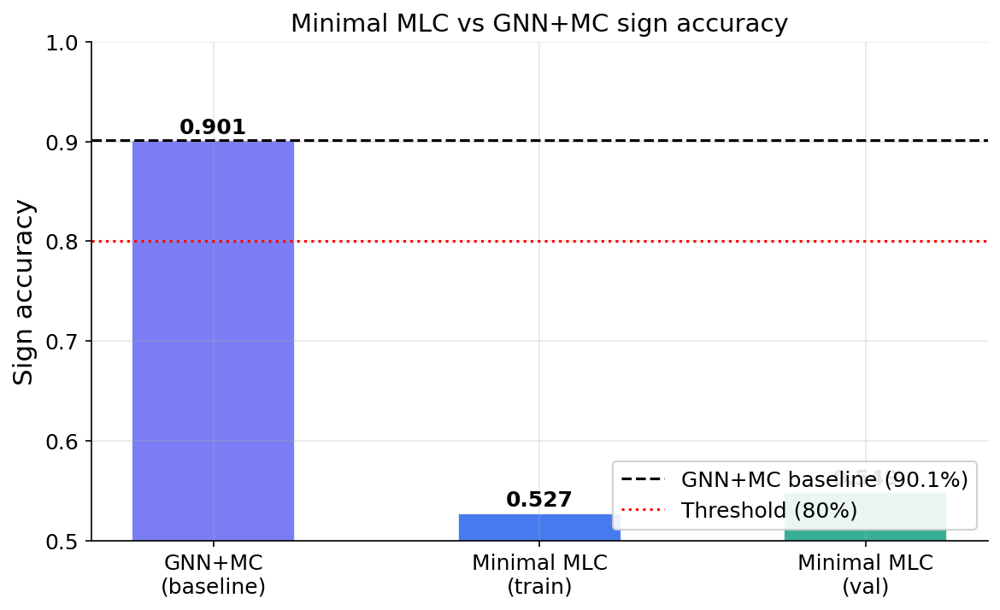
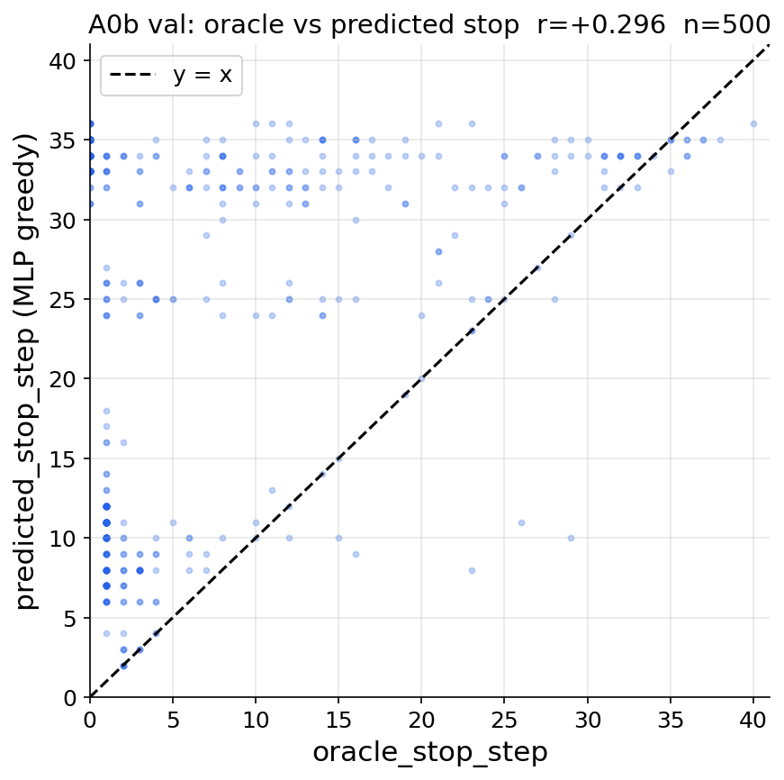
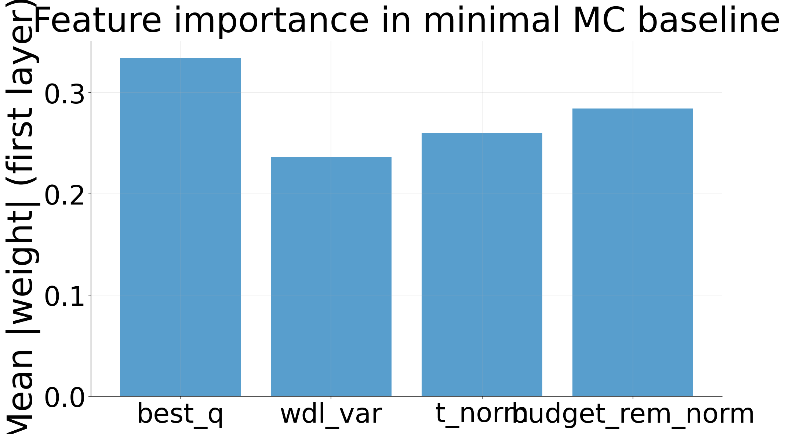
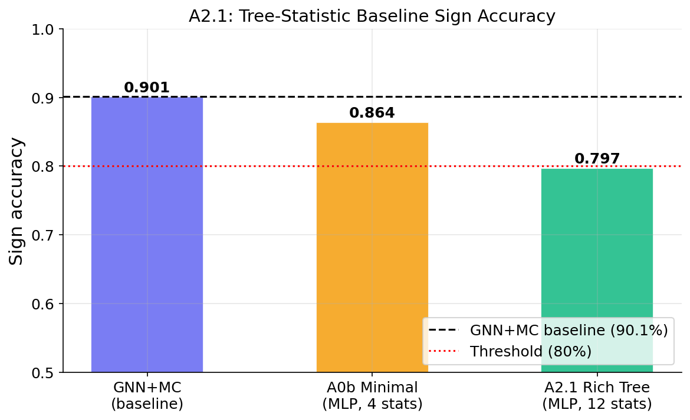
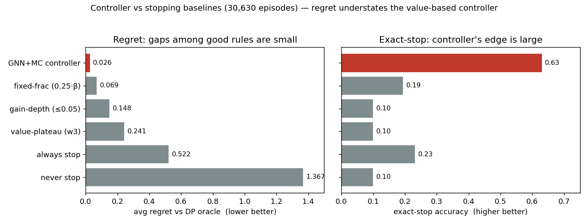
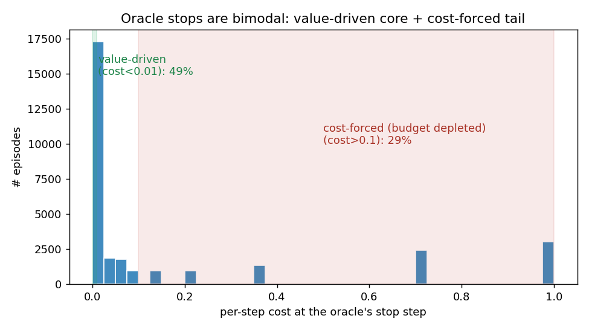

# Minimal meta-controller and budgeted stopping baselines

**Ref:** `R-MINMODEL` · [Index](README.md) · Thread: LMCOS

## Overview / Summary

How much of the GNN+MC controller's stopping skill survives if we strip it down? Two inquiries.
**(1) Minimal model:** can raw scalar tree-statistic features (no GNN encoder) predict the oracle's
halt/continue decision? **No** — a 4-feature MLP reaches only **54.6% val sign accuracy** (≈chance)
vs the GNN+MC's 90.1%, confirming the GNN encoding of the full Q-value landscape is essential.
**(2) Hand-written baselines:** how much lift does the trained controller have over simple stop
rules on the DP-oracle-regret objective? The **controller dominates** (avg regret +0.026, 5.6×
lower than the best baseline; exact oracle stop 63% of episodes). The best *hand-written* rule is a
position-blind **fixed-fraction-of-budget** stop — revealing that the oracle's stop is substantially
a **budget-structure** decision, and that **regret is a weak discriminator** among good rules
(exact-stop separates them far better).

## Results

### Minimal model: 4 scalar features cannot replace the GNN



| Model | Val sign acc | Val exact stop | r(pred, oracle) |
|---|---|---|---|
| GNN+MC | 90.1% | — | — |
| **Minimal MLP** (4 features) | **54.6%** | **5.2%** | **+0.291** |

(`minimal_mc_baseline.py`, run 2026-06-05, 2K train / 500 val, budget 43.)



- **Near-chance sign accuracy** confirms the 4 raw scalar features (`best_q`, `wdl_var`, `t_norm`,
  `budget_rem_norm`) carry little information about the oracle's halt/continue decision.
- **Training dynamics:** MSE loss falls monotonically (0.143 → 0.053 over 20 epochs) but sign
  accuracy oscillates wildly (0.54 → 0.41 → 0.68 → 0.52) — the model fits the regression target,
  but the zero-crossings of predicted advantages are unstable. The weak r=+0.29 on stop steps
  suggests a faint timing prior (probably `t_norm`), but the GNN encoder is essential for
  discriminative performance.



A tree-stats MLP variant was also scoped (`tree_stats_baseline.py`):


### Controller vs hand-written stopping baselines



On 30,630 episodes of the `subtree_weighting_root_budget` controller (avg regret vs DP oracle,
lower = better):

| Stop rule | avg regret ↓ | exact-stop acc | avg expansions |
|---|---|---|---|
| **GNN+MC controller** | **+0.0264** | **0.630** | 4.9 |
| `halt_at_frac_0.25` (fixed-fraction) | +0.0693 | 0.193 | 8.0 |
| `halt_at_frac_0.1` | +0.0969 | 0.285 | 3.2 |
| `halt_when_gain_le_0.05` (gain-depth) | +0.1482 | 0.100 | 1.6 |
| `halt_at_frac_0.5` | +0.1932 | 0.104 | 16.1 |
| `value_plateau_w3_le_0.01` | +0.2412 | 0.099 | 3.3 |
| `always_halt_0` (always stop) | +0.5215 | 0.231 | 0.0 |
| `always_continue_to_end` (never stop) | +1.3668 | 0.099 | 30.1 |

- **Controller dominates** — ~2.6× lower regret than the best baseline, 20–52× the trivial anchors;
  exact oracle stop step **63%** of episodes.
- **Fixed-fraction-of-budget is the best *hand-written* rule** (`halt_at_frac_0.25`, +0.069),
  beating every value-based rule. A position-blind "spend ~10–25% of the budget then stop" anchor
  predicts the oracle's stop better than the noisy per-step value signal.
- **Value-plateau under-performs gain-depth** (+0.241 vs +0.148): windowed smoothing delays the
  stop (3.3 vs 1.6 expansions), but the oracle usually wants to stop *early*, so noise-robustness
  hurts. `always_halt_0` gets 23% exact-stop because the oracle itself halts at step 0 on ~23% of
  episodes (many positions need no search) — yet its blanket regret is 20× the controller's.

### Why fixed-fraction competes: budget vs value in the oracle's stop



Decomposing the oracle's stop on the same 30,630 episodes (recovered cost config
`time_lambda=18.537`, maint off):

1. **Stops are bimodal, not uniformly budget-dominated.** At the stop step, the per-step cost is
   **< 0.01 in ~49%** of episodes (value-driven — median gross value of continuing = 0.000, nothing
   left to gain) but **> 0.1 in ~28%** (cost-forced — budget so depleted the convex time cost swamps
   any value). The core is value-driven; budget has outsized sway on a sizable minority.
2. **The oracle stops early.** Median stop = **3.8% of starting budget** (IQR 0.9–14%);
   `corr(stop, budget) = +0.41`. "Stop soon" is almost always right → a small fixed fraction
   approximates it *without value info*, which is why a position-blind rule competes.
3. **Regret is a weak discriminator among *good* rules.** Good rules cluster (controller +0.026,
   fixed-fraction +0.069, gain-depth +0.148 — a few % of the return range). **Exact-stop separates
   them far better** (0.63 vs 0.19 vs 0.10).

**Takeaways.** (a) `time_lambda` and the budget distribution are **levers**: ~28% of stops are
budget-forced, masking the value signal — lowering the cost weight / using longer budgets would
sharpen value-driven stopping and *reduce* fixed-fraction's edge. (b) **Report exact-stop (or a
value-normalized regret) alongside regret** — regret alone undersells the value-based controller.

## Methods

- **Minimal model** (`lmcos/analysis/minimal_mc_baseline.py`): 4 scalar features → MSE → predicted
  `target_advantage`; sign of the advantage = halt/continue. Labels from the pack-path oracle
  (`pack.py` / `oracle.py`), never invalidated by the A0a analysis-layer fixes. Behavioral anchor =
  val sign accuracy.
- **Baselines** (`analyze_budgeted_controller_run.py`, `core` mode): runs on **existing** packed
  per-episode diagnostics (`*_diagnostics.jsonl` carrying oracle labels + trajectory + controller
  predictions) — **no new trees, no GPU**, so it advances in parallel with the tree-gen and Lc0-gain
  threads. Compares the controller's predicted stop vs `_baseline_sweep` hand-written rules vs the
  DP oracle.

```bash
cd lmcos && source /home/hl4291/venv/bin/activate
PYTHONPATH=$PWD python -m cts.analysis.analyze_budgeted_controller_run --config <yaml>
# yaml: diagnostics_path, log_path (training .out), output_dir, report_mode: core
```

## Appendix (Logs)

### Procedure status

| Step | Status |
|------|--------|
| **Minimal model** A0b re-run with corrected halt_rewards | ✅ done (2026-06-05) |
| Config D YAML (`subtree_weighting_root_scratch_D.yaml`, d_embed=16, unfreeze) | ⬜ incomplete |
| Tree-statistic features → MC (no GNN head) | ⬜ incomplete |
| **Baselines:** gain-depth-only baseline + `test_budgeted_baselines.py` (12 tests) | ✅ done |
| Run controller-vs-baseline comparison on existing diagnostics | ✅ done |
| Semi-smart baselines (value-plateau, fixed-fraction) + tests (16 total) | ✅ done |
| Cost-vs-value decomposition + slides | ✅ done |
| Argmax-stability baseline (needs oracle_best_move trace) | ⬜ later |
| Model-variant comparison on other controller diagnostics (ysagiv configs) | ⬜ next |
| MLP-over-tree-stats baseline (`tree_stats_baseline.py`) vs GNN | ⬜ |
| Re-run on the U1.3 controller (refit on human FENs) | ⬜ after U1.3 |

### Config D (planned minimal GNN)

`d_embed=16`, `d_message=16`, `n_heads=1`, `hidden_dim=32`, `hidden_layers=1`,
`unfreeze_encoder: true` (online embeddings, no `z_root` cache). Data:
`…/ysagiv/chess/CTS/data/controller_packed_combined_nomaint_no_xaba/train/` (subsample 10 shards).
Success metric = **GNN loss** on ablation shards (not stop-step accuracy alone). Guardrail: do not
run large-scale GNN pretrain before a minimum-viable architecture is established on existing shards.

### Invalid runs (do not cite)

| Run | Date | Reported outcome | Why invalid |
|---|---|---|---|
| A0b minimal MLP (2K/500 val, budget 43) | 2026-06-03 | val sign acc ≈ 86.4% | Used evolving `q[s, best_idx[s]]` for halt_rewards, not `Q_final[best_idx[s]]` |

### Notes

- **Independence (baselines):** uses existing `*_diagnostics.jsonl`; re-run on any controller's
  diagnostics to compare models. The many ysagiv `fittedq_*_diagnostics.jsonl` are a ready-made
  model-variant comparison set (same command, different inputs).
- Full baseline report + 15 diagnostic plots: `/scratch/gpfs/GRIFFITHS/hl4291/tmp/u3_baselines/`.
  The two kept figures are archived under `../figures/archive/u3_baselines/`.

*This report merges the minimal-MC half of the former `R-A0`, the former `R-A2` (minimal model /
skip GNN pretrain), and `R-U3` (controller vs baselines) reports.*
