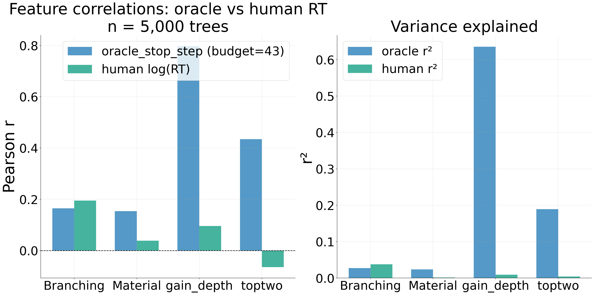
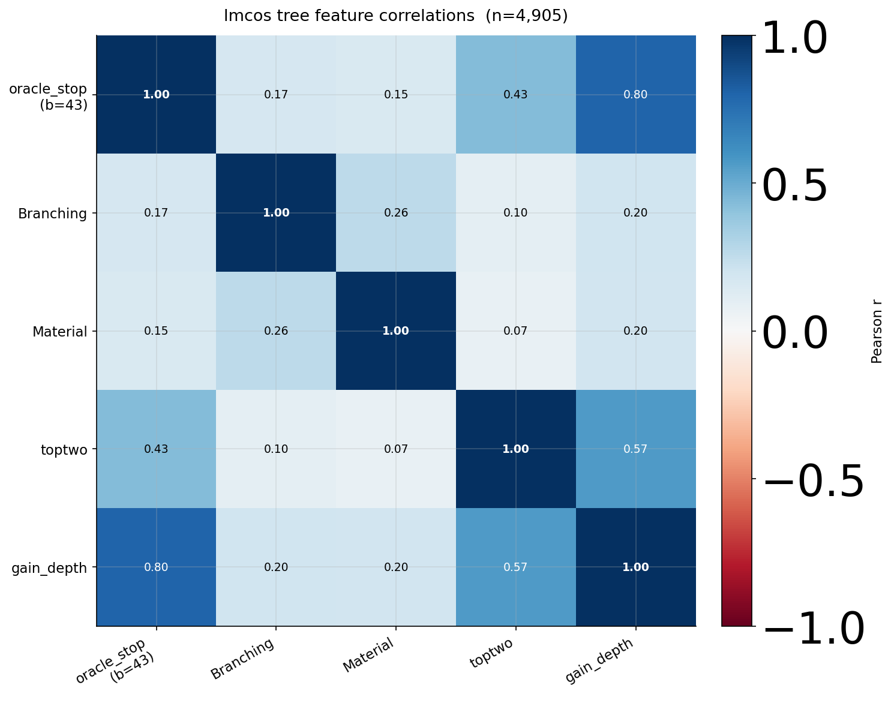
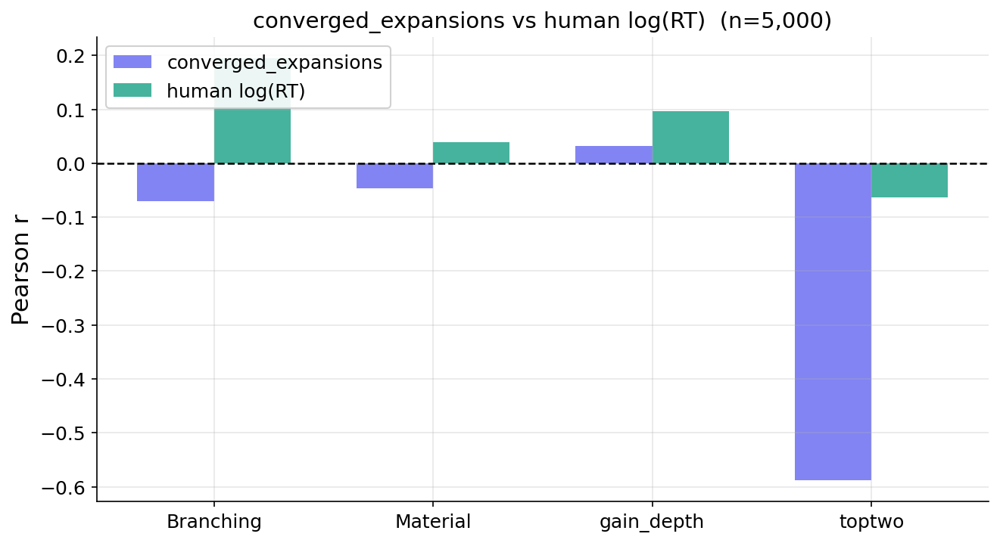
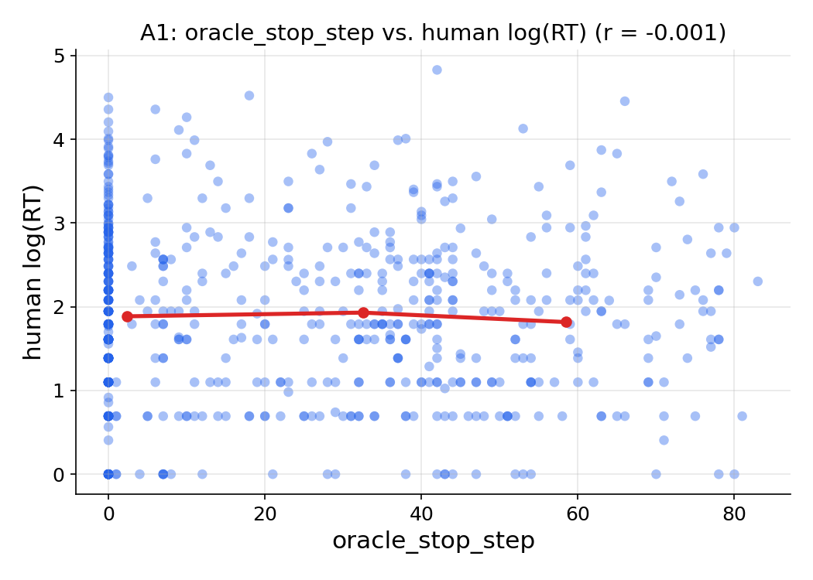
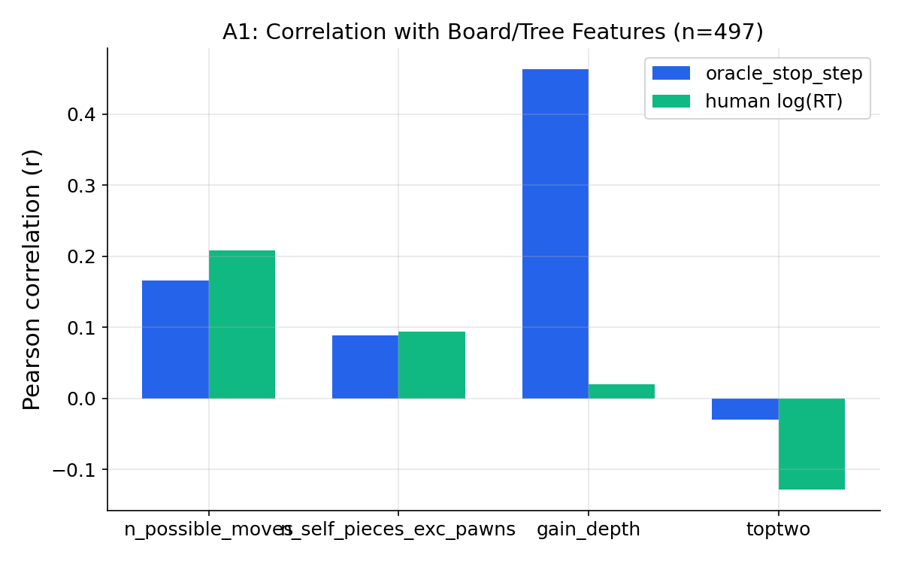

# Oracle stop step vs human response time

**Ref:** `R-ORACLE-RT` · [Index](README.md) · Thread: LMCOS · Framework: [(R-THEORY)](human-theory-stopping.md)

## Overview / Summary

Does a normative **DP oracle's stop step** — when a budgeted optimal-stopping agent decides it has
searched enough — track how long *humans* think on the **same positions**? Across LMCOS search
trees (n = 39,668) the same board/value features that drive the oracle's stop step also drive human
RT directionally (**4/4 feature directions match**), and on matched human FEN trees the oracle stop
step correlates **positively** with log(RT) (smoke r = +0.091, significant at n = 497). The
oracle's stopping is driven by **value-landscape** features (toptwo, gain_depth/VOC), whereas human
RT is driven more by **structural complexity** (branching, material) — a split this thread is
designed to sharpen at 10K. A strength-matched **SF-2000** oracle is the conditional follow-up if
the LC0 oracle proves a poor RT match.

## Results

### Same features predict oracle stop and human RT (Tier A — LMCOS trees)



On all 39,668 LMCOS `filtered_shard` trees (budget T=96, DEFAULT cost config):

| Feature | r(oracle_stop_step) | r(converged_expansions) | r(human RT) | OSS dir |
|---|---|---|---|---|
| branching | +0.014 | −0.065 | +0.195 | ✓ (tiny) |
| material | +0.011 | −0.059 | +0.039 | ✓ (tiny) |
| gain_depth (VOC) | **+0.233** | +0.052 | +0.096 | ✓ |
| toptwo | **−0.290** | −0.590 | −0.064 | ✓ |

- **oracle_stop_step: 4/4 correct directions** vs human RT proxies. (converged_expansions: only 2/4
  — branching/material wrong direction.)
- The near-zero oracle correlations for branching and material are **structurally expected**:
  oracle_stop_step is driven by **value convergence** (when is the Q-gap large enough to justify
  stopping?), a property of the *value landscape*, not board structural complexity. Humans
  enumerate moves, so branching/material drive *their* RT; lc0 handles branching natively via its
  PUCT prior, so what matters for the oracle is whether any action is clearly dominant (toptwo) or
  whether deeper search gains value (gain_depth/VOC).



`r(oracle_stop_step, converged_expansions)` = **0.525**. oracle_stop_step: mean 23.6, std 23.1,
median 15. converged_expansions: mean 50.9, std 35.4, median 58.



**Budget sensitivity.** oracle_stop_step varies with starting budget (cost rises convexly as the
budget depletes): tighter budgets → earlier stop; full budget (96) → approaches the zero-cost case
(first step MCTS recommends `final_best`).

### Same FEN: oracle stop ↔ human RT (Tier B — human FEN trees)



Smoke on n = 497 clean human-FEN trees (the 1K job hit the 1-hour SLURM wall):

| Metric | Value |
|---|---|
| **r(oracle_stop_step, log RT)** | **+0.091** |
| r(branching, log RT) / oracle | +0.208 / +0.166 |
| r(material, log RT) / oracle | +0.094 / +0.089 |
| r(gain_depth, log RT) / oracle | +0.020 / +0.463 |
| r(toptwo, log RT) / oracle | −0.128 / −0.030 |

- Direction check: **oracle_stop_step r > 0 ✓** (significant at n = 497; threshold |r| > 0.088).
- **gain_depth shows very strong oracle correlation (+0.463) but near-zero human correlation
  (+0.020)** — consistent with Tier A: VOC strongly predicts when the *oracle* halts, but humans
  don't natively compute VOC; their RT tracks structural complexity. At 10K this split should
  sharpen.



(Partial 50K/5K snapshots also exist:
`../lmcos/analysis/figures/human_oracle_rt_comparison_50k_partial5k.png`,
`../lmcos/analysis/figures/human_oracle_features_comparison_50k_partial5k.png`.)

### Strength-matched engine (Tier-B follow-up — SF-2000, on hold)

No results yet — **gated on the 10K matched-position r** from Tier B. The hypothesis: LC0 (~3000+
ELO) may "see through" positions that a ≥2000-ELO human pool finds hard, so a Stockfish
`UCI_LimitStrength` ELO=2000 oracle (CP→WDL via `pwin = 1/(1+exp(−cp/400))`) on the *same* human
FENs may align deliberation better, especially on tactical errors. If SF-2000 *also* fails, that
strengthens the case that engine VOC fundamentally does not capture human deliberation (not a
strength artifact).

## Methods

### Definitions

**oracle_stop_step** (`BudgetedOraclePolicy.optimal_stop_step`): from `build_compact_trajectory` →
`budgeted_oracle_from_trajectory` (same path as `pack.py`). `halt_rewards[i]` = teacher fixed Q for
the MCTS-recommended action at controller step `i`. **Oracle** stop is `policy.optimal_stop_step`
from the DP, not the greedy first-zero-advantage rule. **Predicted** stop at eval uses
`predicted_stop_from_advantages()` (controller eval rule).

**converged_expansions**: 1 + last step where `oracle_best_move_index` deviated from its final
recommendation (first step of permanent argmax stability; excludes step 0). `oracle_stop_step ≤
converged_expansions` always; equal iff no MCTS oscillation after the first correct recommendation
(~43% of trees at full budget).

**Features** (all from Lc0 96-node oracle MCTS / FEN; human RT analogs are **Stockfish depth-5** on
human lichess 10+0, n=1M — the comparison is deliberately cross-regime):

| Feature | Lc0 definition | Stockfish analog |
|---|---|---|
| `toptwo_equiv` | `Q_final[1st] − Q_final[2nd]` (deep Lc0 Q-gap) | `e_win_best − e_win_second_best` (d=5) |
| `gain_depth_equiv` | `Q_final[best_idx[-1]] − Q_final[best_idx[1]]` | VOC `V_deep(a_deep) − V_deep(a_shallow)` |
| `branching` | `n_possible_moves` from FEN | same (engine-independent) |
| `material` | `n_self_pieces_exc_pawns` from FEN | same (engine-independent) |

`toptwo_equiv` uses the **deep** evaluation (matching the Stockfish definition); step-1 Q-values
(1 explored action) would be ill-defined.

### Pipeline (canonical code paths)

| Layer | Module | Role |
|---|---|---|
| Trajectory | `pack.build_compact_trajectory` | precomputed `halt_rewards`, `tree_sizes` |
| Oracle DP | `oracle.compute_budgeted_oracle` | `target_advantages`, `optimal_stop_step` |
| Analysis glue | `pack.budgeted_oracle_from_trajectory` | trajectory → policy (same as packing) |
| Features | `analysis/board_tree_features.py` | FEN + Lc0 tree features (Tier A/B) |
| Predicted stop | `oracle.predicted_stop_from_advantages` | controller eval rule on model outputs |

Tier B (`human_oracle_comparison.py`) calls the **same pack-path oracle as training** and validates
FENs at load time (`root_position_spec == manifest full_fen`) — stale trees are skipped.

### Data paths (10K human FENs)

- FENs: `/scratch/gpfs/GRIFFITHS/hl4291/tmp/human_fens_10k.txt` · Manifest: `…_10k_manifest.parquet`
- Trees: `/scratch/gpfs/GRIFFITHS/hl4291/tmp/human_trees_10k/` · Shard YAMLs:
  `lmcos/slurm/configs/1_preprocess_data/human_trees_10k_shards/`

## Appendix (Logs)

### Procedure status

| Step | Status |
|------|--------|
| Tier A `oracle_stop_step_features.py` (corrected halt_rewards + feature defs) | ✅ done |
| `converged_expansions_analysis.py` | ✅ done |
| Oracle invariant tests (72 tests, verified on 1K real trees) | ✅ done |
| Tier B: export 10K human FENs (+ manifest, seed 43) | ✅ done |
| Tier B: 10K as 20 parallel shards (jobs 9266775–9266794) | ✅ submitted (under QOS limit) |
| Tier B: `compute_budgeted_oracle()` on all 10K + join + plots A/B/C | ⬜ after jobs complete |
| SF-2000: `build_tree.py` Stockfish + ELO + CP→WDL halt rewards | ⬜ gated on Tier B r |

### Tests (72, all passing)

`tests/test_oracle_stop_step_features.py`, `…_oracle_stop_vs_min_expansions.py`,
`…_converged_expansions.py`, `…_minimal_mc_baseline.py`. Key invariants verified on 1,000 real
trees: `halt_rewards[i] == oracle_final_root_q_values[best_idx[i]]`; R_halt ≤ R_continue (zero
cost); equality iff `best_idx[i] == final_best`; `oracle_stop_step < converged_expansions` iff a
reversal exists between them; quality gap > cost at all continue steps; controller and oracle use
the same advantage ≤ 0 criterion.

### Invalid runs (do not cite)

| Run | Date | Outcome | Why invalid |
|---|---|---|---|
| Tier A initial, 5K trees, budget 43 | 2026-06-03 | — | Two bugs (halt_rewards evolving-Q; mixed-regime gain_depth) |
| Tier A directional, glob `filtered_shard_0000?` | — | — | Missed shards 00010–00019 (half the data); fixed to `filtered_shard_*` |

**Bugs corrected:** (1) halt_rewards used evolving Q-estimates instead of the teacher's fixed
Q-values, making oracle_stop_step sensitive to Q-growth rate rather than action identity;
(2) gain_depth used a mixed-regime numerator/denominator. Both fixed; the original figures are
superseded by the corrected results above.

### Reproduce (Tier B after 10K trees complete)

```bash
cd /home/hl4291/chess_analysis/lmcos && export VENV_DIR=/home/hl4291/venv
python analysis/human_oracle_comparison.py \
    --trees-dir /scratch/gpfs/GRIFFITHS/hl4291/tmp/human_trees_10k \
    --manifest /scratch/gpfs/GRIFFITHS/hl4291/tmp/human_fens_10k_manifest.parquet
```

### Guardrails

Do **not** start SF-2000 before Tier B gives a directional r on matched positions. FEN validation
is enforced at load time; stale trees are skipped automatically.

*This report merges the former `R-A0` (oracle direction + minimal MC, the minimal-MC half moving to
[(R-MINMODEL)](minimal-model-and-baselines.md)), `R-A1` (human FEN trees vs RT), and `R-A3` (SF-2000
weaker engine) reports.*
