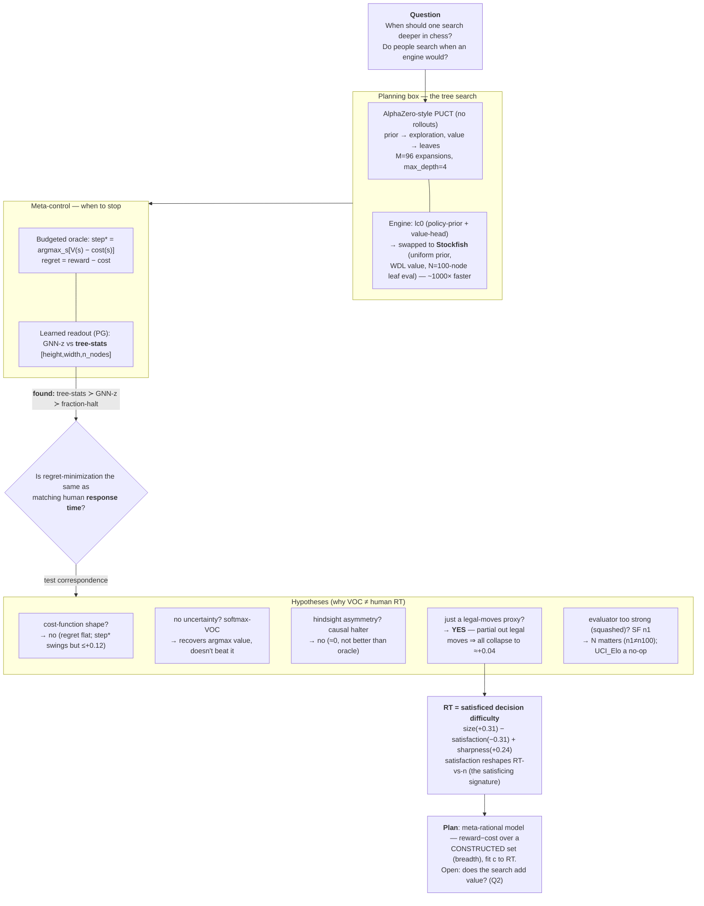

# Tree search & human deliberation: when (and how) ought one to think?

**Ref:** `R-TREESEARCH` · [Index](reference.md)

> **Status:** 📝 active. The **single linear narrative** for the deliberation inquiry — it folds in the former
> VOC discovery report (R-VOC) and is the source-of-truth for the model + program. Powered on filtered SF-2000
> trees (n≈65k human moves, bootstrap 95% CIs). Calibration detail of the budgeted-oracle step\* lives in
> [(R-HALT-CALIB)](halt_calibration.md); data provenance in [(R-DATA)](reference.md).

## The map

---

## 1 · The question, and the planning box

We began with a normative question — *when is it worth searching deeper in a chess position?* — and its behavioural
twin — *do people deliberate longer where an engine would search more?* Both need a model of "searching," so we
build one.

**The tree search.** `build_tree` grows an **AlphaZero-style PUCT tree** — **no rollouts**; each node is valued by
an engine heuristic, and which node to expand next is chosen by PUCT. Two heads matter and are easy to conflate:

- the **prior** `P(child)` enters *only* the **PUCT exploration term** (it biases *which* child to visit), and
- the **value** is backed up from the leaves (it is *what* a node is worth).

**Engine (lc0 → Stockfish).** Originally lc0 supplied **both**: priors from its **policy head**, values from its
**value head**. We swapped to **Stockfish** (~1000× faster on CPU): **priors are uniform** (α-β has no policy
head) and **values are Stockfish's WDL** (its eval→win/draw/loss model). Everything below is on **SF** trees.
Three knobs, kept distinct:

| knob | role | matters? |
|---|---|---|
| **`UCI_Elo`** | a *play* handicap | **no-op** for us — we read the eval, not the played move ([[sf-uci-elo-noop-for-eval]]) |
| **N = `sf_search_limit_nodes`** = 100 | the **leaf evaluator** (N-node SF search per node) — the **heuristic / "gut"** | **yes** (n1 vs n100 differ, ρ≈0.93) |
| **M = `search_budget`** = 96 | the **PUCT expansions** built on the heuristic — the **planning** | the trace we analyze |

The trees: SF-2000, `max_depth=4`, 96 expansions, uniform priors, then a **PUCT-consistent ∧ value-monotone**
filter (~24.6% kept → ~61k). The step\* distribution (what the trees "believe" about stopping):

> **Decision:** SF-2000, budget 96 / depth 4 / N=100 leaf eval, uniform priors, PUCT∧monotone filter — the
> substrate for everything downstream.

## 2 · Meta-control: can a learned readout decide when to stop?

A budgeted-oracle DP turns each tree into an **optimal stop step, step\*** `= argmax_s[V(s) − cost(s)]`, and
**regret** `= reward − cost`. *Internal* question first: can a learned controller minimize regret, beating blind
rules? Two readouts trained by policy gradient — **GNN-z** (learned root embedding) vs **tree-stats**
(`[height, width, n_nodes]` per step):

 

> **Result:** the controllers solve the regret problem (tree-stats PG ≻ GNN-z ≻ fraction-halt; [(R-LMCOS-TINY)](lmcos_tiny.md))
> — and, tellingly, **raw tree structure carries more stopping signal than the learned embedding**. But low
> regret is *self-consistency*, not correspondence to people. So: **is regret even the right target for RT?**

## 3 · The pivot: does any of this match human response time?

We correlated every signal with human log-RT. The landscape:

The dominant drivers are **# legal moves (+0.31)** and **fraction of good moves (−0.31)** — *not* any
value-of-computation signal (+0.12–0.16), *not* the causal controller (≈0).

> **Result (carefully):** it is **not** that "normative ≠ human." Our *specific measure* of optimal stop-time
> (step\* on strong-engine trees, position-independent cost) doesn't match human RT — the model is mis-specified,
> and §4 enumerates the *why* we tested.

## 4 · The hypotheses, and what each showed

- **4a — Wrong cost shape?** Sweep it. Regret is **flat** (it's a monotone transform of cost-free Gain, ρ=0.98,
  because the cost is position-independent); step\* *does* respond but tops out at +0.12. 
- **4b — No uncertainty?** Re-grade the policy as a **softmax** over the root values and ask the value of
  *sharpening* it. Precisely: at step `s`, halt value `= Σ_c softmax(q_trace[s,c]/τ)·V_deep(c)` — the expected
  deep value of the move a softmax-`τ` policy would play. Early search ⇒ flat values ⇒ near-uniform softmax ⇒
  averages good and bad ⇒ low; search **sharpens** the softmax ⇒ value rises. The "benefit of thinking" is this
  sharpening = uncertainty reduction. At calibrated `τ` it **recovers** the argmax value (~+0.16) but does **not
  exceed** it. 
- **4c — Hindsight asymmetry?** step\* is computed by backward DP — it "knows the future." A **causal halter**
  (tree-stats, sees only the tree-so-far) does **not** beat it (≈0 vs +0.06; both ≪ legal-moves, the grey vs
  light-grey bars in §3). So information asymmetry is not it.
- **4d — Just a legal-moves proxy?** The decisive test. Partial out legal-moves and **every** value/VOC/step\*
  signal collapses (+0.12–0.16 → **≈+0.04**); legal-moves *survives* controlling for them (+0.22). 
- **4e — Evaluator too strong (values squashed)?** Vary the leaf eval `N`. **N matters** (n1 vs n100 differ,
  ρ≈0.93 — the overnight `elo2000_n1` set is a genuinely noisier/myopic "gut"); separately, `UCI_Elo` is a
  **no-op** for the eval (SF-1350 ≡ SF-2000 bit-identical) — so strength must be varied via the *search*
  (nodes/depth), not `UCI_Elo`.

> **Result:** no value-of-computation or stopping-time formulation tracks human RT beyond ≈+0.04. The driver is
> something else.

## 5 · What it actually is: satisficed decision difficulty

RT decomposes into **size (+)**, **satisfaction (−)**, **sharpness (+)** — and the *good*-moves term flips the
sign of the *all*-moves term:

And the clincher: **satisfaction reshapes the entire RT-vs-`n` curve** — high-satisfaction positions plateau low
(stop once good-enough, no matter `n`), low-satisfaction ones stay steep. That is **satisficing**, made visible:

> **Result:** RT = **satisficed decision difficulty**. The plateau-shift shows it's not bare problem-size
> (Hick's law) but a *stop-when-good-enough* rule — which is exactly what a meta-rational model predicts.

## 6 · The model, and two questions about the search

**The meta-MDP.** Deliberation time = optimal compute under a cost: state = the consideration set built so far;
actions = *include the next candidate move* or *stop*; reward on stop = `V_sup(chosen) − c·#inclusions` (= −regret);
optimal policy = grow while marginal VOC > `c`, else stop (**satisfice**). **~1–2 parameters** (`c`, prior
noise). **Prediction:** RT ∝ #computations. **Test:** fit `c` to RT; how much of the §5 structure does a 1–2-param
meta-RL reproduce vs the ±0.31 ceiling? *(Current 1-param meta-RL on the depth substrate: +0.16 vs ±0.31.)*

**Q1 — are we already doing best-first search?** Yes. With **uniform priors**, PUCT reduces to **UCB** (exploit
`Q` + visit-count exploration), so we're already running a heuristic best-first search with a **UCT selector**
(not greedy-argmax), which is **breadth-leaning** (it touches many root moves early). So the construal can be read
off the *existing* expansion trace; the levers are the **selector** and a **per-move cost + satisficing stop** —
not "MCTS vs BeFS" wholesale.

**Q2 — does the tree search add value?** *(open)* Planning is worth modelling only if it changes the prognosis.
We've stressed the **prior** (N) but not the **search** (M). Provisional probe: heuristic↔planned rank-corr ≈0.33,
argmax settles ~step 78/95 — the search **reorders heavily** (adds a lot), but it's artifact-prone and needs a
clean 1-ply-vs-converged measurement. *The subtlety:* the search's value-add is in **depth** (where step\*/VOC
live, +0.16), while RT is **breadth**-driven (+0.31) — and the breadth is already in the *early* UCT trace.

## 7 · The plan from here

| # | experiment | what it fits / tests | status |
|---|---|---|---|
| **P-FIT** | fit `c` (+prior noise) to RT on the **breadth trace** (root-move inclusion order from the existing UCT trees) + satisficing stop | the headline: meta-RL variance vs the ±0.31 ceiling, and whether the §5 signatures emerge from 1–2 params | the frontier |
| **Q2-check** | clean 1-ply-heuristic vs M-converged: decision-flip + value-movement | does the *search* add value, or is the tree-building the weak link? | next |
| **N-readout** | analyze the overnight **`elo2000_n1`** (dumb-eval) tree-stats↔RT | does a noisier "gut" make the tree more human-like? | data ready |
| **selector** | swap UCT-exploration → optimism/argmax; compare breadth/expansion-count↔RT | is the *selector* the lever? | gated |
| **prior** | a real policy prior (lc0 policy as expansion guide, SF value) | prior-focused consideration, not uniform | gated |

> **Decision:** the breadth-trace `c`-fit (P-FIT) and the Q2 value-add check are next; both run on the **existing**
> trees (no new generation). The model's headline number is *the RT variance a 1–2-parameter meta-RL explains vs
> the ±0.31 descriptive ceiling* — if it reaches it with the §5 signatures emerging, we have a parsimonious
> meta-rational account of deliberation time; if it stalls, the residual is the genuinely non-rational part.

---

## Appendix — definitions

- **regret / reward−cost / step\***: `step* = argmax_s[V(s) − cost(s)]`; `regret = oracle_value − return(stop)`.
- **tree-stats** = per-step `[height (deepest node), width (max nodes at a depth), n_nodes (total)]`.
- **softmax-VOC**: `halt_reward[s] = Σ_c softmax(q_trace[s,c]/τ)·V_deep(c)`; supervisor = deep tree `final_Q`.
- **size / satisfaction / sharpness** = # legal moves / fraction within ε of best / top-1−top-2 action gap.
- One visual language for ρ-figures (horizontal bars, ρ on x; blue=size, red=satisfaction, grey=VOC, green=legal
  reference), from `lmcos_tiny/analysis/make_rt_figures.py`. Method: Spearman + percentile-bootstrap 95% CIs
  ([[bootstrap-cis-always]]).
