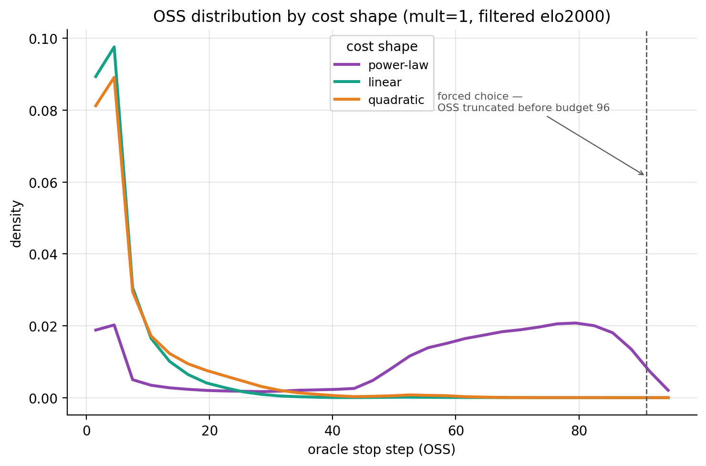
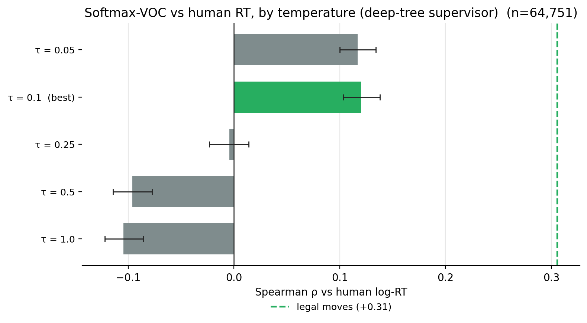

# When ought one think — and is it what people do? A step-by-step account

**Ref:** `R-VOC` · [Index](reference.md)

> **Status:** 📝 active. The **discovery walk-through** — one claim per step, each backed by a figure — that
> *motivates* the formal model in [(R-TREESEARCH)](treesearch.md). Figures are powered (filtered elo2000,
> **n≈65k moves**, bootstrap 95% CIs); a few inline numbers are flagged where they're the earlier interim
> values. Sibling [(R-HALT-CALIB)](halt_calibration.md) holds the step\*↔RT calibration detail.

The question in one line: **can a normative model of *when it is worth thinking* explain *when people actually
think*?** The answer turned out to be *no, not directly* — and chasing *why* produced a positive model (the
satisficing-construal account, formalized in [(R-TREESEARCH)](treesearch.md)). Read top to bottom.

---

## Step 1 — How were the trees generated, and how were they filtered?

Every analysis sits on a dataset of Stockfish search trees over human game positions.

- **Engine / search.** Stockfish at a fixed strength (`UCI_Elo`), driven by `build_tree`: an outer PUCT/UCT
  tree with **`search_budget = 96` expansions**, **`max_depth = 4`** (shallow + bushy), each leaf valued by a
  **Stockfish search of `sf_search_limit_nodes = 100`**. Priors are **uniform** (α-β has no policy head) — a
  decision that matters later (Step 5). Strength rungs: **SF-2000** (matched to the ≥2000-Elo human
  population) and **SF-1350** (the engine floor; sub-1350 segfaults).
- **Roots.** 250k FENs sampled from the 110.5M-position human pool (`lc0/fens.txt`); index-named trees so the
  set extends by *resume* without recompute.
- **Filter.** Keep trees that are **PUCT-consistent ∧ value-monotone** (≈24.6% pass) → the clean set the
  oracle/readouts run on.
- **The normative object.** A budgeted-oracle DP turns each tree into an **optimal stop step, step\*** =
  `argmax_s [V(s) − cost(s)]` — "how long it's worth thinking here."

The figure below is what the generated trees "believe" about stopping — the step\* distribution. Note the
spike at 0 ("don't think") whose size is governed by the cost (see R-HALT-CALIB).

> **Decision:** SF-2000 trees, budget 96 / depth 4 / 100-node leaf eval, uniform priors, PUCT∧monotone
> filter. This fixes the substrate; everything downstream is read off these trees + the budgeted oracle.

---

## Step 2 — What did the normative (fitted-RL) controllers do?

Before touching humans, we asked the *internal* question: can a learned controller decide when to stop and
beat blind rules on the oracle's own terms (regret vs compute)? Two readouts trained by **policy gradient**
(exact expected-return): a **GNN-z** controller (learned root embedding) vs a **tree-stats** controller
(hand-crafted height/width/size).

The tree-stats PG controller wins (regret ≈0.104 vs GNN-z 0.154, non-overlapping CIs) at *less* compute
([(R-LMCOS-TINY)](lmcos_tiny.md)). So the normative problem is *solvable* — and, tellingly, **raw tree
structure carries more stopping signal than the learned embedding**.

> **Result:** we can fit a good normative "when to stop" (tree-stats PG ≻ GNN-z ≻ blind). But this is
> normative *self-consistency* (low regret), **not** evidence it matches people. That is Step 3.

---

## Step 3 — Why ask what humans do? (and does it matter — yes)

The project's actual goal is **correspondence**: a model that says when one *ought* to think, compared to when
people *do* (their response time). It matters because a normative account that ignores behaviour is untested
metareasoning; and because the prior human-RT work ([(R-MOVETIME-MODEL)](engine.md)) found the oracle stops on
**value-convergence** while humans deliberate on **decision-width** — a concrete gap to explain.

So we correlated every signal with human log-RT. The punchline, previewed here and proven across the next
steps:

The dominant drivers are **problem size (# legal moves, +0.31)** and **satisfaction (fraction of good moves,
−0.31)** — *not* any normative value-of-computation signal (all clustered at +0.12–0.16), and *not* the causal
controller (≈0). *(63k; equal-and-opposite at the powered set.)*

> **Result (carefully):** it is **not** that "normative when-to-think ≠ human when-to-think." It is that our
> **current measure of optimal stop-time** — the budgeted-oracle step\* computed on strong-engine trees with a
> position-independent cost — does not match human when-to-think. "Optimal" here is normative only *with
> respect to that specific model*; it is not a verdict on metareasoning. The dominant human driver
> (decision-width, ~2× any of our signals) says the *model* is mis-specified, and Steps 4–6 enumerate **why**
> (concrete, fixable hypotheses) — not that the enterprise is foolish.

---

## Step 4 — The hypotheses we tried to close the gap, and what each showed

### 4a — Does a better *cost of thinking* align the oracle with RT?

Sweep cost shape × scale. **Regret barely moves** — because cost-aware regret is a near-monotone transform of
the cost-free Gain (ρ=0.98; the cost is position-independent). **step\*** *does* respond to cost but tops out
at +0.12.

**No normative signal vs human RT comes close** (filtered elo2000, bootstrap 95% CIs; softmax-VOC at its best
τ=0.1; "| legal" = partialling out legal-moves):

| normative signal | ρ vs RT | ρ vs RT \| legal-moves |
|---|---|---|
| cost-free Gain | +0.108 [+0.09, +0.13] | +0.036 |
| regret-alwaysstop (best cost) | +0.107 [+0.09, +0.12] | +0.037 |
| step\* (best cost regime) | +0.119 [+0.10, +0.13] | +0.050 |
| softmax-VOC (τ=0.1, deep-tree) | +0.120 [+0.10, +0.14] | — |
| *reference:* **legal moves** | **+0.247** [+0.23, +0.26] | — |

The per-cost-regime detail (below): **regret is flat** across all 12 cost configs (~+0.10, it's a monotone
transform of Gain), while **step\* varies** (+0.006 → +0.12) — the cost-sensitive one — but every bar stays
well under the legal-moves reference (green dashed).

> **Result:** cost calibration is a near-dead-end for regret; step\* is the cost-sensitive object but plateaus
> at +0.12 (≈ half the legal-moves effect). *(detail in R-HALT-CALIB.)*

### 4b — Does an *uncertainty-aware* VOC help? (softmax policy, sweep τ)

τ=1 is degenerate (softmax ≈ uniform at win-prob scale → the VOC inverts). At a calibrated **τ≈0.1** it flips
positive and **recovers** the argmax Gain (ρ≈+0.12 vs RT) — but does **not exceed** it. (Deep-tree supervisor;
τ is the only knob — the confusing cur/legal-moves panels are dropped to focus on human RT.)

> **Result:** the uncertainty framing, properly tempered, *re-derives* the value signal; it adds no RT power.

### 4c — Is step\* low only because the oracle *cheats* with hindsight?

The oracle uses backward DP over the full rollout. A **causal tree-stats halter** (sees only the tree-so-far,
like a human) does **not** beat it — both are weak (halter ≈0, oracle +0.06), both ≪ legal-moves (the grey
bar in the Step-3 figure).

> **Result:** removing hindsight does not recover RT signal. The information-asymmetry story is not it.

### 4d — The decisive test: are these signals anything *but* legal-moves proxies?

Partial out legal-moves. **Every** value/VOC/step\* signal collapses (+0.11 → +0.04); legal-moves *survives*
controlling for each of them (+0.23). They were riding on legal-moves the whole time.

> **Result:** the normative signals are **proxies for legal-moves**, not independent deliberation signals. The
> normative deliberation residual is ≈+0.04.

---

## Step 5 — Why "decision difficulty" — and how does it relate to VOC?

The pure-size reading is too dumb (people don't scan every move). The sharpening came from your prediction and
it holds (63k): **# all moves → slower (+0.31), but # *good* moves → faster (−0.12 to −0.21)** — the sign
flips, and survives partialling on size.

So human RT is **decision difficulty**, decomposing into **size (+)**, **satisfaction (−)**, **sharpness (+)**
(the Step-3 landscape).

> **satisfaction** (def.) = the fraction of legal moves that are *near-best* (within ε win-prob of the top
> move) — how *forgiving* the position is. High satisfaction ⇒ many acceptable choices ⇒ the decision is easy
> ⇒ people commit faster (the negative term).

### Are decision-difficulty and VOC the same thing? (the key conceptual point)

Almost — and the gap between them *is* our whole result. Write **VOC = value(thinking) − cost(thinking).**

- **They agree on the value side.** *Satisfaction*: many near-equal good moves ⇒ thinking can't improve your
  choice (you're already near-optimal) ⇒ low VOC **and** easy ⇒ fast. *Sharpness*: a contested/critical move
  ⇒ high VOC **and** hard ⇒ slow. On these, difficulty and VOC predict the *same* thing — and indeed our VOC
  signals capture them (that's the +0.04 they legitimately own).
- **They diverge on what gets *considered*.** This is **not** a pure scanning *cost* — it is a
  **consideration *benefit***: you cannot reap a move's value without first **including it in your
  consideration set**, and inclusion carries a (tunable) **fixed cost per move**. You add a move when the
  expected benefit of considering it clears that inclusion cost — so the **size of the consideration set you
  choose to build** is what drives RT. Our oracle never modelled set *construction*: it took the whole tree as
  given (every move pre-included, for free), so it structurally could not produce a size effect.

> **Clarification (construals):** decision difficulty is **VOC over a *constructed* consideration set**, not
> over a fixed option list. The set is a **construal** (value-guided construal; Ho, Griffiths et al.) — built
> by paying a per-move inclusion cost wherever the benefit of considering it justifies the cost. This unifies
> the three RT terms:
> - **size (+):** more legal moves ⇒ more candidates clear the include-it bar ⇒ a bigger set ⇒ longer;
> - **satisfaction (−):** once a good-enough move is *in* the set you stop expanding it (**satisficing**) ⇒ shorter;
> - **sharpness (+):** high stakes raise the benefit of including more ⇒ people are **willing to pay** for a
>   bigger set ⇒ longer.
>
> Our VOC — all moves pre-included, position-independent cost — kept only the *post-construal refinement*
> value (+0.04) and missed the construal itself (the +0.31). The legal-moves effect is the size of the
> consideration set a person rationally chooses to build, not a scanning overhead.

### Is the construal *chosen* or *grown*? (three worries, resolved)

The two-stage gloss — *pick a set size, then plan on it* — is wrong, and three worries expose why (and fix it):

1. **You should be able to change the set as you go.** Right — the set isn't chosen up front, it's **grown
   incrementally**: include one more candidate *iff you suspect it helps*.
2. **That's just best-first search.** Also right — incremental costly inclusion **is** a best-first search with
   a VOC stop rule: each step includes the most-promising not-yet-considered move (pay the per-move cost, learn
   its value), and you stop when the **marginal** VOC of one more inclusion falls below the cost (Russell–Wefald
   meta-greedy stopping = **satisficing**). So **the construal *is* the search** — H3 (the BeFS generator) isn't
   a detour, it's the mechanism — and **RT ∝ the size of the tree you grow**, exactly as you'd expect if each
   considered move costs.
3. **A per-move cost should make sets *smaller* — the wrong sign.** The subtle one. The cost does **not** flip
   the sign; it sets the **saturation** of set size. Optimal `S* ≈ min(n, S_unconstrained)`, where
   `S_unconstrained` is where marginal VOC = cost. `n` is the **pool of worthwhile inclusions**: with few legal
   moves you exhaust the pool fast (`S*≈n` ⇒ small ⇒ fast); with many, the marginal VOC stays above cost longer
   ⇒ a bigger set ⇒ slower — until the cost **caps** it (the plateau). So RT rises with `n` and saturates (a
   concave, Hick-like curve). The cost makes the human set **smaller than all-`n`** (it *does* prune — the
   default is **not** "include everyone") — but the size *effect* comes from how far the incremental process
   runs, which grows with the pool.

> **Clarification:** this makes the oracle's error precise. It (a) **pre-includes all** root moves for free and
> (b) spends its budget on **depth** (refining the top), whereas the human grows **breadth** incrementally and
> pays per inclusion. So oracle expansions ≠ human inclusions, and step\* (a *depth*-stop) is the wrong axis for
> RT. The right axis is **breadth grown before satisficing** — precisely what an optimistic BeFS produces
> (H3/P3): the test is whether its breadth / expansion-count tracks RT.

### The satisficing signature, made visible (63k)

The construal/satisficing account makes a sharp prediction: satisfaction should not merely *shift* RT's level
but **reshape the RT-vs-`n` curve** — high-satisfaction positions plateau early (stop once good-enough, no
matter `n`), low-satisfaction ones keep rising. On the powered 63k set this is exactly what appears:

The aggregate "RT ≈ linear in `n`" (left) *hides* a **family** of satisfaction-conditioned curves (right):
high-satisfaction **flat and low**, low-satisfaction **steep**. That is the satisficing stop — "stop when
marginal VOC < cost" — made visible, and it's what lifts this above a bare problem-size (Hick's-law) account.

> **Result:** satisfaction reshapes the *curve*, not just its level — the satisficing fingerprint, and the
> empirical hook for the formal model in [(R-TREESEARCH)](treesearch.md).

### The flip is also an engine-strength litmus test

`# good moves` is defined by the *engine's* values, so the flip appears **only if engine-good = human-good**.
No flip ⇒ a strength mismatch (e.g. a superhuman engine whose "good" humans can't track). The flip is clean at
SF-2000 (the ≥2000 population), which validates that rung; the SF-1350 vs SF-2000 comparison (overnight) finds
the best-matched strength.

---

## Where this leaves us → the construal account

VOC, in every form we tried, is a **legal-moves proxy** — it does not explain *when people think*. The dominant
structure is **decision difficulty** (size − satisfaction + sharpness), and the satisfaction plateau-shift looks
like **satisficing**. That hands a concrete, positive program to **[(R-TREESEARCH)](treesearch.md)**: formalize it
as a meta-rational optimization (reward − cost over a *constructed* consideration set) and fit it to human RT.

---

## Appendix

**Softmax-VOC model (M1–M3 spec).** Policy = `softmax(v_t/τ)`; halt value = `E_softmax[V_sup]` (closed form,
no sampling); benefit of thinking = the sharpening = uncertainty reduction. Supervisor = deep-tree `final_Q`
(free) or an independent stronger Stockfish (M3 → folded into P1). Encoder unchanged. M1/M2 done (Step 4b);
M3 = the strength ladder.

**Figure index** (all `figures/lmcos_tiny/`, interim elo2000): `oss_dist_elo2000` (Step 1) · `regret_vs_compute`,
`regret_by_model` (Step 2) · `rt_headline` (Step 3) · `cost_sweep_rt`, `voc_tau_sweep`,
`rt_partials` (Step 4) · `good_moves_signflip` (Step 5). All ρ-comparison figures share one visual language
(horizontal bars, ρ on x, names on y; blue=size, red=satisfaction, grey=value-of-computation, green dashed =
legal-moves reference), produced by `lmcos_tiny/analysis/make_rt_figures.py`. Method: Spearman with percentile-bootstrap 95% CIs
([[bootstrap-cis-always]]); partials via the rank formula; the metric is pre-committed (human log-RT).

**Data provenance:** [(R-DATA)](reference.md). **Calibration sibling:** [(R-HALT-CALIB)](halt_calibration.md).
